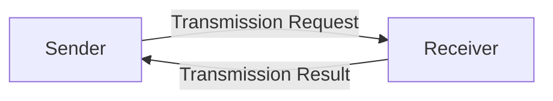
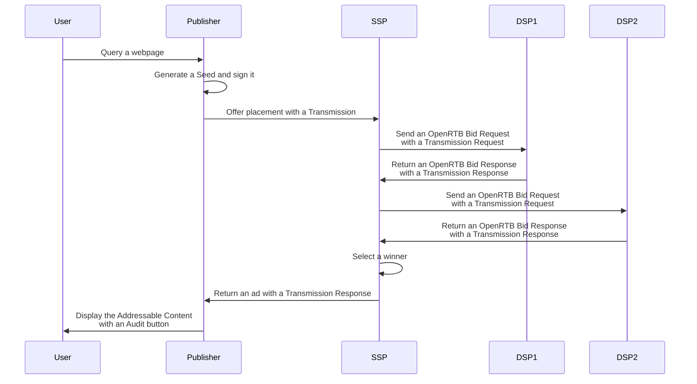

# Goal

Describe the required API for a DSP that want to become a Contracting Party of
the Prebid SSO ecosystem.

# The Identity endpoint

To be part of the Prebid SSO network, a DSP must provide an entity endpoint for
providing:
* The name of the DSP;
* The Prebid SSO version that it handles;
* The public key used to verify its signatures of Prebid SSO Data and
transmissions.

It is reachable at the following endpoint:

```
GET https://<domain>/prebidsso/API/v1/identity
```
It provides the following data as JSON:
| Field   | Type   | Details                                                                                                                                                                                                             |
|---------|--------|---------------------------------------------------------------------------------------------------------------------------------------------------------------------------------------------------------------------|
| name    | String | The name of the Contracting Party since the domain may no reflect the Company name.<br /> e.g "Criteo"                                                                                                                    |
| type    | String | The type of Contracting Party in the Prebid SSO ecosystem. For now, the type for a DSP is "vendor"
| version | Number | A two digit number separated by a point for expressing the last Prebid SSO version handled.<br /> For now, the value is "1.0"<br /> Note: a new field may appear with the new versions of the Prebid SSO protocol for the last supported version. |
| key     | String | Public key encoded in a UTF-8 string.                                                                                                                                                                               |

An example:
```json
{
    "name": "Criteo",
    "type": "vendor",
    "version": 1.0,
    "key": "..."
}
```

# Transmission Overview

A Transmission is the act of sharing Prebid SSO Data (Pseudonymous-Identifiers
and Preferences) between two Contracting Parties of Prebid SSO: the Sender and
the Receiver.



The transmissions are chainable:



# Standalone Transmission 

## Transmission Request

### The Transmission Request object


| Field  | Type          | Detail                                              |
|--------|---------------|-----------------------------------------------------|
| seed   | Seed object   | A Seed object contains all the Prebid SSO Data gathered and signed by the Publisher concerning the user. |
| source | Source object | The source object contains all the necessary information for identifying the Sender of the Transmission. |


### The Seed object

| Field                  | Type                                     | Details  |
|------------------------|------------------------------------------|----------|
| version                | Integer                                  | The Prebid SSO version used to sign the Seed.                                                                                                                                                                                           |
| transaction_id         | String                                   | A GUID in a String format dedicated to the share of the Prebid SSO data for one Addressable Content.                                                                                                                                    |
| display_responsability | String                                   | Equals "publisher" if the publisher takes the responsibility to display the Audit Button and the Audit UI.</ br> Equals "vendor" if the publisher delegates the responsibility to display the Audit Button and the Audit UI to the DSP. |
| preferences            | Preference object                        | The Preferences of the user.                                                                                                                                                                                                            |
| identifiers            | Array of Pseudonymous-Identifier objects | The Pseudonymous-Identifiers of the user. For now, it only contains a Prebid ID.                                                                                                                                                        |
| source                 | Source object                            | The source contains all the necessary information for identifying and trusting the Publisher.                                                                                                                                           |


### The Preferences object

| Field   | Type          | Details                                            |
|---------|---------------|----------------------------------------------------|
| version | Integer       | The Prebid SSO version used to sign the Preferences.                                                                                                                                                                               |
| data    | Dictionary    | The key is a string and represent the name of the preference. <br /> The values represent the value of the preference. <br /> For now there is only one preference named "optin" and its value is a boolean. e.g { "optin": true } |
| source  | Source object | The source contains all the necessary information for identifying and trusting the Operator that generate the Preferences.                                                                                                         |


### The Identifier object

| Field   | Type          | Details                                            |
|---------|---------------|----------------------------------------------------|
| version | Number        | The version of Prebid SSO used for signing the Identifier.                                                                       |
| type    | string        | The type of Pseudonymous-Identifier. For now, there is only one: "prebid_id".                                                    |
| value   | string        | The Pseudonymous-Identifier value in UTF-8.                                                                                      |
| source  | Source object | The Source contains all the necessary data for identifying and trusting the Operator that generated the Pseudonymous-Identifier. |


### The Source objects

| Field     | Type   | Details                                                 |
|-----------|--------|---------------------------------------------------------|
| domain    | String | The domain of the Sender as a Contracting Party.        |
| date      | Date   | The date of the signature.                              |
| signature | String | Encoded signature in UTF-8 of the signer.<br /> In the case of the Transmission, it is the Sender.<br />In case of the Seed, it is the Publisher.<br />In case of the Preferences or the Identifier is the Operator.  |

### Example of a Transmission Request

````json
{
    "seed": {
        "version": 1,
        "transaction_id": 1234567,
        "display_responsibility": "publisher",
        "identifiers": [
            {
                "version": 1,
                "type": "swid",
                "value": "123_I_AM_SWID",
                "source": {
                    "domain": "operotor0.com",
                    "date": "2021-04-23T18:25:43.511Z",
                    "signature": "12345_signature"
                }
            }
        ],
        "preferences": {
            "data": [
                { "version": 1, "type": "opt_in", "value": true }
            ],
            "source": {
                "domain": "operator1.com",
                "date": "2021-04-23T18:25:43.511Z",
                "signature": "12345_signature"
            }
        },
        "source": {
            "domain": "publisher.com",
            "date": "2021-04-23T18:25:43.511Z",
            "signature": "12345_signature"
        }
    },
    "source" : {
        "domain": "ssp1.com",
        "date": "2021-04-23T18:25:43.511Z",
        "signature": "123_signature",
    }
}
````

## Transmission Response

The Transmission Response contains the signature of the DSP. Considering that
the DSP, in a nominal case, doesn't share itself the Prebid SSO Data to other
suppliers, it shouldn't take care of the "children" Transaction Results.

### Transmission object

| Field    | Type                        | Details                             |
|----------|-----------------------------|-------------------------------------|
| version  | Number                      | The version of the Prebid SSO used for generating the Transmission Response.                                                                                                                                                                                                                               |
| receiver | string                      | The domain name of the DSP.                                                                                                                                                                                                                                                                                |
| status   | string                      | Equals "SUCCESS" if the DSP signed the Transmission and returns it to the sender.<br /> Equals "ERROR_BAD_REQUEST" if the receiver doesn't understand or see incoherency in the Transmission Request.<br /> Equals "ERROR_CANNOT_PROCEED" if the receiver cannot handle the Transmission Request properly. |
| details  | string                      | In case of an error status, the DSP can provide details concerning the error.                                                                                                                                                                                                                              |
| children | Array of Transaction Result | An empty array as we consider that the DSP doesn't share the Prebid SSO Data to its suppliers via new transmissions.                                                                                                                                                                                       |
| source   | Source object               | The source contains all the data for identifying the DSP and verifying the Transmission.                                                                                                                                                                                                                   |

### Signing the Transmission Object

A Transmission Response must be signed by the DSP. This signature relies on the
same cryptographic algorithm as the other signatures in Prebid SSO (ECDSA NIST
P-256):

* Build a UTF-8 string from the data of the Transmission Request (see below);
* Generates a SHA256 hash;
* Sign it with its private key and signs it.


To build the UTF-8 string, the DSP must concats the following fields:

````
transmission_result.source.domain + '\u2063' + 
transmission_result.source.date + '\u2063' + 

seed.source.signature + '\u2063' + 

source.domain + '\u2063' + 
source.date + '\u2063' + 

transmission_response.receiver + '\u2063' + 
transmission_response.status + '\u2063' +
transmission_response.details
````

| Name                  | Details                                              |
|-----------------------|------------------------------------------------------|
| source.domain         | The Domain of the DSP. It matches the "domain" field in the Source object of the Transmission Response.   |
| source.date           | The Date of the signature. It matches the "date" field in the Source object of the Transmission Response. |
| seed.source.signature | The signature of the Seed available in the Transmission Request.                                          |
| '\u2063'               | The invisible separator in UTF-8.


# Transmissions in OpenRTB

OpenRTB is a standardized format for bidding on inventory. It is widely used in
the industry and Prebid SSO Transmission can be integrated into it. For this
purpose, Prebid SSO uses the "extensions" of OpenRTB requests and responses.

## Many Transmission Requests in one OpenRTB Bid Request

There is one transmission between two Contracting Parties for one ad and one 
OpenRTB bid request can contain multiple ads - named "impression" in OpenRTB
specification. Therefore, a bid request can have multiple Transmission
Requests. Those Transmissions are added in the "ext" object of each "imp" (for 
impression) object of the Bid Request. This new object dedicated to the 
Transmission is named "prebid_sso_transmission".

#### Example of a Transmission Request in an OpenRTB Bid Request

`````json
{
    "id": "80ce30c53c16e6ede735f123ef6e32361bfc7b22",
    "at": 1, "cur": [ "USD" ],
    "imp": [
        {
            "id": "1",
            "bidfloor": 0.03,
            "banner": {
                "h": 250,
                "w": 300,
                "pos": 0
            },
            "ext": {
                "prebid_sso_transmission": {
                    "version": 1.0,
                    "seed": {
                        "version": 1,
                        "transaction_id": 1234567,
                        "display_responsibility": "publisher",
                        "identifiers": [
                            {
                                "version": 1,
                                "type": "swid",
                                "value": "123_I_AM_SWID",
                                "source": {
                                    "domain": "operotor0.com",
                                    "date": "2021-04-23T18:25:43.511Z",
                                    "signature": "12345_signature"
                                }
                            }
                    ],
                    "preferences": {
                        "data": [
                            { "version": 1, "type": "opt_in", "value": true }
                        ],
                        "source": {
                            "domain": "operator1.com",
                            "date": "2021-04-23T18:25:43.511Z",
                            "signature": "12345_signature"
                        }
                },
                "source": {
                    "domain": "publisher.com",
                    "date": "2021-04-23T18:25:43.511Z",
                    "signature": "12345_signature_with_identifier_preferences_date_domain"
                }
            },
            "source" : {
                "domain": "ssp1.com",
                "date": "2021-04-23T18:25:43.511Z",
                "signature": "123_signature",
            } 
        }
    ],
    "site": {
        "id": "102855",
        "cat": [ "IAB3-1" ],
        "domain": "www.publisher.com",
        "page": "http://www.publisher.com/1234.html ",
        "publisher": {
            "id": "8953",
            "name": "publisher.com",
            "cat": [ "IAB3-1" ],
            "domain": "publisher.com"
        }
    },
    "device": {
        "ua": "Mozilla/5.0 (Macintosh; Intel Mac OS X 10_6_8) AppleWebKit/537.13 (KHTML, like Gecko) Version/5.1.7 Safari/534.57.2",
        "ip": "123.145.167.10"
    },
    "user": {
        "id": "55816b39711f9b5acf3b90e313ed29e51665623f"
    }
}
`````

## Many Transmission Responses in one OpenRTB Bid Response

Similar to the OpenRTB Bid Request for the Transmission Requests, the OpenRTB
Bid Response must contain multiple Transmission Responses - one for each
impression. However, the OpenRTB Bid Response is focused on BidSeat and Bid with
potential cases where impressions don't appear in the response because there is
no bid on them. Therefore, each Transmission Request must be expressed in the
"ext" object of the root Bid Response paired with the impression ids provided in
the request. The name of this new object in the "ext" object is named 
"prebid_sso_transmissions".

Each Transmission Request presented in the Bid Request must have a Transmission
Response in the Bid Response. The OpenRTB specification allows providing an
empty payload for a "No Bid". However, this is not acceptable in the presence of
Transmission.

#### Example of a Transmission Response in an OpenRTB Bid Response
````json
{
    "id": "1234567890",
    "bidid": "abc1123",
    "cur": "USD",
    "seatbid": [
        {
            "seat": "512",
            "bid": [
                {
                    "id": "1",
                    "impid": "1",
                    "price": 9.43,
                    "nurl": "http://adserver.com/winnotice?impid=102",
                    "iurl": "http://adserver.com/pathtosampleimage",
                    "adomain": [ "advertiserdomain.com" ],
                    "cid": "campaign111",
                    "crid": "creative112",
                    "attr": [ 1, 2, 3, 4, 5, 6, 7, 12 ]
                }
            ]
        }
    ],
    "ext": {
        "prebid_sso_transmissions": [
            {
                "impid": "1",
                "response": {
                    "version": 1,
                    "receiver": "dsp1.com",
                    "status": "SUCCESS",
                    "details": "",
                    "source": {
                        "domain": "dsp1.com",
                        "date": "2021-04-23T18:25:43.511Z",
                        "signature": "12345_signature"
                    },
                    "children": []
                }
            },
            {
                "impid": "1",
                "response": {
                    "version": 1,
                    "sender": "ssp1.com",
                    "receiver": "dsp1.com",
                    "status": "SUCCESS",
                    "details": "",
                    "source": {
                        "domain": "dsp1.com",
                        "date": "2021-04-23T18:25:43.511Z",
                        "signature": "12345_signature"
                    },
                    "children": []
                }
            }
        ]
    }
}
````

# Display of the Audit Button

If the Seed included in the Transmission contains 
_"display_responsibility" = "vendor"_,
then the DSP must include an Audit Button within the Addressable Content.

The standard approach is to use an HTML button for the Audit Button. This HTML
button is in a form containing also a hidden input for retaining the Audit Log.
The Audit Log stored in the value of the hidden input is in JSON encoded in
base64.

The method of the form must be a POST and the action is the URL of the Audit UI
hosted by the DSP.

````html
<div class="ad_container">
    <div>This is an ad.</div>
    <form action="https://vendor.com/prebidsso/v1/audit_ui" method="post"> 
        <input type="hidden" id="audit_log" value="eyJPV0lEIjoiQTI1....C8iLC" />
        <button type="submit" class="prebid_sso_audit_button">Audit Log</button>
    </form>
</div>
````

# Display of the Audit UI

## Web Page interface

If the Seed included in the Transmission contains "display_responsibility", then
the DSP must include an Audit Button within the Addressable Content.

Once the user has clicked on the Audit Button, she/he is redirected to the
Audit UI. The DSP generates the UI based on the validations of the Prebid SSO
Data and the Transmission Results. The following elements must appear in the
page:

| Element                          | Details                                   |
|----------------------------------|-------------------------------------------|
| List of Pseudonymous-Identifiers | Each Pseudonymous-Identifier must be paired with the name of the Operator who generated it and signed it with a Reg/Green indicator expressing the validity of the signature.                                                |
| List of the Preferences          | Each Preference must be paired with the name of the Operator who generated it and signed it with a Red/Green indicator expressing the validity of the signature.                                                             |
| Seed                             | The Seed is represented by the Transaction ID and a Red/Green indicator expressing the validity of the signature                                                                                                             |
| List of Transmission Results     | The Transmission Results available in the Audit Log. Each Transmission Results is represented by the Name of the Receiver, the status of the Transmission and a Red/Green indicator expressing the validity of the signature |

The design of the page is up to the DSP but it must consider to have a neutral
UI to be used for many different Publishers.

## Source validations

As we saw, for displaying correctly the Audit UI, the DSP must validate
different sources. For each sources available in the Audit Log, the DSP must:

* Call the Identity Endpoint of the "domain" of the source to retrieve its name
and it key used for verifying the signature.
* Decode the signature thank to the NIST P-256 public key of the domain that 
generated it.
* Build a UTF-8 string based on the data available in the Audit Log. For each 
data that is signed, there is a specific way to generate this UTF-8 string. 
Those generations are described in this document.
* Generate an SHA-256 hash from the UTF-8 string.
* Compare the hash to the decoded signature. If they match, the signature is
validated.

### Verify the Pseudo-Identifiers

The Audit Log contains a list of Pseudo-identifiers. Each Pseudo-identifier is 
signed. The UTF-8 string for a specific Pseudo-Identifier must be built as followed:

````
identifier.source.domain + '\u2063' + 
identifier.source.date + '\u2063' + 
identifier.type + '\u2063'+
identifier.value
````

### Verify the Preferences

The Audit Log contains a list of Preferences with one signature. The UTF-8 string for a specific Preference must be built as followed:

````
preferences.source.domain + '\u2063' +
preferences.source.date + '\u2063' +

preferences.data.key1 + '\u2063' + preferences.data[key1].value + '\u2063' +
preferences.data.key2 + '\u2063' + preferences.data[key2].value + '\u2063' +
...
preferences.data.keyN + '\u2063' + preferences.data[keyN].value
````

For handling properly the preferences, key1, key2, ... keyN follows the
alpha-numerical order of the keys existing in the dictionary.

### Verify the Seed

The Audit Log contains a Seed. The UTF-8 string for the Seed must be built as
followed:

````
seed.source.domain + '\u2063' + 
seed.source.date + '\u2063' + 

seed.transaction_id + '\u2063' + 

seed.identifiers[0].source.signature + '\u2063' +
seed.identifiers[1].source.signature + '\u2063' +
... + '\u2063' + 
seed.identifiers[n].source.signature + '\u2063' + 

seed.preferences.source.signature
````
Note that we iterate over the identifiers by taking for each signature and
appending it to the UTF-8 string.

### Verify the Transmission Results

The Audit Log contains a list of Transmission Results. Each Transmission Result
is signed. The UTF-8 string for a specific Transmission Result must be built
as followed:

````
transmission_result.source.domain + '\u2063' + 
transmission_result.source.date + '\u2063' + 

seed.source.signature + '\u2063' + 

transmission_result.receiver + '\u2063' + 
transmission_result.status + '\u2063' +
transmission_result.details
````
