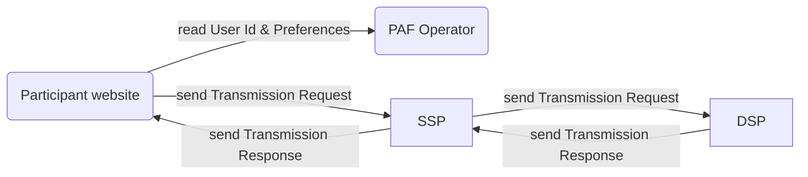

# Prebid Addressability Framework

The Prebid Addressability Framework (PAF) is a set of technical standards, UX requirements, and mandatory contractual terms designed to improve addressable advertising across the open internet.

This directory contains functional and technical specifications for a minimum viable product (MVP).

## Overview

PAF integrates in the existing digital marketing landscape and introduces a new actor: the "PAF operator".

The operator is responsible for:
- generating unique pseudonymous user ids
- storing these ids and their associated preferences

Key features of PAF include:

- making available alongside the ad an Audit Log of entities involved
- signing Seeds, Transmissions Requests, Transmissions Responses, User Id and Preferences, and all messages sent to or from the Operator

## Nodes

### Operator

The operator is responsible for:
- generating unique user ids
- storing these ids and their associated preferences

See [operator-api.md](operator-api.md)  for details.

### Participant website

A participant website is usually either an advertiser or publisher website. It can:
- Call the Operator to read the user id and preferences
- Sell ad placements to other PAF participants. To do so it must create and sign a "seed" object and initialize an RTB transaction sent to an SSP.

See [operator-client.md](operator-client.md) and [publishers-requirements.md](publishers-requirements.md).

### SSP (Supply Side Platform)

The SSP shares PAF Data to DSPs via Transmission Requests. Depending of the context, it can generate the Seed and emit the first Transmission of the Transaction or receive the Seed from a previous Transmission Request.

### DSP (Demand Side Platform)

DSPs receive transmissions that they must sign before they respond to the SSP

See d[dsp-implementation.md](dsp-implementation.md).

### See also

- Focus on signatures: [signatures.md](signatures.md)
- Audit log design: [audit-log-design.md](audit-log-design.md)

## Documents

| Document                                                                   | Description                                                                                         |
|----------------------------------------------------------------------------|-----------------------------------------------------------------------------------------------------|
| [signatures.md](signatures.md)                                             | General introduction on signatures and signature verification                                       |
| [audit-log-requirements.md](audit-log-requirements.md)                     | Functional requirements related to the Audit Log and the Transmissions.                             |
| [audit-log-design.md](audit-log-design.md)                                 | Design the technical solution for the Audit Log.                                                    |
| [publishers-requirements.md](publishers-requirements.md)               | Details PAF implementation from a publisher's standpoint.                                                         |
| [dsp-implementation.md](dsp-implementation.md)                             | Data exchange specification, from the point of view of a DSP implementer.                           |
| [operator-api.md](operator-api.md)                                         | Operator API specification                                                                          |
| [operator-design.md](operator-design.md)                                   | Design of the generation of Prebid SSO Data.                                                        |
| [operator-design-alternative-swan.md](operator-design-alternative-swan.md) | Summary of the SWAN solution for generating PAF Data.                                               |
| [operator-requirements.md](operator-requirements.md)                       | Requirements for the generation of the PAF Data.                                                    |
| [operator-client.md](operator-client.md)                                   | Modules needed to connect to the operator                                                           |
| [model/](model)                                                            | Data and messages model                                                                             |
| [json-schemas/](json-schemas)                                              | Data and messages model in [JSON schema](https://json-schema.org/understanding-json-schema/) format |
| `assets/` `model-updater/` `partials/` `partials-updater/`                 | Technical dependencies, please ignore                                                               |
