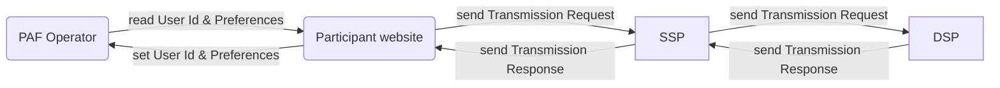

# Prebid Addressability Framework

The Prebid Addressability Framework (PAF) is a set of technical standards, UX requirements, and mandatory contractual terms designed to improve addressable advertising across the open internet.

This directory contains technical specifications for a minimum viable product (MVP).

## Overview

PAF supports the following features:
- User Id and Preferences management, based on mandatory user consent
- an Audit Log, listing all entities that have been involved in an ad display

To deliver these features, PAF integrates in the existing digital marketing landscape and introduces a new actor: the Operator.

## Glossary

Framework-specific terms, with first letters in uppercase, are defined in this glossary.

**Audit Log** means a log identifying all participants (Publisher, SSP, DSP) part of a chain leading to an ad display.

**PAF** is short for Prebid Addressability Framework

**Operator** means the entity responsible for creating, updating, deleting and controlling access to the User Id and Preferences.

**Root Party** means the entity initiating the originating Transmission in a particular chain of Transmissions.

**Transmission Request** and **Transmission Response** are signed statements that must be attached to the communication of User Id and Preferences between two entities (typically done through bid requests and bid responses).

**Transmission Result** means the final statement of a Transmissions that is used in an Audit Log

**User Id and Preferences** means a set of user pseudonymous identifiers and preferences managed within the Prebid Addressability Framework.

**Vendor** means an entity, different from the Publisher, participating to the generation of an ad display.

## Workflows

The Prebid Addressability Framework supports:
- User Id and Preferences management
- extension of ad auction mechanisms with signed Transmissions
- display of an Audit Log to the user upon request 

### User Id and Preferences management

The User Id and Preferences management involves:
- The Operator
- The advertiser or publisher web site

See [workflows](workflows.md), [operator-api.md](operator-api.md), and [paf-client-node.md](paf-client-node.md). 

### Ad auction

Prebid Addressability Framework integration with an ad auction involves:
- The seller site
- SSP and DSP

See [ad-auction](ad-auction.md).

### Audit Log display

Audit Log display involves:
- The seller site

See [audit-log-design.md](audit-log-design.md) and [audit-log-requirements.md](audit-log-requirements.md).

### See also

- Seeds, Transmissions Requests, Transmissions Responses, User Id and Preferences, and all messages sent to or from the Operator must be signed: [security-signatures.md](security-signatures.md)
- Audit log design: [audit-log-design.md](audit-log-design.md)

## Documents

| Document                                                                                            | Description                                                                                         |
|-----------------------------------------------------------------------------------------------------|-----------------------------------------------------------------------------------------------------|
| [security-signatures.md](security-signatures.md)                                                    | General introduction on signatures and signature verification                                       |
| [audit-log-requirements.md](audit-log-requirements.md)                                              | Functional requirements related to the Audit Log and the Transmissions.                             |
| [audit-log-design.md](audit-log-design.md)                                                          | Design the technical solution for the Audit Log.                                                    |
| [ad-auction](ad-auction.md)                                                                         | Details PAF integration in an ad auction.                                                           |
| [dsp-implementation.md](dsp-implementation.md)                                                      | Data exchange specification, from the point of view of a DSP implementer.                           |
| [operator-api.md](operator-api.md)                                                                  | Operator API specification                                                                          |
| [operator-design.md](operator-design.md)                                                            | Design of the generation of PAF Data.                                                               |
| [operator-design-alternative-swan.md](../alternative%20designs/operator-design-alternative-swan.md) | Summary of the SWAN solution for generating PAF Data.                                               |
| [operator-requirements.md](operator-requirements.md)                                                | Requirements for the generation of the PAF Data.                                                    |
| [paf-client-node.md](paf-client-node.md)                                                            | Website integration: frontend library, PAF client node, operator backend                            |
| [Integration Guide.md](../Integration-guides/PAF-Integration-Guide.md)                              | Guide to integrate into current PAF MVP                                                             |
| [model/](model)                                                                                     | Data and messages model                                                                             |
| [json-schemas/](json-schemas)                                                                       | Data and messages model in [JSON schema](https://json-schema.org/understanding-json-schema/) format |
| `assets/` `model-updater/` `partials/` `partials-updater/`                                          | Technical dependencies, please ignore                                                               |
