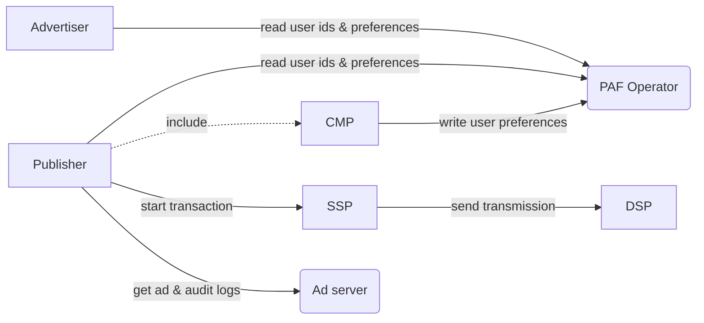

# Prebid Addressability Framework MVP specs

This directory contains functional and technical specifications for PAF minimum viable product (MVP). 

## Documents

| Document                                                                   | Description                                                                                         |
|----------------------------------------------------------------------------|-----------------------------------------------------------------------------------------------------|
| [signatures.md](signatures.md)                                             | General introduction on signatures and signature verification                                       |
| [audit-log-requirements.md](audit-log-requirements.md)                     | Functional requirements related to the Audit Log and the Transmissions.                             |
| [audit-log-design.md](audit-log-design.md)                                 | Design the technical solution for the Audit Log.                                                    |
| [ad-server-implementation.md](ad-server-implementation.md)                 | Details PAF implementation in an Ad Server.                                                         |
| [dsp-implementation.md](dsp-implementation.md)                             | Data exchange specification, from the point of view of a DSP implementer.                           |
| [operator-api.md](operator-api.md)                                         | Operator API specification                                                                          |
| [operator-design.md](operator-design.md)                                   | Design of the generation of Prebid SSO Data.                                                        |
| [operator-design-alternative-swan.md](operator-design-alternative-swan.md) | Summary of the SWAN solution for generating PAF Data.                                               |
| [operator-requirements.md](operator-requirements.md)                       | Requirements for the generation of the PAF Data.                                                    |
| [operator-client.md](operator-client.md)                                   | Modules needed to connect to the operator                                                           |
| [advertiser-implementation.md](advertiser-implementation.md)               | Instructions for advertisers                                                                        |
| [publisher-implementation.md](publisher-implementation.md)                 | Instructions for publishers                                                                         |
| [cmp-implementation.md](cmp-implementation.md)                             | Instructions for CMPs (Consent Management Platforms)                                                |
| [model/](model)                                                            | Data and messages model                                                                             |
| [json-schemas/](json-schemas)                                              | Data and messages model in [JSON schema](https://json-schema.org/understanding-json-schema/) format |
| `assets/` `model-updater/` `partials/` `partials-updater/`                 | Technical dependencies, please ignore                                                               |

## Architecture

PAF integrates in the existing digital marketing landscape and introduces a new actor: the "PAF operator".

Note: most nodes are clickable on the diagram.

## Advertiser

See [advertiser-implementation.md](advertiser-implementation.md).

## CMP (Consent Management Platform)

Usually, publishers include a CMP javascript in their web pages, to gather user consent _on their behalf_.

In PAF, the CMP is also responsible for **signing user preferences** and **writing** these preferences via the operator.

Note that the CMP role can be taken by the publisher in some cases.

See [cmp-implementation.md](cmp-implementation.md).

## Publisher

The publisher has multiple roles

1. Just like the advertiser, it needs to read id and preferences from the operator
2. It is also selling inventory to contracting parties and must create and sign a "seed" object and initialize an RTB transaction sent to an SSP
   1. this is done through the ad server

See [publisher-implementation.md](publisher-implementation.md).

## Ad server

See [ad-server-implementation.md](ad-server-implementation.md).

## SSP (Supply Side Platform)

The SSP shares PAF Data to DSPs via Transmission Requests. Depending of the context, it can generate the Seed and emit the first Transmission of the Transaction or receive the Seed from a previous Transmission Request.

## DSP (Demand Side Platform)

DSPs receive transmissions that they must sign before they respond to the SSP

See [dsp-implementation.md](dsp-implementation.md).

## Operator

The operator is responsible for:
- generating unique user ids
- storing these ids and their associated preferences

See [operator-api.md](operator-api.md) for details.

## See also

- Focus on [signatures](signatures.md)
- Audit log [design](audit-log-design.md)
