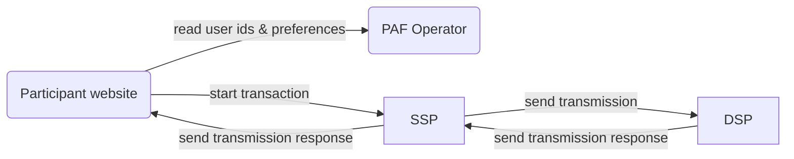

# Prebid Addressability Framework

The Prebid Addressability Framework (PAF) is a set of technical standards, UX requirements, and mandatory contractual terms designed to improve addressable advertising across the open internet.

This directory contains functional and technical specifications for a minimum viable product (MVP).

## Overview

PAF integrates in the existing digital marketing landscape and introduces a new actor: the "PAF operator".

The operator is responsible for:
- generating unique pseudonymous user ids
- storing these ids and their associated preferences

Key features of PAF include:

- signing transmissions and request with private keys
- making available alongside the ad an audit log of entities involved

## Documents

| Document                                                                   | Description                                                                                         |
|----------------------------------------------------------------------------|-----------------------------------------------------------------------------------------------------|
| [signatures.md](signatures.md)                                             | General introduction on signatures and signature verification                                       |
| [audit-log-requirements.md](audit-log-requirements.md)                     | Functional requirements related to the Audit Log and the Transmissions.                             |
| [audit-log-design.md](audit-log-design.md)                                 | Design the technical solution for the Audit Log.                                                    |
| [ad-server-implementation.md](ad-server-implementation.md)                 | Details PAF implementation in an Ad Server.                                                         |
| [dsp-implementation.md](dsp-implementation.md)                             | Data exchange specification, from the point of view of a DSP implementer.                           |
| [operator-api.md](operator-api.md)                                         | Operator API specification                                                                          |
| [operator-design.md](operator-design.md)                                   | Design of the generation of Prebid SSO Data.                                                        |
| [operator-design-alternative-swan.md](operator-design-alternative-swan.md) | Summary of the SWAN solution for generating PAF Data.                                               |
| [operator-requirements.md](operator-requirements.md)                       | Requirements for the generation of the PAF Data.                                                    |
| [operator-client.md](operator-client.md)                                   | Modules needed to connect to the operator                                                           |
| [model/](model)                                                            | Data and messages model                                                                             |
| [json-schemas/](json-schemas)                                              | Data and messages model in [JSON schema](https://json-schema.org/understanding-json-schema/) format |
| `assets/` `model-updater/` `partials/` `partials-updater/`                 | Technical dependencies, please ignore                                                               |
