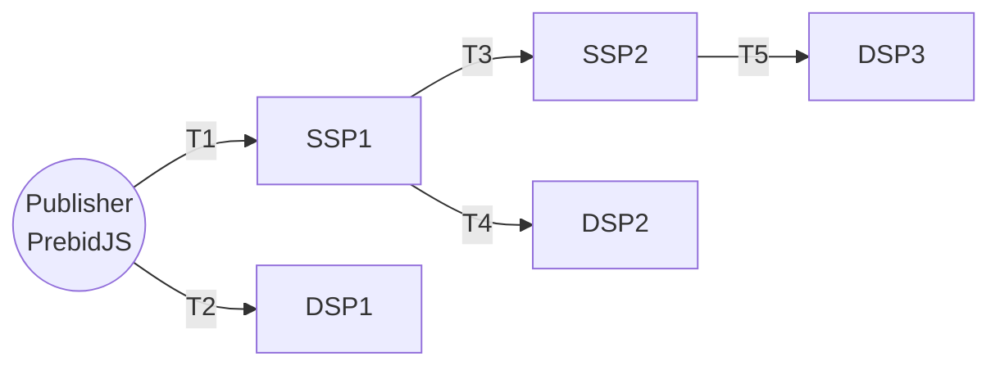
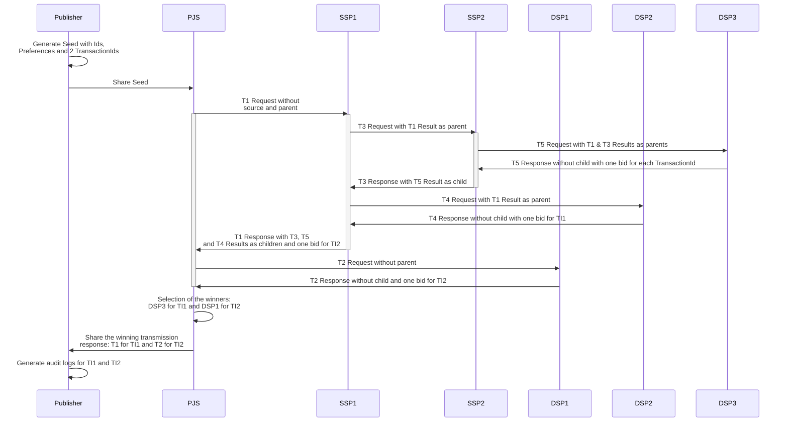

# Example of an ad auction

## Goal of the document

Provide a concrete example of an auction flow with Transmissions.

## The auction setup 

We will use the following setup of Publisher, SSPs and DSPs and we will describe the Transmission Request and the Transmission Response.



Notes:

* We will consider that the publisher has two ad placements to share a cross the Ad Network.
* T1, T2... Tn are Transmission names to ease the discussion around it. T1 and T2 share only the seed to the Receivers and those Receivers send back a Transmission Response.
* This setup uses the PrebidJS on the Publisher side. It will help us to show that the Sources of Transmissions of the party generation the Seed (in our case the Publisher) can be omitted.

## The auction flow



## OpenRTB Request/Response with the Transmissions

In those examples:
* The transmission-ids, the content-ids have defined value for easing the understanding of the relations between the requests and the responses. In real life, those values are GUID.
* The signatures aren't verifiable.
* The jsons omit some values (like "id" and "cur") that are normaly used in OpenRTB protocol to ease the understanding. 

<details>
<summary>OpenRTB Bid Request with T1 and T2 (identical)</summary>

<!--partial-begin { "files": [ "ad-auction-example-T1-T2-request.json" ], "block": "json" } -->
<!-- ⚠️ GENERATED CONTENT - DO NOT MODIFY DIRECTLY ⚠️ -->
```json
{
    "imp": [
        {
            "id": "1",
            "banner": {
                "h": 250,
                "w": 300,
                "pos": 0
            },
            "ext": {
                "data": {
                    "paf": {
                        "transaction_id": "transaction-id-for-impression-1 (GUID)"
                    }
                }
            }
        },
        {
            "id": "2",
            "banner": {
                "h": 250,
                "w": 300,
                "pos": 1
            },
            "ext": {
                "data": {
                    "paf": {
                        "transaction_id": "transaction-id-for-impression-2 (GUID)"
                    }
                }
            }
        }
    ],
    "user": {
        "id": "55816b39711f9b5acf3b90e313ed29e51665623f",
         "ext":
         {
            "eids": 
            [
                {
                    "source": "paf",
                    "uids": [
                        {
                            "source": "paf",
                            "atype": 1,
                            "id": "7435313e-caee-4889-8ad7-0acd0114ae3c",
                            "ext": 
                            {
                                "version": "0.1",
                                "type": "paf_browser_id",
                                "source": {
                                    "domain": "operator0.com",
                                    "timestamp": 1639580000,
                                    "signature": "868e7a6c27b7b7fe5fed219503894bf263f31bb6d8fd48336d283e77b512cda7"
                                }
                            }
                        }
                    ],
                    "ext": {
                        "preferences": {
                            "version": "0.1",
                            "data": { 
                                "use_browsing_for_personalization": true 
                            },
                            "source": {
                                "domain": "cmp1.com",
                                "timestamp": 1639581000,
                                "signature": "65acdcfdbdba8b17936f25a32b33b000393c866588d146cb62ec51ab8890c54f"
                            }
                        }
                    }
                }
            ],
            "paf": {
                "transmission": {
                    "seed": {
                        "version": "0.1",
                        "transaction_ids": [ 
                            "transaction-id-for-impression-1 (GUID)", 
                            "transaction-id-for-impression-2 (GUID)" 
                        ],
                        "publisher": "publisher.com",
                        "source": {
                            "domain": "publisher.com",
                            "timestamp": 1639582000,
                            "signature": "f1f4871d48b825931c5016a433cb3b6388f989fac363af09b9ee3cd400d86b74"
                        }
                    }
                }
            }
        }
    }
}
```
<!--partial-end-->
</details>

<details>
<summary>OpenRTB Bid Request with T3 and T4 (identical)</summary>

<!--partial-begin { "files": [ "ad-auction-example-T3-T4-request.json" ], "block": "json" } -->
<!-- ⚠️ GENERATED CONTENT - DO NOT MODIFY DIRECTLY ⚠️ -->
```json
{
    "imp": [
        {
            "id": "1",
            "banner": {
                "h": 250,
                "w": 300,
                "pos": 0
            },
            "ext": {
                "data": {
                    "paf": {
                        "transaction_id": "transaction-id-for-impression-1"
                    }
                }
            }
        },
        {
            "id": "2",
            "banner": {
                "h": 250,
                "w": 300,
                "pos": 1
            },
            "ext": {
                "data": {
                    "paf": {
                        "transaction_id": "transaction-id-for-impression-2"
                    }
                }
            }
        }
    ],
    "user": {
        "id": "55816b39711f9b5acf3b90e313ed29e51665623f",
         "ext":
         {
            "eids": 
            [
                {
                    "source": "paf",
                    "uids": [
                        {
                            "source": "paf",
                            "atype": 1,
                            "id": "7435313e-caee-4889-8ad7-0acd0114ae3c",
                            "ext": 
                            {
                                "version": "0.1",
                                "type": "paf_browser_id",
                                "source": {
                                    "domain": "operator0.com",
                                    "timestamp": 1639580000,
                                    "signature": "868e7a6c27b7b7fe5fed219503894bf263f31bb6d8fd48336d283e77b512cda7"
                                }
                            }
                        }
                    ],
                    "ext": {
                        "preferences": {
                            "version": "0.1",
                            "data": { 
                                "use_browsing_for_personalization": true 
                            },
                            "source": {
                                "domain": "cmp1.com",
                                "timestamp": 1639581000,
                                "signature": "65acdcfdbdba8b17936f25a32b33b000393c866588d146cb62ec51ab8890c54f"
                            }
                        }
                    }
                }
            ],
            "paf": {
                "transmission": {
                    "seed": {
                        "version": "0.1",
                        "transaction_ids": [ 
                            "transaction-id-for-impression-1 (GUID)", 
                            "transaction-id-for-impression-2 (GUID)" 
                        ],
                        "publisher": "publisher.com",
                        "source": {
                            "domain": "publisher.com",
                            "timestamp": 1639582000,
                            "signature": "f1f4871d48b825931c5016a433cb3b6388f989fac363af09b9ee3cd400d86b74"
                        }
                    },
                    "parents": [
                        {
                            "version": "0.1",
                            "receiver": "ssp1.com",
                            "contents": [],
                            "status": "success",
                            "details": "",
                            "source": {
                                "domain": "ssp1.com",
                                "timestamp": 1639581000,
                                "signature": "5d0519da9c65feeae715dfcf380c7997ea9ee859e2636a498c43c1044dc20354"
                            }
                        }
                    ]
                }
            }
        }
    }
}
```
<!--partial-end-->
</details>

<details>
<summary>OpenRTB Bid Request with T5</summary>

<!--partial-begin { "files": [ "ad-auction-example-T5-request.json" ], "block": "json" } -->
<!-- ⚠️ GENERATED CONTENT - DO NOT MODIFY DIRECTLY ⚠️ -->
```json
{
    "imp": [
        {
            "id": "1",
            "banner": {
                "h": 250,
                "w": 300,
                "pos": 0
            },
            "ext": {
                "data": {
                    "paf": {
                        "transaction_id": "transaction-id-for-impression-1 (GUID)"
                    }
                }
            }
        },
        {
            "id": "2",
            "banner": {
                "h": 250,
                "w": 300,
                "pos": 1
            },
            "ext": {
                "data": {
                    "paf": {
                        "transaction_id": "transaction-id-for-impression-2 (GUID)"
                    }
                }
            }
        }
    ],
    "user": {
        "id": "55816b39711f9b5acf3b90e313ed29e51665623f",
         "ext":
         {
            "eids": 
            [
                {
                    "source": "paf",
                    "uids": [
                        {
                            "source": "paf",
                            "atype": 1,
                            "id": "7435313e-caee-4889-8ad7-0acd0114ae3c",
                            "ext": 
                            {
                                "version": "0.1",
                                "type": "paf_browser_id",
                                "source": {
                                    "domain": "operator0.com",
                                    "timestamp": 1639580000,
                                    "signature": "868e7a6c27b7b7fe5fed219503894bf263f31bb6d8fd48336d283e77b512cda7"
                                }
                            }
                        }
                    ],
                    "ext": {
                        "preferences": {
                            "version": "0.1",
                            "data": { 
                                "use_browsing_for_personalization": true 
                            },
                            "source": {
                                "domain": "cmp1.com",
                                "timestamp": 1639581000,
                                "signature": "65acdcfdbdba8b17936f25a32b33b000393c866588d146cb62ec51ab8890c54f"
                            }
                        }
                    }
                }
            ],
            "paf": {
                "transmission": {
                    "seed": {
                        "version": "0.1",
                        "transaction_ids": [ 
                            "transaction-id-for-impression-1", 
                            "transaction-id-for-impression-2"
                        ],
                        "publisher": "publisher.com",
                        "source": {
                            "domain": "publisher.com",
                            "timestamp": 1639582000,
                            "signature": "f1f4871d48b825931c5016a433cb3b6388f989fac363af09b9ee3cd400d86b74"
                        }
                    },
                    "parents": [
                        {
                            "version": "0.1",
                            "receiver": "ssp1.com",
                            "contents": [],
                            "status": "success",
                            "details": "",
                            "source": {
                                "domain": "ssp1.com",
                                "timestamp": 1639581000,
                                "signature": "5d0519da9c65feeae715dfcf380c7997ea9ee859e2636a498c43c1044dc20354"
                            }
                        },
                        {
                            "version": "0.1",
                            "receiver": "ssp2.com",
                            "contents": [],
                            "status": "success",
                            "details": "",
                            "source": {
                                "domain": "ssp2.com",
                                "timestamp": 1639581000,
                                "signature": "5d0519da9c65feeae715dfcf380c7997ea9ee859e2636a498c43c1044dc20354"
                            }
                        }
                    ]
                }
            }
        }
    }
}
```
<!--partial-end-->
</details>

<details>
<summary>OpenRTB Bid Response with T4</summary>

<!--partial-begin { "files": [ "ad-auction-example-T4-response.json" ], "block": "json" } -->
<!-- ⚠️ GENERATED CONTENT - DO NOT MODIFY DIRECTLY ⚠️ -->
```json
{
    "ext": {
        "paf": {
            "transmission": {
                "version": "0.1",
                "contents": [
                    {
                        "transaction_id": "transaction-id-for-impression-1 (GUID)",
                        "content_id": "dsp3-content-id-for-impression-1 (GUID)"
                    }
                ],
                "status": "success",
                "details": "",
                "receiver": "dsp2.com",
                "source": {
                    "domain": "dsp2.com",
                    "timestamp": 1639589531,
                    "signature": "d01c6e83f14b4f057c2a2a86d320e2454fc0c60df4645518d993b5f40019d24c"
                },
                "children": [
                ]
            }
        }
    },
    "seatbid": [
        {
            "seat": "513 (DSP2)",
            "bid": [
                {
                    "id": "1",
                    "impid": "1",
                    "price": 1,
                    "nurl": "http://adserver2.com/winnotice?impid=102",
                    "iurl": "http://adserver2.com/pathtosampleimage",
                    "adomain": [ "advertiserdomain2.com" ],
                    "cid": "campaign2",
                    "crid": "creative2",
                    "attr": [ 1, 2, 3, 4, 5, 6, 7, 12 ],
                    "ext": {
                        "paf" : {
                            "content_id": "dsp2-content-id-for-impression-1 (GUID)"
                        }
                    }
                }
            ]
        }
    ]
}
```
<!--partial-end-->
</details>

<details>
<summary>OpenRTB Bid Response with T5</summary>

<!--partial-begin { "files": [ "ad-auction-example-T5-response.json" ], "block": "json" } -->
<!-- ⚠️ GENERATED CONTENT - DO NOT MODIFY DIRECTLY ⚠️ -->
```json
{
    "ext": {
        "paf": {
            "transmission": {
                "version": "0.1",
                "contents": [
                    {
                        "transaction_id": "transaction-id-for-impression-1 (GUID)",
                        "content_id": "dsp3-content-id-for-impression-1 (GUID)"
                    },
                    {
                        "transaction_id": "transaction-id-for-impression-2 (GUID)",
                        "content_id": "dsp3-content-id-for-impression-2 (GUID)"
                    }
                ],
                "status": "success",
                "details": "",
                "receiver": "dsp3.com",
                "source": {
                    "domain": "dsp3.com",
                    "timestamp": 1639589531,
                    "signature": "d01c6e83f14b4f057c2a2a86d320e2454fc0c60df4645518d993b5f40019d24c"
                },
                "children": [
                ]
            }
        }
    },
    "seatbid": [
        {
            "seat": "512 (DSP3)",
            "bid": [
                {
                    "id": "1",
                    "impid": "1",
                    "price": 6,
                    "nurl": "http://adserver31.com/winnotice?impid=102",
                    "iurl": "http://adserver31.com/pathtosampleimage",
                    "adomain": [ "advertiserdomain31.com" ],
                    "cid": "campaign31",
                    "crid": "creative31",
                    "attr": [ 1, 2, 3, 4, 5, 6, 7, 12 ],
                    "ext": {
                        "paf" : {
                            "content_id": "dsp3-content-id-for-impression-1 (GUID)"
                        }
                    }
                },
                {
                    "id": "2",
                    "impid": "2",
                    "price": 2,
                    "nurl": "http://adserver32.com/winnotice?impid=102",
                    "iurl": "http://adserver32.com/pathtosampleimage",
                    "adomain": [ "advertiserdomain32.com" ],
                    "cid": "campaign32",
                    "crid": "creative32",
                    "attr": [ 1, 2, 3, 4, 5, 6, 7, 12 ],
                    "ext": {
                        "paf" : {
                            "content_id": "dsp3-content-id-for-impression-2 (GUID)"
                        }
                    }
                }
            ]
        }
    ]
}
```
<!--partial-end-->
</details>

<details>
<summary>OpenRTB Bid Response with T3</summary>

<!--partial-begin { "files": [ "ad-auction-example-T3-response.json" ], "block": "json" } -->
<!-- ⚠️ GENERATED CONTENT - DO NOT MODIFY DIRECTLY ⚠️ -->
```json
{
    "ext": {
        "paf": {
            "transmission": {
                "version": "0.1",
                "contents": [
                ],
                "status": "success",
                "details": "",
                "receiver": "ssp2.com",
                "source": {
                    "domain": "ssp2.com",
                    "timestamp": 1639589531,
                    "signature": "asfdef14b4f057c2a2a86d320e2454fc0c60df4645518d993b5f40019dssda"
                },
                "children": [
                    {
                        "version": "0.1",
                        "contents": [
                            {
                                "transaction_id": "transaction-id-for-impression-1 (GUID)",
                                "content_id": "dsp3-content-id-for-impression-1 (GUID)"
                            },
                            {
                                "transaction_id": "transaction-id-for-impression-2 (GUID)",
                                "content_id": "dsp3-content-id-for-impression-2 (GUID)"
                            }
                        ],
                        "status": "success",
                        "details": "",
                        "receiver": "dsp3.com",
                        "source": {
                            "domain": "dsp3.com",
                            "timestamp": 1639589531,
                            "signature": "d01c6e83f14b4f057c2a2a86d320e2454fc0c60df4645518d993b5f40019d24c"
                        },
                        "children": [
                        ]
                    }
                ]
            }
        }
    },
    "seatbid": [
        {
            "seat": "512 (DSP3)",
            "bid": [
                {
                    "id": "1",
                    "impid": "1",
                    "price": 6,
                    "nurl": "http://adserver31.com/winnotice?impid=102",
                    "iurl": "http://adserver31.com/pathtosampleimage",
                    "adomain": [ "advertiserdomain31.com" ],
                    "cid": "campaign31",
                    "crid": "creative31",
                    "attr": [ 1, 2, 3, 4, 5, 6, 7, 12 ],
                    "ext": {
                        "paf" : {
                            "content_id": "dsp3-content-id-for-impression-1 (GUID)"
                        }
                    }
                },
                {
                    "id": "2",
                    "impid": "2",
                    "price": 2,
                    "nurl": "http://adserver32.com/winnotice?impid=102",
                    "iurl": "http://adserver32.com/pathtosampleimage",
                    "adomain": [ "advertiserdomain32.com" ],
                    "cid": "campaign32",
                    "crid": "creative32",
                    "attr": [ 1, 2, 3, 4, 5, 6, 7, 12 ],
                    "ext": {
                        "paf" : {
                            "content_id": "dsp3-content-id-for-impression-2 (GUID)"
                        }
                    }
                }
            ]
        }
    ]
}
```
<!--partial-end-->
</details>

<details>
<summary>OpenRTB Bid Response with T1</summary>

<!--partial-begin { "files": [ "ad-auction-example-T1-response.json" ], "block": "json" } -->
<!-- ⚠️ GENERATED CONTENT - DO NOT MODIFY DIRECTLY ⚠️ -->
```json
{
    "ext": {
        "paf": {
            "transmission": {
                "version": "0.1",
                "contents": [
                ],
                "status": "success",
                "details": "",
                "receiver": "ssp1.com",
                "source": {
                    "domain": "ssp1.com",
                    "timestamp": 1639589531,
                    "signature": "3fe324b4f057c2a2a86d320e2454fc0c60df4645518d993b5f40019eada5"
                },
                "children": [
                    {
                        "version": "0.1",
                        "contents": [
                        ],
                        "status": "success",
                        "details": "",
                        "receiver": "ssp2.com",
                        "source": {
                            "domain": "ssp2.com",
                            "timestamp": 1639589531,
                            "signature": "asfdef14b4f057c2a2a86d320e2454fc0c60df4645518d993b5f40019dssda"
                        },
                        "children": [
                            {
                                "version": "0.1",
                                "contents": [
                                    {
                                        "transaction_id": "transaction-id-for-impression-1 (GUID)",
                                        "content_id": "dsp3-content-id-for-impression-1 (GUID)"
                                    },
                                    {
                                        "transaction_id": "transaction-id-for-impression-2 (GUID)",
                                        "content_id": "dsp3-content-id-for-impression-2 (GUID)"
                                    }
                                ],
                                "status": "success",
                                "details": "",
                                "receiver": "dsp3.com",
                                "source": {
                                    "domain": "dsp3.com",
                                    "timestamp": 1639589531,
                                    "signature": "d01c6e83f14b4f057c2a2a86d320e2454fc0c60df4645518d993b5f40019d24c"
                                },
                                "children": [
                                ]
                            }
                        ]
                    },
                    {
                        "version": "0.1",
                        "contents": [
                            {
                                "transaction_id": "transaction-id-for-impression-1 (GUID)",
                                "content_id": "dsp2-content-id-for-impression-1 (GUID)"
                            }
                        ],
                        "status": "success",
                        "details": "",
                        "receiver": "dsp2.com",
                        "source": {
                            "domain": "dsp2.com",
                            "timestamp": 1639589531,
                            "signature": "d01c6e83f14b4f057c2a2a86d320e2454fc0c60df4645518d993b5f40019d24c"
                        },
                        "children": [
                        ]
                    }
                ]
            }
        }
    },
    "seatbid": [
        {
            "seat": "512 (DSP3)",
            "bid": [
                {
                    "id": "1",
                    "impid": "1",
                    "price": 6,
                    "nurl": "http://adserver31.com/winnotice?impid=102",
                    "iurl": "http://adserver31.com/pathtosampleimage",
                    "adomain": [ "advertiserdomain31.com" ],
                    "cid": "campaign31",
                    "crid": "creative31",
                    "attr": [ 1, 2, 3, 4, 5, 6, 7, 12 ],
                    "ext": {
                        "paf" : {
                            "content_id": "dsp3-content-id-for-impression-1 (GUID)"
                        }
                    }
                },
                {
                    "id": "2",
                    "impid": "2",
                    "price": 2,
                    "nurl": "http://adserver32.com/winnotice?impid=102",
                    "iurl": "http://adserver32.com/pathtosampleimage",
                    "adomain": [ "advertiserdomain32.com" ],
                    "cid": "campaign32",
                    "crid": "creative32",
                    "attr": [ 1, 2, 3, 4, 5, 6, 7, 12 ],
                    "ext": {
                        "paf" : {
                            "content_id": "dsp3-content-id-for-impression-2 (GUID)"
                        }
                    }
                }
            ]
        },
        {
            "seat": "513 (DSP2)",
            "bid": [
                {
                    "id": "1",
                    "impid": "1",
                    "price": 1,
                    "nurl": "http://adserver2.com/winnotice?impid=102",
                    "iurl": "http://adserver2.com/pathtosampleimage",
                    "adomain": [ "advertiserdomain2.com" ],
                    "cid": "campaign2",
                    "crid": "creative2",
                    "attr": [ 1, 2, 3, 4, 5, 6, 7, 12 ],
                    "ext": {
                        "paf" : {
                            "content_id": "dsp2-content-id-for-impression-1 (GUID)"
                        }
                    }
                }
            ]
        }
    ]
}
```
<!--partial-end-->
</details>

<details>
<summary>OpenRTB Bid Response with T2</summary>

<!--partial-begin { "files": [ "ad-auction-example-T2-response.json" ], "block": "json" } -->
<!-- ⚠️ GENERATED CONTENT - DO NOT MODIFY DIRECTLY ⚠️ -->
```json
{
    "ext": {
        "paf": {
            "transmission": {
                "version": "0.1",
                "contents": [
                    {
                        "transaction_id": "transaction-id-for-impression-2 (GUID)",
                        "content_id": "dsp1-content-id-for-impression-2 (GUID)"
                    }
                ],
                "status": "success",
                "details": "",
                "receiver": "dsp1.com",
                "source": {
                    "domain": "dsp1.com",
                    "timestamp": 1639589531,
                    "signature": "d01c6e83f14b4f057c2a2a86d320e2454fc0c60df4645518d993b5f40019d24c"
                },
                "children": [
                ]
            }
        }
    },
    "seatbid": [
        {
            "seat": "555 (DSP1)",
            "bid": [
                {
                    "id": "2",
                    "impid": "2",
                    "price": 5,
                    "nurl": "http://adserver12.com/winnotice?impid=102",
                    "iurl": "http://adserver12.com/pathtosampleimage",
                    "adomain": [ "advertiserdomain12.com" ],
                    "cid": "campaign12",
                    "crid": "creative12",
                    "attr": [ 1, 2, 3, 4, 5, 6, 7, 12 ],
                    "ext": {
                        "paf" : {
                            "content_id": "dsp1-content-id-for-impression-2 (GUID)"
                        }
                    }
                }
            ]
        }
    ]
}
```
<!--partial-end-->
</details>

<details>
<summary>Audit Log for TI1 based on T1</summary>

<!--partial-begin { "files": [ "ad-auction-example-TI1-audit-log.json" ], "block": "json" } -->
<!-- ⚠️ GENERATED CONTENT - DO NOT MODIFY DIRECTLY ⚠️ -->
```json
{
    "data": {
        "identifiers": [
            {
                "version": "0.1",
                "type": "paf_browser_id",
                "value": "7435313e-caee-4889-8ad7-0acd0114ae3c",
                "source": {
                    "domain": "operator0.com",
                    "timestamp": 1639589531,
                    "signature": "3045022100aabf3ca5e4609990a1ff077c50aa52e3343005ead0d6f2ba1c05f71afe34b2f2022045fb8a98b154f8bcd66eb5774499d5fcb20e18274d67f14a43d5b45ec301d470"
                }
            }
        ],
        "preferences": {
            "version": "0.1",
            "data": { 
                "use_browsing_for_personalization": true 
            },
            "source": {
                "domain": "cmp1.com",
                "timestamp": 1639589531,
                "signature": "304502203be66cc4bfa525f20005bc0b921f756f6a1d016c49641bdf0133413fe2ee1e15022100d2a37aabdb3c58ca84dfbaccf59496087deb976e9b8aa18bc93c48f59853b587"
            }
        }
    },
    "seed": {
        "version": "0.1",
        "transaction_ids": [ 
            "transaction-id-for-impression-1 (GUID)", 
            "transaction-id-for-impression-2 (GUID)" 
        ],
        "publisher": "publisher.com",
        "source": {
            "domain": "publisher.com",
            "timestamp": 1639582000,
            "signature": "f1f4871d48b825931c5016a433cb3b6388f989fac363af09b9ee3cd400d86b74"
        }
    },
    "transaction_id": "transaction-id-for-impression-1 (GUID)",
    "transmissions": [
        {
            "version": "0.1",
            "contents": [
            ],
            "status": "success",
            "details": "",
            "receiver": "ssp1.com",
            "source": {
                "domain": "ssp1.com",
                "timestamp": 1639589531,
                "signature": "3fe324b4f057c2a2a86d320e2454fc0c60df4645518d993b5f40019eada5"
            }
        },
        {
            "version": "0.1",
            "contents": [
            ],
            "status": "success",
            "details": "",
            "receiver": "ssp2.com",
            "source": {
                "domain": "ssp2.com",
                "timestamp": 1639589531,
                "signature": "asfdef14b4f057c2a2a86d320e2454fc0c60df4645518d993b5f40019dssda"
            }
        },
        {
            "version": "0.1",
            "contents": [
                {
                    "transaction_id": "transaction-id-for-impression-1 (GUID)",
                    "content_id": "dsp3-content-id-for-impression-1 (GUID)"
                },
                {
                    "transaction_id": "transaction-id-for-impression-2 (GUID)",
                    "content_id": "dsp3-content-id-for-impression-2 (GUID)"
                }
            ],
            "status": "success",
            "details": "",
            "receiver": "dsp3.com",
            "source": {
                "domain": "dsp3.com",
                "timestamp": 1639589531,
                "signature": "d01c6e83f14b4f057c2a2a86d320e2454fc0c60df4645518d993b5f40019d24c"
            }
        }
    ]
}
```
<!--partial-end-->
</details>

<details>
<summary>Audit Log for TI2 based on T2</summary>

<!--partial-begin { "files": [ "ad-auction-example-TI2-audit-log.json" ], "block": "json" } -->
<!-- ⚠️ GENERATED CONTENT - DO NOT MODIFY DIRECTLY ⚠️ -->
```json
{
    "data": {
        "identifiers": [
            {
                "version": "0.1",
                "type": "paf_browser_id",
                "value": "7435313e-caee-4889-8ad7-0acd0114ae3c",
                "source": {
                    "domain": "operator0.com",
                    "timestamp": 1639589531,
                    "signature": "3045022100aabf3ca5e4609990a1ff077c50aa52e3343005ead0d6f2ba1c05f71afe34b2f2022045fb8a98b154f8bcd66eb5774499d5fcb20e18274d67f14a43d5b45ec301d470"
                }
            }
        ],
        "preferences": {
            "version": "0.1",
            "data": { 
                "use_browsing_for_personalization": true 
            },
            "source": {
                "domain": "cmp1.com",
                "timestamp": 1639589531,
                "signature": "304502203be66cc4bfa525f20005bc0b921f756f6a1d016c49641bdf0133413fe2ee1e15022100d2a37aabdb3c58ca84dfbaccf59496087deb976e9b8aa18bc93c48f59853b587"
            }
        }
    },
    "seed": {
        "version": "0.1",
        "transaction_ids": [ 
            "transaction-id-for-impression-1", 
            "transaction-id-for-impression-2" 
        ],
        "publisher": "publisher.com",
        "source": {
            "domain": "publisher.com",
            "timestamp": 1639582000,
            "signature": "f1f4871d48b825931c5016a433cb3b6388f989fac363af09b9ee3cd400d86b74"
        }
    },
    "transaction_id": "transaction-id-for-impression-2 (GUID)",
    "transmissions": [
        {
            "version": "0.1",
            "contents": [
                {
                    "transaction_id": "transaction-id-for-impression-2 (GUID)",
                    "content_id": "dsp1-content-id-for-impression-2 (GUID)"
                }
            ],
            "status": "success",
            "details": "",
            "receiver": "dsp1.com",
            "source": {
                "domain": "dsp1.com",
                "timestamp": 1639589531,
                "signature": "d01c6e83f14b4f057c2a2a86d320e2454fc0c60df4645518d993b5f40019d24c"
            }
        }
    ]
}
```
<!--partial-end-->
</details>

