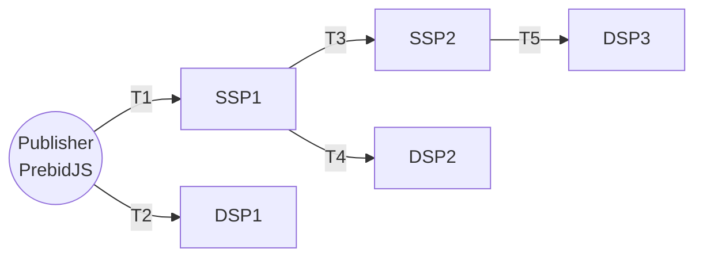
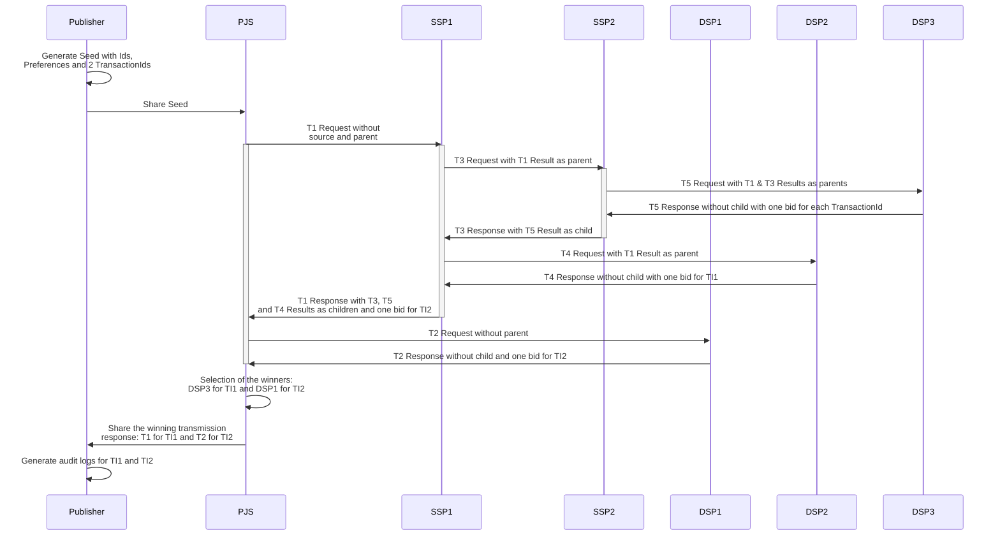

# Example of an ad auction

## Goal of the document

Provide a concrete example of an auction flow with Transmissions.

## The auction setup 

We use the following setup of Publisher, SSPs and DSPs and we describe the Transmission Requests and the Transmission Responses.



Notes:

* We will consider that the publisher has two ad unit to offer a cross the Ad Network.
* Those ad units are associated respectively to one transaction_id each: `transaction-id-for-impression-1 (GUID)` (named TI1 in the auction flow) and `transaction-id-for-impression-2 (GUID)` (named TI2 in the auction flow).
* T1, T2... Tn are Transmission names to ease the discussion around it. T1 and T2 share only the seed to the Receivers and those Receivers send back a Transmission Response.
* This setup uses the PrebidJS on the Publisher website. The publisher generates the Seeds and pass it to PrebidJS which offer it to the PrebidJS adaptors. 

## The auction flow



## OpenRTB Request/Response with the Transmissions

In those examples:
* The transaction-ids, the content-ids, seat and signatures have defined value for easing the understanding of the relations between the requests and the responses. In real life, those values are GUID, integer or hash.
* The jsons omit some values (like "id" and "cur") that are normaly used in OpenRTB protocol to ease the understanding.
* T1 and T2 Request are directly send by the Prebid Bidder Adapter to the matching server. This is typically done using a custom protocol, so we're just providing the expected Transmission Request object instead of the full request.

<details>
<summary>Bid Response with standalone format for T1 and T2 (identical)</summary>

<!--partial-begin { "files": [ "ad-auction-example-T1-T2-request-standalone.json" ], "block": "json" } -->
<!-- ⚠️ GENERATED CONTENT - DO NOT MODIFY DIRECTLY ⚠️ -->
```json
{
    "adunits": [
        {
            "banner": {
                "h": 250,
                "w": 300,
                "pos": 0
            },
            "paf_transaction_id": "transaction-id-for-impression-1 (GUID)"
        },
        {
            "banner": {
                "h": 250,
                "w": 300,
                "pos": 1
            },
            "paf_transaction_id": "transaction-id-for-impression-2 (GUID)"
        }
    ],
    "paf": {
        "seed": {
            "version": "0.1",
            "transaction_ids": [ 
                "transaction-id-for-impression-1 (GUID)", 
                "transaction-id-for-impression-2 (GUID)" 
            ],
            "publisher": "publisher.com",
            "source": {
                "domain": "publisher.com",
                "timestamp": 1639582000,
                "signature": "seed-signature-done-by-publisher-before-T1-and-T2"
            }
        },
        "data": {
            "identifiers": [
                {
                    "version": "0.1",
                    "type": "paf_browser_id",
                    "value": "7435313e-caee-4889-8ad7-0acd0114ae3c",
                    "source": {
                        "domain": "operator0.com",
                        "timestamp": 1639580000,
                        "signature": "operator-signature-done-before-ad-auction-flow"
                    }
                }
            ],
            "preferences": {
                "version": "0.1",
                "data": { 
                    "use_browsing_for_personalization": true 
                },
                "source": {
                    "domain": "cmp1.com",
                    "timestamp": 1639581000,
                    "signature": "cmp-signature-done-before-ad-auction-flow"
                }
            }
        },
        "parents": [
        ]
    }
}
```
<!--partial-end-->
</details>

<details>
<summary>OpenRTB Bid Request with T3 and T4 (identical)</summary>

<!--partial-begin { "files": [ "ad-auction-example-T3-T4-request.json" ], "block": "json" } -->
<!-- ⚠️ GENERATED CONTENT - DO NOT MODIFY DIRECTLY ⚠️ -->
```json
{
    "imp": [
        {
            "id": "1",
            "banner": {
                "h": 250,
                "w": 300,
                "pos": 0
            },
            "ext": {
                "data": {
                    "paf": {
                        "transaction_id": "transaction-id-for-impression-1"
                    }
                }
            }
        },
        {
            "id": "2",
            "banner": {
                "h": 250,
                "w": 300,
                "pos": 1
            },
            "ext": {
                "data": {
                    "paf": {
                        "transaction_id": "transaction-id-for-impression-2"
                    }
                }
            }
        }
    ],
    "user": {
        "id": "55816b39711f9b5acf3b90e313ed29e51665623f",
         "ext":
         {
            "eids": 
            [
                {
                    "source": "paf",
                    "uids": [
                        {
                            "source": "paf",
                            "atype": 1,
                            "id": "7435313e-caee-4889-8ad7-0acd0114ae3c",
                            "ext": 
                            {
                                "version": "0.1",
                                "type": "paf_browser_id",
                                "source": {
                                    "domain": "operator0.com",
                                    "timestamp": 1639580000,
                                    "signature": "operator-signature-done-before-ad-auction-flow"
                                }
                            }
                        }
                    ],
                    "ext": {
                        "preferences": {
                            "version": "0.1",
                            "data": { 
                                "use_browsing_for_personalization": true 
                            },
                            "source": {
                                "domain": "cmp1.com",
                                "timestamp": 1639581000,
                                "signature": "cmp-signature-done-before-ad-auction-flow"
                            }
                        }
                    }
                }
            ],
            "paf": {
                "transmission": {
                    "seed": {
                        "version": "0.1",
                        "transaction_ids": [ 
                            "transaction-id-for-impression-1 (GUID)", 
                            "transaction-id-for-impression-2 (GUID)" 
                        ],
                        "publisher": "publisher.com",
                        "source": {
                            "domain": "publisher.com",
                            "timestamp": 1639582000,
                            "signature": "seed-signature-done-by-publisher-before-T1-and-T2"
                        }
                    },
                    "parents": [
                        {
                            "version": "0.1",
                            "receiver": "ssp1.com",
                            "contents": [],
                            "status": "success",
                            "details": "",
                            "source": {
                                "domain": "ssp1.com",
                                "timestamp": 1639581000,
                                "signature": "transmission-signature-done-by-ssp1-just-after-T1-request"
                            }
                        }
                    ]
                }
            }
        }
    }
}
```
<!--partial-end-->
</details>

<details>
<summary>OpenRTB Bid Request with T5</summary>

<!--partial-begin { "files": [ "ad-auction-example-T5-request.json" ], "block": "json" } -->
<!-- ⚠️ GENERATED CONTENT - DO NOT MODIFY DIRECTLY ⚠️ -->
```json
{
    "imp": [
        {
            "id": "1",
            "banner": {
                "h": 250,
                "w": 300,
                "pos": 0
            },
            "ext": {
                "data": {
                    "paf": {
                        "transaction_id": "transaction-id-for-impression-1 (GUID)"
                    }
                }
            }
        },
        {
            "id": "2",
            "banner": {
                "h": 250,
                "w": 300,
                "pos": 1
            },
            "ext": {
                "data": {
                    "paf": {
                        "transaction_id": "transaction-id-for-impression-2 (GUID)"
                    }
                }
            }
        }
    ],
    "user": {
        "id": "55816b39711f9b5acf3b90e313ed29e51665623f",
         "ext":
         {
            "eids": 
            [
                {
                    "source": "paf",
                    "uids": [
                        {
                            "source": "paf",
                            "atype": 1,
                            "id": "7435313e-caee-4889-8ad7-0acd0114ae3c",
                            "ext": 
                            {
                                "version": "0.1",
                                "type": "paf_browser_id",
                                "source": {
                                    "domain": "operator0.com",
                                    "timestamp": 1639580000,
                                    "signature": "operator-signature-done-before-ad-auction-flow"
                                }
                            }
                        }
                    ],
                    "ext": {
                        "preferences": {
                            "version": "0.1",
                            "data": { 
                                "use_browsing_for_personalization": true 
                            },
                            "source": {
                                "domain": "cmp1.com",
                                "timestamp": 1639581000,
                                "signature": "cmp-signature-done-before-ad-auction-flow"
                            }
                        }
                    }
                }
            ],
            "paf": {
                "transmission": {
                    "seed": {
                        "version": "0.1",
                        "transaction_ids": [ 
                            "transaction-id-for-impression-1", 
                            "transaction-id-for-impression-2"
                        ],
                        "publisher": "publisher.com",
                        "source": {
                            "domain": "publisher.com",
                            "timestamp": 1639582000,
                            "signature": "seed-signature-done-by-publisher-before-T1-and-T2"
                        }
                    },
                    "parents": [
                        {
                            "version": "0.1",
                            "receiver": "ssp1.com",
                            "contents": [],
                            "status": "success",
                            "details": "",
                            "source": {
                                "domain": "ssp1.com",
                                "timestamp": 1639581000,
                                "signature": "transmission-signature-done-by-ssp1-just-after-T1-request"
                            }
                        },
                        {
                            "version": "0.1",
                            "receiver": "ssp2.com",
                            "contents": [],
                            "status": "success",
                            "details": "",
                            "source": {
                                "domain": "ssp2.com",
                                "timestamp": 1639581000,
                                "signature": "transmission-signature-done-by-ssp2-just-after-T3-request"
                            }
                        }
                    ]
                }
            }
        }
    }
}
```
<!--partial-end-->
</details>

<details>
<summary>OpenRTB Bid Response with T4</summary>

<!--partial-begin { "files": [ "ad-auction-example-T4-response.json" ], "block": "json" } -->
<!-- ⚠️ GENERATED CONTENT - DO NOT MODIFY DIRECTLY ⚠️ -->
```json
{
    "ext": {
        "paf": {
            "transmission": {
                "version": "0.1",
                "contents": [
                    {
                        "transaction_id": "transaction-id-for-impression-1 (GUID)",
                        "content_id": "dsp3-content-id-for-impression-1 (GUID)"
                    }
                ],
                "status": "success",
                "details": "",
                "receiver": "dsp2.com",
                "source": {
                    "domain": "dsp2.com",
                    "timestamp": 1639589531,
                    "signature": "transmission-signature-done-by-dsp2-just-after-T4-request"
                },
                "children": [
                ]
            }
        }
    },
    "seatbid": [
        {
            "seat": "513 (DSP2)",
            "bid": [
                {
                    "id": "1",
                    "impid": "1",
                    "price": 1,
                    "nurl": "http://adserver2.com/winnotice?impid=102",
                    "iurl": "http://adserver2.com/pathtosampleimage",
                    "adomain": [ "advertiserdomain2.com" ],
                    "cid": "campaign2",
                    "crid": "creative2",
                    "attr": [ 1, 2, 3, 4, 5, 6, 7, 12 ],
                    "ext": {
                        "paf" : {
                            "content_id": "dsp2-content-id-for-impression-1 (GUID)"
                        }
                    }
                }
            ]
        }
    ]
}
```
<!--partial-end-->
</details>

<details>
<summary>OpenRTB Bid Response with T5</summary>

<!--partial-begin { "files": [ "ad-auction-example-T5-response.json" ], "block": "json" } -->
<!-- ⚠️ GENERATED CONTENT - DO NOT MODIFY DIRECTLY ⚠️ -->
```json
{
    "ext": {
        "paf": {
            "transmission": {
                "version": "0.1",
                "contents": [
                    {
                        "transaction_id": "transaction-id-for-impression-1 (GUID)",
                        "content_id": "dsp3-content-id-for-impression-1 (GUID)"
                    },
                    {
                        "transaction_id": "transaction-id-for-impression-2 (GUID)",
                        "content_id": "dsp3-content-id-for-impression-2 (GUID)"
                    }
                ],
                "status": "success",
                "details": "",
                "receiver": "dsp3.com",
                "source": {
                    "domain": "dsp3.com",
                    "timestamp": 1639589531,
                    "signature": "transmission-signature-done-by-dsp3-just-after-T5-request"
                },
                "children": [
                ]
            }
        }
    },
    "seatbid": [
        {
            "seat": "512 (DSP3)",
            "bid": [
                {
                    "id": "1",
                    "impid": "1",
                    "price": 6,
                    "nurl": "http://adserver31.com/winnotice?impid=102",
                    "iurl": "http://adserver31.com/pathtosampleimage",
                    "adomain": [ "advertiserdomain31.com" ],
                    "cid": "campaign31",
                    "crid": "creative31",
                    "attr": [ 1, 2, 3, 4, 5, 6, 7, 12 ],
                    "ext": {
                        "paf" : {
                            "content_id": "dsp3-content-id-for-impression-1 (GUID)"
                        }
                    }
                },
                {
                    "id": "2",
                    "impid": "2",
                    "price": 2,
                    "nurl": "http://adserver32.com/winnotice?impid=102",
                    "iurl": "http://adserver32.com/pathtosampleimage",
                    "adomain": [ "advertiserdomain32.com" ],
                    "cid": "campaign32",
                    "crid": "creative32",
                    "attr": [ 1, 2, 3, 4, 5, 6, 7, 12 ],
                    "ext": {
                        "paf" : {
                            "content_id": "dsp3-content-id-for-impression-2 (GUID)"
                        }
                    }
                }
            ]
        }
    ]
}
```
<!--partial-end-->
</details>

<details>
<summary>OpenRTB Bid Response with T3</summary>

<!--partial-begin { "files": [ "ad-auction-example-T3-response.json" ], "block": "json" } -->
<!-- ⚠️ GENERATED CONTENT - DO NOT MODIFY DIRECTLY ⚠️ -->
```json
{
    "ext": {
        "paf": {
            "transmission": {
                "version": "0.1",
                "contents": [
                ],
                "status": "success",
                "details": "",
                "receiver": "ssp2.com",
                "source": {
                    "domain": "ssp2.com",
                    "timestamp": 1639589531,
                    "signature": "asfdef14b4f057c2a2a86d320e2454fc0c60df4645518d993b5f40019dssda"
                },
                "children": [
                    {
                        "version": "0.1",
                        "contents": [
                            {
                                "transaction_id": "transaction-id-for-impression-1 (GUID)",
                                "content_id": "dsp3-content-id-for-impression-1 (GUID)"
                            },
                            {
                                "transaction_id": "transaction-id-for-impression-2 (GUID)",
                                "content_id": "dsp3-content-id-for-impression-2 (GUID)"
                            }
                        ],
                        "status": "success",
                        "details": "",
                        "receiver": "dsp3.com",
                        "source": {
                            "domain": "dsp3.com",
                            "timestamp": 1639589531,
                            "signature": "transmission-signature-done-by-dsp3-just-after-T5-request"
                        },
                        "children": [
                        ]
                    }
                ]
            }
        }
    },
    "seatbid": [
        {
            "seat": "512 (DSP3)",
            "bid": [
                {
                    "id": "1",
                    "impid": "1",
                    "price": 6,
                    "nurl": "http://adserver31.com/winnotice?impid=102",
                    "iurl": "http://adserver31.com/pathtosampleimage",
                    "adomain": [ "advertiserdomain31.com" ],
                    "cid": "campaign31",
                    "crid": "creative31",
                    "attr": [ 1, 2, 3, 4, 5, 6, 7, 12 ],
                    "ext": {
                        "paf" : {
                            "content_id": "dsp3-content-id-for-impression-1 (GUID)"
                        }
                    }
                },
                {
                    "id": "2",
                    "impid": "2",
                    "price": 2,
                    "nurl": "http://adserver32.com/winnotice?impid=102",
                    "iurl": "http://adserver32.com/pathtosampleimage",
                    "adomain": [ "advertiserdomain32.com" ],
                    "cid": "campaign32",
                    "crid": "creative32",
                    "attr": [ 1, 2, 3, 4, 5, 6, 7, 12 ],
                    "ext": {
                        "paf" : {
                            "content_id": "dsp3-content-id-for-impression-2 (GUID)"
                        }
                    }
                }
            ]
        }
    ]
}
```
<!--partial-end-->
</details>

<details>
<summary>Bid Response with standalone format for T1</summary>

<!--partial-begin { "files": [ "ad-auction-example-T1-response-standalone.json" ], "block": "json" } -->
<!-- ⚠️ GENERATED CONTENT - DO NOT MODIFY DIRECTLY ⚠️ -->
```json
{
    "paf_transmission": {
        "version": "0.1",
        "contents": [
        ],
        "status": "success",
        "details": "",
        "receiver": "ssp1.com",
        "source": {
            "domain": "ssp1.com",
            "timestamp": 1639589531,
            "signature": "transmission-signature-done-by-ssp1-just-after-T1-request"
        },
        "children": [
            {
                "version": "0.1",
                "contents": [
                ],
                "status": "success",
                "details": "",
                "receiver": "ssp2.com",
                "source": {
                    "domain": "ssp2.com",
                    "timestamp": 1639589531,
                    "signature": "transmission-signature-done-by-ssp2-just-after-T3-request"
                },
                "children": [
                    {
                        "version": "0.1",
                        "contents": [
                            {
                                "transaction_id": "transaction-id-for-impression-1 (GUID)",
                                "content_id": "dsp3-content-id-for-impression-1 (GUID)"
                            },
                            {
                                "transaction_id": "transaction-id-for-impression-2 (GUID)",
                                "content_id": "dsp3-content-id-for-impression-2 (GUID)"
                            }
                        ],
                        "status": "success",
                        "details": "",
                        "receiver": "dsp3.com",
                        "source": {
                            "domain": "dsp3.com",
                            "timestamp": 1639589531,
                            "signature": "transmission-signature-done-by-dsp3-just-after-T5-request"
                        },
                        "children": [
                        ]
                    }
                ]
            },
            {
                "version": "0.1",
                "contents": [
                    {
                        "transaction_id": "transaction-id-for-impression-1 (GUID)",
                        "content_id": "dsp2-content-id-for-impression-1 (GUID)"
                    }
                ],
                "status": "success",
                "details": "",
                "receiver": "dsp2.com",
                "source": {
                    "domain": "dsp2.com",
                    "timestamp": 1639589531,
                    "signature": "transmission-signature-done-by-dsp2-just-after-T4-request"
                },
                "children": [
                ]
            }
        ]
    },
    "bid": [
        {
            "impid": "1",
            "price": 6,
            "nurl": "http://adserver31.com/winnotice?impid=102",
            "iurl": "http://adserver31.com/pathtosampleimage",
            "adomain": [ "advertiserdomain31.com" ],
            "cid": "campaign31",
            "crid": "creative31",
            "attr": [ 1, 2, 3, 4, 5, 6, 7, 12 ],
            "paf_content_id": "dsp3-content-id-for-impression-1 (GUID)"
        },
        {
            "impid": "2",
            "price": 2,
            "nurl": "http://adserver32.com/winnotice?impid=102",
            "iurl": "http://adserver32.com/pathtosampleimage",
            "adomain": [ "advertiserdomain32.com" ],
            "cid": "campaign32",
            "crid": "creative32",
            "attr": [ 1, 2, 3, 4, 5, 6, 7, 12 ],
            "paf_content_id": "dsp3-content-id-for-impression-2 (GUID)"
        },
        {
            "impid": "1",
            "price": 1,
            "nurl": "http://adserver2.com/winnotice?impid=102",
            "iurl": "http://adserver2.com/pathtosampleimage",
            "adomain": [ "advertiserdomain2.com" ],
            "cid": "campaign2",
            "crid": "creative2",
            "attr": [ 1, 2, 3, 4, 5, 6, 7, 12 ],
            "paf_content_id": "dsp2-content-id-for-impression-1 (GUID)"
        }
    ]
}
```
<!--partial-end-->
</details>

<details>
<summary>Bid Response with standalone format for T2</summary>

<!--partial-begin { "files": [ "ad-auction-example-T2-response-standalone.json" ], "block": "json" } -->
<!-- ⚠️ GENERATED CONTENT - DO NOT MODIFY DIRECTLY ⚠️ -->
```json
{
    "paf_transmission": {
        "version": "0.1",
        "contents": [
            {
                "transaction_id": "transaction-id-for-impression-2 (GUID)",
                "content_id": "dsp1-content-id-for-impression-2 (GUID)"
            }
        ],
        "status": "success",
        "details": "",
        "receiver": "dsp1.com",
        "source": {
            "domain": "dsp1.com",
            "timestamp": 1639589531,
            "signature": "transmission-signature-done-by-dsp1-just-after-T2-request"
        },
        "children": [
        ]
    },
    "seatbid": [
        {
            "seat": "555 (DSP1)",
            "bid": [
                {
                    "id": "2",
                    "impid": "2",
                    "price": 5,
                    "nurl": "http://adserver12.com/winnotice?impid=102",
                    "iurl": "http://adserver12.com/pathtosampleimage",
                    "adomain": [ "advertiserdomain12.com" ],
                    "cid": "campaign12",
                    "crid": "creative12",
                    "attr": [ 1, 2, 3, 4, 5, 6, 7, 12 ],
                    "ext": {
                        "paf" : {
                            "content_id": "dsp1-content-id-for-impression-2 (GUID)"
                        }
                    }
                }
            ]
        }
    ]
}
```
<!--partial-end-->
</details>

<details>
<summary>Audit Log for TI1 based on T1</summary>

<!--partial-begin { "files": [ "ad-auction-example-TI1-audit-log.json" ], "block": "json" } -->
<!-- ⚠️ GENERATED CONTENT - DO NOT MODIFY DIRECTLY ⚠️ -->
```json
{
    "data": {
        "identifiers": [
            {
                "version": "0.1",
                "type": "paf_browser_id",
                "value": "7435313e-caee-4889-8ad7-0acd0114ae3c",
                "source": {
                    "domain": "operator0.com",
                    "timestamp": 1639589531,
                    "signature": "operator-signature-done-before-ad-auction-flow"
                }
            }
        ],
        "preferences": {
            "version": "0.1",
            "data": { 
                "use_browsing_for_personalization": true 
            },
            "source": {
                "domain": "cmp1.com",
                "timestamp": 1639589531,
                "signature": "cmp-signature-done-before-ad-auction-flow"
            }
        }
    },
    "seed": {
        "version": "0.1",
        "transaction_ids": [ 
            "transaction-id-for-impression-1 (GUID)", 
            "transaction-id-for-impression-2 (GUID)" 
        ],
        "publisher": "publisher.com",
        "source": {
            "domain": "publisher.com",
            "timestamp": 1639582000,
            "signature": "seed-signature-done-by-publisher-before-T1-and-T2"
        }
    },
    "transaction_id": "transaction-id-for-impression-1 (GUID)",
    "transmissions": [
        {
            "version": "0.1",
            "contents": [
            ],
            "status": "success",
            "details": "",
            "receiver": "ssp1.com",
            "source": {
                "domain": "ssp1.com",
                "timestamp": 1639589531,
                "signature": "transmission-signature-done-by-ssp1-just-after-T1-request"
            }
        },
        {
            "version": "0.1",
            "contents": [
            ],
            "status": "success",
            "details": "",
            "receiver": "ssp2.com",
            "source": {
                "domain": "ssp2.com",
                "timestamp": 1639589531,
                "signature": "transmission-signature-done-by-ssp2-just-after-T3-request"
            }
        },
        {
            "version": "0.1",
            "contents": [
                {
                    "transaction_id": "transaction-id-for-impression-1 (GUID)",
                    "content_id": "dsp3-content-id-for-impression-1 (GUID)"
                },
                {
                    "transaction_id": "transaction-id-for-impression-2 (GUID)",
                    "content_id": "dsp3-content-id-for-impression-2 (GUID)"
                }
            ],
            "status": "success",
            "details": "",
            "receiver": "dsp3.com",
            "source": {
                "domain": "dsp3.com",
                "timestamp": 1639589531,
                "signature": "transmission-signature-done-by-dsp3-just-after-T5-request"
            }
        }
    ]
}
```
<!--partial-end-->
</details>

<details>
<summary>Audit Log for TI2 based on T2</summary>

<!--partial-begin { "files": [ "ad-auction-example-TI2-audit-log.json" ], "block": "json" } -->
<!-- ⚠️ GENERATED CONTENT - DO NOT MODIFY DIRECTLY ⚠️ -->
```json
{
    "data": {
        "identifiers": [
            {
                "version": "0.1",
                "type": "paf_browser_id",
                "value": "7435313e-caee-4889-8ad7-0acd0114ae3c",
                "source": {
                    "domain": "operator0.com",
                    "timestamp": 1639589531,
                    "signature": "operator-signature-done-before-ad-auction-flow"
                }
            }
        ],
        "preferences": {
            "version": "0.1",
            "data": { 
                "use_browsing_for_personalization": true 
            },
            "source": {
                "domain": "cmp1.com",
                "timestamp": 1639589531,
                "signature": "cmp-signature-done-before-ad-auction-flow"
            }
        }
    },
    "seed": {
        "version": "0.1",
        "transaction_ids": [ 
            "transaction-id-for-impression-1", 
            "transaction-id-for-impression-2" 
        ],
        "publisher": "publisher.com",
        "source": {
            "domain": "publisher.com",
            "timestamp": 1639582000,
            "signature": "seed-signature-done-by-publisher-before-T1-and-T2"
        }
    },
    "transaction_id": "transaction-id-for-impression-2 (GUID)",
    "transmissions": [
        {
            "version": "0.1",
            "contents": [
                {
                    "transaction_id": "transaction-id-for-impression-2 (GUID)",
                    "content_id": "dsp1-content-id-for-impression-2 (GUID)"
                }
            ],
            "status": "success",
            "details": "",
            "receiver": "dsp1.com",
            "source": {
                "domain": "dsp1.com",
                "timestamp": 1639589531,
                "signature": "transmission-signature-done-by-dsp1-just-after-T2-request"
            }
        }
    ]
}
```
<!--partial-end-->
</details>

