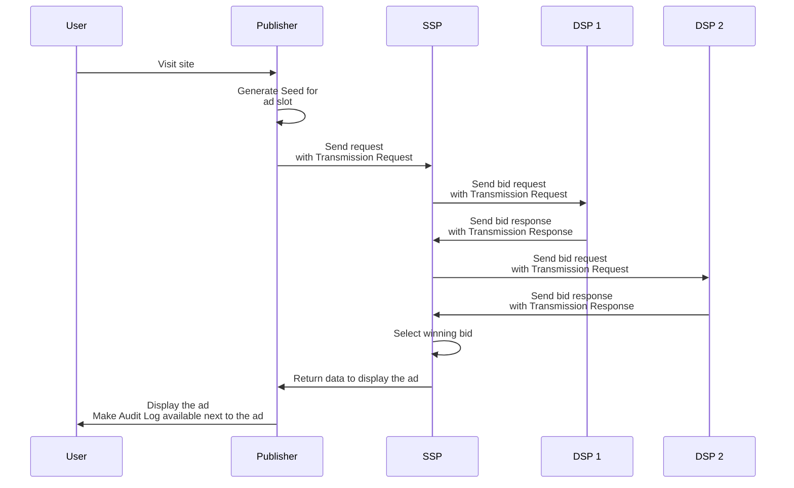
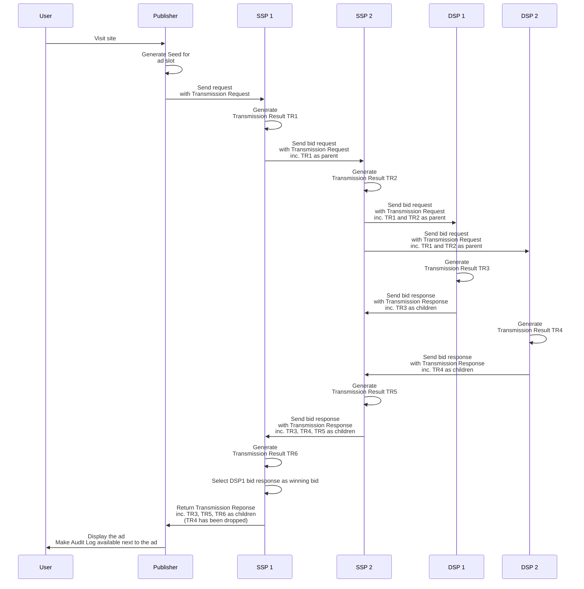

# Ad auction

## Goal of the document

This document describes the Prebid Addressability Framework (PAF) requirements related to an ad auction.

## Overview

The Prebid Addressability Framework enhances ad auctions by instantiating an **Audit Log**, built upon the following elements:
* **Seed**
* **Transmission Requests**
* **Transmission Responses**
* **Transmission Results**

### Seed

A Seed is data that expresses the commitment of the publisher to respect the User Id and Preferences of the user for a set of ad placements on a page. 

A Seed is a unique identifier and links together:
- the publisher identity
- a set of Transaction ids (one for each ad placement)

### Transmission Requests

A Transmission Request is a request sent by a participant sharing the User Id and Preferences to another participant, for this receiver to commit to respect the preferences of the user.

A Transmission Request links together:
- a Seed 
- a sender identity 
- an array of Transmission Results that is chronogically ordered - from the oldest ancestor to the most recent. See details of Transmission Result below.

Participants sending User Id and Preferences with bid requests must include a Transmission Request alongside that communication.

### Transmission Responses

A Transmission Response is a response of a receiver to a sender for User Id and Preferences. It expresses the commitment of the receiver to respect the preferences of the user.

A Transmission Response links together:
- the receiver identity 
- the status of the Transmission
- zero to many associations between a Transaction Id and Content Id depending if the receiver offers potential ad content itself
- a tree of Transmission Results (see below)

Participants which have made use of User Id and Preferences must send a Transmission Response alongside their bid response, to the entity that sent them the User Id and Preferences.

### Transmission Results 

A Transmission Result is the acknowledgement by a participant of the reception of a Transmission Request or a Transmission Response. 

### Audit Log chain

Transmission Results are chained through Transmission Requests and Transmission Responses.

Each participant sending a Transmission Request must include their own Transmission Result in the communication (except for the participant sending the first Transmission Request) and all the Transmission Results they have received as part of the Transmission Request chain, which are referred to as "parent" Transmission Results. This structure is an array to represent a single path and it is ordered chronologicaly.

Each participant sending a Transmission Response must include their own Transmission Result in the communication and all the Transmission Results they have received as part of the Transmission Response chain, which are referred to as "children" Transmission Results. This structure is a tree to represent the multiplicity of the suppliers.

A participant's content may be filtered out at some point of the bid response chain (e.g. a bid response being excluded). In that case the corresponding Transmission Results are also filter out of the list of Transmission Results and keep the chronological order. 
In the generic case where an ad is being provided by one DSP only, the Transmission Result list of the final Transmission Response is an array.

The Audit Log of a transaction is the list of all the Transmission Results part of the final Transmission Response and the associated
User Id and Preferences. 

### Signatures

Seeds, Transmission Requests, Transmission Responses, and Transmission Results are signed. Signature mechanisms are detailed in [security-signatures.md](security-signatures.md)

### Audit Log display

Audit Log display is detailed in [audit-log-design.md](audit-log-design.md).

## Ad auction with the Prebid Addressability Framework

### Workflow

Example workflow:



Example workflow including "parent" and "children" Transmission Results:



For a more advanced example, go to [ad-auction-example.md](./ad-auction-example.md)

### Ad slots, Seeds, and Transmissions Requests

The relationships between ad slots, Seeds, and Transmissions are:
* A Publisher offers *one or many* ad slots per page
* The Publisher creates *one* Seed for many ad slots (usually in the same page)
* The Publisher must send *one* Transmission Request per Seed and SSP
* An SSP must generate *one* Transmission Response per Transmission Request


#### Ad auction step by step

The following is a step by step of Prebid Addressability Framework integration in an ad auction.

### Step 1: Deserialize the User Id and Preferences

The publisher must deserialize User Id and Preferences.

| Entity  | Format|
|----------|-------|
| Identifier  | [identifier.md](./model/identifier.md) |
| Preferences | [preferences.md](./model/preferences.md) |

### Step 2: Generate the Seed

The Seed is the association of the User Id and Preferences with a set of ad slot. The publisher must
generate the Seed and sign it.

| Entity  | Format|
|----------|-------|
| Seed  | [seed.md](./model/seed.md) |

<details>
<summary>Seed - JSON Example</summary>
<!--partial-begin { "files": [ "seed.json" ], "block": "json" } -->
<!-- ⚠️ GENERATED CONTENT - DO NOT MODIFY DIRECTLY ⚠️ -->
```json
{
    "version": "0.1",
    "transaction_ids": [ "a0651946-0f5b-482b-8cfc-eab3644d2743" ],
    "publisher": "publisher.com",
    "source": {
        "domain": "adserver-company.com",
        "timestamp": 1639582000,
        "signature": "12345_signature"
    }
}
```
<!--partial-end-->
</details>

### Step 3: Send User Id and Preferences with Transmission Requests

Once the Seed is generated, the publisher shares the Seed via
Transmissions Requests with auction data to the SSP. 
Transmission Requests must be included in the existing
communication and bound structurally or by references to the data of the 
impressions (also named Addressable Content). The OpenRTB case is detailed later in this document.

| Entity  | Format|
|----------|-------|
| Transmission Request  | [transmission-request.md](./model/transmission-request.md) |


Here is a hypothetical structure of the associated User Id and Preferences, named `data` in the following example: 

| Entity  | Format|
|----------|-------|
| Ids and Preferences  | [ids-and-preferences.md](./model/ids-and-preferences.md) |

In the communication, the Transmission Requests must be associated to the 
User Id and Preferences. Depending on the existing structure of the communication,
it makes sense to have a shared structure for the User Id and Preferences and 
multiple Transmissions referring to it.

<details>
<summary>Transmission Request - JSON Example</summary>

<!--partial-begin { "files": [ "transmission-request.json" ], "block": "json" } -->
<!-- ⚠️ GENERATED CONTENT - DO NOT MODIFY DIRECTLY ⚠️ -->
```json
{
    "seed": {
        "version": "0.1",
        "transaction_ids": [ 
            "4640dc9f-385f-4e02-a0e5-abbf241af94d", 
            "7d71a23a-fafa-449a-8b85-63a634780107" 
        ],
        "publisher": "publisher.com",
        "source": {
            "domain": "publisher.com",
            "timestamp": 1639582000,
            "signature": "f1f4871d48b825931c5016a433cb3b6388f989fac363af09b9ee3cd400d86b74"
        }
    },
    "data": {
        "identifiers": [
            {
                "version": "0.1",
                "type": "paf_browser_id",
                "value": "7435313e-caee-4889-8ad7-0acd0114ae3c",
                "source": {
                    "domain": "operator0.com",
                    "timestamp": 1639580000,
                    "signature": "868e7a6c27b7b7fe5fed219503894bf263f31bb6d8fd48336d283e77b512cda7"
                }
            }
        ],
        "preferences": {
            "version": "0.1",
            "data": { 
                "use_browsing_for_personalization": true 
            },
            "source": {
                "domain": "cmp1.com",
                "timestamp": 1639581000,
                "signature": "65acdcfdbdba8b17936f25a32b33b000393c866588d146cb62ec51ab8890c54f"
            }
        }
    },
    "parents": [
        {
            "version": "0.1",
            "contents": [],
            "status": "success",
            "details": "",
            "receiver": "dsp1.com",
            "source": {
                "domain": "dsp1.com",
                "timestamp": 1639589531,
                "signature": "d01c6e83f14b4f057c2a2a86d320e2454fc0c60df4645518d993b5f40019d24c"
            }
        }
    ]
}
```
<!--partial-end-->
</details>

### Step 4: Send Transmission Responses

Whenever making use of the User Id and Preferences, the receiver of a Transmission Request
must answer back with Transmission Responses. Those Transmission Responses must be included
and bound to the bid response.

| Entity  | Format|
|----------|-------|
| Transmission Response  | [transmission-response.md](./model/transmission-response.md) |

<details>
<summary>Transmission Response - JSON Example</summary>

<!--partial-begin { "files": [ "transmission-responses.json" ], "block": "json" } -->
<!-- ⚠️ GENERATED CONTENT - DO NOT MODIFY DIRECTLY ⚠️ -->
```json
{
    "version": "0.1",
    "contents": [
        {
            "transaction_id": "f55a401d-e8bb-4de1-a3d2-fa95619393e8",
            "content_id": "90141190-26fe-497c-acee-4d2b649c2112"
        },
        {
            "transaction_id": "e538ff77-4746-4eb9-96c1-bda714dfb80a",
            "content_id": "b3e79370-ecb8-468b-8afa-d227890ddca5"
        }
    ],
    "status": "success",
    "details": "",
    "receiver": "dsp1.com",
    "source": {
        "domain": "dsp1.com",
        "timestamp": 1639589531,
        "signature": "d01c6e83f14b4f057c2a2a86d320e2454fc0c60df4645518d993b5f40019d24c"
    },
    "children": []
}
```
<!--partial-end-->
</details>


For more advanced examples, go to [ad-auction-example.md](./ad-auction-example.md)

### Step 5: Generate the Audit Log

Once the publisher has selected the DSP that will display the
Addressable Content, it must generate the Audit Log based on the related
Transmission Response and the User Id and Preferences.

| Entity  | Format|
|----------|-------|
| Audit Log  | [audit-log.md](./model/audit-log.md) |


As described, the Audit Log contains a list of Transmission Results. The 
Transmission Results are built thanks to the data within the received 
Transmission Response that are part of chain of participants leading to the ad displayed. The required
data are the status and the signature of the Transmission Response and its 
children.

| Entity  | Format|
|----------|-------|
| Transmission Result (sub-element of the Audit Log)  | [transmission-result.md](./model/transmission-result.md) |


<details>
<summary>Transformation details to Transmission Results</summary>

Let's take an example of a transformation to Transmission Results.
Here is a Transmission Response:

<!--partial-begin { "files": [ "transmission-response-with-children.json" ], "block": "json" } -->
<!-- ⚠️ GENERATED CONTENT - DO NOT MODIFY DIRECTLY ⚠️ -->
```json
{
    "version": "0.1",
    "contents": [
        {
            "transaction_id": "f55a401d-e8bb-4de1-a3d2-fa95619393e8",
            "content_id": "90141190-26fe-497c-acee-4d2b649c2112"
        },
        {
            "transaction_id": "e538ff77-4746-4eb9-96c1-bda714dfb80a",
            "content_id": "b3e79370-ecb8-468b-8afa-d227890ddca5"
        }
    ],
    "status": "success",
    "details": "",
    "receiver": "dsp1.com",
    "source": {
        "domain": "dsp1.com",
        "timestamp": 1639589531,
        "signature": "d01c6e83f14b4f057c2a2a86d320e2454fc0c60df4645518d993b5f40019d24c"
    },
    "children": [
        {
            "version": "0.1",
            "contents": [
                {
                    "transaction_id": "f55a401d-e8bb-4de1-a3d2-fa95619393e8",
                    "content_id": "b4a330e0-e41e-4c47-a1a7-00cdc5f627ed"
                }
            ],
            "status": "success",
            "details": "",
            "receiver": "dsp1-partner.com",
            "source": {
                "domain": "dsp1-partner.com",
                "timestamp": 1639589531,
                "signature": "d01c6e83f14b4f057c2a2a86d320e2454fc0c60df4645518d993b5f40019d24c"
            },
            "children": []
        }
    ]
}
```
<!--partial-end-->

Here is the associated list of Transmission Results:

<!--partial-begin { "files": [ "transmission-results.json" ], "block": "json" } -->
<!-- ⚠️ GENERATED CONTENT - DO NOT MODIFY DIRECTLY ⚠️ -->
```json
{
    "transmissions": [
        {
            "version": "0.1",
            "receiver": "ssp1.com",
            "status": "success",
            "details": "",
            "source": {
                "domain": "ssp1.com",
                "timestamp": 1639589531,
                "signature": "12345_signature"
            }
        },
        {
            "version": "0.1",
            "receiver": "ssp2.com",
            "status": "success",
            "details": "",
            "source": {
                "domain": "ssp2.com",
                "timestamp": 1639589531,
                "signature": "12345_signature"
            }
        },
        {
            "version": "0.1",
            "receiver": "dsp.com",
            "status": "success",
            "details": "",
            "source": {
                "domain": "dsp.com",
                "timestamp": 1639589531,
                "signature": "12345_signature"
            }
        }
    ]
}
```
<!--partial-end-->

</details>

<details>
<summary>Audit Log - JSON Example</summary>

<!--partial-begin { "files": [ "audit-log.json" ], "block": "json" } -->
<!-- ⚠️ GENERATED CONTENT - DO NOT MODIFY DIRECTLY ⚠️ -->
```json
{
    "data": {
        "identifiers": [
            {
                "version": "0.1",
                "type": "paf_browser_id",
                "value": "7435313e-caee-4889-8ad7-0acd0114ae3c",
                "source": {
                    "domain": "operator0.com",
                    "timestamp": 1639589531,
                    "signature": "3045022100aabf3ca5e4609990a1ff077c50aa52e3343005ead0d6f2ba1c05f71afe34b2f2022045fb8a98b154f8bcd66eb5774499d5fcb20e18274d67f14a43d5b45ec301d470"
                }
            }
        ],
        "preferences": {
            "version": "0.1",
            "data": { 
                "use_browsing_for_personalization": true 
            },
            "source": {
                "domain": "cmp1.com",
                "timestamp": 1639589531,
                "signature": "304502203be66cc4bfa525f20005bc0b921f756f6a1d016c49641bdf0133413fe2ee1e15022100d2a37aabdb3c58ca84dfbaccf59496087deb976e9b8aa18bc93c48f59853b587"
            }
        }
    },
    "seed": {
        "version": "0.1",
        "transaction_ids": [
            "4640dc9f-385f-4e02-a0e5-abbf241af94d",
            "7d71a23a-fafa-449a-8b85-63a634780107" 
        ],
        "publisher": "publisher.com",
        "source": {
          "domain": "ad-server.com",
          "timestamp": 1639589531,
          "signature": "3044022005aa77b713ef8fdac9d3031e450cfd9d66f22adb0636903c6eaa02f7b30a20780220331c7b3fed84c2a962d8ec6ca0f19795a79b799a99fd8f9589286049bd66a0da"
        }
    },
    "transaction_id": "4640dc9f-385f-4e02-a0e5-abbf241af94d",
    "transmissions": [
        {
            "version": "0.1",
            "receiver": "ssp2.com",
            "contents": [],
            "status": "success",
            "details": "",
            "source": {
                "domain": "ssp2.com",
                "timestamp": 1639589531,
                "signature": "d01c6e83f14b4f057c2a2a86d320e2454fc0c60df4645518d993b5f40019d24c"
            }
        },
        {
            "version": "0.1",
            "contents": [
                {
                    "transaction_id": "f55a401d-e8bb-4de1-a3d2-fa95619393e8",
                    "content_id": "90141190-26fe-497c-acee-4d2b649c2112"
                },
                {
                    "transaction_id": "e538ff77-4746-4eb9-96c1-bda714dfb80a",
                    "content_id": "b3e79370-ecb8-468b-8afa-d227890ddca5"
                }
            ],
            "receiver": "dsp1.com",
            "status": "success",
            "details": "",
            "source": {
                "domain": "dsp1.com",
                "timestamp": 1639589531,
                "signature": "d01c6e83f14b4f057c2a2a86d320e2454fc0c60df4645518d993b5f40019d24c"
            }
        },
        {
            "version": "0.1",
            "contents": [
                {
                    "transaction_id": "f55a401d-e8bb-4de1-a3d2-fa95619393e8",
                    "content_id": "b4a330e0-e41e-4c47-a1a7-00cdc5f627ed"
                }
            ],
            "receiver": "dsp1-partner.com",
            "status": "success",
            "details": "",
            "source": {
                "domain": "dsp1-partner.com",
                "timestamp": 1639589531,
                "signature": "d01c6e83f14b4f057c2a2a86d320e2454fc0c60df4645518d993b5f40019d24c"
            }
        }        
    ]
}
```
<!--partial-end-->
</details>


For more advanced examples, go to [ad-auction-example.md](./ad-auction-example.md)

### Step 6: Display the ad and make the Audit Log available

Finally, the ad can be displayed to the user on the publisher 
page. An Audit Button (ideally per Addressable Content) is available for 
displaying the Audit UI.

### Transmissions with OpenRTB

If the ad auction protocol is OpenRTB, integration with PAF is as described below.

#### The OpenRTB Bid Request

In step **Step 3**, the publisher must share the User Id and Preferences in the 
extensions of the bid request:

First, The Transmission Request object in an OpenRTB request keeps the same structure.
It is embedded in the `ext` field of each impression. It is 
reachable at `imp`.`ext`.`data`.`paf`.

Second, the Pseudonymous-Identifiers and the Preferences structures change 
in the OpenRTB request to take the advantage of the 
[Extended Identifiers](https://github.com/InteractiveAdvertisingBureau/openrtb/blob/master/extensions/2.x_official_extensions/eids.md). 
One `eid` per Pseudonymous-Identifier (and Preferences). 
It is reachable at `user`.`ext`.`eids`.

Comparing to the solution without OpenRTB:
1. The Pseudonymous-Identifier value is stored in the `eids`.`id` field.
2. The `eids`.`atype` is set to `1` because the ID is tied to a specific browser
for nom.
3. The `version`, `type`, and `source` fields are gathered in an extension of the `eid`: `eids`.`ext`.`paf`.
4. The Preferences are attached as an extention of the `eid`.

| Entity  | Format|
|----------|-------|
| OpenRTB Bid Request with PAF  | [open-rtb-bid-request.md](./model/open-rtb-bid-request.md) |

<details>
<summary>OpenRTB Bid Request - JSON Example</summary>

<!--partial-begin { "files": [ "open-rtb-request-with-transmission.json" ], "block": "json" } -->
<!-- ⚠️ GENERATED CONTENT - DO NOT MODIFY DIRECTLY ⚠️ -->
```json
{
    "imp": [
        {
            "id": "1",
            "bidfloor": 0.03,
            "banner": {
                "h": 250,
                "w": 300,
                "pos": 0
            },
            "ext": {
                "data": {
                    "paf": {
                        "transaction_id": "4640dc9f-385f-4e02-a0e5-abbf241af94d"
                    }
                }
            }
        }
    ],
    "user": {
        "id": "55816b39711f9b5acf3b90e313ed29e51665623f",
         "ext":
         {
            "eids": 
            [
                {
                    "source": "paf",
                    "uids": [
                        {
                            "source": "paf",
                            "atype": 1,
                            "id": "7435313e-caee-4889-8ad7-0acd0114ae3c",
                            "ext": 
                            {
                                "version": "0.1",
                                "type": "paf_browser_id",
                                "source": {
                                    "domain": "operator0.com",
                                    "timestamp": 1639580000,
                                    "signature": "868e7a6c27b7b7fe5fed219503894bf263f31bb6d8fd48336d283e77b512cda7"
                                }
                            }
                        }
                    ],
                    "ext": {
                        "preferences": {
                            "version": "0.1",
                            "data": { 
                                "use_browsing_for_personalization": true 
                            },
                            "source": {
                                "domain": "cmp1.com",
                                "timestamp": 1639581000,
                                "signature": "65acdcfdbdba8b17936f25a32b33b000393c866588d146cb62ec51ab8890c54f"
                            }
                        }
                    }
                }
            ],
            "paf": {
                "transmission": {
                    "seed": {
                        "version": "0.1",
                        "transaction_ids": [ 
                            "4640dc9f-385f-4e02-a0e5-abbf241af94d", 
                            "7d71a23a-fafa-449a-8b85-63a634780107" 
                        ],
                        "publisher": "publisher.com",
                        "source": {
                            "domain": "publisher.com",
                            "timestamp": 1639582000,
                            "signature": "f1f4871d48b825931c5016a433cb3b6388f989fac363af09b9ee3cd400d86b74"
                        }
                    },
                    "parents": []
                }
            }
        }
    }
}
```
<!--partial-end-->
</details>

#### The OpenRTB Bid Response

In **step 4**, the bidder sends back a 
OpenRTB Bid Response. Each `bid` is associated with a Transaction Response. The 
Transaction has the same structure as explained in **Step 4** and is reachable in
the `ext` field of a `bid` (full path: `seatbid[].bid.ext.paf`).

| Entity  | Format|
|----------|-------|
| OpenRTB Bid Response with PAF  | [open-rtb-bid-response.md](./model/open-rtb-bid-response.md) |

<details>
<summary>OpenRTB Bid Response - JSON Example</summary>

<!--partial-begin { "files": [ "open-rtb-response-with-transmission.json" ], "block": "json" } -->
<!-- ⚠️ GENERATED CONTENT - DO NOT MODIFY DIRECTLY ⚠️ -->
```json
{
    "ext": {
        "paf": {
            "transmission": {
                "version": "0.1",
                "contents": [
                    {
                        "transaction_id": "f55a401d-e8bb-4de1-a3d2-fa95619393e8",
                        "content_id": "90141190-26fe-497c-acee-4d2b649c2112"
                    }
                ],
                "status": "success",
                "details": "",
                "receiver": "dsp1.com",
                "source": {
                    "domain": "dsp1.com",
                    "timestamp": 1639589531,
                    "signature": "d01c6e83f14b4f057c2a2a86d320e2454fc0c60df4645518d993b5f40019d24c"
                },
                "children": []
            }
        }
    },
    "seatbid": [
        {
            "seat": "512",
            "bid": [
                {
                    "id": "1",
                    "impid": "1",
                    "price": 1,
                    "nurl": "http://adserver.com/winnotice?impid=102",
                    "iurl": "http://adserver.com/pathtosampleimage",
                    "adomain": [ "advertiserdomain.com" ],
                    "cid": "campaign111",
                    "crid": "creative112",
                    "attr": [ 1, 2, 3, 4, 5, 6, 7, 12 ],
                    "ext": {
                        "paf" : {
                            "content_id": "90141190-26fe-497c-acee-4d2b649c2112"
                        }
                    }
                }
            ]
        }
    ]
}
```
<!--partial-end-->
</details>
