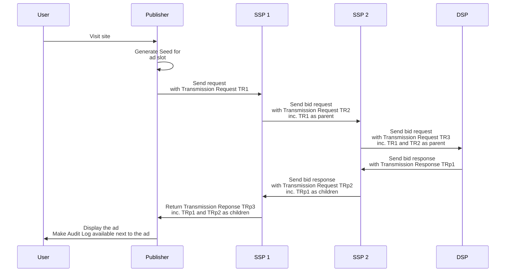

# Ad auction

## Goal of the document

This document describes the Prebid Addressability Framework (PAF) requirements related to an ad auction.

## Overview

The Prebid Addressability Framework enhances ad auctions by instantiating an **Audit Log**, built upon the following elements:
* **Seed**
* **Transmission Requests**
* **Transmission Responses**
* **Transmission Results**

### Seed

A Seed links together the publisher site identity, and a transaction id. 

### Transmission Requests

Participants who send User Id and Preferences with bid requests must include a Transmission Request alongside that communication.

A Transmission Request links together a Seed, a sender identity, and an array of Transmission Results (see below). 

### Transmission Responses

Participants which have made use of User Id and Preferences must send a Transmission Response alongside their bid response, to the entity that sent them the User Id and Preferences.

A Transmission Response links together a receiver identity, one or several transaction id, one or several content id, and a tree of Transmission Resulsts (see below). 

### Transmission Results 

A Transmission Result is the acknowledgement by a participant of the reception of a Transmission Request or a Transmission Response. 

### Audit Log chain

Transmission Results are chained through the Transmission Requests and Transmission Responses.

Each participant sending a Transmission Request must include their own Transmission Result in the communication (except for the participant sending the first Transmission Request), and all the Transmission Results they have received as part of the Transmission Request chain, which are referred to as "parents" Transmission Results. This structure is an array to represent a single path.

Each participant sending a Transmission Response must include their own Transmission Result in the communication, and all the Transmission Results they have received as part of the Transmission Response chain, which are referred to as "children" Transmission Results. This structure is a tree to represent the multiplicity of the suppliers.

A participant's content may be filtered out at some point of the bid response chain (e.g. a bid response being excluded). In that case the corresponding Transmission Results are also filter out of the list of Transmission Results. 
In the generic case where an ad is being provided by one DSP only, the Transmission Result list of the final Transmission Response is an array.

The Audit Log of a transaction is the audit of all its Transmissions and their associated
User Id and Preferences. The audit is accomplished thanks to the digital signatures of the Transmissions, the
Seed, and the User Id and Preferences.

### Signatures

Seeds, Transmission Requests, and Transmissions Responses are signed. Signature mechanisms are detailed in [signatures.md](signatures.md)

### Audit Log display

Audit Log display is detailed in [audit-log-design.md](audit-log-design.md).

## Ad auction with the Prebid Addressability Framework

### Workflow

Example workflow:


Example workflow including "parent" Transmission Requests and "children" Transmission Responses:



### Ad slots, Seeds, and Transmissions Requests

The relationships between ad slots, Seeds, and Transmissions are:
* A Publisher offers *multiple* ad slots per page
* The Publisher must create *one* Seed per ad slot
* The Publisher must send *one* Transmission Request per Seed and SSP
* An SSP must generate *one* Transmission Response per Transmission Request


### Step 1: Deserialize the User Id and Preferences

The publisher must deserialize User Id and Preferences.

The structure of the User Id is:

<!--partial-begin { "files": [ "identifier-table.md" ] } -->
<!-- ⚠️ GENERATED CONTENT - DO NOT MODIFY DIRECTLY ⚠️ -->
| Field   | Type          | Details                                            |
|---------|---------------|----------------------------------------------------|
| version | Number        | The version of PAF used.                                                                       |
| type    | String        | The type of Pseudonymous-Identifier. For now, there is only one: "paf_browser_id".                                                    |
| value   | String        | The Pseudonymous-Identifier value in UTF-8.                                                                                      |
| source  | Source object | The Source contains all the data for identifying and trusting the Operator that generated the Pseudonymous-Identifier. <br /> <table><tr><th>Field</th><th>Type</th><th>Details</th></tr><tr><td>domain</td><td>String</td><td>The domain of the Operator.</td></tr><tr><td>timestamp</td><td>Integer</td><td>The timestamp of the signature.</td></tr><tr><td>signature</td><td>String</td><td>Encoded signature in UTF-8 of the Operator.</td></tr></table>|
<!--partial-end-->

The structure of the Preferences is:

<!--partial-begin { "files": [ "preferences-table.md" ] } -->
<!-- ⚠️ GENERATED CONTENT - DO NOT MODIFY DIRECTLY ⚠️ -->
| Field   | Type                   | Details                                   |
|---------|------------------------|-------------------------------------------|
| version | Number                 | The PAF version used.     |
| data    | Dictionary             | The keys are strings and represent the name of the preferences. <br /> The values represent the value of the preference. <br /> For now there is only one preference named "optin" and its value is a boolean.|
| source  | Source object          | The source contains the data for identifying and trusting the CMP that signed lastly the Preferences.<br /> <table><tr><th>Field</th><th>Type</th><th>Details</th></tr><tr><td>domain</td><td>String</td><td>The domain of the CMP.</td></tr><tr><td>timestamp</td><td>Integer</td><td>The timestamp of the signature.</td></tr><tr><td>signature</td><td>String</td><td>Encoded signature in UTF-8 of the CMP.</td></tr></table>|
<!--partial-end-->

### Step 2: Generate the Seed

The Seed is the association of the User Id and Preferences with an ad slot. The publisher must
generate the Seed and sign it.

The composition of a Seed is:

<!--partial-begin { "files": [ "seed-optimized-table.md" ] } -->
<!-- ⚠️ GENERATED CONTENT - DO NOT MODIFY DIRECTLY ⚠️ -->
| Field                  | Type                                     | Details  |
|------------------------|------------------------------------------|----------|
| version                | Number                                   | The PAF version used.|
| transaction_id         | String                                   | A GUID in a String format dedicated to the share of the PAF data for one Addressable Content.|
| publisher              | String                                   | The domain name of the Publisher that displays the Addressable Content|
| source                 | Source object                            | The source contains data for identifying and trusting the Publisher.<br /><table><tr><th>Field</th><th>Type</th><th>Details</th></tr><tr><td>domain</td><td>String</td><td>The domain of the Root Party (Publisher in most of the cases).</td></tr><tr><td>timestamp</td><td>Integer</td><td>The timestamp of the signature.</td></tr><tr><td>signature</td><td>String</td><td>Encoded signature in UTF-8 of the Root Party/Publisher.</td></tr></table>|
<!--partial-end-->

Here is a JSON example of the Seed:

<!--partial-begin { "files": [ "seed-optimized.json" ], "block": "json" } -->
<!-- ⚠️ GENERATED CONTENT - DO NOT MODIFY DIRECTLY ⚠️ -->
```json
{
    "version": "0.1",
    "transaction_id": "a0651946-0f5b-482b-8cfc-eab3644d2743",
    "publisher": "publisher.com",
    "source": {
        "domain": "adserver-company.com",
        "timestamp": 1639582000,
        "signature": "12345_signature"
    }
}
```
<!--partial-end-->

The publisher must sign the Seeds ("source"."signature").

Here is how to build the UTF-8 string for then generating the signature:

<!--partial-begin { "files": [ "seed-signature-string.txt" ], "block": "" } -->
<!-- ⚠️ GENERATED CONTENT - DO NOT MODIFY DIRECTLY ⚠️ -->
```
seed.source.domain + '\u2063' + 
seed.source.timestamp + '\u2063' + 
seed.transaction_id + '\u2063' + 
seed.publisher + '\u2063' + 
data.identifiers[0].source.signature + '\u2063' +
data.identifiers[1].source.signature + '\u2063' +
... + '\u2063' + 
data.identifiers[n].source.signature + '\u2063' +
data.preferences.source.signature
```
<!--partial-end-->

### Step 3: Send User Id and Preferences in Transmission Requests

Once the Seeds are generated (one per ad slot), the publisher
shares the Seeds via Transmissions Requests with auction data to the
SSP. 
Transmission Requests must be included in the existing
communication and bound structurally or by references to the data of the 
impressions (also named Addressable Content). The OpenRTB case is detailed later in this document.

A Transmission Request is composed as followed:

<!--partial-begin { "files": [ "transmission-request-table.md" ] } -->
<!-- ⚠️ GENERATED CONTENT - DO NOT MODIFY DIRECTLY ⚠️ -->
| Field  | Type                            | Details                           |
|--------|---------------------------------|-----------------------------------|
| version| Number                          | The PAF version used.               |
| seed   | Seed object                     | A Seed object contains all the PAF Data gathered and signed by the Publisher concerning the user. |
| parents| Array of Transmission Results   | A list of Transmission Results that participate to a chain of Transmissions and make this Transmission possible. |  
| source | Source object                   | The source object contains data for identifying the Sender of the Transmission.<br /><table><tr><th>Field</th><th>Type</th><th>Details</th></tr><tr><td>domain</td><td>String</td><td>The domain of the Sender.</td></tr><tr><td>timestamp</td><td>Integer</td><td>The timestamp of the signature.</td></tr><tr><td>signature</td><td>String</td><td>Encoded signature in UTF-8 of the Tranmission sender.</td></tr></table>|
<!--partial-end-->

Similar to the Seed, each Transmission Request contains a signature for 
audit purposes, using the same cryptographic algorithm, and based on the UTF-8 encoded string below:

<!--partial-begin { "files": [ "transmission-request-signature-string.txt" ], "block": "" } -->
<!-- ⚠️ GENERATED CONTENT - DO NOT MODIFY DIRECTLY ⚠️ -->
```
transmission_request_receiver_domain        + '\u2063' +
transmission_request.source.domain          + '\u2063' + 
transmission_request.source.timestamp       + '\u2063' + 
seed.source.signature
```
<!--partial-end-->

Here is a hypothetical structure of the associated User Id and Preferences, named `data` in the following example: 

<!--partial-begin { "files": [ "data-id-and-preferences-table.md" ] } -->
<!-- ⚠️ GENERATED CONTENT - DO NOT MODIFY DIRECTLY ⚠️ -->
| Field                  | Type                                     | Details  |
|------------------------|------------------------------------------|----------|
| preferences            | Preferences object                       | The Preferences of the user.|
| identifiers            | Array of Pseudonymous-Identifier objects | The Pseudonymous-Identifiers of the user. For now, it only contains a Prebid ID.|
<!--partial-end-->

In the communication, the Transmission Requests must be associated to the 
User Id and Preferences. Depending on the existing structure of the communication,
it makes sense to have a shared structure for the User Id and Preferences and 
multiple Transmissions referring to it.

Here is an example that must be adapted to the existing API of the Ad Server:

<!--partial-begin { "files": [ "transmission-request.json" ], "block": "json" } -->
<!-- ⚠️ GENERATED CONTENT - DO NOT MODIFY DIRECTLY ⚠️ -->
```json
{
    "version": "0.1",
    "seed": {
        "version": "0.1",
        "transaction_ids": [ 
            "4640dc9f-385f-4e02-a0e5-abbf241af94d", 
            "7d71a23a-fafa-449a-8b85-63a634780107" 
        ],
        "publisher": "publisher.com",
        "source": {
            "domain": "publisher.com",
            "timestamp": 1639582000,
            "signature": "f1f4871d48b825931c5016a433cb3b6388f989fac363af09b9ee3cd400d86b74"
        }
    },
    "data": {
        "identifiers": [
            {
                "version": "0.1",
                "type": "paf_browser_id",
                "value": "7435313e-caee-4889-8ad7-0acd0114ae3c",
                "source": {
                    "domain": "operator0.com",
                    "timestamp": 1639580000,
                    "signature": "868e7a6c27b7b7fe5fed219503894bf263f31bb6d8fd48336d283e77b512cda7"
                }
            }
        ],
        "preferences": {
            "version": "0.1",
            "data": { 
                "use_browsing_for_personalization": true 
            },
            "source": {
                "domain": "cmp1.com",
                "timestamp": 1639581000,
                "signature": "65acdcfdbdba8b17936f25a32b33b000393c866588d146cb62ec51ab8890c54f"
            }
        }
    },
    "contents": [],
    "status": "success",
    "details": "",
    "receiver": "dsp1.com",
    "source": {
        "domain": "publisher.com",
        "timestamp": 1639581000,
        "signature": "5d0519da9c65feeae715dfcf380c7997ea9ee859e2636a498c43c1044dc20354"
    },
    "parents": []
}
```
<!--partial-end-->

### Step 4: Receive Transmission Responses

Whenever making use of the User Id and Preferences, the receiver of a Transmission Request must answer back with Transmission 
Responses. Those Transmission Responses must be included and bound to the bid response.

A Transmission Response is composed as followed:

<!--partial-begin { "files": [ "transmission-response-table.md" ] } -->
<!-- ⚠️ GENERATED CONTENT - DO NOT MODIFY DIRECTLY ⚠️ -->
| Field           | Type                          | Details                           |
|-----------------|-------------------------------|-----------------------------------|
| version         | Number                        | The version of the PAF used.                                                                                                                                                                                                                               |
| transaction_id  | String                        | A GUID dedicated to the Addressable Content. It allows associating the Transmission Responses to Transmission Request                                                                                                                     |
| receiver        | String                        | The domain name of the DSP.                                                                                                                                                                                                                                                                                |
| status          | String                        | Equals "success" if the DSP signed the Transmission and returns it to the sender.<br /> Equals "error_bad_request" if the receiver doesn't understand or see inconsistency in the Transmission Request.<br /> Equals "error_cannot_process" if the receiver cannot handle the Transmission Request properly. |
| details         | String                        | In case of an error status, the DSP can provide details concerning the error.                                                                                                                                                                                                                              |
| children        | Array of Transmission Results | An empty array as we consider that the DSP doesn't share the PAF Data to its suppliers via new transmissions.                                                                                                                                                                                       |
| source          | Source object                 | The source contains all the data for identifying the DSP and verifying the Transmission.                                                                                                                                                                                                                   |
<!--partial-end-->

Therefore, here is an example of Transmission Response that
must be adapted to the existing API:

<!--partial-begin { "files": [ "transmission-responses.json" ], "block": "json" } -->
<!-- ⚠️ GENERATED CONTENT - DO NOT MODIFY DIRECTLY ⚠️ -->
```json
{
    "version": "0.1",
    "contents": [
        {
            "transaction_id": "f55a401d-e8bb-4de1-a3d2-fa95619393e8",
            "content_id": "90141190-26fe-497c-acee-4d2b649c2112"
        },
        {
            "transaction_id": "e538ff77-4746-4eb9-96c1-bda714dfb80a",
            "content_id": "b3e79370-ecb8-468b-8afa-d227890ddca5"
        }
    ],
    "status": "success",
    "details": "",
    "receiver": "dsp1.com",
    "source": {
        "domain": "dsp1.com",
        "timestamp": 1639589531,
        "signature": "d01c6e83f14b4f057c2a2a86d320e2454fc0c60df4645518d993b5f40019d24c"
    },
    "children": []
}
```
<!--partial-end-->

### Step 5: Generate the Audit Log

Once the publisher has selected the DSP that will display the
Addressable Content, it must generate the Audit Log based on the related
Transmission Response and the User Id and Preferences.

The Audit Log has the following structure:

<!--partial-begin { "files": [ "audit-log-table.md" ] } -->
<!-- ⚠️ GENERATED CONTENT - DO NOT MODIFY DIRECTLY ⚠️ -->
| Field         | Type                         | Detail                        |
|---------------|------------------------------|-------------------------------|
| data          | PAF Data Object       | List the Pseudonymous-Identifiers and the Preferences of the user. |
| seed          | Seed Object                  | The Seed object is the association of an Addressable Content to the PAF Data. |
| transmissions | List of Transmission Results | A list of Transmission Results |
<!--partial-end-->

As described, the Audit Log contains a list of Transmission Results. The 
Transmission Results are built thanks to the data within the received 
Transmission Response that are part of chain of participants leading to the ad displayed. The required
data are the status and the signature of the Transmission Response and its 
children.

Here is the structure of a Transmission Result:
<!--partial-begin { "files": [ "transmission-result-table.md" ] } -->
<!-- ⚠️ GENERATED CONTENT - DO NOT MODIFY DIRECTLY ⚠️ -->
| Field           | Type                          | Details                           |
|-----------------|-------------------------------|-----------------------------------|
| version         | Number                        | The version of the PAF used.                                                                                                                                                                                                                               |
| receiver        | String                        | The domain name of the DSP.                                                                                                                                                                                                                                                                                |
| status          | String                        | Equals "success" if the DSP signed the Transmission and returns it to the sender.<br /> Equals "error_bad_request" if the receiver doesn't understand or see inconsistency in the Transmission Request.<br /> Equals "error_cannot_process" if the receiver failed to use the data of the Transmission Request properly. |
| details         | String                        | In case of an error status, the DSP can provide details concerning the error.                                                                                                                                                                                                                              |
| source          | Source object                 | The source contains all the data for identifying the DSP and verifying the Transmission.                                                                                                                                                                                                                   |
<!--partial-end-->

Let's take an example of a transformation to Transmission Results.
Here is a Transmission Response:

<!--partial-begin { "files": [ "transmission-response-with-children.json" ], "block": "json" } -->
<!-- ⚠️ GENERATED CONTENT - DO NOT MODIFY DIRECTLY ⚠️ -->
```json
{
    "version": "0.1",
    "contents": [
        {
            "transaction_id": "f55a401d-e8bb-4de1-a3d2-fa95619393e8",
            "content_id": "90141190-26fe-497c-acee-4d2b649c2112"
        },
        {
            "transaction_id": "e538ff77-4746-4eb9-96c1-bda714dfb80a",
            "content_id": "b3e79370-ecb8-468b-8afa-d227890ddca5"
        }
    ],
    "status": "success",
    "details": "",
    "receiver": "dsp1.com",
    "source": {
        "domain": "dsp1.com",
        "timestamp": 1639589531,
        "signature": "d01c6e83f14b4f057c2a2a86d320e2454fc0c60df4645518d993b5f40019d24c"
    },
    "children": [
        {
            "version": "0.1",
            "contents": [
                {
                    "transaction_id": "f55a401d-e8bb-4de1-a3d2-fa95619393e8",
                    "content_id": "b4a330e0-e41e-4c47-a1a7-00cdc5f627ed"
                }
            ],
            "status": "success",
            "details": "",
            "receiver": "dsp1-partner.com",
            "source": {
                "domain": "dsp1-partner.com",
                "timestamp": 1639589531,
                "signature": "d01c6e83f14b4f057c2a2a86d320e2454fc0c60df4645518d993b5f40019d24c"
            },
            "children": []
        }
    ]
}
```
<!--partial-end-->

Here is the associated list of Transmission Results:

<!--partial-begin { "files": [ "transmission-results.json" ], "block": "json" } -->
<!-- ⚠️ GENERATED CONTENT - DO NOT MODIFY DIRECTLY ⚠️ -->
```json
{
    "transmissions": [
        {
            "version": "0.1",
            "receiver": "ssp1.com",
            "status": "success",
            "details": "",
            "source": {
                "domain": "ssp1.com",
                "timestamp": 1639589531,
                "signature": "12345_signature"
            }
        },
        {
            "version": "0.1",
            "receiver": "ssp2.com",
            "status": "success",
            "details": "",
            "source": {
                "domain": "ssp2.com",
                "timestamp": 1639589531,
                "signature": "12345_signature"
            }
        },
        {
            "version": "0.1",
            "receiver": "dsp.com",
            "status": "success",
            "details": "",
            "source": {
                "domain": "dsp.com",
                "timestamp": 1639589531,
                "signature": "12345_signature"
            }
        }
    ]
}
```
<!--partial-end-->

After this transformation, it is possible to generate the Audit Log. Here is
an example:

<!--partial-begin { "files": [ "audit-log.json" ], "block": "json" } -->
<!-- ⚠️ GENERATED CONTENT - DO NOT MODIFY DIRECTLY ⚠️ -->
```json
{
    "data": {
        "identifiers": [
            {
                "version": "0.1",
                "type": "paf_browser_id",
                "value": "7435313e-caee-4889-8ad7-0acd0114ae3c",
                "source": {
                    "domain": "operator0.com",
                    "timestamp": 1639589531,
                    "signature": "3045022100aabf3ca5e4609990a1ff077c50aa52e3343005ead0d6f2ba1c05f71afe34b2f2022045fb8a98b154f8bcd66eb5774499d5fcb20e18274d67f14a43d5b45ec301d470"
                }
            }
        ],
        "preferences": {
            "version": "0.1",
            "data": { 
                "use_browsing_for_personalization": true 
            },
            "source": {
                "domain": "cmp1.com",
                "timestamp": 1639589531,
                "signature": "304502203be66cc4bfa525f20005bc0b921f756f6a1d016c49641bdf0133413fe2ee1e15022100d2a37aabdb3c58ca84dfbaccf59496087deb976e9b8aa18bc93c48f59853b587"
            }
        }
    },
    "seed": {
        "version": "0.1",
        "transaction_ids": [
            "4640dc9f-385f-4e02-a0e5-abbf241af94d",
            "7d71a23a-fafa-449a-8b85-63a634780107" 
        ],
        "publisher": "publisher.com",
        "source": {
          "domain": "ad-server.com",
          "timestamp": 1639589531,
          "signature": "3044022005aa77b713ef8fdac9d3031e450cfd9d66f22adb0636903c6eaa02f7b30a20780220331c7b3fed84c2a962d8ec6ca0f19795a79b799a99fd8f9589286049bd66a0da"
        }
    },
    "transaction_id": "4640dc9f-385f-4e02-a0e5-abbf241af94d",
    "transmissions": [
        {
            "version": "0.1",
            "receiver": "ssp2.com",
            "contents": [],
            "status": "success",
            "details": "",
            "source": {
                "domain": "ssp2.com",
                "timestamp": 1639589531,
                "signature": "d01c6e83f14b4f057c2a2a86d320e2454fc0c60df4645518d993b5f40019d24c"
            }
        },
        {
            "version": "0.1",
            "contents": [
                {
                    "transaction_id": "f55a401d-e8bb-4de1-a3d2-fa95619393e8",
                    "content_id": "90141190-26fe-497c-acee-4d2b649c2112"
                },
                {
                    "transaction_id": "e538ff77-4746-4eb9-96c1-bda714dfb80a",
                    "content_id": "b3e79370-ecb8-468b-8afa-d227890ddca5"
                }
            ],
            "receiver": "dsp1.com",
            "status": "success",
            "details": "",
            "source": {
                "domain": "dsp1.com",
                "timestamp": 1639589531,
                "signature": "d01c6e83f14b4f057c2a2a86d320e2454fc0c60df4645518d993b5f40019d24c"
            }
        },
        {
            "version": "0.1",
            "contents": [
                {
                    "transaction_id": "f55a401d-e8bb-4de1-a3d2-fa95619393e8",
                    "content_id": "b4a330e0-e41e-4c47-a1a7-00cdc5f627ed"
                }
            ],
            "receiver": "dsp1-partner.com",
            "status": "success",
            "details": "",
            "source": {
                "domain": "dsp1-partner.com",
                "timestamp": 1639589531,
                "signature": "d01c6e83f14b4f057c2a2a86d320e2454fc0c60df4645518d993b5f40019d24c"
            }
        }        
    ]
}
```
<!--partial-end-->

### Step 6: Display the ad and make the Audit Log available

Finally, the ad can be displayed to the user on the publisher 
page. An Audit Button (ideally per Addressable Content) is available for 
displaying the Audit UI.

### Transmissions with OpenRTB

If the ad auction protocol is OpenRTB, integration with PAF is as described below.

#### The OpenRTB Bid Request

In step **Step 3**, the publisher must share the User Id and Preferences in the 
extensions of the bid request:

First, The Transmission Request object in an OpenRTB request keeps the same structure.
It is embedded in the `ext` field of each impression. It is 
reachable at `imp`.`ext`.`paf`.

Second, the Pseudonymous-Identifiers and the Preferences structures change 
in the OpenRTB request to take the advantage of the 
[Extended Identifiers](https://github.com/InteractiveAdvertisingBureau/openrtb/blob/master/extensions/2.x_official_extensions/eids.md). 
One `eid` per Pseudonymous-Identifier (and Preferences). 
It is reachable at `user`.`ext`.`eids`.

Comparing to the solution without OpenRTB:
1. The Pseudonymous-Identifier value is stored in the `eids`.`id` field.
2. The `eids`.`atype` is set to `1` because the ID is tied to a specific browser
for nom.
3. The `version`, `type`, and `source` fields are gathered in an extension of the `eid`: `eids`.`ext`.`paf`.
4. The Preferences are attached as an extention of the `eid`.

#### Example of a OpenRTB Bid Request

<!--partial-begin { "files": [ "open-rtb-request-with-transmission.json" ], "block": "json" } -->
<!-- ⚠️ GENERATED CONTENT - DO NOT MODIFY DIRECTLY ⚠️ -->
```json
{
    "id": "80ce30c53c16e6ede735f123ef6e32361bfc7b22",
    "at": 1, 
    "cur": [ "USD" ],
    "imp": [
        {
            "id": "1",
            "bidfloor": 0.03,
            "banner": {
                "h": 250,
                "w": 300,
                "pos": 0
            },
            "ext": {
                "data": {
                    "paf": {
                        "transaction_id": "4640dc9f-385f-4e02-a0e5-abbf241af94d"
                    }
                }
            }
        }
    ],
    "site": {
        "id": "102855",
        "cat": [ "IAB3-1" ],
        "domain": "www.publisher.com",
        "page": "http://www.publisher.com/1234.html ",
        "publisher": {
            "id": "8953",
            "name": "publisher.com",
            "cat": ["IAB3-1"],
            "domain": "publisher.com"
        }
    },
    "device": {
        "ua": "Mozilla/5.0 (Macintosh; Intel Mac OS X 10_6_8) AppleWebKit/537.13 (KHTML, like Gecko) Version/5.1.7 Safari/534.57.2",
        "ip": "123.145.167.10"
    },
    "user": {
        "id": "55816b39711f9b5acf3b90e313ed29e51665623f",
         "ext":
         {
            "eids": 
            [
                {
                    "source": "paf",
                    "uids": [
                        {
                            "atype": 1,
                            "id": "7435313e-caee-4889-8ad7-0acd0114ae3c",
                            "ext": 
                            {
                                "version": "0.1",
                                "type": "paf_browser_id",
                                "source": {
                                    "domain": "operator0.com",
                                    "timestamp": 1639580000,
                                    "signature": "868e7a6c27b7b7fe5fed219503894bf263f31bb6d8fd48336d283e77b512cda7"
                                }
                            }
                        }
                    ],
                    "ext": {
                        "preferences": {
                            "version": "0.1",
                            "data": { 
                                "use_browsing_for_personalization": true 
                            },
                            "source": {
                                "domain": "cmp1.com",
                                "timestamp": 1639581000,
                                "signature": "65acdcfdbdba8b17936f25a32b33b000393c866588d146cb62ec51ab8890c54f"
                            }
                        }
                    }
                }
            ],
            "paf": {
                "transmission": {
                    "version": "0.1",
                    "seed": {
                        "version": "0.1",
                        "transaction_ids": [ 
                            "4640dc9f-385f-4e02-a0e5-abbf241af94d", 
                            "7d71a23a-fafa-449a-8b85-63a634780107" 
                        ],
                        "publisher": "publisher.com",
                        "source": {
                            "domain": "publisher.com",
                            "timestamp": 1639582000,
                            "signature": "f1f4871d48b825931c5016a433cb3b6388f989fac363af09b9ee3cd400d86b74"
                        }
                    },
                    "source": {
                        "domain": "dsp1.com",
                        "timestamp": 1639581000,
                        "signature": "5d0519da9c65feeae715dfcf380c7997ea9ee859e2636a498c43c1044dc20354"
                    },
                    "parents": []
                }
            }
        }
    }
}
```
<!--partial-end-->

#### The OpenRTB Bid Response

In **step 4**, the bidder sends back a 
OpenRTB Bid Response. Each `bid` is associated with a Transaction Response. The 
Transaction has the same structure as explained in **Step 4** and is reachable in
the `ext` field of a `bid` (full path: `seatbid[].bid.ext.paf`).

Here is an example:

<!--partial-begin { "files": [ "open-rtb-response-with-transmission.json" ], "block": "json" } -->
<!-- ⚠️ GENERATED CONTENT - DO NOT MODIFY DIRECTLY ⚠️ -->
```json
{
    "id": "1234567890",
    "bidid": "abc1123",
    "cur": "USD",
    "ext": {
        "paf": {
            "transmission": {
                "version": "0.1",
                "contents": [
                    {
                        "transaction_id": "f55a401d-e8bb-4de1-a3d2-fa95619393e8",
                        "content_id": "90141190-26fe-497c-acee-4d2b649c2112"
                    }
                ],
                "status": "success",
                "details": "",
                "receiver": "dsp1.com",
                "source": {
                    "domain": "dsp1.com",
                    "timestamp": 1639589531,
                    "signature": "d01c6e83f14b4f057c2a2a86d320e2454fc0c60df4645518d993b5f40019d24c"
                },
                "children": []
            }
        }
    },
    "seatbid": [
        {
            "seat": "512",
            "bid": [
                {
                    "id": "1",
                    "impid": "1",
                    "price": 1,
                    "nurl": "http://adserver.com/winnotice?impid=102",
                    "iurl": "http://adserver.com/pathtosampleimage",
                    "adomain": [ "advertiserdomain.com" ],
                    "cid": "campaign111",
                    "crid": "creative112",
                    "attr": [ 1, 2, 3, 4, 5, 6, 7, 12 ],
                    "ext": {
                        "paf" : {
                            "content_id": "90141190-26fe-497c-acee-4d2b649c2112"
                        }
                    }
                }
            ]
        }
    ]
}
```
<!--partial-end-->
