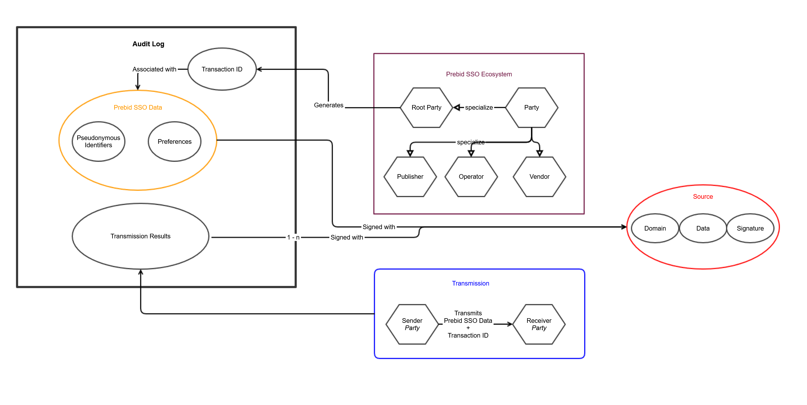

# Goal

Define the use cases and associated requirements for the auditing of Prebid Addressability Framework
data exchange targeted in the MVP.

# Disclaimer

While this document doesn't fully cover nor 100% aligns with the current 
version of SWAN Model Terms and its description of the Audit Log, it reuses 
definitions and makes some implicit references to it. The intention is for this
document to be self-contained, so don't hesitate to challenge or request 
clarification when it's not the case. However, we do recommend reading the 
Model Terms before this document.

# Resources

-   [SWAN Model Terms](https://github.com/SWAN-community/swan/blob/main/model-terms.md)
-   [SWAN Model Terms explainer](https://github.com/SWAN-community/swan/blob/main/model-terms-explainer.md)
-   [Open RTB specifications](https://www.iab.com/wp-content/uploads/2016/03/OpenRTB-API-Specification-Version-2-5-FINAL.pdf)

# Definitions

Here are both existing and extra definitions from the Model Terms:

**Addressable Content** means the interface on the webpage that displays 
ad-hoc - or not - content to the user thank to the Prebid Addressability Framework Data.

**Audit Log** means a log containing information received by a Party of each 
Transmission that has been Signed.

**Audit Log Button** means a button on the Publisher website inside or aside 
from a Personalized Content that the user can click to see the Audit Log UI.

**Audit Log Owner** means a Contracting Party responsible to display the Audit 
Log Button and the Audit Log UI to the user.

**Audit Log UI** means the webpage or a webpage section that displays all 
Audits to the user.

**Contracting Party** means any party bound to an agreement containing these 
Model Terms and “**Parties**” shall be construed accordingly.

**Operator** means the Party or Parties responsible for adding, updating, 
deleting and controlling access to the Prebid Addressability Framework Data;

**PAF** short for Prebid Addressability Framework

**Prebid Addressability Framework Data** means all Pseudonymous Identifiers and associated 
Preferences

**Prebid Addressability Framework Ecosystem** means each and every Party.

**Pseudo-Identifier or Pseudonymous-Identifier** means a generated Identifiers
for the User.

**Receiver** means the Contracting Party receiving the PAF Data from
the Sender.

**Root Party** means the Contracting Party initiating the originating 
Transmission in a particular chain of Transmissions.

**Sender** means the Contracting Party sending the PAF Data to 
the Receiver.

**Sign** means a cryptographic confirmation of generating, sending or 
receipt of PAF Data.

**Transaction**: the sending of PAF Data from the Root Party through the 
PAF ecosystem by consecutive Transmissions.

**Transaction ID** is the generated identifier for a dedicated placement. One 
Transaction ID per Audit Log.

**Transmission** means the sending of PAF Data from the Sender to
the Receiver. One Transaction can be composed of many Transmissions.

**Transmission Request** means the communication of the PAF Data from 
a Sender to a Receiver.

**Transmission Response** means the communication of the PAF Data from 
a Receiver to a Sender.

**Transmission Result** means the final statement of a Transmission that is 
used in an Audit Log

**Vendor** means a Contracting Party that participated via a Transaction to 
the generation of the Addressable Content to the user on the publisher website.
The Publisher isn't a Vendor.



# MVP target use case

## User interactions

When a user noticing an ad that is obviously personalized when he asked for
no personalization, we wants to provide him with evidence of which parties were
involved in the creation of that ad, so that material may be used to support a
formal complaint through the law enforcement mechanism of the relevant 
jurisdiction. The audit is achievable through a dedicated Audit Log UI. Each ad 
has an Audit Log that can be displayed independently in the Audit Log UI. 
Those Audit Logs are available at least as long as the ads are shown. 
More generally, a PAF ad is a Addressable Content.


The Audit Log contains:

* The PAF Data (Pseudonymous-identifiers + Preferences)
* A Transaction ID
* The Contracting Parties that received the PAF Data through
Transmissions for the given Transaction ID.
* The security data for validating the accountability of the Contracting Parties
concerning the PAF Data.

The Audit Log UI can be:
* a dedicated webpage where the user is redirected once she/he clicks on
the Audit Log Button.
* a dedicated UI appearing on the webpage where the Addressable Content is
displayed (it can be achieved with JavaScript for example).

The Audit Log UI must show:
* The type of the shared Pseudonymous-Identifiers and their values so that
the user can understand how she/he is identified;
* The Preferences so that the user know exactly on what the
Addressable Content relies;
* The list of the parties who received the PAF Data for
the Addressable Content;
* A "green or red" status for each Contacting Party: the status is green 
when the Receiver is part of the PAF ecosystem and signed properly
a transmission, else it is red.

## Display responsibility

The Publisher is the owner of the display for the Audit UI. However, the 
Publisher can delegate the responsibility of this Audit display to the Vendor 
that displays the ad. So two cases can happen:

* The Publisher takes responsibility of the display of the Audit Log Button
and add it "near" the Addressable Content. When the user clicks on the button,
the Publisher displays the Audit Log UI.
* The Publisher gives the responsability of the display of the Audit Log Button
to the Vendor and this latest adds it "in" the Addressable Content. When the 
user clicks on the button, the Vendor displays the Audit Log UI.

The Publisher must express this responsibility preferences in the Seed.

# The scope of the audit

## From the overall data flows

The Audit Log must help the user to audit the PAF Data and 
the Transmission that occur when the ad is displayed.

If we consider the typical personal ad scenario, we have two important entities:
* Publisher: the website where the content to audit is being displayed
* Advertiser: a website where user behavioral data has been collected for
the purpose of content personalization.

In our scenario:
* An Advertiser sends user behavioral event to his DSP at T0
* A Publisher that display an ad at T0 + 1 Day


The Audit scope is focused on the communications between the Publisher, the SSP
and the DSP. It doesn't include the communications between the Advertiser
and the DSP. If we abstract this use case:

* The Audit Scope includes the website that displays the 
Addressable Content and the Contracting Parties that help to generate this
Addressable Content in Real-Time.
* The Audit Scope doesn't include the Contracting Party that retrieved the
analytic data or the client of the Contracting Parties that generate
the Addressable Content.

## Nominal case where all actors are Contracting Parties

The nominal case is a Publisher's website offering an ad inventory with
PAF Data. Those data flow through different Contracting Parties. The
communication between those Parties can includes OpenRTB responses and 
OpenRTB requests and the election of a bid winner:

<!--partial-begin { "files": [ "transaction-nominal-case.mmd" ], "transformation": "mermaid" } -->
<!-- ⚠️ GENERATED CONTENT - DO NOT MODIFY DIRECTLY ⚠️ -->

<!--partial-end-->

In the diagram above, the Publisher, the SSP, and the DSPs MUST be part of the
PAF ecosystem. For being part of it, they must commit to the Model Terms
meaning that they have to sign their transmissions and the Audit Log must 
reflect it. However, if they aren't part of the PAF ecosystem, there is
no PAF transmission between them and they don't appear in the Audit Log
even if they participate in the Addressable Content.

## Filtered transmissions of the data flow

The Audit Log shows the Contracting Parties who collaborate on the 
Addressable Content that relies on the PAF data. The Audit Log UI lets
the user pinpoints the Contracting Parties. There is no requirement to show
Transmission that didn't have an impact on the Addressable Content.


The Audit Log helps the user to know who received her/his PAF Data. In
other words, the user doesn't need to know who was the Sender of a 
Transmission, only the Receiver. She/he doesn't even need to know the order of
the Transmissions. So it is acceptable to see the Audit Log as an unordered 
list to simplify the display and the concepts to the users. We will use this 
approach for the rest of the requirement.

# Heterogeneous systems

While adopting PAF, the Contracting Parties will still interact with 
actors that are part not of the PAF ecosystem. Moreover, PAF need 
to be integrate to existing communication standard and format. For instance, 
some actors use OpenRTB to communicate and other will use custom communications.
This section is about clarifying those edge cases.

## Transaction as a continuous chain

A transmission is a direct communication between a Sender and a Receiver that 
are parts of the PAF ecosystem. Therefore, the PAF Data cannot be
shared to a non-PaF actor even if this later is in communication with
other Parties that are parts of the PAF ecosystem. Therefore, there is
no transaction possible with this path because there is no transmission.


In term of Transmission (see diagram above):

* SSP2 and DSP4 won't receive any PAF Data because they aren't part 
of the PAF ecosystem.
* DSP3 won't receive any PAF Data because it suppliers isn't part 
of the PAF ecosystem.


In term of Audit Log, if the winner of the inventory is DSP3, there is no 
Audit Log because DSP3 didn't receive PAF Data. To enumerate all cases
concerning the Addressable Content of the Audit Log:

|          | All are Contracting Parties | "Leaves" aren't Contracting Parties | Middlemen aren't Contracting Parties | No actor except the Publisher are Contracting Parties|
|----------|-----------------------------|-------------------------------------|--------------------------------------|------------------------------------------------------|
| Audit log| Include all                 | None                                | None                                 | None                                                 |


  
## Who is part of the Prebid Addressability Framework ecosystem

Before sharing PAF Data via a Transmission, a Sender must know that 
the Receiver is part of the PAF Ecosystem. For this purpose, both share 
mutually their commitments to the Model Terms when they define the frame of 
their partnership. This commitment also includes the fact that the Sender and
the Receiver must provide a web API for letting other Contracting Parties
verify its signatures.  

The API must:

* include the Receiver's name;
* include the data for validating the signatures of the Receiver (e.g a public key);
* include the PAF version used (for forward and backward compatibility);
* respect the technical details of further specifications.

For performance reasons, the Contracting Party can fetch this data once
and cache it. The time-to-live of the cache must be treated in a technical
document.

The general philosophy of PAF is to have a purely decentralized 
ecosystem. Therefore, there is no centralized list of all the 
Contracting Parties that the PAF ecosystem maintains. Instead, it relies
on the relationships between Contracting Parties and their respective
commitments on the Model Terms.  

## Communications with non-contracting parties

As soon as a Sender signs a Transmission, it cannot repudiate that it received
the PAF Data. Few elements to consider:

* a Contracting Party can communicate non-PAF data to its suppliers that
are out of the PAF ecosystem. However, it cannot share PAF data
with them.
* a Contracting Party isn't responsible for the behavior of its suppliers that
are out of the PAF ecosystem even if the user expressed an opt-out.


## OpenRTB, one request for many audit logs

The technical solution must specify how the PAF Data is handled in 
OpenRTB requests and responses. OpenRTB is a standardized format for bidding on
an inventory. We won't provide technical solution here. However, we should 
consider few elements if we want to integrate PAF in the existing 
protocol:

* a Bid request can contain multiple placements so it means that we can have 
multiple audit logs per Bid Request;
* a Bid request can contain extra data not specified in the OpenRTB 
specifications. It is named "Extension" and is represented by a field "ext" in 
different technical objects including the "imp" object (for impression). It can 
be a location for a Transmission request for each placement;
* a Bid response can also be extended (field "ext") in different objects. It 
can be a place for Transmission responses.
* It is acceptable in OpenRTB to send an empty response for a no-bid. In this
case, the Transmissions must end with a no_bid status. This should not impact
the final Audit Log because if there is no bid, the bidder doesn't provide any
Addressable Content and won't appear in the Audit Log.

# The Transmission Results

A Transmission is a communication protocol. Therefore, it can have some
failures and misunderstandings between the Contracting Parties (e.g bad request,
bad response, legacy version...). The Transmission Result is the final output 
of a Transmission. It is the data that is appended in the Audit Log. It 
describes the status of it and is signed by the Sender or the Receiver.

* If the Receiver succeeds to process the Transmission Response, it generates a
Transmission Request and signs it back to the Sender. If the Sender consider it 
as a good response, then the Transmission Response is the Transmission Result.
* If the Receiver fails to process the Transmission Response and returns an 
error to the Sender, the Sender generates a Transmission Result and signs it;
* If the Sender doesn't receive a response from the Receiver, it generates a 
Transmission Result and signs it;

# Signatures

The Parties must sign when generating PAF Data or when they received it
with the Transaction ID. Those signatures are cryptographic ones and so:

* It cannot be reproduced by anybody;
* It can be verified by everybody;
* Data cannot be altered else the signature is invalid;
* The Contracting Party cannot repudiate it.

In the context of the Audit Log, we have two kinds of signatures associated with the data:  

-   The signature of the Seed so that we are sure of the Identity of the Root Party.
-   The signature of the Transmission Result so that we are sure of the Identity of the Contracting Party that received the Seed.

Those two signatures must rely on specific data to ensure security. Here are, for each signature, the list of necessary data:

|  Seed Signature (Root Party) | Transmission Result signature (Sender/Receiver) |
|------------------------------|-------------------------------------------------|
| <ul><li>Root Party Domain</li><li>Pseudonymous-Identifiers or their signatures</li><li>Preferences or their signatures</li><li>Transaction ID</li></ul>|<ul><li>Seed or the signature of the Seed.</li><li>Receiver Domain</li><li>Transmission status (success or failure)</li></ul> |

# Data formalism

To combine the previous sections, the data of the Audit Log should be as followed:

````
# Actors
Root_Party  	    -> Domain of the Root Party
Sender              -> Domain of a Contracting Party (domain.com)
Receiver            -> Domain of a Contracting Party (domain.com)
Contracting_Party   -> Root_Party | Sender | Receiver

Signature<Contracting_Party> -> Cryptographic signature relying on PAF Data

# Transmissions
Transmission_Success            -> (Receiver, Signature<Receiver>)
Transmission_No_Bid             -> (Receiver, Signature<Receiver>)
Transmission_Error_Response     -> (Receiver, Signature<Sender>, Detail)
Transmission_Error_No_Response  -> (Receiver, Signature<Sender>)
Transmission_Result             -> Transmission_Success | Transmission_No_Bid | Transmission_Error_No_Response | Transmission_Error_Response

# Seed and PAF Data
Transaction_ID              -> Unique Identifier
Audit_log_responsibility    -> "publisher" | "vendor"
Identifiers                 -> List of unique Identifiers with their signatures (for now SWID)
Preferences                 -> Preference of the user with their signatures (for now opt-in/opt-out)
Seed                        -> (Transaction_ID, Audit_log_responsibility, Identifiers, Preferences, Signature<Root_Party>)

Transmissions     -> List<Transmission_Result>

Audit_Log   -> (Seed, Transmissions)
````

To put it in perspective, we need tho highligh that PAF Data
and transmissions contain signatures:
* The Identifiers (one for each)
* The Preferences (one for all)
* The Seed
* The Transmission (one for each)

Here are details:

| Entity     | Type               | Value           |
|------------|--------------------|-----------------|
| Seed       | object             | <table> <tr> <th>Name</th> <th>Type</th> <th>Value</th> </tr> <tr> <td>Transaction ID</td> <td>GUID</td> <td>8b4cf0ff-8b4c-4d79-4d79-69b65402f0ff</td> </tr> <tr> <td>Audit Responsibility</td> <td>String</td> <td>"Publisher"</td> </tr> <tr> <td>Identifier</td> <td>List<Pseudonymous-Identifier></td> <td> Each Identifier also includes: <ul> <li>A digital signature</li> <li>The domain of the Contracting Party that signs</li> <li>The date of the signature</li> </ul> </td> </tr> <tr> <td>Preferences</td> <td>List<Preferences></td> <td> For all Preferences, there are: <ul> <li>A digital signature</li> <li>The domain of the Contracting Party that signs</li> <li>The date of the signature</li> </ul> </td> </tr> <tr> <td>Signature</td> <td>Signature object</td> <td> <ul> <li>Domain - string</li> <li>Date - date</li> <li>Signature - string</li> </ul> </td> </tr> </table>|
| Transmissions    | Array of objects   | <table> <tr> <th>Name</th> <th>Type</th> <th>Value</th> </tr> <tr> <td>Receiver</td> <td>String</td> <td>"party42.com"</td> </tr> <tr> <td>Status</td> <td>String</td> <td>"success", "bad_response", "no_response"</td> </tr> <tr> <td>Detail</td> <td>String</td> <td>"Error: The Receiver wasn't able to verify the identity of the sender."</td> </tr> </table> Each Transmission also includes: <ul> <li>A digital signature</li> <li>The domain of the Contracting Party that signs</li> <li>The date of the signature</li> </ul> If the transmission was successful, the Contracting Party is the Receiver. Else it is the sender. |

A concrete example using a JSON format (that is subject to change in Technical 
Specifications):

**Example**

````json
{
    "seed": {
        "version": 1,
        "transaction_id": "a0651946-0f5b-482b-8cfc-eab3644d2743",
        "display_responsibility": "publisher",
        "identifiers": [
            {
                "version": 1,
                "type": "prebid_id",
                "value": "prebidid12345",
                "source": {
                    "domain": "operotor0.com",
                    "date": "2021-04-23T18:25:43.511Z",
                    "signature": "12345_signature"
                }
            }
        ],
        "preferences": [
            {
                "version": 1,
                "type": "opt_in",
                "value": true,
                "source": {
                    "domain": "operator1.com",
                    "date": "2021-04-23T18:25:43.511Z",
                    "signature": "12345_signature"
                }
            }
        ],
        "source": {
            "domain": "publisher.com",
            "date": "2021-04-23T18:25:43.511Z",
            "signature": "12345_signature"
        }
    },
    "transactions": [
        {
            "version": 1,
            "receiver": "party2.com",
            "status": "success",
            "source": {
                "domain": "party2.com",
                "date": "2021-04-23T18:25:43.511Z",
                "signature": "12345_signature"
            }
        },
        {
            "version": 1,
            "receiver": "party3.com",
            "status": "success",
            "source": {
                "domain": "party3.com",
                "date": "2021-04-23T18:25:43.511Z",
                "signature": "12345_signature"
            }
        }
    ]
}
````

When a user wants to verify if her/his preferences haven't been respected,
the audit log must be able to see that:

* all the parties commit to the Model Terms by signing the PAF data;
* there are transmissions that are not well signed and so there is an issue
with the correct propagation of my PAF data.

However, the audit logs cannot tell the user which exact Party didn't behave 
correctly with her/his PAF Data.

# Transmission parents and children

<!--partial-begin { "files": [ "transmissions-diagrams-and-details.md" ] } -->
<!-- ⚠️ GENERATED CONTENT - DO NOT MODIFY DIRECTLY ⚠️ -->
Here is a workflow with detailed steps  how Transmission Requests contain
 **parents** and Transmission Responses contains **children**. 


The detailed steps of the diagram above:

1. The Publisher generates the Seed.
2. The Publisher sends the Transmission Request 1 to SSP1. The "parents" field of the Transmission Request is empty.
3. The SSP1 receives the Transmission Request 1 and generates the Transmission Result 1.
4. The SSP1 sends the Transmission Request 2 to SSP2. The "parents" contains the Transmission Result 1.
5. The SSP2 receives the Transmission Request 2 and generates the Transmission Result 2.
6. The SSP2 sends the Transmission Request 3 to the DSP. The "parents" contain the Transmission Result 1 and the Transmission Result 2.
7. The DSP receives the Transmission Request 3 and generates a Transmission Result 3.
8. The DSP returns a Transmission Response 3 to the Transmission Request 3 (SSP2). It includes the Transmission Result 3. The 'children" field is empty.
8. The SSP2 receives the Transmission Response 3.
10. The SSP2 returns a Transmission Response 2 to Transmission Request 2 (SSP1). It contains the Transmission Result 2. The "children" field includes the Transmission Result 3.
11. The SSP1 receives the Transmission Response 2.
12. The SSP1 returns a Transmission Response 1 to Transmission Request 3 (Publisher). It contains the Transmission Result 1. The "children" field includes the Transmission Result 2 and the Transmission Result 3.
13. The Publisher shows the Addressable Content via the DSP and the Audit Log is available.
<!--partial-end-->
