# Client node

⚠️ TO BE UPDATED: missing documentation about **signing seeds**.

## Interacting with the operator: frontend, client node

**Websites** that need to get access to data:

- read user ids and preferences
- write user preferences
- or both

Ids and preferences are stored as **1st party cookies on the OneKey top level +1 domain** (aka TLD+1).

As a reminder, the content of these websites
is _served by a http server_ and it can then use Javascript _in the browser_.

- OneKey provides a "**frontend library**" to call the operator on REST or "redirect" endpoints (see [operator-api.md](operator-api.md) for details).
    - But only **signed** requests can be sent to the operator and these requests are signed using a **private key**,
      which must never be sent to the browser.

- Thus, OneKey also provides a "**client node**" component which the frontend library uses to sign the requests on
  its behalf.
    - this node can be hosted by the website's owner or by a tech vendor

- Note: clients of the operators _can_ decide to use an operator client that is part of their website's HTTP server
  and intercepts all requests made to display the web pages to trigger **HTTP** redirects (not Javascript).
  - This special kind of integration (a "**backend operator client**") is not detailed here but can be investigated further if needed.


## Client node

The **client node** is an API called by the frontend library to sign and verify requests sent and received to / from the
operator.

It acts as a proxy that transforms unsigned requests into signed ones.

To do so, it exposes:

- all [the (REST and redirect) endpoints that the **operator** exposes](operator-api.md)
- a couple of extra endpoints to help sign and verify messages

| Endpoint                                                          | Description                                                                                                                                                           | Input                                                                                      | Output                                                                                                     | REST                            | Redirect                                    |
|-------------------------------------------------------------------|-----------------------------------------------------------------------------------------------------------------------------------------------------------------------|--------------------------------------------------------------------------------------------|------------------------------------------------------------------------------------------------------------|---------------------------------|---------------------------------------------|
| [Get URL: Read ids & preferences](#get-url-read-ids--preferences) | Create a signed request, encode it and append it to a URL pointing to the [read](operator-api.md#read-ids-&-preferences) operator endpoint.                           | -                                                                                          | Operator URL with signed request in the query string                                                       | `GET /paf-proxy/v1/ids-prefs`   | `GET /paf-proxy/v1/redirect/get-ids-prefs`  |
| [**Sign** user preferences](#sign-user-preferences)               | Sign preferences                                                                                                                                                      | Signed ids and **unsigned** preferences                                                    | Signed ids and preferences                                                                                 | `POST /paf-proxy/v1/sign/prefs` | N/A                                         |
| [Get URL: Write ids & prefs](#get-url-write-ids--preferences)     | Sign the request provided as input, return the signed payload, along with the URL pointing to the [write](operator-api.md#write-ids-&-preferences) operator endpoint. | Signed "write" request<br>(see [operator API](operator-api.md#write-ids-&-preferences))    | Operator URL with signed request, as part of the response (REST) or as part of the query string (redirect) | `POST /paf-proxy/v1/ids-prefs`  | `GET /paf-proxy/v1/redirect/post-ids-prefs` |
| [Get URL: Verify 3PC support](#verify-3pc-support)                | Returns the operator URL to call to confirm if 3PC are supported                                                                                                      | -                                                                                          | Operator URL                                                                                               | `GET /paf-proxy/v1/3pc`         | N/A                                         |
| [Get URL: Get new id](#get-a-new-id)                              | Returns the operator URL to call to generate new ID                                                                                                                   | -                                                                                          | Operator URL                                                                                               | `GET /paf-proxy/v1/new-id`      | N/A                                         |
| [**Verify** read](#verify-read-response)                          | Verify the response received from the operator                                                                                                                        | Signed "read" **response**<br>(see [operator API](operator-api.md#read-ids-&-preferences)) | Same as input if verification succeeded, error message otherwise                                           | `POST /paf-proxy/verify/read`   | N/A                                         |
| [Get identity](#get-client-identity)                              | Get client public key to verify ID or responses signatures                                                                                                            | -                                                                                          | list of:<br>public key + start and end dates if any                                                        | `GET /paf/v1/identity`          | N/A                                         |

ℹ️ An example implementation (for NodeJS) of a client node is available in [the implementation project](https://github.com/criteo/paf-mvp-implementation/tree/main/paf-mvp-client-express)

⚠️ Note that in the following examples, the client node is supposed to be hosted on the `cmp.com` domain.

### Get URL: Read ids & preferences

#### REST read: `GET /paf-proxy/v1/ids-prefs`

| Message  | Format                        |
|----------|-------------------------------|
| Request  | nothing                       |
| Response | operator URL to call (string) |


#### Redirect read: `GET /paf-proxy/v1/redirect/get-ids-prefs`

| Message  | Format                        |
|----------|-------------------------------|
| Request  | nothing                       |
| Response | operator URL to call (string) |

### Sign user preferences

- sign the preferences and ids

#### REST sign user preferences: `POST /paf-proxy/v1/sign/prefs`

| Message  | Format                                                                    |
|----------|---------------------------------------------------------------------------|
| Request  | [post-sign-preferences-request](./model/post-sign-preferences-request.md) |
| Response | [preferences](model/preferences.md)                                       |

<details>
<summary>Full example</summary>

- the following request is built:

<!--partial-begin { "files": [ "signPreferences.json" ], "block": "json" } -->
<!-- ⚠️ GENERATED CONTENT - DO NOT MODIFY DIRECTLY ⚠️ -->
```json
{
  "identifiers": [
    {
      "version": "0.1",
      "type": "paf_browser_id",
      "value": "7435313e-caee-4889-8ad7-0acd0114ae3c",
      "source": {
        "domain": "operator.paf-operation-domain.io",
        "timestamp": 1642504380,
        "signature": "B/fOZumQHzzkQtSjYnzLOIJA2GQpoP5bWwzFQCMiQ/Mlvu6itJ1hbRVJkq8+yElu7NxMzojVMNdrc1mD7SJ0SQ=="
      }
    }
  ],
  "unsignedPreferences": {
    "version": "0.1",
    "data": {
      "use_browsing_for_personalization": true
    }
  }
}
```
<!--partial-end-->

- and is used as the **POST payload** to the following call:

<!--partial-begin { "files": [ "signPreferences.http" ], "block": "http" } -->
<!-- ⚠️ GENERATED CONTENT - DO NOT MODIFY DIRECTLY ⚠️ -->
```http
POST /paf-proxy/v1/sign/prefs
Host: cmp.com
```
<!--partial-end-->

- response

<!--partial-begin { "files": [ "preferences.json" ], "block": "json" } -->
<!-- ⚠️ GENERATED CONTENT - DO NOT MODIFY DIRECTLY ⚠️ -->
```json
{
  "version": "0.1",
  "data": {
    "use_browsing_for_personalization": true
  },
  "source": {
    "domain": "cmp.com",
    "timestamp": 1642504560,
    "signature": "JYXJjM04I1WuANplc+RZgHfD7bVDhmf7kg8+kd8DLDfJKDkNp+/3ldWe0O1wFQKT9g5KxwvmF96i3pvI+Wtbvw=="
  }
}
```
<!--partial-end-->

ℹ️ Notice the new `source` property, that includes a signature based on both the identifiers and the preferences data.

</details>

### Get URL: Write ids & preferences

#### REST write: `POST /paf-proxy/v1/ids-prefs`

| Message  | Format                                                                                                                       |
|----------|------------------------------------------------------------------------------------------------------------------------------|
| Request  | POST payload: [ids-and-preferences.md](./model/ids-and-preferences.md)                                                       |
| Response | Operator URL to call and signed payload to use: [proxy-post-ids-prefs-response.md](./model/proxy-post-ids-prefs-response.md) |

<details>
<summary>Example</summary>

Example response from the client node:

<!--partial-begin { "files": [ "proxyPostIdsPrefsResponse.json" ], "block": "json" } -->
<!-- ⚠️ GENERATED CONTENT - DO NOT MODIFY DIRECTLY ⚠️ -->
```json
{
  "url": "https://operator.paf-operation-domain.io/paf/v1/ids-prefs",
  "payload": {
    "body": {
      "identifiers": [
        {
          "version": "0.1",
          "type": "paf_browser_id",
          "value": "7435313e-caee-4889-8ad7-0acd0114ae3c",
          "source": {
            "domain": "operator.paf-operation-domain.io",
            "timestamp": 1642504380,
            "signature": "B/fOZumQHzzkQtSjYnzLOIJA2GQpoP5bWwzFQCMiQ/Mlvu6itJ1hbRVJkq8+yElu7NxMzojVMNdrc1mD7SJ0SQ=="
          }
        }
      ],
      "preferences": {
        "version": "0.1",
        "data": {
          "use_browsing_for_personalization": true
        },
        "source": {
          "domain": "cmp.com",
          "timestamp": 1642504560,
          "signature": "JYXJjM04I1WuANplc+RZgHfD7bVDhmf7kg8+kd8DLDfJKDkNp+/3ldWe0O1wFQKT9g5KxwvmF96i3pvI+Wtbvw=="
        }
      }
    },
    "sender": "cmp.com",
    "receiver": "operator.paf-operation-domain.io",
    "timestamp": 1643097660,
    "signature": "PB0jUkET0EvbWgtCc7ltGUU81qvd1ypeY/UXCi2RDiP5HWbEcS34wlsqEHbhiJ5uN14fZdg+6M1/MiMUSEPE/Q=="
  }
}
```
<!--partial-end-->
</details>

#### Redirect write: `GET /paf-proxy/v1/redirect/post-ids-prefs`

| Message  | Format                                                                             |
|----------|------------------------------------------------------------------------------------|
| Request  | See [operator-api.md](operator-api.md#redirect-write-get-v1redirectpost-ids-prefs) |
| Response | Operator URL to call (including some data in the query string)                     |

### Verify "read" response

- take a read response message received from the operator, and verify it

The data received by a website as part of a query string, after a "boomerang" redirect to the operator must be verified
because a malicious actor could have called the website's URL with query string data that does not originate from the operator,
or that was meant to be sent to another website.

To verify a response message from the operator, this endpoint will make sure that:
- the signature of the response is verified with the sender (the operator) public key
- the operator domain should be the expected one
- the receiver domain should be the one from the current client
- the timestamp is compared to the current date and should not be out of the allowed window

Only when these four checks have successfully passed, the request is considered legit.

#### REST verify "read" response: `POST /paf-proxy/v1/verify/read`

| Message  | Format                                                                               |
|----------|--------------------------------------------------------------------------------------|
| Request  | [get-ids-prefs-response](model/get-ids-prefs-response.md)                            |
| Response | [get-ids-prefs-response](model/get-ids-prefs-response.md) or [error](model/error.md) |

<details>
<summary>Full example</summary>

- the following response, (supposedly) **received from the operator** is copied:

<!--partial-begin { "files": [ "getIdsPrefsResponse_known.json" ], "block": "json" } -->
<!-- ⚠️ GENERATED CONTENT - DO NOT MODIFY DIRECTLY ⚠️ -->
```json
{
  "body": {
    "identifiers": [
      {
        "version": "0.1",
        "type": "paf_browser_id",
        "value": "7435313e-caee-4889-8ad7-0acd0114ae3c",
        "source": {
          "domain": "operator.paf-operation-domain.io",
          "timestamp": 1642504380,
          "signature": "B/fOZumQHzzkQtSjYnzLOIJA2GQpoP5bWwzFQCMiQ/Mlvu6itJ1hbRVJkq8+yElu7NxMzojVMNdrc1mD7SJ0SQ=="
        }
      }
    ],
    "preferences": {
      "version": "0.1",
      "data": {
        "use_browsing_for_personalization": true
      },
      "source": {
        "domain": "cmp.com",
        "timestamp": 1642504560,
        "signature": "JYXJjM04I1WuANplc+RZgHfD7bVDhmf7kg8+kd8DLDfJKDkNp+/3ldWe0O1wFQKT9g5KxwvmF96i3pvI+Wtbvw=="
      }
    }
  },
  "sender": "operator.paf-operation-domain.io",
  "receiver": "advertiser.com",
  "timestamp": 1643041150,
  "signature": "lDCuZbsj88K3vmicWuyZlT9DOYrujZ8l8+D7eutOW5XQOVF12CaoEaiN5VxiBi30PhrRFmIMCOkduYwKKxvLcw=="
}
```
<!--partial-end-->

- and is used as the **POST payload** to the following call:

<!--partial-begin { "files": [ "verifyGetIdsPrefs.http" ], "block": "http" } -->
<!-- ⚠️ GENERATED CONTENT - DO NOT MODIFY DIRECTLY ⚠️ -->
```http
POST /paf-proxy/v1/verify/read
Host: cmp.com
```
<!--partial-end-->

- response in case the signature is valid: same as request

<!--partial-begin { "files": [ "getIdsPrefsResponse_known.json" ], "block": "json" } -->
<!-- ⚠️ GENERATED CONTENT - DO NOT MODIFY DIRECTLY ⚠️ -->
```json
{
  "body": {
    "identifiers": [
      {
        "version": "0.1",
        "type": "paf_browser_id",
        "value": "7435313e-caee-4889-8ad7-0acd0114ae3c",
        "source": {
          "domain": "operator.paf-operation-domain.io",
          "timestamp": 1642504380,
          "signature": "B/fOZumQHzzkQtSjYnzLOIJA2GQpoP5bWwzFQCMiQ/Mlvu6itJ1hbRVJkq8+yElu7NxMzojVMNdrc1mD7SJ0SQ=="
        }
      }
    ],
    "preferences": {
      "version": "0.1",
      "data": {
        "use_browsing_for_personalization": true
      },
      "source": {
        "domain": "cmp.com",
        "timestamp": 1642504560,
        "signature": "JYXJjM04I1WuANplc+RZgHfD7bVDhmf7kg8+kd8DLDfJKDkNp+/3ldWe0O1wFQKT9g5KxwvmF96i3pvI+Wtbvw=="
      }
    }
  },
  "sender": "operator.paf-operation-domain.io",
  "receiver": "advertiser.com",
  "timestamp": 1643041150,
  "signature": "lDCuZbsj88K3vmicWuyZlT9DOYrujZ8l8+D7eutOW5XQOVF12CaoEaiN5VxiBi30PhrRFmIMCOkduYwKKxvLcw=="
}
```
<!--partial-end-->

- response in case the signature is **not** valid:

<!--partial-begin { "files": [ "verifyGetIdsPrefs_invalid.json" ], "block": "json" } -->
<!-- ⚠️ GENERATED CONTENT - DO NOT MODIFY DIRECTLY ⚠️ -->
```json
{
  "message": "Invalid signature"
}
```
<!--partial-end-->

</details>

### Verify 3PC support

| Message  | Format      |
|----------|-------------|
| Request  | _empty_     |
| Response | string: URL |

### Get a new id

| Message  | Format      |
|----------|-------------|
| Request  | _empty_     |
| Response | string: URL |

### Get client identity

See [security-signatures.md](./security-signatures.md#identity-endpoint)

## Frontend library

The "frontend library" is implemented via a Javascript script provided by OneKey and available on [the implementation project](https://github.com/criteo/paf-mvp-implementation/tree/main/paf-mvp-frontend).

This library is a static file that can be added to any website, but requires **the host name of the client node** as configuration input.

## Implementation details

The following diagram details the steps needed to read existing cookies from OneKey

- at browser level the **frontend operator client** (a Javascript library) is used
    - depending on the context, the JS library calls a REST or "redirect" endpoint on the operator
    - it relies on the **client node**, a component responsible for building operator URLs to call.

### Test support of 3rd party cookies

To test if third party cookies are supported and trigger redirect otherwise, the following logic is used:

2. in Javascript,
    - based on user agent, if the browser is known to **not** support 3PC (ex: Safari) ➡️ consider no 3PC and
      immediately **javascript redirect**
3. otherwise, attempt to call REST endpoint and read existing (3PC) Prebid ID
    - at the same time, the operator attempts to write a "test" cookie on .onekey.network (ie. attempt to write a 3PC)
4. if Prebid ID is retrieved, of course it means 3PC **are** supported
5. if no Prebid ID retrieved, it means either that the user is not known, or that 3PC are not supported
    - call operator to attempt to read "test" cookie that was just written
    - if success ➡️ 3PC **are** supported, it's just that the user is not known
    - if failure ➡️ 3PC are **not** supported, **javascript redirect**

```mermaid
flowchart TD
    subgraph "HTML page (with frontend JS library)"
        HtmlLoad[Page load]
        HtmlAfterRedirect{Redirected from operator?}
        HtmlCookies{"Any Prebid 1st party 🍪?"}
        HtmlSave["Set 1st party Prebid 🍪 = data"]
        style HtmlSave stroke:red,stroke-width:4px
        HtmlSaveNothing["Set 1st party Prebid 🍪 = 'unknown'"]
        style HtmlSaveNothing stroke:red,stroke-width:4px
        HtmlAnyData{Received data?}
        HtmlDone[Finished]
        
        ClientBrowser3PC{Browser known to support 3PC?}
        ClientNonEmptyData{Received data?}
        Client3PCOk{3d party cookie ok?}
        
    end
    
    subgraph "client node"
        ClientJsRedirect[redirect read]
        ClientCallJson["read"]
        ClientCallTest3PC["test3PC"]
        ClientVerifyRead["verify signature"]
    end

    subgraph "operator (API)"
        OperatorJson[json/read endpoint]
        OperatorRedirect[redirect/read endpoint]
        OperatorVerify3PC["json/verify3PC endpoint"]
    end
    
    User[User visit] -------> HtmlLoad
    style User stroke:#333,stroke-width:4px
    
    HtmlLoad --> HtmlCookies
    
    HtmlAnyData -->|No| HtmlSaveNothing --> HtmlDone  
    HtmlAnyData -->|Yes| ClientVerifyRead
    ClientVerifyRead --> HtmlSave --> HtmlDone
    
    HtmlCookies -->|No| HtmlAfterRedirect
    HtmlCookies -->|Yes| HtmlDone
    
    HtmlAfterRedirect -->|No| ClientBrowser3PC
    HtmlAfterRedirect -->|Yes| HtmlAnyData
    
    ClientBrowser3PC -->|No| ClientJsRedirect
    ClientBrowser3PC -->|Yes| ClientCallJson
    
    ClientJsRedirect -- document.location = operator/redirect/read --> OperatorRedirect
    ClientCallJson -- operator/json/read --> OperatorJson
    
    ClientNonEmptyData -->|No| ClientCallTest3PC
    ClientNonEmptyData -->|Yes| HtmlSave
    ClientCallTest3PC -- "operator/json/verify3PC" --> OperatorVerify3PC
    
    Client3PCOk -->|No| ClientJsRedirect
    Client3PCOk -->|Yes| HtmlSaveNothing
    
    OperatorJson -- "Attempt to set 'test' 🍪<br>(a 3d party cookie)" --> ClientNonEmptyData
    OperatorVerify3PC --> Client3PCOk
    
    OperatorRedirect -. redirect back .-> Get2
    
    Get2["GET web page<br>(back to the top)"]
```


