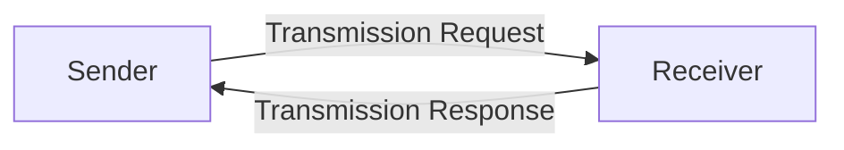
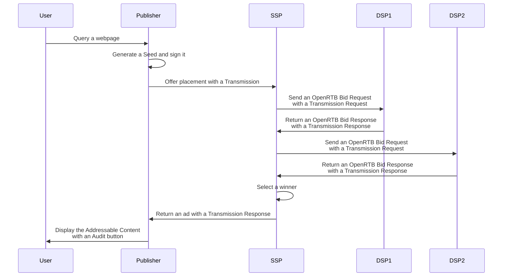

# Goal

Describe the technical requirements for a DSP engaged through the Model Terms
with a supply partner.

# General note about formats

The described API use timestamps based on 1970 (unix epoch time).

# General note about signature

Prebid SSO Data format is design to let the user audit how his preference got
to their current state. Therefore, Prebid SSO relies on the signatures 
of the data and the communication to enforce security. The Elliptic Curve
Digital Signature Algorithm (ECDSA) is used for this purpose. All the signatures
described in this documentation are generated using NIST P-256 coupled with
the hash algorithm SHA-256 on a specific string.

# The Identity endpoint

To be part of the Prebid SSO network, a DSP must provide an Identity Endpoint
for providing:
* The name of the DSP;
* The Prebid SSO version that it handles;
* The public key used to verify its signatures of Prebid SSO Data and
  transmissions.

It is reachable at the following endpoint:

```
GET https://<domain>/prebidsso/API/v1/identity
```

## Identity object

It provides the following data as JSON:
| Field                    | Type                 | Details                    |
|--------------------------|----------------------|----------------------------|
| name                     | String               | The name of the Contracting Party since the domain may no reflect the Company name.<br /> e.g "Criteo"                                                                                                                    |
| type                     | String               | The type of Contracting Party in the Prebid SSO ecosystem. For now, the type for a DSP is "vendor"
| last_version_implemented | Number               | A two digit number separated by a point for expressing the last Prebid SSO version handled.<br /> For now, the value is "0.1"<br /> Note: a new field may appear with the new versions of the Prebid SSO protocol for the last supported version. |
| keys                     | Array of Key objects | Public keys for verifying the signatures of the DSP. Those public key are strings associated to a timeframe for handling key rotation.|


All signatures shared across the network must be verifiable. Therefore, each
signature must have an associable key available in the Identity Endpoint. It is
possible to have overlaps between the key timeframes for handing propertly the
rotations. 

## Key object

| Field | Type      | Details                                                             |
|-------|-----------|---------------------------------------------------------------------|
| key   | String    | Public key for verifying the signature. Encoded in an UTF-8 String. |
| start | Integer   | Timestamp when the Contracting Party started to use this key for signing.         |
| end   | Integer   | Timestamp when the Contracting Party stoped to use this key for signing.          |


## Example of an Identity response

```json
{
    "name": "Criteo",
    "type": "vendor",
    "version": 0.1,
    "keys": [
        { 
            "key": "04f3b7ec9095779b119cc6d30a21a6a3920c5e710d13ea8438727b7fd5cca47d048f020539d24e74b049a418ac68c03ea75c66982eef7fdc60d8fb2c7707df3dcd",
            "start": 1639500000,
            "end": 1639510000
        },
        { 
            "key": "044782dd8b7a6b8affa0f6cd94ede3682e85307224064f39db20e8f49b5f415d83fef66f3818ee549b04e443efa63c2d7f1fe9a631dc05c9f51ad98139b202f9f3",
            "start": 1639510000,
            "end":  1639520000
        }
    ]
}
```

# Transmission Overview

## Definitions

A **Transaction** is the sending of SWAN Data from the Root Party through the SWAN ecosystem by consecutive Transmissions.

A **Transmission** is the act of sharing Prebid SSO Data (Pseudonymous-Identifiers
and Preferences) between two Contracting Parties of Prebid SSO: the Sender and
the Receiver.

The **Sender** sends a **Transmission Request** and the **Receiver** sends back 
a **Transaction Response**.



The Transmissions are chainable:



At the end of a Transmission, the Sender sets a **Transmission Result**. Either
by using the Transmission Response if it fits. Or by generating it with a
status error. The Transmission Results are described in detail in a further
section.

## Transport and security

For doing Transmissions, it is expected to use HTTPS for transport and security
purposes and POST requests for server-to-server communications for accommodating
a greater payload than GET. However, since Prebid SSO can be integrated as
a sub-component, its design doesn't rely on the HTTP status. Therefore, the
error handling would be described in the API details. Other transport protocols
are fine in the case of an integration to existing solutions, as far as it
provides the same level of security as HTTPS.

## Formats

Prebid SSO Data is associated with an Addressable Content (an ad) of an
existing ecosystem. Thus, it is, in most cases, a sub-component of existing
communication protocols like OpenRTB. This document introduces API contracts
with field names and types for this data. It is followed each time by a
concrete example in JSON. However, as it is difficult to find a 
one-size-fits-all solution for an existing fragmented ecosystem, the formats
on. For instance, if the
Transmissions are integrated in an OpenRTB implementation in Protobuf, then it
is possible to use Protobuf for the format of the Transmissions.

## Extensions

Similar to OpenRTB, an integration of the Prebid SSO Transmissions can require
extra data associated to the Prebid SSO Data. Thus, it is possible to add an
"ext" field to every object contained in a Transmission Request or a Transaction
Response. The contents of the "ext"s are up to the two Contracting Parties that
integrate it.

# Transmission protocol

In a case of an ad-hoc communication between two Contracting Parties, the
 transmission protocol can be used.

## Transmission Request

### The Transmission Request object


| Field  | Type                            | Details                           |
|--------|---------------------------------|-----------------------------------|
| version| Number                          | The Prebid SSO version of the object.               |
| seed   | Seed object                     | A Seed object contains all the Prebid SSO Data gathered and signed by the Publisher concerning the user. |
| parents| Array of Transmission Results   | A list of Transmission Results that currently participate to a chain of Transmissions and make this Transmission possible. |  
| source | Source object                   | The source object contains data for identifying the Sender of the Transmission.<br /><table><tr><th>Field</th><th>Type</th><th>Details</th></tr><tr><td>domain</td><td>String</td><td>The domain of the Sender.</td></tr><tr><td>timestamp</td><td>Integer</td><td>The timestamp of the signature.</td></tr><tr><td>signature</td><td>String</td><td>Encoded signature in UTF-8 of the Tranmission sender.</td></tr></table>|


### The Seed object

| Field                  | Type                                     | Details  |
|------------------------|------------------------------------------|----------|
| version                | Number                                   | The Prebid SSO version of the object.                                                                                                                                                                                            |
| transaction_id         | String                                   | A GUID in a String format dedicated to the share of the Prebid SSO data for one Addressable Content.                                                                                                                                    |
| preferences            | Preferences object                       | The Preferences of the user.                                                                                                                                                                                                            |
| identifiers            | Array of Pseudonymous-Identifier objects | The Pseudonymous-Identifiers of the user. For now, it only contains a Prebid ID.                                                                                                                                                        |
| source                 | Source object                            | The source contains data for identifying and trusting the Publisher.<br /><table><tr><th>Field</th><th>Type</th><th>Details</th></tr><tr><td>domain</td><td>String</td><td>The domain of the Root Party (Publisher in most of the cases).</td></tr><tr><td>timestamp</td><td>Integer</td><td>The timestamp of the signature.</td></tr><tr><td>signature</td><td>String</td><td>Encoded signature in UTF-8 of the Root Party/Publisher.</td></tr></table>|


### The Preferences object

| Field   | Type                   | Details                                   |
|---------|------------------------|-------------------------------------------|
| version | Number                 | The Prebid SSO version of the object.                                                                                                                                                                       |
| data    | Dictionary             | The key is a string and represents the name of the preference. <br /> The values represent the value of the preference. <br /> For now there is only one preference named "optin" and its value is a boolean.|
| source  | Source object          | The source contains the data for identifying and trusting the CMP that signed lastly the Preferences.<br /> <table><tr><th>Field</th><th>Type</th><th>Details</th></tr><tr><td>domain</td><td>String</td><td>The domain of the CMP.</td></tr><tr><td>timestamp</td><td>Integer</td><td>The timestamp of the signature.</td></tr><tr><td>signature</td><td>String</td><td>Encoded signature in UTF-8 of the CMP.</td></tr></table>|

Note that the "data" field is a simple dictionnary.


### The Identifier object

| Field   | Type          | Details                                            |
|---------|---------------|----------------------------------------------------|
| version | Number        | The version of Prebid SSO used for signing the Identifier.                                                                       |
| type    | String        | The type of Pseudonymous-Identifier. For now, there is only one: "prebid_id".                                                    |
| value   | String        | The Pseudonymous-Identifier value in UTF-8.                                                                                      |
| source  | Source object | The Source contains all the data for identifying and trusting the Operator that generated the Pseudonymous-Identifier. <br /> <table><tr><th>Field</th><th>Type</th><th>Details</th></tr><tr><td>domain</td><td>String</td><td>The domain of the Operator.</td></tr><tr><td>timestamp</td><td>Integer</td><td>The timestamp of the signature.</td></tr><tr><td>signature</td><td>String</td><td>Encoded signature in UTF-8 of the Operator.</td></tr></table>|

## The Transmission Result object

| Field    | Type             | Details                                        |
|----------|------------------|------------------------------------------------|
| version  | Number           | The Prebid SSO version of the object.          |
| receiver | String           | The domain name of the DSP.                                                                                                                                                                                                                                                                                |
| status   | String           | Equals "success" if the Receiver signed properly the Transmission.<br /> Equals "error_bad_request" if the receiver doesn't understand or see inconsistency in the Transmission Request but still share it across the network.<br /> Equals "error_cannot_proceed" if the receiver failed to use the data of the Transmission Request properly. |
| details  | String           | In case of an error status, the DSP can provide details concerning the error.                                                                                                                                                                                                                              |
| source   | Source object    | The source object contains data for identifying the Receiver of a Transmission.<br /><table><tr><th>Field</th><th>Type</th><th>Details</th></tr><tr><td>domain</td><td>String</td><td>The domain of the Receiver.</td></tr><tr><td>timestamp</td><td>Integer</td><td>The timestamp of the signature.</td></tr><tr><td>signature</td><td>String</td><td>Encoded signature in UTF-8 of the Receiver of the Tranmission.</td></tr></table>|


### Example of a Transmission Request


````json
{
    "version": 0,
    "seed": {
        "version": 0,
        "transaction_id": 1234567,
        "identifiers": [
            {
                "version": 0,
                "type": "prebid_id",
                "value": "7435313e-caee-4889-8ad7-0acd0114ae3c",
                "source": {
                    "domain": "operator0.com",
                    "timestamp": 1639580000,
                    "signature": "12345_signature"
                }
            }
        ],
        "preferences": {
            "data": { 
                "opt_in": true 
            },
            "source": {
                "domain": "cmp1.com",
                "timestamp": 1639581000,
                "signature": "12345_signature"
            }
        },
        "source": {
            "domain": "publisher.com",
            "timestamp": 1639582000,
            "signature": "12345_signature"
        }
    },
    "parents": [
        {
            "version": 0,
            "receiver": "ssp1.com",
            "status": "SUCCESS",
            "details": "",
            "source": {
                "domain": "ssp1.com",
                "timestamp": 1639583000,
                "signature": "12345_signature"
            }
        }
    ],
    "source" : {
        "domain": "ssp1.com",
        "timestamp": 1639581000,
        "signature": "123_signature",
    }
}
````

## Transmission Response

The Transmission Response contains the signature of the DSP. Considering that
the DSP, in a nominal case, doesn't share itself the Prebid SSO Data to other
suppliers, it shouldn't take care of the "children" Transmission Results.

### Transmission object

| Field    | Type                          | Details                           |
|----------|-------------------------------|-----------------------------------|
| version  | Number                        | The version of the Prebid SSO used for generating the Transmission Response.                                                                                                                                                                                                                               |
| receiver | String                        | The domain name of the DSP.                                                                                                                                                                                                                                                                                |
| status   | String                        | Equals "success" if the DSP signed the Transmission and returns it to the sender.<br /> Equals "error_bad_request" if the receiver doesn't understand or see inconsistency in the Transmission Request.<br /> Equals "error_cannot_process" if the receiver cannot handle the Transmission Request properly. |
| details  | String                        | In case of an error status, the DSP can provide details concerning the error.                                                                                                                                                                                                                              |
| children | Array of Transmission Results | An empty array as we consider that the DSP doesn't share the Prebid SSO Data to its suppliers via new transmissions.                                                                                                                                                                                       |
| source   | Source object                 | The source contains all the data for identifying the DSP and verifying the Transmission.                                                                                                                                                                                                                   |


### Signing the Transmission Object

A Transmission Response must be signed by the DSP. This signature relies on the
same cryptographic algorithm as the other signatures in Prebid SSO (ECDSA NIST
P-256):

* Build a UTF-8 string from the data of the Transmission Request (see below);
* Generates a SHA256 hash;
* Sign it with its private key and signs it.


To build the UTF-8 string, the DSP must concat the following fields:

````
transmission_result.source.domain + '\u2063' + 
transmission_result.source.timestamp + '\u2063' + 

seed.source.signature + '\u2063' + 

source.domain + '\u2063' + 
source.timestamp + '\u2063' + 

transmission_response.receiver + '\u2063' + 
transmission_response.status + '\u2063' +
transmission_response.details
````

| Name                  | Details                                              |
|-----------------------|------------------------------------------------------|
| source.domain         | The Domain of the DSP. It matches the "domain" field in the Source object of the Transmission Response.   |
| source.timestamp      | The timestamp of the signature. It matches the "timestamp" field in the Source object of the Transmission Response. |
| seed.source.signature | The signature of the Seed available in the Transmission Request.                                          |
| '\u2063'              | The invisible separator in UTF-8.

### Example of a Transmission Response

````json
{
    "version": 0,
    "receiver": "dsp1.com",
    "status": "success",
    "details": "",
    "source": {
        "domain": "dsp1.com",
        "timestamp": 1639589531,
        "signature": "12345_signature"
    },
    "children": []
}
````


# Transmissions in OpenRTB

OpenRTB is a standardized format for bidding on inventory. It is widely used in
the industry and Prebid SSO Transmission can be integrated into it. For this
purpose, Prebid SSO uses the "extensions" of OpenRTB requests and responses.

## Many Transmission Requests in one OpenRTB Bid Request

There is one transmission between two Contracting Parties for one ad and one
OpenRTB bid request can contain multiple ads - named "impression" in OpenRTB
specifications. Therefore, a bid request can have multiple Transmission
Requests. Those Transmissions are added in the "ext" object of each "imp" (for 
impression) object of the Bid Request. This new object dedicated to the 
Transmission is named "prebid_sso_transmission".

#### Example of a Transmission Request in an OpenRTB Bid Request

```json
{
    "id": "80ce30c53c16e6ede735f123ef6e32361bfc7b22",
    "at": 1, 
    "cur": [ "USD" ],
    "imp": [
        {
            "id": "1",
            "bidfloor": 0.03,
            "banner": {
                "h": 250,
                "w": 300,
                "pos": 0
            },
            "ext": {
                "prebid_sso_transmission": {
                    "version": 0,
                    "seed": {
                        "version": 0,
                        "transaction_id": 1234567,
                        "identifiers": [
                            {
                                "version": 0,
                                "type": "prebid_id",
                                "value": "7435313e-caee-4889-8ad7-0acd0114ae3c",
                                "source": {
                                    "domain": "operotor0.com",
                                    "timestamp": 1639589531,
                                    "signature": "12345_signature"
                                }
                            }
                        ],
                        "preferences": {
                            "version": 0,
                            "data": { 
                                "opt_in": true 
                            },
                            "source": {
                                "domain": "cmp1.com",
                                "timestamp": 1639589531,
                                "signature": "12345_signature"
                            }
                        },
                        "source": {
                            "domain": "publisher0.com",
                            "timestamp": 1639589531,
                            "signature": "12345_signature"
                        }
                    },
                    "parents": [
                        {
                            "version": 0,
                            "receiver": "ssp1.com",
                            "status": "success",
                            "details": "",
                            "source": {
                                "domain": "ssp1.com",
                                "timestamp": 1639589531,
                                "signature": "12345_signature"
                            },
                        },
                        {
                            "version": 0,
                            "receiver": "publisher.com",
                            "status": "success",
                            "details": "",
                            "source": {
                                "domain": "publisher.com",
                                "timestamp": 1639589531,
                                "signature": "12345_signature"
                            },
                        },
                    ],
                }
            }
        }
    ],
    "site": {
        "id": "102855",
        "cat": [ "IAB3-1" ],
        "domain": "www.publisher.com",
        "page": "http://www.publisher.com/1234.html ",
        "publisher": {
            "id": "8953",
            "name": "publisher.com",
            "cat": ["IAB3-1"],
            "domain": "publisher.com"
        }
    },
    "device": {
        "ua": "Mozilla/5.0 (Macintosh; Intel Mac OS X 10_6_8) AppleWebKit/537.13 (KHTML, like Gecko) Version/5.1.7 Safari/534.57.2",
        "ip": "123.145.167.10"
    },
    "user": {
        "id": "55816b39711f9b5acf3b90e313ed29e51665623f"
    }
}

```

## Many Transmission Responses in one OpenRTB Bid Response

Similar to the OpenRTB Bid Request for the Transmission Requests, the OpenRTB
Bid Response must contain multiple Transmission Responses - one for each
impression. However, the OpenRTB Bid Response is focused on BidSeat and Bid with
potential cases where impressions don't appear in the response because there is
no bid on them. Therefore, each Transmission Request must be expressed in the
"ext" object of the root Bid Response paired with the impression ids provided in
the request. The name of this new object in the "ext" object is 
"prebid_sso_transmissions".

Each Transmission Request presented in the Bid Request must have a Transmission
Response in the Bid Response. The OpenRTB specification allows providing an
empty payload for a "No Bid". However, this is not acceptable in the presence of
Transmission.

#### Example of a Transmission Response in an OpenRTB Bid Response
```json
{
    "id": "1234567890",
    "bidid": "abc1123",
    "cur": "USD",
    "seatbid": [
        {
            "seat": "512",
            "bid": [
                {
                    "id": "1",
                    "impid": "1",
                    "price": 9.43,
                    "nurl": "http://adserver.com/winnotice?impid=102",
                    "iurl": "http://adserver.com/pathtosampleimage",
                    "adomain": [ "advertiserdomain.com" ],
                    "cid": "campaign111",
                    "crid": "creative112",
                    "attr": [ 1, 2, 3, 4, 5, 6, 7, 12 ]
                }
            ]
        }
    ],
    "ext": {
        "prebid_sso_transmissions": [
            {
                "impid": "1",
                "response": {
                    "version": 0,
                    "receiver": "dsp1.com",
                    "status": "success",
                    "details": "",
                    "source": {
                        "domain": "dsp1.com",
                        "timestamp": 1639589531,
                        "signature": "12345_signature"
                    },
                    "children": []
                }
            },
            {
                "impid": "2",
                "response": {
                    "version": 0,
                    "receiver": "dsp1.com",
                    "status": "success",
                    "details": "",
                    "source": {
                        "domain": "dsp1.com",
                        "timestamp": 1639589531,
                        "signature": "12345_signature"
                    },
                    "children": []
                }
            }
        ]
    }
}
```

# The Audit Button

## The interface

Tthe DSP must include an Audit Button within the Addressable Content.

The standard approach is to use an HTML button for the Audit Button. This HTML
button is in a form containing also a hidden input for retaining the Audit Log.
The Audit Log stored in the value of the hidden input is in JSON encoded in
base64.

The method of the form must be a POST and the action is the URL of the Audit UI
hosted by the DSP.

```html
<div class="ad_container">
    <div>This is an ad.</div>
    <form action="https://vendor.com/prebidsso/v1/audit_ui" method="post"> 
        <input type="hidden" id="audit_log" value="eyJPV0lEIjoiQTI1....C8iLC" />
        <button type="submit" class="prebid_sso_audit_button">Audit Log</button>
    </form>
</div>
```

## The Audit Log

The DSP must build a valid Audit Log. For this purpose, it must:

1. Take the Seed and the Transmission Parents from the Transmission Request that
it received for this Addressable content.
2. Consider the Transmission Parent to Transmission Result
3. Append it own Transmission Result ot the existing list.
4. Shuffle the list of Transmission Results
5. Build the Audit Log by following the specification below.

### The root object

| Field         | Type                         | Detail                        |
|---------------|------------------------------|-------------------------------|
| seed          | Seed Object                  | The Seed object already described in this document. |
| transmissions | List of Transmission Results | A list of Transmission Results |

### The Transmission Result object

A Transmission Result is the output of a Transmission. It can be a
Transmission Response without the "children" field when the Receiver of 
a Transmission responded correctly to a Transmission Request. 
Those Transmission Results are appended to the Audit Log. Therefore,
the DSP handles those objects (see the Transmission Response object in this
document).

### Example of Audit Log

```json
{
    "seed": {
        "version": 0,
        "transaction_id": 1234567,
        "identifiers": [
            {
                "version": 0,
                "type": "prebid_id",
                "value": "7435313e-caee-4889-8ad7-0acd0114ae3c",
                "source": {
                    "domain": "operotor0.com",
                    "timestamp": 1639589531,
                    "signature": "12345_signature"
                }
            }
        ],
        "preferences": {
            "version": 0,
            "data": { 
                "opt_in": true 
            },
            "source": {
                "domain": "cmp1.com",
                "timestamp": 1639589531,
                "signature": "12345_signature"
            }
        },
        "source": {
          "domain": "operator0.com",
          "timestamp": 1639589531,
          "signature": "12345_signature"
        }
    },
    "transmissions": [
        {
            "version": 0,
            "receiver": "party2.com",
            "status": "success",
            "details": "",
            "source": {
                "domain": "party2.com",
                "timestamp": 1639589531,
                "signature": "12345_signature"
            }
        },
        {
            "version": 0,
            "receiver": "party3.com",
            "status": "success",
            "details": "",
            "source": {
                "domain": "party3.com",
                "timestamp": 1639589531,
                "signature": "12345_signature"
            }
        }
    ]
}
```

# Display of the Audit UI

## Web Page interface

The DSP must include an Audit Button within the Addressable Content.

Once the user has clicked on the Audit Button, she/he is redirected to the
Audit UI. The DSP generates the UI based on the validations of the Prebid SSO
Data and the Transmission Results. The following elements must appear in the
page:

| Element                          | Details                                   |
|----------------------------------|-------------------------------------------|
| List of Pseudonymous-Identifiers | Each Pseudonymous-Identifier must be paired with the name of the Operator who generated it and signed it with a Reg/Green indicator expressing the validity of the signature.                                                |
| List of the Preferences          | Each Preference must be paired with the name of the CMP who generated it and signed it with a Red/Green indicator expressing the validity of the signature.                                                             |
| Seed                             | The Seed is represented by the Transaction ID and a Red/Green indicator expressing the validity of the signature                                                                                                             |
| List of Transmission Results     | The Transmission Results available in the Audit Log. Each Transmission Results is represented by the Name of the Receiver, the status of the Transmission and a Red/Green indicator expressing the validity of the signature |

The design of the page is up to the DSP but it must consider to have a neutral
UI to be used for many different Publishers.

Note that for the version v0.1, there are only one possible preference
("opt-in") and one possible pseudonymous-identifiers ("prebid_id").
However the framework is designed to handle many of them. 

## Source validations

As we saw, for displaying correctly the Audit UI, the DSP must validate
different sources. For each source available in the Audit Log, the DSP must:

* Call the Identity Endpoint of the "domain" of the source to retrieve its name
  and its public key used for verifying the signature.
* Decode the signature thanks to the NIST P-256 public key of the domain that
  generated it.
* Build a UTF-8 string based on the data available in the Audit Log. For each
  data that is signed, there is a specific way to generate this UTF-8 string.
  Those generations are described in this document.
* Generate an SHA-256 hash from the UTF-8 string.
* Compare the hash to the decoded signature. If they match, the signature is
  validated.

### Verify the Pseudo-Identifiers

The Audit Log contains a list of Pseudo-identifiers. Each Pseudo-identifier is
signed. The UTF-8 string for a specific Pseudo-Identifier must be built as follows:

```
identifier.source.domain + '\u2063' + 
identifier.source.timestamp + '\u2063' + 
identifier.type + '\u2063'+
identifier.value
```

### Verify the Preferences

The Audit Log contains a list of Preferences with one signature. The UTF-8 string for a specific Preference must be built as follows:

```
preferences.source.domain + '\u2063' +
preferences.source.timestamp + '\u2063' +

prebid_id.source.signature + '\u2063' +

preferences.data.key1 + '\u2063' + preferences.data[key1].value + '\u2063' +
preferences.data.key2 + '\u2063' + preferences.data[key2].value + '\u2063' +
...
preferences.data.keyN + '\u2063' + preferences.data[keyN].value
```

For handling properly the preferences, key1, key2, ... keyN follows the
alpha-numerical order of the keys existing in the dictionary.

### Verify the Seed

The Audit Log contains a Seed. The UTF-8 string for the Seed must be built as
followed:

```
seed.source.domain + '\u2063' + 
seed.source.timestamp + '\u2063' + 

seed.transaction_id + '\u2063' + 

seed.identifiers[0].source.signature + '\u2063' +
seed.identifiers[1].source.signature + '\u2063' +
... + '\u2063' + 
seed.identifiers[n].source.signature + '\u2063' + 

seed.preferences.source.signature
```
Note that we iterate over the identifiers by taking for each signature and
appending it to the UTF-8 string. 

### Verify the Transmission Results

The Audit Log contains a list of Transmission Results. Each Transmission Result
is signed. The UTF-8 string for a specific Transmission Result must be built
as follows:

```
transmission_result.source.domain + '\u2063' + 
transmission_result.source.timestamp + '\u2063' + 

seed.source.signature + '\u2063' + 

transmission_result.receiver + '\u2063' + 
transmission_result.status + '\u2063' +
transmission_result.details
```
