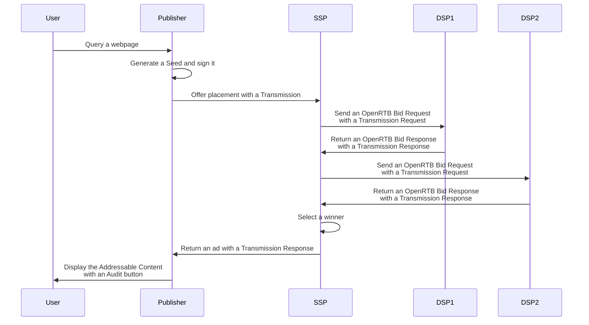
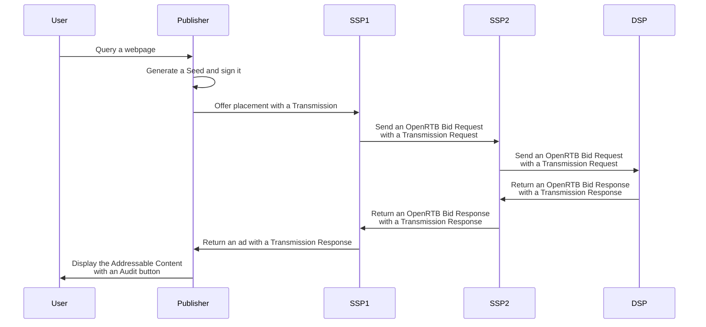
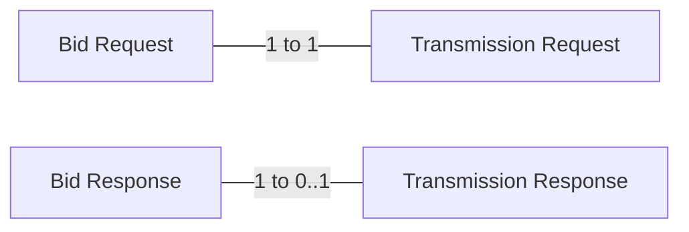

# DSP Implementation

DSPs can implement Prebid Addressability Framework and shares Prebid Addressability Framework Data with partners 
accordingly to the Model Terms. This document describes the technical
requirements for it.

## Principles

### Overview

A **Transaction** is the act of sending PAF Data from the Root Party 
through the PAF ecosystem by consecutive Transmissions.

A **Transmission** is the act of sharing PAF Data (Pseudonymous-Identifiers
and Preferences) between two Contracting Parties: the Sender and
the Receiver. Transmissions are chainable.

The **Transmission Protocol** is the communication protocol between the **Sender**
and the **Receiver**:
1. The **Sender** sends one or many **Transmission Request** in a communication
1. The **Receiver** sends back one or many **Transaction Response**


The **Transmission Protocol** is design so that all parties that participate
to one or many Addressable Content have all the necessary
data for auditing a given Addressable Content.

For this, **Transmission Requests** include their **"parents"** which are 
all the **Transaction Requests** that were necessary to create the current 
Transmission. This structure is an array to represent a single path.

In a same way, **Transmission Responses** contain **"children"** which are all the 
**Transmission Responses** that was generated thanks to the current Transmission
*and participate or can participate to the Addressable Content*. It means that if
an intermediary filters some potential participant in a case of an auction, the
respective **children** are also filtred out from the Transmission. This structure
is a tree to represent the multiplicity of the suppliers.

### Transmission Request

A **Transmission Request** is always sent aside from PAF Data. It is signed so that
we can trust that it comes from the actual **Sender**. It is associated with
**Transactions** via a **Seed**.

A **Seed** is data generated by the publisher or one of its direct third parties. 
It gathers the identity of the publisher, many **Transaction Id** - one per **Addressable Content**. 
The Seed is signed by the actor that generated it so that it can be verified.

A **Transmission Request** contains *previous relative Transmission Requests* so that
the **Receiver** knows all the *in progress* Transmissions that lead to the current one.
Those **Transmission Results** are named the **parents** of the Transmission.

### Transmission Response

A **Transmission Request** is mandatory only if the Receiver uses the PAF Data to participate
to an **Addressable Content** of the **Transmission**.

A **Transmission Response** is associated to a **Transmission Request** through a set of 
**Transaction Id** that the Receiver is willing to participate.

A **Sender** must send its own *Transmission Requests* as a Receiver and receive responses
(or acknowledgments) before sending back its own **Transmission Response**. 
The **Transmission Response** includes all the **Transmission Results** of those transmissions
so that the Sender knows all the Transmissions that occurred after its **Transmission Request**.
Those **Transmission Results** are named the **children** of the Transmission.

### Identity endpoint

All signatures shared across the network must be verifiable. Each digital signature is associated to:
* The domain name of the signer
* The timestamp of the signature

Thanks to those data, any party can call the **Identity Endpoint** of the signer for fetching its public keys
and verifying its signatures. The Identity Endpoint must have Therefore, each signature must have an associable 
key available in the Identity Endpoint. It is possible to have overlaps between the key timeframes for handing
the rotations. 

### Digital signature and Audit Log

For details on how to calculate or verify signatures, see [signatures.md](signatures.md).

The Audit Log of a **Transaction** is the audit of all its **Transmissions** and their associated
**PAF Data**. The audit is accomplished thanks to the digital signatures of the Transmissions, the
Seed and the Data.

Every entity in possession of the Audit Log can audit by:
1. Fetching the public keys of the Contracting Parties that participate in the Transaction.
1. Build the strings that help to generate the signatures thanks to the data of the Audit Log.
1. Verifying all the signatures of the Audit Log thanks to the public keys.

⚠️ It is required to verify those signatures in the scope of the MVP only when the audit 
is asked by the user to the Publisher. The verification of the signatures isn't required
during the Transmissions.

### Workflow

Here is a nominal workflow where the Transmission Protocol is integrated for sharing PAF Data.



<!--partial-begin { "files": [ "transmissions-diagrams-and-details.md" ] } -->
<!-- ⚠️ GENERATED CONTENT - DO NOT MODIFY DIRECTLY ⚠️ -->
Here is a workflow with detailed steps  how Transmission Requests contain
 **parents** and Transmission Responses contains **children**. 



The detailed steps of the diagram above:

1. The Publisher generates the Seed.
2. The Publisher sends the Transmission Request 1 to SSP1. The "parents" field of the Transmission Request is empty.
3. The SSP1 receives the Transmission Request 1 and generates the Transmission Result 1.
4. The SSP1 sends the Transmission Request 2 to SSP2. The "parents" contains the Transmission Result 1.
5. The SSP2 receives the Transmission Request 2 and generates the Transmission Result 2.
6. The SSP2 sends the Transmission Request 3 to the DSP. The "parents" contain the Transmission Result 1 and the Transmission Result 2.
7. The DSP receives the Transmission Request 3 and generates a Transmission Result 3.
8. The DSP returns a Transmission Response 3 to the Transmission Request 3 (SSP2). It includes the Transmission Result 3. The 'children" field is empty.
8. The SSP2 receives the Transmission Response 3.
10. The SSP2 returns a Transmission Response 2 to Transmission Request 2 (SSP1). It contains the Transmission Result 2. The "children" field includes the Transmission Result 3.
11. The SSP1 receives the Transmission Response 2.
12. The SSP1 returns a Transmission Response 1 to Transmission Request 3 (Publisher). It contains the Transmission Result 1. The "children" field includes the Transmission Result 2 and the Transmission Result 3.
13. The Publisher shows the Addressable Content via the DSP and the Audit Log is available.
<!--partial-end-->

## Transport and security

For doing Transmissions, it is expected to use HTTPS for transport and security
purposes and POST requests for server-to-server communications for accommodating
a greater payload than GET. However, since PAF can be integrated as
a sub-component, its design doesn't rely on the HTTP status. Therefore, the
error handling would be described in the API details. Other transport protocols
are fine in the case of integration to existing solutions, as far as it
provides the same level of security as HTTPS.

### Formats

PAF Data is associated with an Addressable Content (an ad) of an
existing ecosystem. Thus, it is, in most cases, a sub-component of existing
communication protocols like OpenRTB. This document introduces API contracts
with field names and types for this data. It is followed each time by a
concrete example in JSON. However, as it is difficult to find a 
one-size-fits-all solution for an existing fragmented ecosystem, the formats
are subject to adaptation to the context. For instance, if the
Transmissions are integrated into an OpenRTB implementation in Protobuf, then it
is possible to use Protobuf for the format of the Transmissions.

## The Identity endpoint

The Contracting Party must expose an Identity endpoint. It gathers information for verifying the identity and the transmissions that it signed.

It is reachable at the following endpoint:
```
GET https://<domain>/paf/v1/identity
```

| Message  | Format|
|----------|-------|
| Request  | [get-identity-request.md](./model/get-identity-request.md)  |
| Response | [get-identity-response.md](./model/get-identity-response.md)|

<details>
<summary>Identity Response Example</summary>

Request:
```http
GET /paf/v1/identity
Host: my-dsp.io
```

Response:
```json
{
  "name": "My DSP",
  "keys": [
    {
      "key": "-----BEGIN PUBLIC KEY-----\nMFkwEwYHKoZIzj0CAQYIKoZIzj0DAQcDQgAEEiZIRhGxNdfG4l6LuY2Qfjyf60R0\njmcW7W3x9wvlX4YXqJUQKR2c0lveqVDj4hwO0kTZDuNRUhgxk4irwV3fzw==\n-----END PUBLIC KEY-----",
      "start": 1641034200,
      "end": 1646132400
    }
  ],
  "type": "vendor",
  "version": "0.1"
}
```
</details>

## Standalone implementation of the Transmissions protocol

If the Sender and the Receiver want to integrate the Transmission in an existing
communication, they must integrate the Standalone version in of the Transmission Protocol
in their existing models. 

| Message                          | Format|
|----------------------------------|-------|
| Standalone Transmission Request  | [transmission-request.md](./model/transmission-request.md)  |
| Standalone Transmission Response | [transmission-response.md](./model/transmission-response.md) |

<details>
<summary>Transmission Request Example</summary>


<!--partial-begin { "files": [ "transmission-request.json" ], "block": "json" } -->
<!-- ⚠️ GENERATED CONTENT - DO NOT MODIFY DIRECTLY ⚠️ -->
```json
{
    "version": "0.1",
    "seed": {
        "version": "0.1",
        "transaction_ids": [ 
            "4640dc9f-385f-4e02-a0e5-abbf241af94d", 
            "7d71a23a-fafa-449a-8b85-63a634780107" 
        ],
        "publisher": "publisher.com",
        "source": {
            "domain": "publisher.com",
            "timestamp": 1639582000,
            "signature": "f1f4871d48b825931c5016a433cb3b6388f989fac363af09b9ee3cd400d86b74"
        }
    },
    "data": {
        "identifiers": [
            {
                "version": "0.1",
                "type": "paf_browser_id",
                "value": "7435313e-caee-4889-8ad7-0acd0114ae3c",
                "source": {
                    "domain": "operator0.com",
                    "timestamp": 1639580000,
                    "signature": "868e7a6c27b7b7fe5fed219503894bf263f31bb6d8fd48336d283e77b512cda7"
                }
            }
        ],
        "preferences": {
            "version": "0.1",
            "data": { 
                "use_browsing_for_personalization": true 
            },
            "source": {
                "domain": "cmp1.com",
                "timestamp": 1639581000,
                "signature": "65acdcfdbdba8b17936f25a32b33b000393c866588d146cb62ec51ab8890c54f"
            }
        }
    },
    "contents": [],
    "status": "success",
    "details": "",
    "receiver": "dsp1.com",
    "source": {
        "domain": "publisher.com",
        "timestamp": 1639581000,
        "signature": "5d0519da9c65feeae715dfcf380c7997ea9ee859e2636a498c43c1044dc20354"
    },
    "parents": []
}
```
<!--partial-end-->
</details>

<details>

<summary>Transmission Response Example</summary>

<!--partial-begin { "files": [ "transmission-response-with-children.json" ], "block": "json" } -->
<!-- ⚠️ GENERATED CONTENT - DO NOT MODIFY DIRECTLY ⚠️ -->
```json
{
    "version": "0.1",
    "contents": [
        {
            "transaction_id": "f55a401d-e8bb-4de1-a3d2-fa95619393e8",
            "content_id": "90141190-26fe-497c-acee-4d2b649c2112"
        },
        {
            "transaction_id": "e538ff77-4746-4eb9-96c1-bda714dfb80a",
            "content_id": "b3e79370-ecb8-468b-8afa-d227890ddca5"
        }
    ],
    "status": "success",
    "details": "",
    "receiver": "dsp1.com",
    "source": {
        "domain": "dsp1.com",
        "timestamp": 1639589531,
        "signature": "d01c6e83f14b4f057c2a2a86d320e2454fc0c60df4645518d993b5f40019d24c"
    },
    "children": [
        {
            "version": "0.1",
            "contents": [
                {
                    "transaction_id": "f55a401d-e8bb-4de1-a3d2-fa95619393e8",
                    "content_id": "b4a330e0-e41e-4c47-a1a7-00cdc5f627ed"
                }
            ],
            "status": "success",
            "details": "",
            "receiver": "dsp1-partner.com",
            "source": {
                "domain": "dsp1-partner.com",
                "timestamp": 1639589531,
                "signature": "d01c6e83f14b4f057c2a2a86d320e2454fc0c60df4645518d993b5f40019d24c"
            },
            "children": []
        }
    ]
}
```
<!--partial-end-->
</details>

## OpenRTB implementation of the Transmissions protocol

OpenRTB is a standardized format for bidding on inventory. It is widely used in
the industry and PAF Transmission can be integrated into it. For this
purpose, PAF uses the "extensions" of OpenRTB requests and responses.

The protocol of OpenRTB is mainly composed by:
* one **Bid Request** for many Addressable Contents (a.k.a impressions) from the Sender to the Receiver
* potentially one **Bid Response** in return from the Receiver to the Sender.


So the Transmission protocol can be integrated by considering that:
* one **Bid Request** contains one **Transmission Request** for many **Addressable Contents**
* one **Bid Response** contains zero or one Transmission Response for **Addressable Contents** that the Receiver is bidding for.



OpenRTB already defines a field for "Extended Identifiers" in the Bid Request. This field (`eids`) at 
the User level (`user`) is designed to support multiple third party identity provider to the OpenRTB 
ecosystem. Then, to integrate the Transmission Request in the Bid Request, the PAF data is added in a
new "Extended Identifier". Precisely, the path is `user`.`ext`.`eids`. The rest of the content of the
Transmission Request is put in the `user`.`ext`.`paf`. In addition, the "transaction_id"s are added
respectively to their impressions at the path `imp`.`ext`.`path`. 

The OpenRTB Bid Response can contain one Transmission Response. The Bid Response contains 
this Transmission Response if the Receiver bid on at least one of the impressions. 
The rationale is that if the DSP doesn't expect to provide an 
Addressable Content, won't appear in the Audit Log, and thus its Transmission
Response isn't useful.

To provide a concrete example, the OpenRTB specifications allow providing 
an empty payload for a "No Bid". Because there is no bid, there is also no
Transmission Response and it is an acceptable scenario.

Each Transmission Response must be expressed in the "ext" objects of the root 
Bid Response paired with the impression ids provided in the request. The name 
of this new object in the "ext" object is "paf".

| Message                          | Format|
|----------------------------------|-------|
| OpenRTB Bid Request with Transmission Request  | [openrtb-bid-request.md](./model/openrtb-bid-request.md)  |
| OpenRTB Bid Request with Transmission Response | [openrtb-bid-response.md](./model/openrtb-bid-response.md) |

<details>
<summary>OpenRTB Request Example</summary>

<!--partial-begin { "files": [ "openrtb-request-with-transmission.json" ], "block": "json" } -->
<!-- ⚠️ GENERATED CONTENT - DO NOT MODIFY DIRECTLY ⚠️ -->
```json
{
    "id": "80ce30c53c16e6ede735f123ef6e32361bfc7b22",
    "at": 1, 
    "cur": [ "USD" ],
    "imp": [
        {
            "id": "1",
            "bidfloor": 0.03,
            "banner": {
                "h": 250,
                "w": 300,
                "pos": 0
            },
            "ext": {
                "paf": {
                    "transaction-id": "4640dc9f-385f-4e02-a0e5-abbf241af94d"
                }
            }
        }
    ],
    "site": {
        "id": "102855",
        "cat": [ "IAB3-1" ],
        "domain": "www.publisher.com",
        "page": "http://www.publisher.com/1234.html ",
        "publisher": {
            "id": "8953",
            "name": "publisher.com",
            "cat": ["IAB3-1"],
            "domain": "publisher.com"
        }
    },
    "device": {
        "ua": "Mozilla/5.0 (Macintosh; Intel Mac OS X 10_6_8) AppleWebKit/537.13 (KHTML, like Gecko) Version/5.1.7 Safari/534.57.2",
        "ip": "123.145.167.10"
    },
    "user": {
        "id": "55816b39711f9b5acf3b90e313ed29e51665623f",
         "ext":
         {
            "eids": 
            [
                {
                    "source": "paf",
                    "uids": [
                        {
                            "atype": 1,
                            "id": "7435313e-caee-4889-8ad7-0acd0114ae3c",
                            "ext": 
                            {
                                "version": "0.1",
                                "type": "paf_browser_id",
                                "source": {
                                    "domain": "operator0.com",
                                    "timestamp": 1639580000,
                                    "signature": "868e7a6c27b7b7fe5fed219503894bf263f31bb6d8fd48336d283e77b512cda7"
                                }
                            }
                        }
                    ],
                    "ext": {
                        "preferences": {
                            "version": "0.1",
                            "data": { 
                                "use_browsing_for_personalization": true 
                            },
                            "source": {
                                "domain": "cmp1.com",
                                "timestamp": 1639581000,
                                "signature": "65acdcfdbdba8b17936f25a32b33b000393c866588d146cb62ec51ab8890c54f"
                            }
                        }
                    }
                }
            ],
            "paf": {
                "transmission": {
                    "version": "0.1",
                    "seed": {
                        "version": "0.1",
                        "transaction_ids": [ 
                            "4640dc9f-385f-4e02-a0e5-abbf241af94d", 
                            "7d71a23a-fafa-449a-8b85-63a634780107" 
                        ],
                        "publisher": "publisher.com",
                        "source": {
                            "domain": "publisher.com",
                            "timestamp": 1639582000,
                            "signature": "f1f4871d48b825931c5016a433cb3b6388f989fac363af09b9ee3cd400d86b74"
                        }
                    },
                    "source": {
                        "domain": "dsp1.com",
                        "timestamp": 1639581000,
                        "signature": "5d0519da9c65feeae715dfcf380c7997ea9ee859e2636a498c43c1044dc20354"
                    },
                    "parents": []
                }
            }
        }
    }
}
```
<!--partial-end-->
</details>

<details>
<summary>OpenRTB Request Example</summary>

<!--partial-begin { "files": [ "openrtb-response-with-transmission.json" ], "block": "json" } -->
<!-- ⚠️ GENERATED CONTENT - DO NOT MODIFY DIRECTLY ⚠️ -->
```json
{
    "id": "1234567890",
    "bidid": "abc1123",
    "cur": "USD",
    "ext": {
        "paf": {
            "transmission": {
                "version": "0.1",
                "contents": [
                    {
                        "transaction_id": "f55a401d-e8bb-4de1-a3d2-fa95619393e8",
                        "content_id": "90141190-26fe-497c-acee-4d2b649c2112"
                    }
                ],
                "status": "success",
                "details": "",
                "receiver": "dsp1.com",
                "source": {
                    "domain": "dsp1.com",
                    "timestamp": 1639589531,
                    "signature": "d01c6e83f14b4f057c2a2a86d320e2454fc0c60df4645518d993b5f40019d24c"
                },
                "children": []
            }
        }
    },
    "seatbid": [
        {
            "seat": "512",
            "bid": [
                {
                    "id": "1",
                    "impid": "1",
                    "price": 1,
                    "nurl": "http://adserver.com/winnotice?impid=102",
                    "iurl": "http://adserver.com/pathtosampleimage",
                    "adomain": [ "advertiserdomain.com" ],
                    "cid": "campaign111",
                    "crid": "creative112",
                    "attr": [ 1, 2, 3, 4, 5, 6, 7, 12 ],
                    "ext": {
                        "paf" : {
                            "content_id": "90141190-26fe-497c-acee-4d2b649c2112"
                        }
                    }
                }
            ]
        }
    ]
}
```
<!--partial-end-->
</details>
