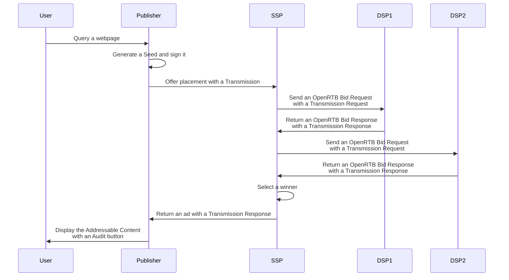
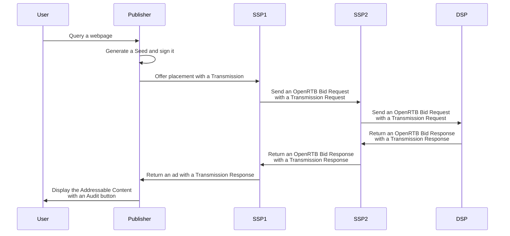

# DSP Implementation

DSPs can implement Prebid SSO and shares Prebid SSO Data with partners 
accordingly to the Model Terms. This document describes the technical
requirements for it.

## General note about formats

The described API use timestamps based on 1970 (UNIX epoch time).

## General note about signature

Prebid SSO Data format is designed to let the user audit how his preference got
to their current state. Therefore, PAF relies on the signatures 
of the data and the communication to enforce security. The Elliptic Curve
Digital Signature Algorithm (ECDSA) is used for this purpose. All the signatures
described in this documentation are generated using NIST P-256 coupled with
the hash algorithm SHA-256 on a specific string.

# Overview

To implement PAF, the DSP must:
1. expose a new *Identity endpoint*  
2. extend its existing API for handing Transmissions of Prebid SSO Data. 


# The Identity endpoint


To be part of the PAF network, a DSP must expose an Identity Endpoint
for providing:
* The name of the DSP;
* The PAF version that it handles;
* The public key used to verify its signatures of Prebid SSO Data and
  transmissions.

It is reachable at the following endpoint:

```
GET https://<domain>/prebidsso/API/v1/identity
```

## Identity object

It provides the following data as JSON:

<!--partial-begin { "files": [ "identity-table.md" ] } -->
<!-- ⚠️ GENERATED CONTENT - DO NOT MODIFY DIRECTLY ⚠️ -->
| Field                    | Type                 | Details                    |
|--------------------------|----------------------|----------------------------|
| name                     | String               | The name of the Contracting Party since the domain may not reflect the Company name.<br /> e.g "Criteo"                                                                                                                    |
| type                     | String               | The type of Contracting Party in the PAF ecosystem. For now, the type for a DSP is "vendor"
| version                  | Number               | A two-digit number separated by a point for expressing the last PAF version handled.<br /> For now, the value is "0.1"<br /> Note: a new field may appear with the new versions of the PAF for the last supported version. |
| keys                     | Array of Key objects | Public keys for verifying the signatures of the DSP. Those public keys are strings associated with a timeframe for handling key rotation.|
<!--partial-end-->


All signatures shared across the network must be verifiable. Therefore, each
signature must have an associable key available in the Identity Endpoint. It is
possible to have overlaps between the key timeframes for handing properly the
rotations. 

### Key object

| Field | Type      | Details                                                             |
|-------|-----------|---------------------------------------------------------------------|
| key   | String    | Public key for verifying the signature. Encoded in a UTF-8 String. |
| start | Integer   | Timestamp when the Contracting Party started to use this key for signing.         |
| end   | Integer   | Timestamp when the Contracting Party stopped using this key for signing.          |


### Example of an Identity response

```json
{
    "name": "Criteo",
    "type": "vendor",
    "version": 0.1,
    "keys": [
        { 
            "key": "04f3b7ec9095779b119cc6d30a21a6a3920c5e710d13ea8438727b7fd5cca47d048f020539d24e74b049a418ac68c03ea75c66982eef7fdc60d8fb2c7707df3dcd",
            "start": 1639500000,
            "end": 1639510000
        },
        { 
            "key": "044782dd8b7a6b8affa0f6cd94ede3682e85307224064f39db20e8f49b5f415d83fef66f3818ee549b04e443efa63c2d7f1fe9a631dc05c9f51ad98139b202f9f3",
            "start": 1639510000,
            "end":  1639520000
        }
    ]
}
```

## Transaction and Transmission Overview

### Definitions

A **Transaction** is the sending of PAF Data from the Root Party 
through the PAF ecosystem by consecutive Transmissions.

A **Transmission** is the act of sharing Prebid SSO Data (Pseudonymous-Identifiers
and Preferences) between two Contracting Parties of PAF: the Sender and
the Receiver. Transactions are chainable.

The **Sender** sends a **Transmission Request** and the **Receiver** sends back 
a **Transaction Response** which is composed of **Transmission Results**.


At the end of a Transmission, the Sender sets a **Transmission Result**. Either
by using the Transmission Response if it fits. Or by generating it with a
status error. The Transmission Results are described in detail in a further
section.

Here is a workflow that highlights that a Contracting Party can send
many Transmission Requests and then get many Transmission Responses.




At the end of a Transmission, the Sender sets a **Transmission Result**. Either
by using the Transmission Response if it fits. Or by generating it with a
status error. The Transmission Results are described in detail in a further
section.
<!--partial-begin { "files": [ "transmissions-diagrams-and-details.md" ] } -->
<!-- ⚠️ GENERATED CONTENT - DO NOT MODIFY DIRECTLY ⚠️ -->

Here is a workflow with detailed steps that explains how 
Transmissions Request contain **parents** and Transmission Responses contains
**children** (here, we loan the terminology of the Tree data structure). 
**children** and **parents** are Transmission Results and they are helpful for
the Publisher and the DSP for generating the Audit Log of an Addressable Content.



The detailed steps of the diagram above:

1. The Publisher generates the Seed.
2. The Publisher sends the Transmission Request 1 to SSP1. The "parents" field of the Transmission Request is empty.
3. The SSP1 receives the Transmission Request 1 and generates the Transmission Result 1.
4. The SSP1 sends the Transmission Request 2 to SSP2. The "parents" contains the Transmission Result 1.
5. The SSP2 receives the Transmission Request 2 and generates the Transmission Result 2.
6. The SSP2 sends the Transmission Request 3 to the DSP. The "parents" contain the Transmission Result 1 and the Transmission Result 2.
7. The DSP receives the Transmission Request 3 and generates a Transmission Result 3.
8. The DSP returns a Transmission Response 3 to the Transmission Request 3 (SSP2). It includes the Transmission Result 3. The 'children" field is empty.
8. The SSP2 receives the Transmission Response 3.
10. The SSP2 returns a Transmission Response 2 to Transmission Request 2 (SSP1). It contains the Transmission Result 2. The "children" field includes the Transmission Result 3.
11. The SSP1 receives the Transmission Response 2.
12. The SSP1 returns a Transmission Response 1 to Transmission Request 3 (Publisher). It contains the Transmission Result 1. The "children" field includes the Transmission Result 2 and the Transmission Result 3.
13. The Publisher shows the Addressable Content via the DSP and the Audit Log is available.

<!--partial-end-->

## Transport and security

For doing Transmissions, it is expected to use HTTPS for transport and security
purposes and POST requests for server-to-server communications for accommodating
a greater payload than GET. However, since PAF can be integrated as
a sub-component, its design doesn't rely on the HTTP status. Therefore, the
error handling would be described in the API details. Other transport protocols
are fine in the case of an integration to existing solutions, as far as it
provides the same level of security as HTTPS.

### Formats

Prebid SSO Data is associated with an Addressable Content (an ad) of an
existing ecosystem. Thus, it is, in most cases, a sub-component of existing
communication protocols like OpenRTB. This document introduces API contracts
with field names and types for this data. It is followed each time by a
concrete example in JSON. However, as it is difficult to find a 
one-size-fits-all solution for an existing fragmented ecosystem, the formats
are subject to adaptation to the context. For instance, if the
Transmissions are integrated into an OpenRTB implementation in Protobuf, then it
is possible to use Protobuf for the format of the Transmissions.

## Transmission protocol

In a case of an ad-hoc communication between two Contracting Parties, the
transmission protocol can be used coupled with the Prebid SSO Data. 

It is important to consider that ad-hoc communication can contain multiple
Transactions (one for each placement of a webpage). Therefore, to avoid the
duplication of the Prebid SSO Data in the communication it is aside of the
Transmission Request (and not inside it).

### Transmission Request with Prebid SSO Data

Since it is mandatory to share Prebid SSO Data with one Transmission Request per
Transaction (between two Contracting Parties), here is an example of a 
structure for an ad-hoc communication:

<!--partial-begin { "files": [ "transmission-request-wrapper-table.md" ] } -->
<!-- ⚠️ GENERATED CONTENT - DO NOT MODIFY DIRECTLY ⚠️ -->

| Field                  | Type                                     | Details  |
|------------------------|------------------------------------------|----------|
| data                   | Prebid SSO Data object                   | The Pseudonymous-Identifiers and the Preferences |
| transmissions          | Array of Transmission Request objects    | The list of Transmission Request, one per Transaction and Addressable Content.|

<!--partial-end-->

#### The Prebid SSO Object

The Prebid SSO object contains the Pseudonymous-Identifier and the Preferences:
<!--partial-begin { "files": [ "data-id-and-preferences-table.md" ] } -->
<!-- ⚠️ GENERATED CONTENT - DO NOT MODIFY DIRECTLY ⚠️ -->

| Field                  | Type                                     | Details  |
|------------------------|------------------------------------------|----------|
| preferences            | Preferences object                       | The Preferences of the user.|
| identifiers            | Array of Pseudonymous-Identifier objects | The Pseudonymous-Identifiers of the user. For now, it only contains a Prebid ID.|

<!--partial-end-->

#### The Preferences object

<!--partial-begin { "files": [ "preferences-table.md" ] } -->
<!-- ⚠️ GENERATED CONTENT - DO NOT MODIFY DIRECTLY ⚠️ -->
| Field   | Type                   | Details                                   |
|---------|------------------------|-------------------------------------------|
| version | Number                 | The Prebid SSO version used.     |
| data    | Dictionary             | The keys are strings and represent the name of the preferences. <br /> The values represent the value of the preference. <br /> For now there is only one preference named "optin" and its value is a boolean.|
| source  | Source object          | The source contains the data for identifying and trusting the CMP that signed lastly the Preferences.<br /> <table><tr><th>Field</th><th>Type</th><th>Details</th></tr><tr><td>domain</td><td>String</td><td>The domain of the CMP.</td></tr><tr><td>timestamp</td><td>Integer</td><td>The timestamp of the signature.</td></tr><tr><td>signature</td><td>String</td><td>Encoded signature in UTF-8 of the CMP.</td></tr></table>|

<!--partial-end-->

#### The Identifier object

<!--partial-begin { "files": [ "identifier-table.md" ] } -->
<!-- ⚠️ GENERATED CONTENT - DO NOT MODIFY DIRECTLY ⚠️ -->
| Field   | Type          | Details                                            |
|---------|---------------|----------------------------------------------------|
| version | Number        | The version of PAF used.                                                                       |
| type    | String        | The type of Pseudonymous-Identifier. For now, there is only one: "prebid_id".                                                    |
| value   | String        | The Pseudonymous-Identifier value in UTF-8.                                                                                      |
| source  | Source object | The Source contains all the data for identifying and trusting the Operator that generated the Pseudonymous-Identifier. <br /> <table><tr><th>Field</th><th>Type</th><th>Details</th></tr><tr><td>domain</td><td>String</td><td>The domain of the Operator.</td></tr><tr><td>timestamp</td><td>Integer</td><td>The timestamp of the signature.</td></tr><tr><td>signature</td><td>String</td><td>Encoded signature in UTF-8 of the Operator.</td></tr></table>|

<!--partial-end-->

#### The Transmission Request object

The transmission Request object must follow strictly this structure:
<!--partial-begin { "files": [ "transmission-request-table.md" ] } -->
<!-- ⚠️ GENERATED CONTENT - DO NOT MODIFY DIRECTLY ⚠️ -->

| Field  | Type                            | Details                           |
|--------|---------------------------------|-----------------------------------|
| version| Number                          | The PAF version used.               |
| seed   | Seed object                     | A Seed object contains all the Prebid SSO Data gathered and signed by the Publisher concerning the user. |
| parents| Array of Transmission Results   | A list of Transmission Results that participate to a chain of Transmissions and make this Transmission possible. |  
| source | Source object                   | The source object contains data for identifying the Sender of the Transmission.<br /><table><tr><th>Field</th><th>Type</th><th>Details</th></tr><tr><td>domain</td><td>String</td><td>The domain of the Sender.</td></tr><tr><td>timestamp</td><td>Integer</td><td>The timestamp of the signature.</td></tr><tr><td>signature</td><td>String</td><td>Encoded signature in UTF-8 of the Tranmission sender.</td></tr></table>|

<!--partial-end-->

#### The Seed object

<!--partial-begin { "files": [ "seed-optimized-table.md" ] } -->
<!-- ⚠️ GENERATED CONTENT - DO NOT MODIFY DIRECTLY ⚠️ -->
| Field                  | Type                                     | Details  |
|------------------------|------------------------------------------|----------|
| version                | Number                                   | The PAF version used.|
| transaction_id         | String                                   | A GUID in a String format dedicated to the share of the Prebid SSO data for one Addressable Content.|
| publisher              | String                                   | The domain name of the Publisher that displays the Addressable Content|
| source                 | Source object                            | The source contains data for identifying and trusting the Publisher.<br /><table><tr><th>Field</th><th>Type</th><th>Details</th></tr><tr><td>domain</td><td>String</td><td>The domain of the Root Party (Publisher in most of the cases).</td></tr><tr><td>timestamp</td><td>Integer</td><td>The timestamp of the signature.</td></tr><tr><td>signature</td><td>String</td><td>Encoded signature in UTF-8 of the Root Party/Publisher.</td></tr></table>|

<!--partial-end-->

#### The Transmission Result object

<!--partial-begin { "files": [ "transmission-result-table.md" ] } -->
<!-- ⚠️ GENERATED CONTENT - DO NOT MODIFY DIRECTLY ⚠️ -->
| Field           | Type                          | Details                           |
|-----------------|-------------------------------|-----------------------------------|
| version         | Number                        | The version of the PAF used.                                                                                                                                                                                                                               |
| receiver        | String                        | The domain name of the DSP.                                                                                                                                                                                                                                                                                |
| status          | String                        | Equals "success" if the DSP signed the Transmission and returns it to the sender.<br /> Equals "error_bad_request" if the receiver doesn't understand or see inconsistency in the Transmission Request.<br /> Equals "error_cannot_process" if the receiver failed to use the data of the Transmission Request properly. |
| details         | String                        | In case of an error status, the DSP can provide details concerning the error.                                                                                                                                                                                                                              |
| source          | Source object                 | The source contains all the data for identifying the DSP and verifying the Transmission.                                                                                                                                                                                                                   |

<!--partial-end-->

#### Signatures

Note that the signature of the `source` in the Transmission Request is 
generated with the following string:

<!--partial-begin { "files": [ "transmission-request-signature-string.txt" ], "block": "" } -->
<!-- ⚠️ GENERATED CONTENT - DO NOT MODIFY DIRECTLY ⚠️ -->
```
transmission_request_receiver_domain        + '\u2063' +
transmission_request.source.domain          + '\u2063' + 
transmission_request.source.timestamp       + '\u2063' + 
seed.source.signature

```
<!--partial-end-->

The signatures of the `source`s in the Transmission Results are generated with
the following string:

<!--partial-begin { "files": [ "transmission-result-signature-string.txt" ], "block": "" } -->
<!-- ⚠️ GENERATED CONTENT - DO NOT MODIFY DIRECTLY ⚠️ -->
```
transmission_result.receiver                + '\u2063' +
transmission_result.status                  + '\u2063' 
transmission_result.source.domain           + '\u2063' + 
transmission_result.source.timestamp        + '\u2063' + 
seed.source.signature      // -> The Seed associated to the given Transaction Result
```
<!--partial-end-->

⚠️ **It is not required to verify those signatures in the scope of the MVP.**
The details of those signatures are here just for the understanding purpose.

#### Example of a Transmission Request

<!--partial-begin { "files": [ "transmission-requests.json" ], "block": "json" } -->
<!-- ⚠️ GENERATED CONTENT - DO NOT MODIFY DIRECTLY ⚠️ -->
```json
{
    "data": {
        "identifiers": [
            {
                "version": 0,
                "type": "prebid_id",
                "value": "7435313e-caee-4889-8ad7-0acd0114ae3c",
                "source": {
                    "domain": "operator0.com",
                    "timestamp": 1639580000,
                    "signature": "12345_signature"
                }
            }
        ],
        "preferences": {
            "version": 0,
            "data": { 
                "opt_in": true 
            },
            "source": {
                "domain": "cmp1.com",
                "timestamp": 1639581000,
                "signature": "12345_signature"
            }
        }
    },
    "transmissions": [
        {
            "version": 0,
            "seed": {
                "version": 0,
                "transaction_id": "a0651946-0f5b-482b-8cfc-eab3644d2743",
                "publisher": "publisher.com",
                "source": {
                    "domain": "publisher.com",
                    "timestamp": 1639582000,
                    "signature": "12345_signature"
                }
            },
            "source": {
                "domain": "dsp1.com",
                "timestamp": 1639581000,
                "signature": "12345_signature"
            },
            "parents": []
        },
        {
            "version": 0,
            "seed": {
                "version": 0,
                "transaction_id": "a0651946-0f5b-482b-8cfc-eab3644d2743",
                "publisher": "publisher.com",
                "source": {
                    "domain": "publisher.com",
                    "timestamp": 1639582000,
                    "signature": "12345_signature"
                }
            },
            "source": {
                "domain": "dps1.com",
                "timestamp": 1639581000,
                "signature": "12345_signature"
            },
            "parents": []
        }
    ]
}
```
<!--partial-end-->


### Transmission Responses

The response of the ad-hoc communication contains zero to many 
Transmission Responses. It is required to provide a Transmission Response on
a Transaction only when the Receiver of the Transmission expects to supply 
the Addressable Content for a given Transmission.

Concretely, if a DSP bids for a placement with Prebid SSO Data, it must provide
a Transmission Response for it. If a DSP bids without it, the bid will be 
dismissed.

The Transmission Response contains the signature of the DSP. Considering that, 
in a nominal case, the DSP doesn't share the Prebid SSO Data with other
suppliers, it shouldn't take care of the "children" Transmission Results.

#### Transmission object

<!--partial-begin { "files": [ "transmission-response-table.md" ] } -->
<!-- ⚠️ GENERATED CONTENT - DO NOT MODIFY DIRECTLY ⚠️ -->
| Field           | Type                          | Details                           |
|-----------------|-------------------------------|-----------------------------------|
| version         | Number                        | The version of the PAF used.                                                                                                                                                                                                                               |
| transaction_id  | String                        | A GUID dedicated to the Addressable Content. It allows associating the Transmission Responses to Transmission Request                                                                                                                     |
| receiver        | String                        | The domain name of the DSP.                                                                                                                                                                                                                                                                                |
| status          | String                        | Equals "success" if the DSP signed the Transmission and returns it to the sender.<br /> Equals "error_bad_request" if the receiver doesn't understand or see inconsistency in the Transmission Request.<br /> Equals "error_cannot_process" if the receiver cannot handle the Transmission Request properly. |
| details         | String                        | In case of an error status, the DSP can provide details concerning the error.                                                                                                                                                                                                                              |
| children        | Array of Transmission Results | An empty array as we consider that the DSP doesn't share the Prebid SSO Data to its suppliers via new transmissions.                                                                                                                                                                                       |
| source          | Source object                 | The source contains all the data for identifying the DSP and verifying the Transmission.                                                                                                                                                                                                                   |

<!--partial-end-->

#### Signing the Transmission Object

A Transmission Response must be signed by the DSP. This signature relies on the
same cryptographic algorithm as the other signatures in PAF (ECDSA NIST
P-256):

* Build a UTF-8 string from the data of the Transmission Request (see below);
* Generates a SHA256 hash;
* Sign it with its private key.


To build the UTF-8 string, the DSP must generate a string as followed:

<!--partial-begin { "files": [ "transmission-response-signature-string.txt" ], "block": "" } -->
<!-- ⚠️ GENERATED CONTENT - DO NOT MODIFY DIRECTLY ⚠️ -->
```
transmission_response.receiver                + '\u2063' +
transmission_response.status                  + '\u2063' 
transmission_response.source.domain           + '\u2063' + 
transmission_response.source.timestamp        + '\u2063' + 
seed.source.signature      // -> The Seed associated to the given Transaction Result
```
<!--partial-end-->

#### Example of a Transmission Response

<!--partial-begin { "files": [ "transmission-response-with-children.json" ], "block": "json" } -->
<!-- ⚠️ GENERATED CONTENT - DO NOT MODIFY DIRECTLY ⚠️ -->
```json
{
    "version": 0,
    "transaction_id": "a0651946-0f5b-482b-8cfc-eab3644d2743",
    "receiver": "ssp1.com",
    "status": "success",
    "details": "",
    "source": {
        "domain": "ssp1.com",
        "timestamp": 1639589531,
        "signature": "12345_signature"
    },
    "children": [
        {
            "receiver": "ssp2.com",
            "status": "success",
            "details": "",
            "source": {
                "domain": "ssp2.com",
                "timestamp": 1639589531,
                "signature": "12345_signature"
            }
        },
        {
            "receiver": "dsp.com",
            "status": "success",
            "details": "",
            "source": {
                "domain": "dsp.com",
                "timestamp": 1639589531,
                "signature": "12345_signature"
            }
        }
    ]
}
```
<!--partial-end-->

## Transmissions in OpenRTB

OpenRTB is a standardized format for bidding on inventory. It is widely used in
the industry and PAF Transmission can be integrated into it. For this
purpose, PAF uses the "extensions" of OpenRTB requests and responses.

### Many Transmission Requests in one OpenRTB Bid Request

There is one transmission between two Contracting Parties for one ad and one
OpenRTB bid request can contain multiple ads - named "impression" in OpenRTB
specifications. Therefore, a bid request can have multiple Transmission
Requests. Those Transmissions are added in the "ext" object of each "imp" (for 
impression) object of the Bid Request. This new object dedicated to the 
Transmission is named "prebid_sso".

##### Example of Transmission Requests in an OpenRTB Bid Request

<!--partial-begin { "files": [ "openrtb-request-with-transmissions.json" ], "block": "json" } -->
<!-- ⚠️ GENERATED CONTENT - DO NOT MODIFY DIRECTLY ⚠️ -->
```json
{
    "id": "80ce30c53c16e6ede735f123ef6e32361bfc7b22",
    "at": 1, 
    "cur": [ "USD" ],
    "imp": [
        {
            "id": "1",
            "bidfloor": 0.03,
            "banner": {
                "h": 250,
                "w": 300,
                "pos": 0
            },
            "ext": {
                "paf": {
                    "version": 0,
                    "seed": {
                        "version": 0,
                        "transaction_id": "a0651946-0f5b-482b-8cfc-eab3644d2743",
                        "publisher": "publisher.com",
                        "source": {
                            "domain": "publisher0.com",
                            "timestamp": 1639589531,
                            "signature": "12345_signature"
                        }
                    },
                    "parents": []
                }
            }
        }
    ],
    "site": {
        "id": "102855",
        "cat": [ "IAB3-1" ],
        "domain": "www.publisher.com",
        "page": "http://www.publisher.com/1234.html ",
        "publisher": {
            "id": "8953",
            "name": "publisher.com",
            "cat": ["IAB3-1"],
            "domain": "publisher.com"
        }
    },
    "device": {
        "ua": "Mozilla/5.0 (Macintosh; Intel Mac OS X 10_6_8) AppleWebKit/537.13 (KHTML, like Gecko) Version/5.1.7 Safari/534.57.2",
        "ip": "123.145.167.10"
    },
    "user": {
        "id": "55816b39711f9b5acf3b90e313ed29e51665623f",
         "ext":
         {
            "eids": 
            [
                {
                    "source": "paf",
                    "uids": [
                        {
                            "atype": 1,
                            "id": "7435313e-caee-4889-8ad7-0acd0114ae3c",
                            "ext": 
                            {
                                "version": 0,
                                "type": "prebid_id",
                                "source": 
                                {
                                    "domain": "operotor0.com",
                                    "timestamp": 1639589531,
                                    "signature": "12345_signature"
                                }
                            }
                        }
                    ],
                    "ext": {
                        "preferences": {
                            "version": 0,
                            "data": { 
                                "opt_in": true 
                            },
                            "source": {
                                "domain": "cmp1.com",
                                "timestamp": 1639589531,
                                "signature": "12345_signature"
                            }
                        }
                    }
                }
            ]
        }
    }
}
```
<!--partial-end-->

### Many Transmission Responses in one OpenRTB Bid Response

Similar to the OpenRTB Bid Request for the Transmission Requests, the OpenRTB
Bid Response can contain multiple Transmission Responses - one for each
bid. The Bid Response contains only Transmission Responses for impressions that
the DSP bids on. The rational is that if the DSP doesn't expect to provide an 
Addressable Content, it won't appear in the Audit Log and thus its Transmission
Response isn't useful.

To provide a concrete example, the OpenRTB specifications allow providing 
an empty payload for a "No Bid". Because there is no bid, there is also no
Transmission Response and it is an acceptable scenario.

Each Transmission Request must be expressed in the "ext" object of the root 
Bid Response paired with the impression ids provided in the request. The name 
of this new object in the "ext" object is "prebid_sso_transmissions".


##### Example of a Transmission Response in an OpenRTB Bid Response

<!--partial-begin { "files": [ "openrtb-response-with-transmissions.json" ], "block": "json" } -->
<!-- ⚠️ GENERATED CONTENT - DO NOT MODIFY DIRECTLY ⚠️ -->
```json
{
    "id": "1234567890",
    "bidid": "abc1123",
    "cur": "USD",
    "seatbid": [
        {
            "seat": "512",
            "bid": [
                {
                    "id": "1",
                    "impid": "1",
                    "price": 9.43,
                    "nurl": "http://adserver.com/winnotice?impid=102",
                    "iurl": "http://adserver.com/pathtosampleimage",
                    "adomain": [ "advertiserdomain.com" ],
                    "cid": "campaign111",
                    "crid": "creative112",
                    "attr": [ 1, 2, 3, 4, 5, 6, 7, 12 ],
                    "ext": {
                        "paf": {
                            "version": 0,
                            "receiver": "dsp1.com",
                            "status": "success",
                            "details": "",
                            "source": {
                                "domain": "dsp1.com",
                                "timestamp": 1639589531,
                                "signature": "12345_signature"
                            },
                            "children": []
                        }
                    }
                }
            ]
        }
    ]
}
```
<!--partial-end-->

