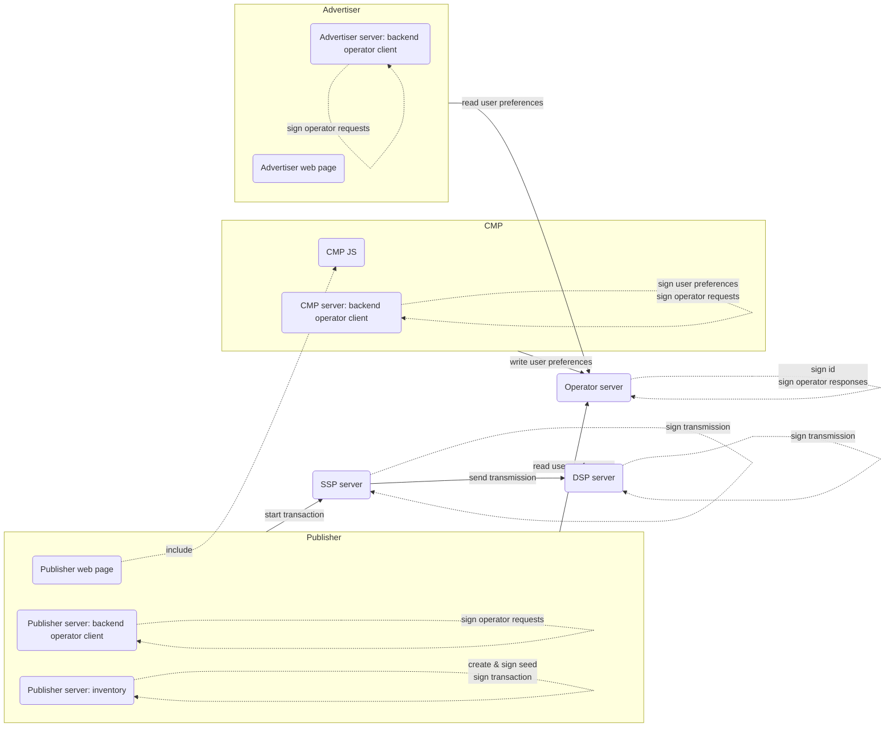

# Landscape

An overview of the different actors and their roles.

ℹ️ Reminder: any signature or encryption **cannot be done in the browser** because secret keys must remain server side.  However, in most cases they can be done through a tech-vendor provided server module separate from the web content server.

## Operator

The operator is responsible for:
- generating unique user ids
- storing these ids and their associated preferences

## Advertiser

The advertiser reads user preferences from the operator.

To do so, it needs to sign messages sent to and received from the operator.
This can only be done **server side** because a secret key is used.

So, regardless if ids and preferences are read in javascript from an `Advertiser web page`, an `Advertiser server: operator client` is needed.
This role can be played directly by the advertiser or by another module _on behalf of the advertiser_ 

## CMP (Consent Management Platform)

Usually, publishers include a CMP javascript in their web pages, to gather user consent _on their behalf_.

In Prebid SSO, the CMP is also responsible for **signing user preferences** and **writing** these preferences via the operator.

Because it requires a secret key, a `CMP server: operator client` module is needed.

Note that the CMP role can be taken by the publisher in some cases.

## Publisher

The publisher has multiple roles

1. Just like the advertiser, it needs to read id and preferences from the operator,
   so a `Publisher server: operator client` module is needed.
    1. Note that this role could be played directly by the publisher or by another module _on behalf of the publisher_ ❓for instance its CMP server module or its SSP server❓
2. The publisher is also selling inventory to contracting parties and must create and sign a "seed" object and initialize an RTB transaction sent to an SSP.
   This also requires a secret key and must be done server side via a `Publisher server: inventory` module.
    1. Note that this role could be played directly by the publisher or by another module _on behalf of the publisher_ ❓for instance its SSP server❓

## SSP (Supply Side Platform)

The SSP shares Prebid SSO Data to DSPs via Transmission Requests. Depending of the context, it can generate the Seed and emit the first Transmission of the Transaction or receive the Seed from a previous Transmission Request.

## DSP (Demand Side Platform)

DSPs receive transmissions that they must sign before they respond to the SSP
