# Operator API proposal

⚠️ To **view diagrams** in this page, you are invited to install a browser extension such as [mermaid-diagrams](https://chrome.google.com/webstore/detail/mermaid-diagrams/phfcghedmopjadpojhmmaffjmfiakfil)

## Context

Operators are contracting parties responsible for storing and controlling access to users data, in a secured way.

In this context,

- **data** means:
  - **Prebid ID** is the pseudonymous identifier _generated by an operator_ to identify a device
    - Other optional IDs will be supported in the future but are **not** part of the MVP
  - **Preferences** are user-set preferences regarding online tracking that is _captured by a CMP UI_ or a website (
    such as a publisher).
    - In the MVP, only one "preference" is supported: optin status.
- **storing** means in the form of **cookies** stored on Prebid SSO top level domain +1 (TLD+1, ex: `prebidsso.com`)
- **controlling access** means to offer ways for contracting parties to read and write this data and help them store a
  copy ("cache") of these cookies on their own domain.
- ***in a secured way*** has different meanings that are discussed below

Multiple operators will implement the same set of core features under the same TLD+1, although at this stage it is not
clear how they will co-operate.

## Example workflows

We represent two typical workflows:

- the first interaction with Prebid where a user visits a publisher's page, that triggers a CMP
- a visit to a advertiser while the user already opted in to Prebid

...in two different contexts:

- where the browser supports third party cookies (3PC)
- where it doesn't

### With 3PC

When 3d party cookies are available, all calls to read cookies can be made via Javascript to read or write data.

- When visiting a publisher and meeting Prebid SSO for the first time:
  - the publisher's page is called.
  - the publisher's backend serves the requested page, and it includes a JS library that checks for existence of
    Prebid SSO cookie
  - a JS call to the operator to "read or init" data will generate a new ID
  - the ID can be displayed in the CMP UI
  - when the user submits their preferences:
    - a JS call is made to the CMP to "prepare" the values to write (more about this, below)
    - another JS call is made to the operator to write these values (saved under Prebid SSO domain)
    - finally, these values are saved on the publisher's domain
- When a participating user visits an advertiser:
  - a JS call is made to the operator to get the Prebid SSO ID and preferences
  - the values are saved on the advertiser's domain

ℹ️ in this scenario, no full page redirect is needed


### Without 3PC

Without 3d party cookies,

- **a full page load** on Prebid SSO domain is needed to read or write cookies stored on Prebid SSO TLD+1
- **a full page load** on the website domain is needed to write cookies based on values read from Prebid SSO

So the only way to interact with Prebid SSO cookies is through  **full page "redirects"**.

- When visiting a publisher and meeting Prebid SSO for the first time:
  - the publisher's page is called. Here,  **two options are possible**:
    - either the publisher's _backend_ checks the existence of Prebid SSO cookie, and redirect the user to Prebid
      SSO operator
    - or, the publisher's backend serves the requested page, and it includes a JS library that does exactly the same
      thing
  - in both cases the browser is  **redirected**  to Prebid SSO operator to read any existing cookie or to create an
    ID if needed
  - the operator  **redirects**  back to the original page, this time with a Prebid SSO ID as part of the URL
  - the CMP is displayed
  - the ID can be displayed in the CMP UI if needed
  - when the user submits their preferences:
    - a JS call is made to the CMP to "prepare" the values to write
    - via JS, a  **redirect**  is triggered to the operator to write these values (saved under Prebid SSO domain)
    - the operator  **redirects**  back to the original page, this time with a Prebid SSO ID & preferences as part
      of the URL
    - finally, these values are saved as cookies on the publisher's domain
      - Note that this, again, can be done on the publisher's backend side or via JS
- When a participating user visits an advertiser:
  - on the advertiser backend, a  **redirect**  is triggered to the operator to get the Prebid SSO ID and preferences
  - the operator  **redirects**  back to the original page, this time with a Prebid SSO ID & preferences as part of
    the URL
  - the values are saved on the advertiser's domain



```mermaid
sequenceDiagram
participant U as user
participant B as browser
participant P as publisher P http server
participant C as CMP http server
participant A as advertiser A http server
participant O as operator node O

rect rgba(224, 224, 224, .55)
    note right of U: Time T1<br>"WRITE" scenario: user visits publisher<br>and sets their preferences for the first time

    U ->> B: visit www.publisherP.com/pageP.html
    activate U

        activate B
            B ->> P: GET /pageP.html
        deactivate B

        activate P
            P -->> B: embed CMP
        deactivate P

        activate B
            B ->> B: no Prebid SSO ID 🍪 found
            B -->> B: REDIRECT
            B ->> O: call "read or init" endpoint<br/>redirectUrl = publisherP.com/pageP.html
        deactivate B

        activate O
            note over B,O: make sure this URL cannot be "replayed" by hackers to read central cookies
            note over O: make sure<br/>CMP is authorized to read
            O ->> O: create ID
            O -->> B: REDIRECT
        deactivate O

        activate B
            B ->> P: GET /pageP.html?id=xxx
        deactivate B

        activate P
            P -->> B: embed CMP
        deactivate P

        activate B
            B ->> B: show Prebid SSO ID
            B -->> U:  
        deactivate B

    deactivate U

    U ->> B: submit preferences

    activate U

        activate B
            B ->> C: JS call to sign preferences value
            activate C
                C -->> B: url to call = ...
            deactivate C

            B -->> B: REDIRECT
            B ->> O: call "write" endpoint<br>id = xxx<br>preferences = yyy<br>redirectUrl = publisherP.com/pageP.html
        deactivate B

        activate O
            note over B,O: make sure this URL cannot be "replayed" by hackers to write central cookies
            note over O: make sure<br/>CMP is authorized to read and write
            note over O: make sure<br/>ID and preferences values can be trusted
            O ->> O: write 1P 🍪:<br/>ID & preferences
            O -->> B: REDIRECT
        deactivate O

        activate B
            B ->> P: GET /pageP.html?<br/>cookie = ID & preferences
        deactivate B

        activate P
            note over B,P: make sure this URL cannot be "replayed" by hackers<br>to write local cookies
            note over B,P: make sure ID & preferences in the URL<br/>cannot be read by hackers & challengers (browser)
            P ->> P: write 1P 🍪<br/>ID & preferences
            P -->> B: display pageP.html
        deactivate P

        B -->> U:  

    deactivate U

end

rect rgba(255, 255, 255, .55)
    note right of U: Time T2<br>"READ" scenario: user visits a "new" advertiser without CMP

    U ->> B: visit www.advertiserA.com/pageA.html
    activate U

        activate B
            B ->> A: GET /pageA.html
        deactivate B

        activate A
            A ->> A: no Prebid SSO ID 🍪 found
            A ->> A: build redirect URL
            A -->> B: REDIRECT
        deactivate A

        activate B
            B ->> O: call "read" endpoint<br/>redirectUrl = advertiserA.com/pageA.html
        deactivate B

        activate O
            note over B,O: make sure this URL cannot be "replayed" by hackers to read data
            O ->> O: read 1P 🍪
            note over O: make sure<br/>advertiserA is authorized to read
            O -->> B: REDIRECT
        deactivate O

        activate B
            B ->> A: GET /pageA.html?<br/>cookie = ID & preferences
        deactivate B

        activate A
            note over B,A: make sure this URL cannot be "replayed" by hackers to write local cookies
            note over B,A: make sure ID & preferences in the URL<br/>cannot be read by hackers & challengers (browser)
            A ->> A: write 1P 🍪
            A -->> B: display pageA.html
        deactivate A

        B -->> U: 

    deactivate U

end
```

## Endpoints

To support the previous workflows (and more), a few endpoints are needed on the operator API.

These endpoints need to support both the "3PC" and "no 3PC" contexts.

- where 3PC are available, a simple JS call is optimum
  - in this case, we favour POST calls when data is mutated (data mutation == when  **a cookie is created or updated
    on Prebid SSO TLD+1 domain**)
  - return code is HTTP 200 and return type is JSON
- where 3PC are not available, a full page redirect is required to read or write cookies on Prebid SSO TLD+1 domain
  - in this context, POST is not possible
  - return code is 302 with no content: data is part of the redirect URL

In practice, this will translate into endpoints available under different root paths. Example paths are specified in the last column of the table.

| Endpoint                               | Input*                  | Output                                                | Description                                                                                                                                        | Notes                                                                                                                                                                                                                                                                                   | Rest                                   | Redirect                    |
| -------------------------------------- | ----------------------- | ----------------------------------------------------- | -------------------------------------------------------------------------------------------------------------------------------------------------- | --------------------------------------------------------------------------------------------------------------------------------------------------------------------------------------------------------------------------------------------------------------------------------------- | -------------------------------------- | --------------------------- |
| Read data                              | -                       | List of IDs (if any).<br>List of preferences (if any) | If ID 🍪 exist, return it.<br>If preferences 🍪 exist, return them                                                                                 | -                                                                                                                                                                                                                                                                                       | GET /v1/json/read                      | GET /v1/redirect/read       |
| Read or init data                      | -                       | List of IDs.<br>List of preferences (if any)          | If ID exist, return it.<br>otherwise:<br>create a new ID and sign it.<br>do not store a cookie.<br>return ID.<br>If preferences exist, return them | Why don't we save the newly generated ID?<br>Because haven't yet received consent. It will be provided via the "Write data" endpoint ⬇️ and saved along with preferences.                                                                                                               | GET /v1/json/readOrInit                | GET /v1/redirect/readOrInit |
| Write data.<br>and return written data | main ID.<br>preferences | List of IDs.<br>List of preferences                   | Read provided ID.<br>Verify provided signatures.<br>Write ID 🍪.<br>Write preferences 🍪                                                           | ID is mandatory input for the "first visit" use case so is considered always mandatory, for consistency.<br>Data is written because it will be used for confirmation.                                                                                                                   | POST /v1/json/write                    | GET /v1/redirect/write      |
| Get new main ID                        | -                       | main ID                                               | create a new ID and sign it.<br>do not store a cookie.<br>return ID                                                                                | Cookie is not saved at this stage because we show the new value to the user before they validate it (and then it is saved, using the "Write data" endpoint ⬆️ ).<br>Since there is no cookie to read or write, no redirect version is needed, it can be made in JS with our without 3PC | GET /v1/json/newId                     | Not available               |
| Get identity                           | -                       | list of:<br>public key + start and end dates if any   | Get the operator's "key" to use it for verifying an ID signed by this operator                                                                     | This is used by websites to get the operator identity to verify signatures of preferences and id.<br>Also used by audits.                                                                                                                                                               | GET /v1/json/identity.<br>(plain text) | Not available               |

ℹ️ See below for details and examples

## Design

### SWAN

Although not implementing the exact endpoints described above, [SWAN]([swan/apis.md at main · SWAN-community/swan · GitHub](https://github.com/SWAN-community/swan/blob/main/apis.md)) provides a solution that can be used for all workflows.

Some core principles of SWAN are:

- all data is **encrypted and decrypted by the operator** (using its private key) before to be sent over the network

- clients need to do a server to server call to the access node **before each communication**
  
  - the client is authenticated via its "API key" during this preliminary handshake

- the "**access node**" is a particular node in the operator network, responsible for handling encryption and decryption for clients

- messages are using a **proprietary binary format** for transport and cookie storage, for optimization

- it is originally made to support a tree of operator nodes, under a different domain, although the solution works with a single TLD+1 domain.

The SWAN solution is very modular, based on different open source projects (OWID, SWIFT) and meant to be generic (not limited to the Prebid SSO use case).

✅ the level of security is high because all data is encrypted

✅ robust solution with existing implementations and demo

Limitations:

🟠 to support a wide variety of use cases, it has a complicated code and workflow and unnecessary S2S calls and redirects

- calls to encrypt and decrypt are systematic, even when encryption is unactivated

- scrambling of cookie paths

- the whole system is meant to support multiple nodes (notion of home node, handling of data collision, etc) which makes it overcomplicated for the single node use case

🟠 mandatory backend client

🟠 obscure to web users and regulators

🟠 complex integration and debug

ℹ️ the diagram below is based on the SWAN demo, where CMP is considered to be a dedicated web site that the user is redirected to, not an integrated widget. This counts for a few extra redirects that could probably be avoided.

```mermaid
sequenceDiagram
participant U as user
participant B as browser
participant P as publisher P http server
participant C as CMP http server
participant A as advertiser A http server
participant O as operator node O
participant AN as aperator access node AO

rect rgba(224, 224, 224, .55)
note right of U: Time T1<br>"WRITE" scenario: user visits publisher<br>and sets their preferences for the first time

    U ->> B: visit www.publisherP.com/pageP.html
    activate U

        activate B
            B ->> P: GET /pageP.html
        deactivate B

        activate P
            P ->> P: no Prebid SSO ID 🍪 found
            P ->> AN: (S2S) POST /fetch<br>APIkey=keyP<br>redirectUrl=publisherP.com/pageP.html

          activate AN
              note over AN: keyP == publisherP.com
              AN ->> AN: check publisherP.com is allowed to read
              note over AN: keyP is secret and communicated S2S.<br>ok: this is a valid request
              AN ->> AN: ENCRYPT URL<br>with operator0.prebidsso.com private key
              AN -->> P: "read prebid SSO" URL = ...
          deactivate AN

            P -->> B: REDIRECT
        deactivate P


        activate B
            B ->> O: GET /ENCRYPTED (for "read")
        deactivate B

        activate O
            O ->> O: no 🍪 found

            O ->> AN: (S2S) POST /encrypt<br>url=xxx

          activate AN
              AN ->> AN: ENCRYPT URL<br>with operator0.prebidsso.com private key
              AN -->> O: "ENCRYPTED_URL" = ...
          deactivate AN

            O -->> B: REDIRECT
        deactivate O

        activate B
            B ->> P: GET /ENCRYPTED
        deactivate B

        activate P

        P ->> AN: (S2S) POST /decrypt<br>APIkey=keyP<br>encrypted=ENCRYPTED

          activate AN
              note over AN: keyP == publisherP.com
              AN ->> AN: check publisherP.com is allowed to read
              AN ->> AN: DECRYPT data<br>with operator0.prebidsso.com private key
              AN -->> P: decrypted data = ...
          deactivate AN

            P ->> P: set 🍪 "val"
            P -->> B: REDIRECT
        deactivate P

        activate B
            B ->> P: GET /pageP.html
        deactivate B

        activate P
            P ->> P: 🍪 "val" found
            P -->> B: REDIRECT to CMP
        deactivate P

        activate B
            B ->> C: GET /cmp.html?afterCmpUrl=publisherP.com/pageP.html
        deactivate B

        activate C
            C ->> AN: (S2S) POST /fetch<br>APIkey=keyC<br>redirectUrl=cmp.com/cmp.html?afterCmpUrl=publisherP.com/pageP.html

          activate AN
              note over AN: keyC == cmp.com
              AN ->> AN: check cmp.com is allowed to read
              AN ->> AN: ENCRYPT URL<br>with operator0.prebidsso.com private key
              AN -->> C: "read prebid SSO" URL = ...
          deactivate AN

            C -->> B: REDIRECT
        deactivate C

        activate B
            B ->> O: GET /ENCRYPTED (for "read")
        deactivate B

        activate O
            O ->> O: no 🍪 found

            O ->> AN: (S2S) POST /encrypt<br>url=xxx

          activate AN
              AN ->> AN: ENCRYPT URL<br>with operator0.prebidsso.com private key
              AN -->> O: "ENCRYPTED_URL" = ...
          deactivate AN

            O -->> B: REDIRECT
        deactivate O

        activate B
            B ->> C: GET /ENCRYPTED
        deactivate B

        activate C

            C ->> AN: (S2S) POST /decryptAsJSON<br>APIkey=keyC<br>encrypted=ENCRYPTED

          activate AN
              note over AN: keyP == publisherP.com
              AN ->> AN: check publisherP.com is allowed to read
              AN ->> AN: create ID
              AN ->> AN: SIGN ID<br/>with own private key
              note over AN: ID has been signed by operatorO.prebidsso.com<br/>it can be trusted
              AN ->> AN: DECRYPT data<br>with operator0.prebidsso.com private key
              AN -->> C: decrypted data = ...
          deactivate AN

            C -->> B: display CMP
        deactivate C

        activate B
            B ->> B: JS: show id in form<br>or store in hidden input
            note over B: Note: don't write 🍪 yet, wait for user consent
            B -->> U: 
        deactivate B

    deactivate U

    U ->> B: submit preferences

    activate U
        activate B
            B ->> C: GET /cmp.html?id=xxx&preferences=yyy
        deactivate B

        activate C

            C ->> C: SIGN (preferences + id)<br/>with own private key => sign[pref & id]
            note over C: signature includes id to ensure<br>these preferences are for this user.<br>It can be trusted

            C ->> AN: (S2S) POST /update<br>APIkey=keyC<br>id=xxx&preferences=yyy&signatures=...

            activate AN
                note over AN: keyC == cmp.com
                AN ->> AN: check cmp.com is allowed to write
                AN ->> AN: VERIFY sign[id] with operatorO.prebidsso.com public key
                AN ->> AN: VERIFY sign[pref & id] with cmp.com public key
                note over AN: ok: these preferences are valid<br>and they are associated with the id
                AN ->> AN: ENCRYPT URL<br>with operator0.prebidsso.com private key
                AN -->> C: update URL = ...
            deactivate AN

            C -->> B: REDIRECT
        deactivate C

        activate B
            B ->> O: GET /ENCRYPTED (for "update")
        deactivate B

        activate O
            O ->> O: write 1P 🍪:<br/>preferences & sign[pref & id]
            note over O: preferences have been signed by cmp<br/>ID has been signed by operatorO.prebidsso.com<br/>both can be trusted
            O ->> O: ENCRYPT URL<br>with operator0.prebidsso.com private key
            O -->> B: REDIRECT
        deactivate O

        activate B
            B ->> P: GET /ENCRYPTED
        deactivate B

        activate P

            P ->> AN: (S2S) POST /decrypt<br>APIkey=keyP<br>encrypted=ENCRYPTED

            activate AN
                note over AN: keyP == publisherP.com
                AN ->> AN: check publisherP.com is allowed to read
                AN ->> AN: DECRYPT data<br>with operator0.prebidsso.com private key
                AN -->> P: decrypted data = ...
            deactivate AN

            P ->> P: write 1P 🍪:<br/>id & sign[id]<br>preferences & sign[pref & id]

            P -->> B: REDIRECT
        deactivate P

        activate B
            B ->> P: GET /pageP.html
        deactivate B

        activate P
            P -->> B: display
        deactivate P

        B -->> U: 

    deactivate U
end

rect rgba(255, 255, 255, .55)
note right of U: Time T2<br>"READ" scenario: user visits a "new" advertiser

    U ->> B: visit www.advertiserA.com/pageA.html
    activate U

        activate B
            B ->> A: GET /pageA.html
        deactivate B

        activate A
            A ->> A: no Prebid SSO ID 🍪 found
            A ->> AN: (S2S) POST /fetch<br>APIkey=keyA<br>redirectUrl=publisherP.com/pageP.html

            activate AN
                note over AN: keyA == advertiserA.com
                AN ->> AN: check advertiserA.com is allowed to read
                note over AN: keyA is secret and communicated S2S.<br>ok: this is a valid request
                AN ->> AN: ENCRYPT URL<br>with operator0.prebidsso.com private key
                AN -->> A: "read prebid SSO" URL = ...
            deactivate AN

            A -->> B: REDIRECT
        deactivate A


        activate B
            B ->> O: GET /ENCRYPTED (for "read")
        deactivate B

        activate O
            O ->> O: no 🍪 found

            O ->> AN: (S2S) POST /encrypt<br>url=xxx

            activate AN
                AN ->> AN: ENCRYPT URL<br>with operator0.prebidsso.com private key
                AN -->> O: "ENCRYPTED_URL" = ...
            deactivate AN

            O -->> B: REDIRECT
        deactivate O

        activate B
            B ->> A: GET /ENCRYPTED
        deactivate B

        activate A

            A ->> AN: (S2S) POST /decrypt<br>APIkey=keyA<br>encrypted=ENCRYPTED

            activate AN
                note over AN: keyA == advertiserA.com
                AN ->> AN: check advertiserA.com is allowed to read
                AN ->> AN: DECRYPT data<br>with operator0.prebidsso.com private key
                AN -->> A: decrypted data = ...
            deactivate AN

            A ->> A: write 1P 🍪:<br/>id & sign[id]<br>preferences & sign[pref & id]

            A -->> B: REDIRECT
        deactivate A

        activate B
            B ->> A: GET /pageP.html
        deactivate B

        activate A
            A -->> B: display
        deactivate A

        B -->> U: 

    deactivate U
end
```



### Proposed protocol

The proposed solution enforces the usage of TLS (HTTPS) for all communication to and from the operator, to prevent middle men to "spy" on data that is passed.

- data is **transfered in a human readable fashion**, even when transported as part of the query string ("redirect" scenario without 3PC). Note that when using HTTPS, query string parameters are encrypted.

- data is **stored in a human readable fashion** as cookies

- **signatures** are used to secure communications, but **not encryption**:
  
  - when **sending** a request or a response, the sender:
    
    - provides a **timestamp** and its own domain (the **domain name of the *sender***) are part of the payload
    
    - signs the whole **payload + the domain name of the *receiver*** (which is not part of the payload), using its **own private key**
  
  - when **receiving** a request or a response, the receiver:
    
    - recalls the **public key of the sender** based on the domain name that was provided as part of the payload (this can be done via a cache + regular calls to `/identity` endpoint, similar to what is done in SWAN)
    
    - **verifies** the provided **signature**, based on (the complete payload + its own domain name), using the sender's public key
      
      - ℹ️ verifying the signature is the way to authenticate the sender
    
    - (in the case of the operator) verifies the **permissions** associated with this domain name
    
    - verify the provided **timestamp** is in an acceptable time frame

This protocol:

✅ reduces the server to server (S2S) calls to a minimum, making nodes more reliable.

✅ is transparent to users and regulators (cookies and requests are human readable).

✅ data received from the operator as a full page redirect can be processed by a web server **or in the browser**, in Javascript, because no decryption is needed.

✅ protects from hackers' attempts:

- to read or write Prebid SSO data without being authenticated and authorized.

- to replay legit requests to the operator in an attempt to read or write Prebid SSO data or to websites to overwrite cookies on their domains (because of timestamp + signature).

- to replay legit URLs to overwrite cookies on *other* websites' domain (because the signature includes the receiver's domain name, it is tight to a specific receiver).

Limitations:

🟠 operator needs to keep track of (potentially numerous) clients' public keys for signature verification

🟠 data remains visible (or can be made visible) in URLs, so it can be used by web browser as part of the browsing history.

🟠 it can also appear in web server logs.


### Data

Two types of data is manipulated by the operator API:

- **Identifiers** (ID) are pseudonymous identifiers that are stored by Prebid SSO. 
  - In a near future, Prebid SSO will allow storing multiple IDs of different types, but there will always be at least one, which is the "**primary id**": the Prebid ID, **generated by an operator**.
  - For the MVP, only one id exists, the Prebid (unlogged) ID

Example:

<!-- To get this JSON example, run:
cat body-id.json | npx json body
-->

```json
{
  "version": 1,
  "type": "prebid_id",
  "value": "7435313e-caee-4889-8ad7-0acd0114ae3c",
  "source": {
    "domain": "operator0.com",
    "date": "2021-04-23T18:25:43.511Z",
    "signature": "12345_signature"
  }
}
```

- **Preferences** are user-set preferences regarding online tracking that is captured by a CMP UI or a web site (such as a publisher).
  - There can be multiple preferences objects, but for the MVP **a single boolean** will be stored.

Example:

<!-- To get this JSON example, run:
cat body-id-and-preferences.json | npx json body.preferences
-->

```json
{
  "version": 1,
  "data": {
    "opt_in": true
  },
  "source": {
    "domain": "cmpC.com",
    "date": "2021-04-23T18:25:43.511Z",
    "signature": "preferences_signature_xyz12345"
  }
}
```

While the Prebid ID is really created (randomly generated) **by an operator**, we can say that the preferences data is "*created*" **by a CMP or web site**, based on user input.

### Source

For traceability, in particular in the context of an audit, we need to be able to verify that:

- the "creator" of the data is indeed who it said it was
- the data has not been modified since it was saved
- the preferences are for a particular user and not another one

To achieve this, identifiers and preferences are always stored and transported along with their respective "**source**":

- creator domain name
- creation date
- signature

The signature is calculated as follow:

- for **each** identifier, signature of (creator domain name, creation date, version and ID value) with the creator's private key (in this case it will be **an operator**)
- for preferences, there is **one source for all preferences**:  signature of (creator domain name, creation date, version and preferences value **+ Prebid ID value**) with the creator's private key (in this case it will be **a CMP** or a website, the last to update preferences)
  - because the Prebid ID is part of the signature, the preferences message cannot be used for another user

To **verify that a signature is valid**, *anyone* can:

- read the "creator" domain name
- access the corresponding "identity" endpoint to get the creator's key
- use this key and the data to verify the signature with a standard algorithm

For more details and examples on signature, see [DSP API design](https://github.com/criteo/addressable-network-proposals/mvp-spec/dsp-api.md).

## Endpoint details - JSON

Here are some examples of the operator endpoints, assuming:
- usage of JSON format for payloads
- query strings and payloads are **not** encrypted

### GET /v1/json/read

#### Request

<!-- The query string below is generated with taking the request-advertiserA.json file, removing body, and encoding it as query string:
npx encode-query-string -nd `cat request-advertiserA.json | npx json -e 'this.body = undefined' -o json-0`
-->

```http request
GET /v1/json/read?sender=advertiserA.com&timestamp=1639057962145&signature=message_signature_xyz1234
```

#### Response: known user

<!-- Update this code block with:
cat response-operatorO.json body-id-and-preferences.json | npx json --merge
-->

```json
{
  "sender": "operatorO.com",
  "timestamp": 1639059692793,
  "signature": "message_signature_xyz1234",
  "body": {
    "preferences": {
      "version": 1,
      "data": {
        "opt_in": true
      },
      "source": {
        "domain": "cmpC.com",
        "date": "2021-04-23T18:25:43.511Z",
        "signature": "preferences_signature_xyz12345"
      }
    },
    "identifiers": [
      {
        "version": 1,
        "type": "prebid_id",
        "value": "7435313e-caee-4889-8ad7-0acd0114ae3c",
        "source": {
          "domain": "operator0.com",
          "date": "2021-04-23T18:25:43.511Z",
          "signature": "prebid_id_signature_xyz12345"
        }
      }
    ]
  }
}
```

#### Response: unknown user

<!-- Update this code block with:
cat response-operatorO.json body-id-and-preferences.json | npx json --merge -e 'this.body.preferences = {}; this.body.identifiers = []'
-->

```json
{
  "sender": "operatorO.com",
  "timestamp": 1639059692793,
  "signature": "message_signature_xyz1234",
  "body": {
    "preferences": {},
    "identifiers": []
  }
}

```

### GET /v1/json/readOrInit

#### Request

<!-- The query string below is generated with taking the request-publisherP.json file, removing body, and encoding it as query string:
npx encode-query-string -nd `cat request-publisherP.json | npx json -e 'this.body = undefined' -o json-0`
-->

```http request
GET /v1/json/readOrInit?sender=publisherP.com&timestamp=1639057962145&signature=message_signature_xyz1234
```

#### Response

Note: list of identifiers **cannot** be empty.

<!-- Update this code block with:
cat response-operatorO.json body-id-and-preferences.json | npx json --merge -e 'this.body.preferences = {}'
-->

```json
{
  "sender": "operatorO.com",
  "timestamp": 1639059692793,
  "signature": "message_signature_xyz1234",
  "body": {
    "preferences": {},
    "identifiers": [
      {
        "version": 1,
        "type": "prebid_id",
        "value": "7435313e-caee-4889-8ad7-0acd0114ae3c",
        "source": {
          "domain": "operator0.com",
          "date": "2021-04-23T18:25:43.511Z",
          "signature": "prebid_id_signature_xyz12345"
        }
      }
    ]
  }
}
```

### POST /v1/json/write

### Request

<!-- The query string below is generated with taking the request-cmpC.json file, removing body, and encoding it as query string:
npx encode-query-string -nd `cat request-cmpC.json | npx json -e 'this.body = undefined' -o json-0`
-->

```http request
POST /v1/json/write
```

Request payload:

<!-- Update this code block with just taking the body of body-id-and-preferences.json:
cat request-cmpC.json body-id-and-preferences.json | npx json --merge
-->

```json
{
  "sender": "cmpC.com",
  "timestamp": 1639057962145,
  "signature": "message_signature_xyz1234",
  "body": {
    "preferences": {
      "version": 1,
      "data": {
        "opt_in": true
      },
      "source": {
        "domain": "cmpC.com",
        "date": "2021-04-23T18:25:43.511Z",
        "signature": "preferences_signature_xyz12345"
      }
    },
    "identifiers": [
      {
        "version": 1,
        "type": "prebid_id",
        "value": "7435313e-caee-4889-8ad7-0acd0114ae3c",
        "source": {
          "domain": "operator0.com",
          "date": "2021-04-23T18:25:43.511Z",
          "signature": "prebid_id_signature_xyz12345"
        }
      }
    ]
  }
}

```

### Response

<!-- Update this code block with:
cat response-operatorO.json body-id-and-preferences.json | npx json --merge
-->

```json
{
  "sender": "operatorO.com",
  "timestamp": 1639059692793,
  "signature": "message_signature_xyz1234",
  "body": {
    "preferences": {
      "version": 1,
      "data": {
        "opt_in": true
      },
      "source": {
        "domain": "cmpC.com",
        "date": "2021-04-23T18:25:43.511Z",
        "signature": "preferences_signature_xyz12345"
      }
    },
    "identifiers": [
      {
        "version": 1,
        "type": "prebid_id",
        "value": "7435313e-caee-4889-8ad7-0acd0114ae3c",
        "source": {
          "domain": "operator0.com",
          "date": "2021-04-23T18:25:43.511Z",
          "signature": "prebid_id_signature_xyz12345"
        }
      }
    ]
  }
}
```

### GET /v1/json/newId

#### Request

<!-- The query string below is generated with taking the request-cmpC.json file, removing body, and encoding it as query string:
npx encode-query-string -nd `cat request-cmpC.json | npx json -e 'this.body = undefined' -o json-0`
-->

```http request
GET /v1/json/newId?sender=cmpC.com&timestamp=1639057962145&signature=message_signature_xyz1234
```

#### Response

<!-- Update this code block with:
cat response-operatorO.json body-id.json | npx json --merge
-->

```json
{
  "sender": "operatorO.com",
  "timestamp": 1639059692793,
  "signature": "message_signature_xyz1234",
  "body": {
    "version": 1,
    "type": "prebid_id",
    "value": "7435313e-caee-4889-8ad7-0acd0114ae3c",
    "source": {
      "domain": "operator0.com",
      "date": "2021-04-23T18:25:43.511Z",
      "signature": "12345_signature"
    }
  }
}
```

### GET /v1/redirect/read

#### Request

<!-- The query string below is generated with taking the request-advertiserA.json file, removing body, adding the redirect URL, and encoding it as query string:
npx encode-query-string -nd `cat request-advertiserA.json | npx json -e 'this.body = undefined; redirectUrl="https://advertiserA.com/pageA.html"' -o json-0`
-->

```http request
GET /v1/redirect/read?sender=advertiserA.com&timestamp=1639057962145&signature=message_signature_xyz1234&redirectUrl=https://advertiserA.com/pageA.html
```

#### Response: known user

<!-- The query string below is generated with taking the response-operatorO.json file, adding body, and encoding it as query string:
npx encode-query-string -nd `cat response-operatorO.json body-id-and-preferences.json | npx json --merge -o json-0`
-->

```shell
302 https://advertiserA.com/pageA.html?sender=operatorO.com&timestamp=1639059692793&signature=message_signature_xyz1234&body.preferences.version=1&body.preferences.data.opt_in=true&body.preferences.source.domain=cmpC.com&body.preferences.source.date=2021-04-23T18:25:43.511Z&body.preferences.source.signature=preferences_signature_xyz12345&body.identifiers[0].version=1&body.identifiers[0].type=prebid_id&body.identifiers[0].value=7435313e-caee-4889-8ad7-0acd0114ae3c&body.identifiers[0].source.domain=operator0.com&body.identifiers[0].source.date=2021-04-23T18:25:43.511Z&body.identifiers[0].source.signature=prebid_id_signature_xyz12345
```

...which corresponds to the following query string values:

<!-- To update this block, use the previous command with at the end:
| tr '&' '\n'
-->

```
sender=operatorO.com
timestamp=1639059692793
signature=message_signature_xyz1234
body.preferences.version=1
body.preferences.data.opt_in=true
body.preferences.source.domain=cmpC.com
body.preferences.source.date=2021-04-23T18:25:43.511Z
body.preferences.source.signature=preferences_signature_xyz12345
body.identifiers[0].version=1
body.identifiers[0].type=prebid_id
body.identifiers[0].value=7435313e-caee-4889-8ad7-0acd0114ae3c
body.identifiers[0].source.domain=operator0.com
body.identifiers[0].source.date=2021-04-23T18:25:43.511Z
body.identifiers[0].source.signature=prebid_id_signature_xyz12345
```

#### Response: unknown user

<!-- The query string below is generated with taking the response-operatorO.json file, editing body, and encoding it as query string:
npx encode-query-string -nd `cat response-operatorO.json body-id-and-preferences.json | npx json --merge -e 'this.body.preferences = {}; this.body.identifiers = []' -o json-0`
-->

```shell
302 https://advertiserA.com/pageA.html?sender=operatorO.com&timestamp=1639059692793&signature=message_signature_xyz1234
```

### GET /v1/redirect/readOrInit

#### Request

<!-- The query string below is generated with taking the request-publisherP.json file, removing body, adding the redirect URL, and encoding it as query string:
npx encode-query-string -nd `cat request-publisherP.json | npx json -e 'this.body = undefined; this.redirectUrl="https://publisherP.com/pageP.html"' -o json-0`
-->

```http request
GET /v1/redirect/readOrInit?sender=publisherP.com&timestamp=1639057962145&signature=message_signature_xyz1234&redirectUrl=https://publisherP.com/pageP.html
```

#### Response

Note: list of identifiers **cannot** be empty.

<!-- The query string below is generated with taking the response-operatorO.json file, adding body, removing preferences, and encoding it as query string:
npx encode-query-string -nd `cat response-operatorO.json body-id-and-preferences.json | npx json --merge -e 'this.body.preferences = {}' -o json-0`
-->

```shell
302 https://publisherP.com/pageP.html?sender=operatorO.com&timestamp=1639059692793&signature=message_signature_xyz1234&body.identifiers[0].version=1&body.identifiers[0].type=prebid_id&body.identifiers[0].value=7435313e-caee-4889-8ad7-0acd0114ae3c&body.identifiers[0].source.domain=operator0.com&body.identifiers[0].source.date=2021-04-23T18:25:43.511Z&body.identifiers[0].source.signature=prebid_id_signature_xyz12345
```

...which corresponds to the following query string values:

<!-- To update this block, use the previous command with at the end:
| tr '&' '\n'
-->

```
sender=operatorO.com
timestamp=1639059692793
signature=message_signature_xyz1234
body.identifiers[0].version=1
body.identifiers[0].type=prebid_id
body.identifiers[0].value=7435313e-caee-4889-8ad7-0acd0114ae3c
body.identifiers[0].source.domain=operator0.com
body.identifiers[0].source.date=2021-04-23T18:25:43.511Z
body.identifiers[0].source.signature=prebid_id_signature_xyz12345
```

### GET /v1/redirect/write

### Request

<!-- The query string below is generated with taking the request-cmpC.json file, adding body, and encoding it as query string:
npx encode-query-string -nd `cat request-cmpC.json body-id-and-preferences.json | npx json --merge -e 'this.redirectUrl="https://publisherP.com/pageP.html"' -o json-0`
-->

```http request
GET /v1/redirect/write?sender=cmpC.com&timestamp=1639057962145&signature=message_signature_xyz1234&body.preferences.version=1&body.preferences.data.opt_in=true&body.preferences.source.domain=cmpC.com&body.preferences.source.date=2021-04-23T18:25:43.511Z&body.preferences.source.signature=preferences_signature_xyz12345&body.identifiers[0].version=1&body.identifiers[0].type=prebid_id&body.identifiers[0].value=7435313e-caee-4889-8ad7-0acd0114ae3c&body.identifiers[0].source.domain=operator0.com&body.identifiers[0].source.date=2021-04-23T18:25:43.511Z&body.identifiers[0].source.signature=prebid_id_signature_xyz12345&redirectUrl=https://publisherP.com/pageP.html
```

...which corresponds to the following query string values:

<!-- To update this block, use the previous command with at the end:
| tr '&' '\n'
-->

```
sender=cmpC.com
timestamp=1639057962145
signature=message_signature_xyz1234
body.preferences.version=1
body.preferences.data.opt_in=true
body.preferences.source.domain=cmpC.com
body.preferences.source.date=2021-04-23T18:25:43.511Z
body.preferences.source.signature=preferences_signature_xyz12345
body.identifiers[0].version=1
body.identifiers[0].type=prebid_id
body.identifiers[0].value=7435313e-caee-4889-8ad7-0acd0114ae3c
body.identifiers[0].source.domain=operator0.com
body.identifiers[0].source.date=2021-04-23T18:25:43.511Z
body.identifiers[0].source.signature=prebid_id_signature_xyz12345
redirectUrl=https://publisherP.com/pageP.html
```

### Response

<!-- The query string below is generated with taking the response-operatorO.json file, adding body, and encoding it as query string:
npx encode-query-string -nd `cat response-operatorO.json body-id-and-preferences.json | npx json --merge -o json-0`
-->

```shell
302 https://publisherP.com/pageP.html?sender=operatorO.com&timestamp=1639059692793&signature=message_signature_xyz1234&body.preferences.version=1&body.preferences.data.opt_in=true&body.preferences.source.domain=cmpC.com&body.preferences.source.date=2021-04-23T18:25:43.511Z&body.preferences.source.signature=preferences_signature_xyz12345&body.identifiers[0].version=1&body.identifiers[0].type=prebid_id&body.identifiers[0].value=7435313e-caee-4889-8ad7-0acd0114ae3c&body.identifiers[0].source.domain=operator0.com&body.identifiers[0].source.date=2021-04-23T18:25:43.511Z&body.identifiers[0].source.signature=prebid_id_signature_xyz12345
```

...which corresponds to the following query string values:

<!-- To update this block, use the previous command with at the end:
| tr '&' '\n'
-->

```
sender=operatorO.com
timestamp=1639059692793
signature=message_signature_xyz1234
body.preferences.version=1
body.preferences.data.opt_in=true
body.preferences.source.domain=cmpC.com
body.preferences.source.date=2021-04-23T18:25:43.511Z
body.preferences.source.signature=preferences_signature_xyz12345
body.identifiers[0].version=1
body.identifiers[0].type=prebid_id
body.identifiers[0].value=7435313e-caee-4889-8ad7-0acd0114ae3c
body.identifiers[0].source.domain=operator0.com
body.identifiers[0].source.date=2021-04-23T18:25:43.511Z
body.identifiers[0].source.signature=prebid_id_signature_xyz12345
```

### GET /v1/redirect/newId

#### Request

<!-- The query string below is generated with taking the request-cmpC.json file, removing body, adding redirect URL and encoding it as query string:
npx encode-query-string -nd `cat request-cmpC.json | npx json -e 'this.body = undefined; this.redirectUrl="https://publisherP.com/pageP.html"' -o json-0`
-->

```http request
GET /v1/redirect/newId?sender=cmpC.com&timestamp=1639057962145&signature=message_signature_xyz1234&redirectUrl=https://publisherP.com/pageP.html
```

#### Response

<!-- The query string below is generated with taking the response-operatorO.json file, adding body, and encoding it as query string:
npx encode-query-string -nd `cat response-operatorO.json body-id.json | npx json --merge -o json-0`
-->

```shell
302 https://publisherP.com/pageP.html?sender=operatorO.com&timestamp=1639059692793&signature=message_signature_xyz1234&body.version=1&body.type=prebid_id&body.value=7435313e-caee-4889-8ad7-0acd0114ae3c&body.source.domain=operator0.com&body.source.date=2021-04-23T18:25:43.511Z&body.source.signature=12345_signature
```

...which corresponds to the following query string values:

<!-- To update this block, use the previous command with at the end:
| tr '&' '\n'
-->

```
sender=operatorO.com
timestamp=1639059692793
signature=message_signature_xyz1234
body.version=1
body.type=prebid_id
body.value=7435313e-caee-4889-8ad7-0acd0114ae3c
body.source.domain=operator0.com
body.source.date=2021-04-23T18:25:43.511Z
body.source.signature=12345_signature
```

### GET /v1/identity

#### Request

```http request
GET /v1/identity
```

#### Response

<!-- Update this code block with the content of identity.json
-->

```json
{
  "name": "Operator O",
  "type": "vendor",
  "keys": [
    {
      "key": "04f3b7ec9095779b119cc6d30a21a6a3920c5e710d13ea8438727b7fd5cca47d048f020539d24e74b049a418ac68c03ea75c66982eef7fdc60d8fb2c7707df3dcd",
      "start": "2021-01-01T00:00:00+00:00",
      "end": "2021-02-01T00:00:00+00:00"
    },
    {
      "key": "044782dd8b7a6b8affa0f6cd94ede3682e85307224064f39db20e8f49b5f415d83fef66f3818ee549b04e443efa63c2d7f1fe9a631dc05c9f51ad98139b202f9f3",
      "start": "2021-02-01T00:00:00+00:00",
      "end": "2021-03-01T09:01:00+00:00"
    }
  ]
}
```

## Message signature

All messages (requests or responses, except for `/identity` endpoint) **are signed** before to be sent.

The signature of messages happens as follows:

1. Build the complete message as a JSON object: `sender`, `timestamp`, `redirectUrl` (if any) and `body`.
2. Add a `receiver` element to this JSON object and set it to **the domain name of the recipient of the message**.
3. Recursively alphabetically **sort all keys** of the JSON object.
4. Encode it **as a query string**
5. Sign it with the sender's private key, using ECDSA NIST P-256

### Examples

#### Request from cmpC.com to operatorO.prebidsso.com, on a call to `write`

When calling `write`, the message will be different if calling the `/JSON` or `/redirect` version,
because in the later case, a `redirectUrl` parameter is provided and must be part of the signature.

##### POST /v1/json/write

<details>
  <summary>Click to see the step by step example</summary>

1. Take request object as JSON.
In this case it means the POST body JSON object, except the `signature` field (of course).
<!-- 
cat request-cmpC.json body-id-and-preferences.json | npx json --merge -e 'this.signature = undefined'
-->

```json
{
  "sender": "cmpC.com",
  "timestamp": 1639057962145,
  "body": {
    "preferences": {
      "version": 1,
      "data": {
        "opt_in": true
      },
      "source": {
        "domain": "cmpC.com",
        "date": "2021-04-23T18:25:43.511Z",
        "signature": "preferences_signature_xyz12345"
      }
    },
    "identifiers": [
      {
        "version": 1,
        "type": "prebid_id",
        "value": "7435313e-caee-4889-8ad7-0acd0114ae3c",
        "source": {
          "domain": "operator0.com",
          "date": "2021-04-23T18:25:43.511Z",
          "signature": "prebid_id_signature_xyz12345"
        }
      }
    ]
  }
}
```
2. add `receiver`
<!-- 
cat request-cmpC.json body-id-and-preferences.json | npx json --merge -e 'this.signature = undefined; this.receiver="operatorO.prebidsso.com"'
-->
```json
{
  "sender": "cmpC.com",
  "timestamp": 1639057962145,
  "body": {
    "preferences": {
      "version": 1,
      "data": {
        "opt_in": true
      },
      "source": {
        "domain": "cmpC.com",
        "date": "2021-04-23T18:25:43.511Z",
        "signature": "preferences_signature_xyz12345"
      }
    },
    "identifiers": [
      {
        "version": 1,
        "type": "prebid_id",
        "value": "7435313e-caee-4889-8ad7-0acd0114ae3c",
        "source": {
          "domain": "operator0.com",
          "date": "2021-04-23T18:25:43.511Z",
          "signature": "prebid_id_signature_xyz12345"
        }
      }
    ]
  },
  "receiver": "operatorO.prebidsso.com"
}
```
3. recursive sort
<!--
cat request-cmpC.json body-id-and-preferences.json | npx json --merge -e 'this.signature = undefined; this.receiver="operatorO.prebidsso.com"' > .tmp.json;
npx jsonsort .tmp.json;
cat .tmp.json && rm .tmp.json;

-->
```json
{
  "body": {
    "identifiers": [
      {
        "source": {
          "date": "2021-04-23T18:25:43.511Z",
          "domain": "operator0.com",
          "signature": "prebid_id_signature_xyz12345"
        },
        "type": "prebid_id",
        "value": "7435313e-caee-4889-8ad7-0acd0114ae3c",
        "version": 1
      }
    ],
    "preferences": {
      "data": {
        "opt_in": true
      },
      "source": {
        "date": "2021-04-23T18:25:43.511Z",
        "domain": "cmpC.com",
        "signature": "preferences_signature_xyz12345"
      },
      "version": 1
    }
  },
  "receiver": "operatorO.prebidsso.com",
  "sender": "cmpC.com",
  "timestamp": 1639057962145
}
```
4. encode as query string
<!--
cat request-cmpC.json body-id-and-preferences.json | npx json --merge -e 'this.signature = undefined; this.receiver="operatorO.prebidsso.com"' > .tmp.json;
npx jsonsort .tmp.json;
npx encode-query-string -nd `cat .tmp.json | npx json -o json-0` && rm .tmp.json;

-->
```
body.identifiers[0].source.date=2021-04-23T18:25:43.511Z&body.identifiers[0].source.domain=operator0.com&body.identifiers[0].source.signature=prebid_id_signature_xyz12345&body.identifiers[0].type=prebid_id&body.identifiers[0].value=7435313e-caee-4889-8ad7-0acd0114ae3c&body.identifiers[0].version=1&body.preferences.data.opt_in=true&body.preferences.source.date=2021-04-23T18:25:43.511Z&body.preferences.source.domain=cmpC.com&body.preferences.source.signature=preferences_signature_xyz12345&body.preferences.version=1&receiver=operatorO.prebidsso.com&sender=cmpC.com&timestamp=1639057962145
```

5. sign.
<!--
- Visit https://kjur.github.io/jsrsasign/sample/sample-ecdsa.html
- Generate keys
- copy the content from previous step into the "Message to be signed" field
- copy paste both the key and the signed value here

-->
Assuming the operator's private key is:
```
f74810bc6b5ffe53a2b18e94fdb9426ddea4fc674648cca1869b0b8e13cc6060
```
then the end value, to be used as `signature` field, is:
```
3045022100820853799948174fc35d7dff368275313a733bc1699b979d138bba3305688296022075b80651c1b7a66e4164958dd80c751061121238fce02093202b5002ff6372a3
```

</details>

##### GET /v1/redirect/write

<details>
  <summary>Click to see the step by step example</summary>

1. Build request object as JSON.
   Notice that compared to the `/json` version, the additional `redirectUrl` is present.
2. 
<!-- 
cat request-cmpC.json body-id-and-preferences.json | npx json --merge -e 'this.signature = undefined; this.redirectUrl="https://publisherP.com/pageP.html"'
-->

```json
{
  "sender": "cmpC.com",
  "timestamp": 1639057962145,
  "body": {
    "preferences": {
      "version": 1,
      "data": {
        "opt_in": true
      },
      "source": {
        "domain": "cmpC.com",
        "date": "2021-04-23T18:25:43.511Z",
        "signature": "preferences_signature_xyz12345"
      }
    },
    "identifiers": [
      {
        "version": 1,
        "type": "prebid_id",
        "value": "7435313e-caee-4889-8ad7-0acd0114ae3c",
        "source": {
          "domain": "operator0.com",
          "date": "2021-04-23T18:25:43.511Z",
          "signature": "prebid_id_signature_xyz12345"
        }
      }
    ]
  },
  "redirectUrl": "https://publisherP.com/pageP.html"
}
```
2. add `receiver`
<!-- 
cat request-cmpC.json body-id-and-preferences.json | npx json --merge -e 'this.signature = undefined; this.receiver="operatorO.prebidsso.com"; this.redirectUrl="https://publisherP.com/pageP.html"'
-->
```json
{
  "sender": "cmpC.com",
  "timestamp": 1639057962145,
  "body": {
    "preferences": {
      "version": 1,
      "data": {
        "opt_in": true
      },
      "source": {
        "domain": "cmpC.com",
        "date": "2021-04-23T18:25:43.511Z",
        "signature": "preferences_signature_xyz12345"
      }
    },
    "identifiers": [
      {
        "version": 1,
        "type": "prebid_id",
        "value": "7435313e-caee-4889-8ad7-0acd0114ae3c",
        "source": {
          "domain": "operator0.com",
          "date": "2021-04-23T18:25:43.511Z",
          "signature": "prebid_id_signature_xyz12345"
        }
      }
    ]
  },
  "receiver": "operatorO.prebidsso.com",
  "redirectUrl": "https://publisherP.com/pageP.html"
}
```
3. recursive sort
<!--
cat request-cmpC.json body-id-and-preferences.json | npx json --merge -e 'this.signature = undefined; this.receiver="operatorO.prebidsso.com"; this.redirectUrl="https://publisherP.com/pageP.html"' > .tmp.json;
npx jsonsort .tmp.json;
cat .tmp.json && rm .tmp.json;

-->
```json
{
  "body": {
    "identifiers": [
      {
        "source": {
          "date": "2021-04-23T18:25:43.511Z",
          "domain": "operator0.com",
          "signature": "prebid_id_signature_xyz12345"
        },
        "type": "prebid_id",
        "value": "7435313e-caee-4889-8ad7-0acd0114ae3c",
        "version": 1
      }
    ],
    "preferences": {
      "data": {
        "opt_in": true
      },
      "source": {
        "date": "2021-04-23T18:25:43.511Z",
        "domain": "cmpC.com",
        "signature": "preferences_signature_xyz12345"
      },
      "version": 1
    }
  },
  "receiver": "operatorO.prebidsso.com",
  "redirectUrl": "https://publisherP.com/pageP.html",
  "sender": "cmpC.com",
  "timestamp": 1639057962145
}
```
4. encode as query string
<!--
cat request-cmpC.json body-id-and-preferences.json | npx json --merge -e 'this.signature = undefined; this.receiver="operatorO.prebidsso.com"; this.redirectUrl="https://publisherP.com/pageP.html"' > .tmp.json;
npx jsonsort .tmp.json;
npx encode-query-string -nd `cat .tmp.json | npx json -o json-0` && rm .tmp.json;

-->
```
body.identifiers[0].source.date=2021-04-23T18:25:43.511Z&body.identifiers[0].source.domain=operator0.com&body.identifiers[0].source.signature=prebid_id_signature_xyz12345&body.identifiers[0].type=prebid_id&body.identifiers[0].value=7435313e-caee-4889-8ad7-0acd0114ae3c&body.identifiers[0].version=1&body.preferences.data.opt_in=true&body.preferences.source.date=2021-04-23T18:25:43.511Z&body.preferences.source.domain=cmpC.com&body.preferences.source.signature=preferences_signature_xyz12345&body.preferences.version=1&receiver=operatorO.prebidsso.com&redirectUrl=https://publisherP.com/pageP.html&sender=cmpC.com&timestamp=1639057962145
```


5. sign.
<!--
- Visit https://kjur.github.io/jsrsasign/sample/sample-ecdsa.html
- Generate keys
- copy the content from previous step into the "Message to be signed" field
- copy paste both the key and the signed value here

-->
Assuming the operator's private key is:
```
f74810bc6b5ffe53a2b18e94fdb9426ddea4fc674648cca1869b0b8e13cc6060
```
then the end value, to be used as `signature` field, is:
```
30460221009224c93236a50b669e0777f65721d5bfbcc393be7ed6f3acded2fd7088b0f1c2022100ff14f97e67345d80198164da47c28e1b2b9a6a795c334c3754dad756a693e040
```

</details>

#### Response from operatorO.prebidsso.com to publisherP.com, on a call to `newId`

Regardless if it's a `GET /v1/redirect/newId` or `GET /v1/json/newId`, the process is the same:

<details>
  <summary>Click to see the step by step example</summary>

1. Build response object as JSON
<!-- 
cat response-operatorO.json body-id.json | npx json --merge -e "this.signature = undefined"
-->

```json
{
  "sender": "operatorO.com",
  "timestamp": 1639059692793,
  "signature": "message_signature_xyz1234",
  "body": {
    "version": 1,
    "type": "prebid_id",
    "value": "7435313e-caee-4889-8ad7-0acd0114ae3c",
    "source": {
      "domain": "operator0.com",
      "date": "2021-04-23T18:25:43.511Z",
      "signature": "12345_signature"
    }
  }
}
```
2. add `receiver`
<!-- 
cat response-operatorO.json body-id.json | npx json --merge -e 'this.signature = undefined; this.receiver="publisherP.com"'
-->
```json
{
  "sender": "operatorO.com",
  "timestamp": 1639059692793,
  "body": {
    "version": 1,
    "type": "prebid_id",
    "value": "7435313e-caee-4889-8ad7-0acd0114ae3c",
    "source": {
      "domain": "operator0.com",
      "date": "2021-04-23T18:25:43.511Z",
      "signature": "12345_signature"
    }
  },
  "receiver": "publisherP.com"
}
```
3. recursive sort
<!--
cat response-operatorO.json body-id.json | npx json --merge -e 'this.signature = undefined; this.receiver="publisherP.com"' > .tmp.json;
npx jsonsort .tmp.json;
cat .tmp.json && rm .tmp.json;

-->
```json
{
  "body": {
    "source": {
      "date": "2021-04-23T18:25:43.511Z",
      "domain": "operator0.com",
      "signature": "12345_signature"
    },
    "type": "prebid_id",
    "value": "7435313e-caee-4889-8ad7-0acd0114ae3c",
    "version": 1
  },
  "receiver": "publisherP.com",
  "sender": "operatorO.com",
  "timestamp": 1639059692793
}
```
4. encode as query string
<!--
cat response-operatorO.json body-id.json | npx json --merge -e 'this.signature = undefined; this.receiver="publisherP.com"' > .tmp.json;
npx jsonsort .tmp.json;
npx encode-query-string -nd `cat .tmp.json | npx json -o json-0` && rm .tmp.json;

-->
```
body.source.date=2021-04-23T18:25:43.511Z&body.source.domain=operator0.com&body.source.signature=12345_signature&body.type=prebid_id&body.value=7435313e-caee-4889-8ad7-0acd0114ae3c&body.version=1&receiver=publisherP.com&sender=operatorO.com&timestamp=1639059692793
```

5. sign.
<!--
- Visit https://kjur.github.io/jsrsasign/sample/sample-ecdsa.html
- Generate keys
- copy the content from previous step into the "Message to be signed" field
- copy paste both the key and the signed value here

-->
Assuming the operator's private key is:
```
f74810bc6b5ffe53a2b18e94fdb9426ddea4fc674648cca1869b0b8e13cc6060
```
then the end value, to be used as `signature` field, is:
```
304602210087657703efe0d084d32bb2ec03bfe36022797fd86f4737b4a399d4f95bd3855f022100d92d5f1e00ac8909b9639cf18969cadc0d1b4c196a8718fbe4bad1b390abd1ca
```
</details>
