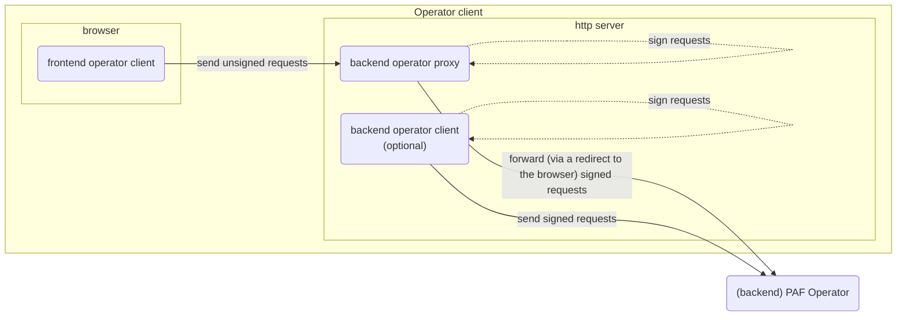
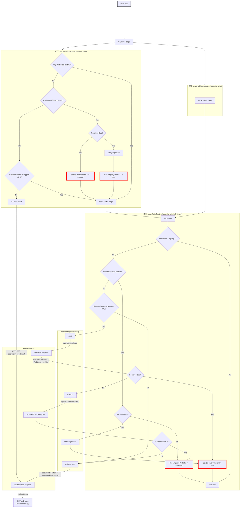

# Operator client

## Operator client: frontend, proxy and backend

An operator client is an actor that needs to interact with a PAF operator, to either:

- read user ids and preferences
- write user preferences
- or both

Ids and preferences are stored as **1st party cookies on the PAF top level +1 domain** (aka TLD+1).

Operator clients are **websites** that need to get access to this data. As a reminder, the content of these websites
is _served by a http server_ and it can then use Javascript _in the browser_.

- PAF provides a "**frontend operator client**" in the form of a Javascript library, to call the operator on REST or "
  redirect" endpoints (see [operator-api.md](operator-api.md) for details).
    - But only **signed** requests can be sent to the operator and these requests are signed using a **private key**,
      which must never be sent to the browser.

- Thus, PAF also provides a "**backend operator proxy**" which the frontend operator client uses to sign the requests on
  its behalf.
    - this proxy can be hosted by the website's owner or by a tech vendor

- Finally, clients of the PAF operators can use an optional "**backend operator client**" that will sign requests and
  redirect to the operator if needed.
    - this is part of the website's http server
    - this can be interesting to trigger HTTP redirects before any web page is served



## Backend operator proxy

The "backend operator **proxy**", owned by any operator client (publisher, advertiser) and hosted by them or by a tech
vendor, is an API called by the frontend operator client to sign and verify requests sent and received to / from the
operator.

As the name suggests, it is a proxy that transforms unsigned requests into signed ones.

To do so, it exposes:

- all [the (REST and redirect) endpoints that the **operator** exposes](operator-api.md), except "Verify 3PC support"
  and "Get identity"
- a couple of extra endpoints to help sign and verify messages

| Endpoint                  | Description                                                                                            | Input                                                                                      | Output                                                           | REST                            | Redirect                                    |
|---------------------------|--------------------------------------------------------------------------------------------------------|--------------------------------------------------------------------------------------------|------------------------------------------------------------------|---------------------------------|---------------------------------------------|
| Read ids & preferences    | Create a sign request and redirect to [read](operator-api.md#read-ids-&-preferences) operator endpoint | -                                                                                          | redirect to operator                                             | `GET /paf-proxy/v1/ids-prefs`   | `GET /paf-proxy/v1/redirect/get-ids-prefs`  |
| **Sign** user preferences | Sign preferences                                                                                       | Signed ids and **unsigned** preferences                                                    | Signed ids and preferences                                       | `POST /paf-proxy/v1/sign/prefs` | N/A                                         |
| **Sign** "write" request  | Sign a "write" request so it can be sent to the operator                                               | **Unsigned** "write" message                                                               | Signed "write" request                                           | `POST /paf-proxy/v1/sign/write` | N/A                                         |
| Write ids & prefs         | Redirect to [write](operator-api.md#write-ids-&-preferences) operator endpoint                         | Signed "write" request<br>(see [operator API](operator-api.md#write-ids-&-preferences))    | redirect to operator                                             | `POST /paf-proxy/v1/ids-prefs`  | `GET /paf-proxy/v1/redirect/post-ids-prefs` |
| **Verify** read           | Verify the response received from the operator                                                         | Signed "read" **response**<br>(see [operator API](operator-api.md#read-ids-&-preferences)) | Same as input if verification succeeded, error message otherwise | `POST /paf-proxy/verify/read`   | N/A                                         |

ℹ️ An example implementation (for NodeJS) of a backend operator proxy is available in [the implementation project](https://github.com/criteo/paf-mvp-implementation/tree/main/paf-mvp-operator-client-express)

⚠️ Note that in the following examples, the operator proxy is supposed to be hosted on the `cmp.com` domain.

### Read ids & preferences

#### REST read: `GET /paf-proxy/v1/ids-prefs`

| Message                                   | Format                                                           |
|-------------------------------------------|------------------------------------------------------------------|
| Request                                   | nothing                                                          |
| Response after a redirect to the operator | See [operator-api.md](operator-api.md#rest-read-get-v1ids-prefs) |


#### Redirect read: `GET /paf-proxy/v1/redirect/get-ids-prefs`

| Message                                   | Format                                                                           |
|-------------------------------------------|----------------------------------------------------------------------------------|
| Request                                   | nothing                                                                          |
| Response after a redirect to the operator | See [operator-api.md](operator-api.md#redirect-read-get-v1redirectget-ids-prefs) |

### Sign user preferences

- sign the preferences and ids

#### REST sign user preferences: `POST /paf-proxy/v1/sign/prefs`

| Message  | Format                                                                    |
|----------|---------------------------------------------------------------------------|
| Request  | [post-sign-preferences-request](./model/post-sign-preferences-request.md) |
| Response | [preferences](model/preferences.md)                                       |

<details>
<summary>Full example</summary>

- the following request is built:

<!--partial-begin { "files": [ "signPreferences.json" ], "block": "json" } -->
<!-- ⚠️ GENERATED CONTENT - DO NOT MODIFY DIRECTLY ⚠️ -->
```json
{
  "identifiers": [
    {
      "version": "0.1",
      "type": "paf_browser_id",
      "value": "7435313e-caee-4889-8ad7-0acd0114ae3c",
      "source": {
        "domain": "operator.paf-operation-domain.io",
        "timestamp": 1642504380,
        "signature": "B/fOZumQHzzkQtSjYnzLOIJA2GQpoP5bWwzFQCMiQ/Mlvu6itJ1hbRVJkq8+yElu7NxMzojVMNdrc1mD7SJ0SQ=="
      }
    }
  ],
  "unsignedPreferences": {
    "version": "0.1",
    "data": {
      "use_browsing_for_personalization": true
    }
  }
}
```
<!--partial-end-->

- and is used as the **POST payload** to the following call:

<!--partial-begin { "files": [ "signPreferences.http" ], "block": "http" } -->
<!-- ⚠️ GENERATED CONTENT - DO NOT MODIFY DIRECTLY ⚠️ -->
```http
POST /paf-proxy/v1/sign/prefs
Host: cmp.com
```
<!--partial-end-->

- response

<!--partial-begin { "files": [ "preferences.json" ], "block": "json" } -->
<!-- ⚠️ GENERATED CONTENT - DO NOT MODIFY DIRECTLY ⚠️ -->
```json
{
  "version": "0.1",
  "data": {
    "use_browsing_for_personalization": true
  },
  "source": {
    "domain": "cmp.com",
    "timestamp": 1642504560,
    "signature": "QE/7TpxT5nDZH0VO2WcJLdO09IBgZ0gtTKqvQY2Ck8Afy/diGmFN71SV6KjkdAItXH3rCM97oLMewTyAccxq+w=="
  }
}
```
<!--partial-end-->

ℹ️ Notice the new `source` property, that includes a signature based on both the identifiers and the preferences data.

</details>

### Sign "write" request

- take an unsigned request to "write" data, and sign it so that it can be sent to the operator

#### REST sign "write" request: `POST /paf-proxy/v1/sign/write`

| Message  | Format                                                    |
|----------|-----------------------------------------------------------|
| Request  | [ids-and-preferences](model/ids-and-preferences.md)       |
| Response | [post-ids-prefs-request](model/post-ids-prefs-request.md) |

<details>
<summary>Full example</summary>

- the following request is built:

<!--partial-begin { "files": [ "signPostIdsPrefs.json" ], "block": "json" } -->
<!-- ⚠️ GENERATED CONTENT - DO NOT MODIFY DIRECTLY ⚠️ -->
```json
{
  "identifiers": [
    {
      "version": "0.1",
      "type": "paf_browser_id",
      "value": "7435313e-caee-4889-8ad7-0acd0114ae3c",
      "source": {
        "domain": "operator.paf-operation-domain.io",
        "timestamp": 1642504380,
        "signature": "B/fOZumQHzzkQtSjYnzLOIJA2GQpoP5bWwzFQCMiQ/Mlvu6itJ1hbRVJkq8+yElu7NxMzojVMNdrc1mD7SJ0SQ=="
      }
    }
  ],
  "preferences": {
    "version": "0.1",
    "data": {
      "use_browsing_for_personalization": true
    },
    "source": {
      "domain": "cmp.com",
      "timestamp": 1642504560,
      "signature": "QE/7TpxT5nDZH0VO2WcJLdO09IBgZ0gtTKqvQY2Ck8Afy/diGmFN71SV6KjkdAItXH3rCM97oLMewTyAccxq+w=="
    }
  }
}
```
<!--partial-end-->

- and is used as the **POST payload** to the following call:

<!--partial-begin { "files": [ "signPostIdsPrefs.http" ], "block": "http" } -->
<!-- ⚠️ GENERATED CONTENT - DO NOT MODIFY DIRECTLY ⚠️ -->
```http
POST /paf-proxy/v1/sign/write
Host: cmp.com
```
<!--partial-end-->

- response

<!--partial-begin { "files": [ "postIdsPrefsRequest.json" ], "block": "json" } -->
<!-- ⚠️ GENERATED CONTENT - DO NOT MODIFY DIRECTLY ⚠️ -->
```json
{
  "body": {
    "identifiers": [
      {
        "version": "0.1",
        "type": "paf_browser_id",
        "value": "7435313e-caee-4889-8ad7-0acd0114ae3c",
        "source": {
          "domain": "operator.paf-operation-domain.io",
          "timestamp": 1642504380,
          "signature": "B/fOZumQHzzkQtSjYnzLOIJA2GQpoP5bWwzFQCMiQ/Mlvu6itJ1hbRVJkq8+yElu7NxMzojVMNdrc1mD7SJ0SQ=="
        }
      }
    ],
    "preferences": {
      "version": "0.1",
      "data": {
        "use_browsing_for_personalization": true
      },
      "source": {
        "domain": "cmp.com",
        "timestamp": 1642504560,
        "signature": "QE/7TpxT5nDZH0VO2WcJLdO09IBgZ0gtTKqvQY2Ck8Afy/diGmFN71SV6KjkdAItXH3rCM97oLMewTyAccxq+w=="
      }
    }
  },
  "sender": "cmp.com",
  "receiver": "operator.paf-operation-domain.io",
  "timestamp": 1643097660,
  "signature": "uVJjcDT8XRO7Ct5RXXJMIRG+zKDbCzJPXcQtstwBpAn0xt/xwFCSZBTZdqKjKaF3WkDJj/ypYeqBYFb4amj+bw=="
}
```
<!--partial-end-->

ℹ️ Notice the new `sender`, `receiver`, `timestamp` and `signature` properties

</details>

### Write ids & preferences

#### REST write: `POST /paf-proxy/v1/ids-prefs`

| Message                                   | Format                                                             |
|-------------------------------------------|--------------------------------------------------------------------|
| Request                                   | See [operator-api.md](operator-api.md#rest-write-post-v1ids-prefs) |
| Response after a redirect to the operator | See [operator-api.md](operator-api.md#rest-write-post-v1ids-prefs) |


#### Redirect write: `GET /paf-proxy/v1/redirect/post-ids-prefs`

| Message                                   | Format                                                                             |
|-------------------------------------------|------------------------------------------------------------------------------------|
| Request                                   | See [operator-api.md](operator-api.md#redirect-write-get-v1redirectpost-ids-prefs) |
| Response after a redirect to the operator | See [operator-api.md](operator-api.md#redirect-write-get-v1redirectpost-ids-prefs) |

### Verify "read" response

- take a read response message received from the operator, and verify it

The data received by a website as part of a query string, after a "boomerang" redirect to the operator must be verified
because a malicious actor could have called the website's URL with query string data that does not originate from the operator,
or that was meant to be sent to another website.

To verify a response message from the operator, this endpoint will make sure that:
- the signature of the response is verified with the sender (the operator) public key
- the operator domain should be the expected one
- the receiver domain should be the one from the current client
- the timestamp is compared to the current date and should not be out of the allowed window

Only when these four checks have successfully passed, the request is considered legit.


#### REST sign user preferences: `POST /paf-proxy/v1/verify/read`

| Message  | Format                                                                               |
|----------|--------------------------------------------------------------------------------------|
| Request  | [get-ids-prefs-response](model/get-ids-prefs-response.md)                            |
| Response | [get-ids-prefs-response](model/get-ids-prefs-response.md) or [error](model/error.md) |

<details>
<summary>Full example</summary>

- the following response, (supposedly) **received from the operator** is copied:

<!--partial-begin { "files": [ "getIdsPrefsResponse_known.json" ], "block": "json" } -->
<!-- ⚠️ GENERATED CONTENT - DO NOT MODIFY DIRECTLY ⚠️ -->
```json
{
  "body": {
    "identifiers": [
      {
        "version": "0.1",
        "type": "paf_browser_id",
        "value": "7435313e-caee-4889-8ad7-0acd0114ae3c",
        "source": {
          "domain": "operator.paf-operation-domain.io",
          "timestamp": 1642504380,
          "signature": "B/fOZumQHzzkQtSjYnzLOIJA2GQpoP5bWwzFQCMiQ/Mlvu6itJ1hbRVJkq8+yElu7NxMzojVMNdrc1mD7SJ0SQ=="
        }
      }
    ],
    "preferences": {
      "version": "0.1",
      "data": {
        "use_browsing_for_personalization": true
      },
      "source": {
        "domain": "cmp.com",
        "timestamp": 1642504560,
        "signature": "QE/7TpxT5nDZH0VO2WcJLdO09IBgZ0gtTKqvQY2Ck8Afy/diGmFN71SV6KjkdAItXH3rCM97oLMewTyAccxq+w=="
      }
    }
  },
  "sender": "operator.paf-operation-domain.io",
  "receiver": "advertiser.com",
  "timestamp": 1643041150,
  "signature": "57j7i9oyM3TXzPobJ1OcSorkUisHC4QYWzoXoQGUnlIJGOyun6OYNi4epM4YwmDnH9kA5wG6m3+9aQ56kKRB8w=="
}
```
<!--partial-end-->

- and is used as the **POST payload** to the following call:

<!--partial-begin { "files": [ "verifyGetIdsPrefs.http" ], "block": "http" } -->
<!-- ⚠️ GENERATED CONTENT - DO NOT MODIFY DIRECTLY ⚠️ -->
```http
POST /paf-proxy/v1/verify/read
Host: cmp.com
```
<!--partial-end-->

- response in case the signature is valid: same as request

<!--partial-begin { "files": [ "getIdsPrefsResponse_known.json" ], "block": "json" } -->
<!-- ⚠️ GENERATED CONTENT - DO NOT MODIFY DIRECTLY ⚠️ -->
```json
{
  "body": {
    "identifiers": [
      {
        "version": "0.1",
        "type": "paf_browser_id",
        "value": "7435313e-caee-4889-8ad7-0acd0114ae3c",
        "source": {
          "domain": "operator.paf-operation-domain.io",
          "timestamp": 1642504380,
          "signature": "B/fOZumQHzzkQtSjYnzLOIJA2GQpoP5bWwzFQCMiQ/Mlvu6itJ1hbRVJkq8+yElu7NxMzojVMNdrc1mD7SJ0SQ=="
        }
      }
    ],
    "preferences": {
      "version": "0.1",
      "data": {
        "use_browsing_for_personalization": true
      },
      "source": {
        "domain": "cmp.com",
        "timestamp": 1642504560,
        "signature": "QE/7TpxT5nDZH0VO2WcJLdO09IBgZ0gtTKqvQY2Ck8Afy/diGmFN71SV6KjkdAItXH3rCM97oLMewTyAccxq+w=="
      }
    }
  },
  "sender": "operator.paf-operation-domain.io",
  "receiver": "advertiser.com",
  "timestamp": 1643041150,
  "signature": "57j7i9oyM3TXzPobJ1OcSorkUisHC4QYWzoXoQGUnlIJGOyun6OYNi4epM4YwmDnH9kA5wG6m3+9aQ56kKRB8w=="
}
```
<!--partial-end-->

- response in case the signature is **not** valid:

<!--partial-begin { "files": [ "verifyGetIdsPrefs_invalid.json" ], "block": "json" } -->
<!-- ⚠️ GENERATED CONTENT - DO NOT MODIFY DIRECTLY ⚠️ -->
```json
{
  "message": "Invalid signature"
}
```
<!--partial-end-->

</details>

## Frontend operator client

The "frontend operator client" is implemented via a Javascript script provided by PAF and available on [the implementation project](https://github.com/criteo/paf-mvp-implementation/tree/main/paf-mvp-frontend).

This library is a static file that can be added to any website, but requires **the host name of the operator backend proxy** as configuration input.

## Backend operator client

The backend operator client is an **optional** component that website owners can use if they want to trigger redirect
at the HTTP level rather than via Javascript, in case the browser doesn't support 3PC.

ℹ️ An example implementation (for NodeJS) of a backend operator client is available in [the implementation project](https://github.com/criteo/paf-mvp-implementation/tree/main/paf-mvp-operator-client-express).

## Implementation details

<details>
<summary>Read ids and preferences</summary>

The following diagram details the steps needed to read existing cookies from PAF

- at server level, _if the website decides to use a **backend operator client**_, HTTP redirects can be triggered when
  needed
- at browser level the **frontend operator client** (a Javascript library) is used
    - depending on the context, the JS library calls a REST or "redirect" endpoint on the operator
    - it relies on the **backend operator proxy**, a component responsible for building operator URLs to call.

### Test support of 3rd party cookies

To test if third party cookies are supported and trigger redirect otherwise, the following logic is used:

1. if a backend client is used, then
    - based on user agent, if the browser is known to **not** support 3PC (ex: Safari) ➡️ consider no 3PC and
      immediately **HTTP redirect**
2. in Javascript,
    - based on user agent, if the browser is known to **not** support 3PC (ex: Safari) ➡️ consider no 3PC and
      immediately **javascript redirect**
3. otherwise, attempt to call REST endpoint and read existing (3PC) Prebid ID
    - at the same time, the operator attempts to write a "test" cookie on .prebidsso.com (ie. attempt to write a 3PC)
4. if Prebid ID is retrieved, of course it means 3PC **are** supported
5. if no Prebid ID retrieved, it means either that the user is not known, or that 3PC are not supported
    - call operator to attempt to read "test" cookie that was just written
    - if success ➡️ 3PC **are** supported, it's just that the user is not known
    - if failure ➡️ 3PC are **not** supported, **javascript redirect**

### Actual cookies writing

Note: cookies set by Javascript can be read by the http server when it receives a successive call, and vice-versa.

In other words, after a redirect by the operator back to the website,

- when using a **backend operator client**:
    - the backend operator client will set 1st party cookies (either a value or "unknown")
    - these cookies will be visible by the JS
    - so in the JS part of the diagram below, the answer to the question "Any Prebid 1st party 🍪?" is: **yes** and the
      cookies won't be written twice
- when not using a backend operator client, these cookies will be written by JS



</details>
