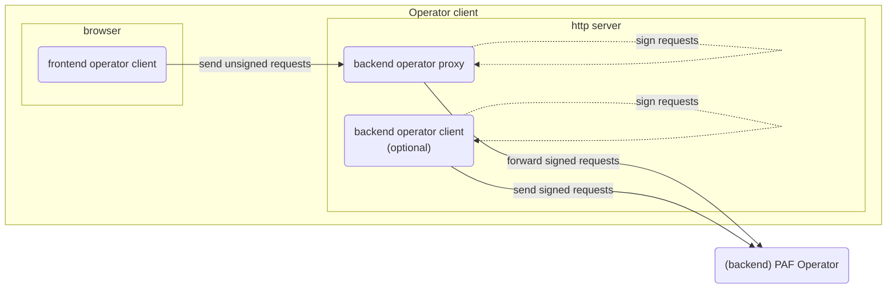

# Operator client

## Operator client: frontend, proxy and backend

An operator client is an actor that needs to interact with a PAF operator, to either:

- read user ids and preferences
- write user preferences
- or both

Ids and preferences are stored as **1st party cookies on the PAF top level +1 domain** (aka TLD+1).

Operator clients are **websites** that need to get access to this data. As a reminder, the content of these websites
is _served by a http server_ and it can then use Javascript _in the browser_.

- PAF provides a "**frontend operator client**" in the form of a Javascript library, to call the operator on REST or "
  redirect" endpoints (see [operator-api.md](operator-api.md) for details).
    - But only **signed** requests can be sent to the operator and these requests are signed using a **private key**,
      which must never be sent to the browser.

- Thus, PAF also provides a "**backend operator proxy**" which the frontend operator client uses to sign the requests on
  its behalf.
    - this proxy can be hosted by the website's owner or by a tech vendor

- Finally, clients of the PAF operators can use an optional "**backend operator client**" that will sign requests and
  redirect to the operator if needed.
    - this is part of the website's http server
    - this can be interesting to trigger HTTP redirects before any web page is served

## Backend operator proxy

The "backend operator **proxy**", owned by any operator client (publisher, advertiser) and hosted by them or by a tech
vendor, is an API called by the frontend operator client to sign and verify requests sent and received to / from the
operator.

As the name suggests, it is a proxy that transforms unsigned requests into signed ones.

To do so, it exposes:

- all [the (REST and redirect) endpoints that the **operator** exposes](operator-api.md), except "Verify 3PC support"
  and "Get identity"
- a couple of extra endpoints to help sign and verify messages

| Endpoint                  | Description                                                                                   | Input                                                                                       | Output                                                           | REST                                  | Redirect                                    |
|---------------------------|-----------------------------------------------------------------------------------------------|---------------------------------------------------------------------------------------------|------------------------------------------------------------------|---------------------------------------|---------------------------------------------|
| Read ids & prefs          | Forwards to [operator API](operator-api.md#read-ids-&-preferences)                            | -                                                                                           | See [operator API](operator-api.md#read-ids-&-preferences)       | `GET /paf-proxy/v1/ids-prefs`         | `GET /paf-proxy/v1/redirect/get-ids-prefs`  |
| **Sign** user preferences | Takes signed identifiers and unsigned preferences and sign them                               | Signed ids and unsigned preferences                                                         | Signed ids and preferences                                       | `POST /paf-proxy/v1/sign/prefs`       | N/A                                         |
| **Sign** "write" request  | Takes a "write" request so it can be sent to the operator                                     | Unsigned "write" message                                                                    | Signed "write" message                                           | `POST /paf-proxy/v1/sign/write`       | N/A                                         |
| Write ids & prefs         | Forwards to [operator API](operator-api.md#write-ids-&-preferences)                           | Signed "write" request (see [operator API](operator-api.md#write-ids-&-preferences))     | See [operator API](operator-api.md#write-ids-&-preferences)      | `POST /paf-proxy/v1/ids-prefs`        | `GET /paf-proxy/v1/redirect/post-ids-prefs` |
| **Verify** read           | Takes a signed "read" response received from the operator, and verifies the message signature | Signed "read"  **response** (see [operator API](operator-api.md#read-ids-&-preferences)) | Same as input if verification succeeded, error message otherwise | `POST /paf-proxy/verify/redirectRead` | N/A                                         |

## Frontend operator client

The integration of an operator client happens

## How to implement an operator client

- [The implementation project](https://github.com/criteo/paf-mvp-demo-express/tree/main/paf-mvp-frontend)
  provides documentation to use the **frontend operator client** Javascript library.
- It also provides example implementations (NodeJS) of
  a [backend operator proxy and backend operator client](https://github.com/criteo/paf-mvp-demo-express/tree/main/paf-mvp-operator-client-express)
  .

## Implementation details

Read ids and preferences

The following diagram details the steps needed to read existing cookies from PAF

- at server level, _if the website decides to use a **backend operator client**_, HTTP redirects can be triggered when
  needed
- at browser level the **frontend operator client** (a Javascript library) is used
    - depending on the context, the JS library calls a REST or "redirect" endpoint on the operator
    - it relies on the **backend operator proxy**, a component responsible for building operator URLs to call.

### Test support of 3rd party cookies

To test if third party cookies are supported and trigger redirect otherwise, the following logic is used:

1. if a backend client is used, then
    - based on user agent, if the browser is known to **not** support 3PC (ex: Safari) ➡️ consider no 3PC and
      immediately **HTTP redirect**
2. in Javascript,
    - based on user agent, if the browser is known to **not** support 3PC (ex: Safari) ➡️ consider no 3PC and
      immediately **javascript redirect**
3. otherwise, attempt to call REST endpoint and read existing (3PC) Prebid ID
    - at the same time, the operator attempts to write a "test" cookie on .prebidsso.com (ie. attempt to write a 3PC)
4. if Prebid ID is retrieved, of course it means 3PC **are** supported
5. if no Prebid ID retrieved, it means either that the user is not known, or that 3PC are not supported
    - call operator to attempt to read "test" cookie that was just written
    - if success ➡️ 3PC **are** supported, it's just that the user is not known
    - if failure ➡️ 3PC are **not** supported, **javascript redirect**

### Actual cookies writing

Note: cookies set by Javascript can be read by the http server when it receives a successive call, and vice-versa.

In other words, after a redirect by the operator back to the website,

- when using a **backend operator client**:
    - the backend operator client will set 1st party cookies (either a value or "unknown")
    - these cookies will be visible by the JS
    - so in the JS part of the diagram below, the answer to the question "Any Prebid 1st party 🍪?" is: **yes** and the
      cookies won't be written twice
- when not using a backend operator client, these cookies will be written by JS

```mermaid
flowchart TD
    subgraph noMiddleware [HTTP server without backend operator client]
        NoMiddlewareServe[serve HTML page]
    end
    
    subgraph middleware[HTTP server with backend operator client]
        MiddlewareCookies{"Any Prebid 1st party 🍪?"}
        MiddlewareAfterRedirect{Redirected from operator?}
        MiddlewareNonEmptyData{Received data?}
        MiddlewareVerifyRead["verify signature"]
        Middleware3PC{Browser known to support 3PC?}
        MiddlewareServe[serve HTML page]
        MiddlewareRedirect[HTTP redirect]
        MiddlewareSave["Set 1st party Prebid 🍪 = data"]
        style MiddlewareSave stroke:red,stroke-width:4px
        MiddlewareSaveNothing["Set 1st party Prebid 🍪 = 'unknown'"]
        style MiddlewareSaveNothing stroke:red,stroke-width:4px
        
        Middleware3PC -->|No| MiddlewareRedirect
        Middleware3PC -->|Yes| MiddlewareServe
        
        MiddlewareCookies -->|No| MiddlewareAfterRedirect
        
        MiddlewareAfterRedirect -->|No| Middleware3PC
        MiddlewareAfterRedirect -->|Yes| MiddlewareNonEmptyData
        
        MiddlewareNonEmptyData -->|No| MiddlewareSaveNothing --> MiddlewareServe
        MiddlewareNonEmptyData -->|Yes| MiddlewareVerifyRead
        MiddlewareVerifyRead --> MiddlewareSave --> MiddlewareServe
        
        MiddlewareCookies -->|Yes| MiddlewareServe
    end

    subgraph "HTML page (with frontend operator client JS library)"
        HtmlLoad[Page load]
        HtmlAfterRedirect{Redirected from operator?}
        HtmlCookies{"Any Prebid 1st party 🍪?"}
        HtmlSave["Set 1st party Prebid 🍪 = data"]
        style HtmlSave stroke:red,stroke-width:4px
        HtmlSaveNothing["Set 1st party Prebid 🍪 = 'unknown'"]
        style HtmlSaveNothing stroke:red,stroke-width:4px
        HtmlAnyData{Received data?}
        HtmlDone[Finished]
        
        ClientBrowser3PC{Browser known to support 3PC?}
        ClientNonEmptyData{Received data?}
        Client3PCOk{3d party cookie ok?}
        
    end
    
    subgraph "backend operator proxy"
        ClientJsRedirect[redirect read]
        ClientCallJson["read"]
        ClientCallTest3PC["test3PC"]
        ClientVerifyRead["verify signature"]
    end

    subgraph "operator (API)"
        OperatorJson[json/read endpoint]
        OperatorRedirect[redirect/read endpoint]
        OperatorVerify3PC["json/verify3PC endpoint"]
    end
    
    User[User visit] -------> Get
    style User stroke:#333,stroke-width:4px
    
    Get[GET web page]
    Get --> noMiddleware
    Get --> middleware
    
    MiddlewareServe --> HtmlLoad
    MiddlewareRedirect -- HTTP 303 operator/redirect/read --> OperatorRedirect
    NoMiddlewareServe ------> HtmlLoad
    HtmlLoad --> HtmlCookies
    
    HtmlAnyData -->|No| HtmlSaveNothing --> HtmlDone  
    HtmlAnyData -->|Yes| ClientVerifyRead
    ClientVerifyRead --> HtmlSave --> HtmlDone
    
    HtmlCookies -->|No| HtmlAfterRedirect
    HtmlCookies -->|Yes| HtmlDone
    
    HtmlAfterRedirect -->|No| ClientBrowser3PC
    HtmlAfterRedirect -->|Yes| HtmlAnyData
    
    ClientBrowser3PC -->|No| ClientJsRedirect
    ClientBrowser3PC -->|Yes| ClientCallJson
    
    ClientJsRedirect -- document.location = operator/redirect/read --> OperatorRedirect
    ClientCallJson -- operator/json/read --> OperatorJson
    
    ClientNonEmptyData -->|No| ClientCallTest3PC
    ClientNonEmptyData -->|Yes| HtmlSave
    ClientCallTest3PC -- "operator/json/verify3PC" --> OperatorVerify3PC
    
    Client3PCOk -->|No| ClientJsRedirect
    Client3PCOk -->|Yes| HtmlSaveNothing
    
    OperatorJson -- "Attempt to set 'test' 🍪<br>(a 3d party cookie)" --> ClientNonEmptyData
    OperatorVerify3PC --> Client3PCOk
    
    OperatorRedirect -. redirect back .-> Get2
    
    Get2["GET web page<br>(back to the top)"]
```

