# SWAN

Although not implementing the exact endpoints described above, [SWAN]([swan/apis.md at main · SWAN-community/swan · GitHub](https://github.com/SWAN-community/swan/blob/main/apis.md)) provides a solution that can be used for all workflows.

Some core principles of SWAN are:

- all data is **encrypted and decrypted by the operator** (using its private key) before to be sent over the network

- clients need to do a server to server call to the access node **before each communication**
  
  - the client is authenticated via its "API key" during this preliminary handshake

- the "**access node**" is a particular node in the operator network, responsible for handling encryption and decryption for clients

- messages are using a **proprietary binary format** for transport and cookie storage, for optimization

- it is originally made to support a tree of operator nodes, under a different domain, although the solution works with a single TLD+1 domain.

The SWAN solution is very modular, based on different open source projects (OWID, SWIFT) and meant to be generic (not limited to the Prebid SSO use case).

✅ the level of security is high because all data is encrypted

✅ robust solution with existing implementations and demo

Limitations:

🟠 to support a wide variety of use cases, it has a complicated code and workflow and unnecessary S2S calls and redirects

- calls to encrypt and decrypt are systematic, even when encryption is unactivated

- scrambling of cookie paths

- the whole system is meant to support multiple nodes (notion of home node, handling of data collision, etc) which makes it overcomplicated for the single node use case

🟠 mandatory backend client

🟠 obscure to web users and regulators

🟠 complex integration and debug

ℹ️ the diagram below is based on the SWAN demo, where CMP is considered to be a dedicated web site that the user is redirected to, not an integrated widget. This counts for a few extra redirects that could probably be avoided.

```mermaid
sequenceDiagram
participant U as user
participant B as browser
participant P as publisher P http server
participant C as CMP http server
participant A as advertiser A http server
participant O as operator node O
participant AN as aperator access node AO

rect rgba(224, 224, 224, .55)
note right of U: Time T1<br>"WRITE" scenario: user visits publisher<br>and sets their preferences for the first time

    U ->> B: visit www.publisherP.com/pageP.html
    activate U

        activate B
            B ->> P: GET /pageP.html
        deactivate B

        activate P
            P ->> P: no Prebid SSO ID 🍪 found
            P ->> AN: (S2S) POST /fetch<br>APIkey=keyP<br>redirectUrl=publisherP.com/pageP.html

          activate AN
              note over AN: keyP == publisherP.com
              AN ->> AN: check publisherP.com is allowed to read
              note over AN: keyP is secret and communicated S2S.<br>ok: this is a valid request
              AN ->> AN: ENCRYPT URL<br>with operator0.prebidsso.com private key
              AN -->> P: "read prebid SSO" URL = ...
          deactivate AN

            P -->> B: REDIRECT
        deactivate P


        activate B
            B ->> O: GET /ENCRYPTED (for "read")
        deactivate B

        activate O
            O ->> O: no 🍪 found

            O ->> AN: (S2S) POST /encrypt<br>url=xxx

          activate AN
              AN ->> AN: ENCRYPT URL<br>with operator0.prebidsso.com private key
              AN -->> O: "ENCRYPTED_URL" = ...
          deactivate AN

            O -->> B: REDIRECT
        deactivate O

        activate B
            B ->> P: GET /ENCRYPTED
        deactivate B

        activate P

        P ->> AN: (S2S) POST /decrypt<br>APIkey=keyP<br>encrypted=ENCRYPTED

          activate AN
              note over AN: keyP == publisherP.com
              AN ->> AN: check publisherP.com is allowed to read
              AN ->> AN: DECRYPT data<br>with operator0.prebidsso.com private key
              AN -->> P: decrypted data = ...
          deactivate AN

            P ->> P: set 🍪 "val"
            P -->> B: REDIRECT
        deactivate P

        activate B
            B ->> P: GET /pageP.html
        deactivate B

        activate P
            P ->> P: 🍪 "val" found
            P -->> B: REDIRECT to CMP
        deactivate P

        activate B
            B ->> C: GET /cmp.html?afterCmpUrl=publisherP.com/pageP.html
        deactivate B

        activate C
            C ->> AN: (S2S) POST /fetch<br>APIkey=keyC<br>redirectUrl=cmp.com/cmp.html?afterCmpUrl=publisherP.com/pageP.html

          activate AN
              note over AN: keyC == cmp.com
              AN ->> AN: check cmp.com is allowed to read
              AN ->> AN: ENCRYPT URL<br>with operator0.prebidsso.com private key
              AN -->> C: "read prebid SSO" URL = ...
          deactivate AN

            C -->> B: REDIRECT
        deactivate C

        activate B
            B ->> O: GET /ENCRYPTED (for "read")
        deactivate B

        activate O
            O ->> O: no 🍪 found

            O ->> AN: (S2S) POST /encrypt<br>url=xxx

          activate AN
              AN ->> AN: ENCRYPT URL<br>with operator0.prebidsso.com private key
              AN -->> O: "ENCRYPTED_URL" = ...
          deactivate AN

            O -->> B: REDIRECT
        deactivate O

        activate B
            B ->> C: GET /ENCRYPTED
        deactivate B

        activate C

            C ->> AN: (S2S) POST /decryptAsJSON<br>APIkey=keyC<br>encrypted=ENCRYPTED

          activate AN
              note over AN: keyP == publisherP.com
              AN ->> AN: check publisherP.com is allowed to read
              AN ->> AN: create ID
              AN ->> AN: SIGN ID<br/>with own private key
              note over AN: ID has been signed by operatorO.prebidsso.com<br/>it can be trusted
              AN ->> AN: DECRYPT data<br>with operator0.prebidsso.com private key
              AN -->> C: decrypted data = ...
          deactivate AN

            C -->> B: display CMP
        deactivate C

        activate B
            B ->> B: JS: show id in form<br>or store in hidden input
            note over B: Note: don't write 🍪 yet, wait for user consent
            B -->> U: 
        deactivate B

    deactivate U

    U ->> B: submit preferences

    activate U
        activate B
            B ->> C: GET /cmp.html?id=xxx&preferences=yyy
        deactivate B

        activate C

            C ->> C: SIGN (preferences + id)<br/>with own private key => sign[pref & id]
            note over C: signature includes id to ensure<br>these preferences are for this user.<br>It can be trusted

            C ->> AN: (S2S) POST /update<br>APIkey=keyC<br>id=xxx&preferences=yyy&signatures=...

            activate AN
                note over AN: keyC == cmp.com
                AN ->> AN: check cmp.com is allowed to write
                AN ->> AN: VERIFY sign[id] with operatorO.prebidsso.com public key
                AN ->> AN: VERIFY sign[pref & id] with cmp.com public key
                note over AN: ok: these preferences are valid<br>and they are associated with the id
                AN ->> AN: ENCRYPT URL<br>with operator0.prebidsso.com private key
                AN -->> C: update URL = ...
            deactivate AN

            C -->> B: REDIRECT
        deactivate C

        activate B
            B ->> O: GET /ENCRYPTED (for "update")
        deactivate B

        activate O
            O ->> O: write 1P 🍪:<br/>preferences & sign[pref & id]
            note over O: preferences have been signed by cmp<br/>ID has been signed by operatorO.prebidsso.com<br/>both can be trusted
            O ->> O: ENCRYPT URL<br>with operator0.prebidsso.com private key
            O -->> B: REDIRECT
        deactivate O

        activate B
            B ->> P: GET /ENCRYPTED
        deactivate B

        activate P

            P ->> AN: (S2S) POST /decrypt<br>APIkey=keyP<br>encrypted=ENCRYPTED

            activate AN
                note over AN: keyP == publisherP.com
                AN ->> AN: check publisherP.com is allowed to read
                AN ->> AN: DECRYPT data<br>with operator0.prebidsso.com private key
                AN -->> P: decrypted data = ...
            deactivate AN

            P ->> P: write 1P 🍪:<br/>id & sign[id]<br>preferences & sign[pref & id]

            P -->> B: REDIRECT
        deactivate P

        activate B
            B ->> P: GET /pageP.html
        deactivate B

        activate P
            P -->> B: display
        deactivate P

        B -->> U: 

    deactivate U
end

rect rgba(255, 255, 255, .55)
note right of U: Time T2<br>"READ" scenario: user visits a "new" advertiser

    U ->> B: visit www.advertiserA.com/pageA.html
    activate U

        activate B
            B ->> A: GET /pageA.html
        deactivate B

        activate A
            A ->> A: no Prebid SSO ID 🍪 found
            A ->> AN: (S2S) POST /fetch<br>APIkey=keyA<br>redirectUrl=publisherP.com/pageP.html

            activate AN
                note over AN: keyA == advertiserA.com
                AN ->> AN: check advertiserA.com is allowed to read
                note over AN: keyA is secret and communicated S2S.<br>ok: this is a valid request
                AN ->> AN: ENCRYPT URL<br>with operator0.prebidsso.com private key
                AN -->> A: "read prebid SSO" URL = ...
            deactivate AN

            A -->> B: REDIRECT
        deactivate A


        activate B
            B ->> O: GET /ENCRYPTED (for "read")
        deactivate B

        activate O
            O ->> O: no 🍪 found

            O ->> AN: (S2S) POST /encrypt<br>url=xxx

            activate AN
                AN ->> AN: ENCRYPT URL<br>with operator0.prebidsso.com private key
                AN -->> O: "ENCRYPTED_URL" = ...
            deactivate AN

            O -->> B: REDIRECT
        deactivate O

        activate B
            B ->> A: GET /ENCRYPTED
        deactivate B

        activate A

            A ->> AN: (S2S) POST /decrypt<br>APIkey=keyA<br>encrypted=ENCRYPTED

            activate AN
                note over AN: keyA == advertiserA.com
                AN ->> AN: check advertiserA.com is allowed to read
                AN ->> AN: DECRYPT data<br>with operator0.prebidsso.com private key
                AN -->> A: decrypted data = ...
            deactivate AN

            A ->> A: write 1P 🍪:<br/>id & sign[id]<br>preferences & sign[pref & id]

            A -->> B: REDIRECT
        deactivate A

        activate B
            B ->> A: GET /pageP.html
        deactivate B

        activate A
            A -->> B: display
        deactivate A

        B -->> U: 

    deactivate U
end
```

