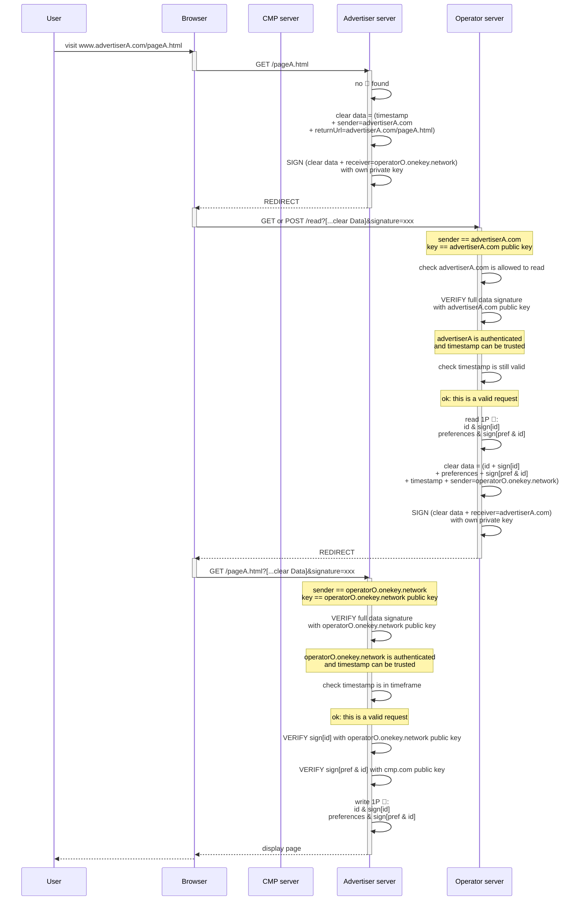

# Operator Design

## Protocol

The proposed solution enforces the usage of TLS (HTTPS) for all communication to and from the operator, to prevent middle men to "spy" on data that is passed.

- data is transferred in a **text format** which facilitates inspection and troubleshooting by web developers, even when transported as part of the query string ("redirect" scenario without 3PC).

- it is also **stored** as cookies in a **text format** which end users can inspect

- **signatures** are used to secure communications, but **not encryption**:

    - when **sending** a request or a response, the sender:

        - provides a **timestamp** and its own domain (the **domain name of the *sender***) are part of the payload

        - signs the whole **payload + the domain name of the *receiver*** (which is not part of the payload), using its **own private key**

    - when **receiving** a request or a response, the receiver:

        - recalls the **public key of the sender** based on the domain name that was provided as part of the payload (this can be done via a cache + regular calls to `/identity` endpoint, similar to what is done in SWAN)

        - **verifies** the provided **signature**, based on (the complete payload + its own domain name), using the sender's public key

            - ℹ️ verifying the signature is the way to authenticate the sender

        - (in the case of the operator) verifies the **permissions** associated with this domain name

        - verify the provided **timestamp** is in an acceptable time frame

The designed solution is a protocol:

✅ reduces the server to server (S2S) calls to a minimum, making nodes more reliable.

✅ is easier to debug (cookies and requests are in plain text).

✅ data received from the operator as a full page redirect can be processed by a web server **or in the browser**, in Javascript, because no decryption is needed.

✅ protects from hackers' attempts:

- to read or write Prebid Addressability Framework data without being authenticated and authorized.

- to replay legit requests to the operator in an attempt to read or write Prebid Addressability Framework data or to websites to overwrite cookies on their domains (because of timestamp + signature).

- to replay legit URLs to overwrite cookies on *other* websites' domain (because the signature includes the receiver's domain name, it is tight to a specific receiver).

Limitations:

🟠 operator needs to keep track of (potentially numerous) clients' public keys for signature verification

🟠 data remains visible (or can be made visible) in URLs, so it can be used by web browser as part of the browsing history.

🟠 it can also appear in web server logs.

## Write Scenario: the user visits a Publisher for the first time

A user visits a Publisher and sets their preferences for the first time.

In this case, the Publisher, the CMP and the Operator interact via 
redirection mechanisms to collect the Pseudonymous-Identifier and the Preferences
of the user and *write* it in a secure way. Therefore, this scenario is
called the **"WRITE" scenario**.

```mermaid
sequenceDiagram
    participant U as User
    participant B as Browser
    participant P as Publisher server
    participant C as CMP server
    participant O as Operator server

    U ->> B: visit www.publisherP.com/pageP.html
    activate U

        activate B
            B ->> P: GET /pageP.html
        deactivate B

        activate P
            P -->> B: display
        deactivate P

        activate B
            B ->> B: JS: no User Id and Preferences 🍪 found
            B -->> C: JS call: GET pafURL?returnURL=publisherP.com/pageP.html
        deactivate B

        activate C
            C ->> C: clear data = (timestamp<br>+ returnUrl=publisherP.com/pageP.html<br>+ sender=cmp.com)
            C ->> C: SIGN (clear data + receiver=operatorO.onekey.network)<br/> with own private key
            note over C: receiver is not part of the clear data
            C -->> B: "operator read" URL = ...
        deactivate C

        activate B
            B ->> B: JS: full page REDIRECT<br>(or wait for user click)
            B ->> O: GET /readOrGetNewId?[...clear Data]&signature=xxx
        deactivate B

        activate O
            note over O: sender == cmp.com<br>key == cmp.com public key
            O ->> O: check cmp.com is allowed to read
            O ->> O: VERIFY full data signature<br/>with cmp.com public key
            note over O: cmp.com is authenticated<br/>and timestamp can be trusted
            O ->> O: check timestamp is still valid
            note over O: ok: this is a valid request
            O ->> O: no 🍪 found
            O ->> O: create ID
            O ->> O: SIGN ID<br/>with own private key
            note over O: ID has been signed by operatorO.onekey.network<br/>it can be trusted
            O ->> O: clear data = (id + sign[id]<br>+ timestamp<br>+ sender=operatorO.onekey.network)
            O ->> O: SIGN (clear data + receiver=publisherP.com)<br/> with own private key
            O -->> B: REDIRECT
        deactivate O

        activate B
            B ->> P: GET /pageP.html&[...clear Data]&signature=xxx
        deactivate B

        activate P
            P -->> B: display
        deactivate P

        activate B
            note over B: sender == operatorO.onekey.network<br>key == operatorO.onekey.network public key
            B ->> B: VERIFY full data signature<br/>with operatorO.onekey.network public key
            note over B: operatorO.onekey.network is authenticated<br/>and timestamp can be trusted
            B ->> B: check timestamp is still valid
            note over B: ok: this is a valid request
            B ->> B: [optional] VERIFY sign[id]<br/>with operatorO.onekey.network public key
            B ->> B: JS: show id in form<br>or store in hidden input
            note over B: Note: don't write 🍪 yet, wait for user consent
             B -->> U: 
        deactivate B

    deactivate U

    U ->> B: submit preferences

    activate U

        activate B
            B ->> C: JS call: GET /submitConsent?id=xxx&preferences=yyy
        deactivate B

        activate C
            C ->> C: SIGN (preferences + id)<br/>with own private key => sign[pref & id]
            note over C: signature includes id to ensure<br>these preferences are for this user.<br>It can be trusted
            C ->> C: clear data = (preferences + sign[pref & id]<br>+ timestamp<br>+ redirectUrl=publisherP.com/pageP.html + sender=cmp.com)
            C ->> C: SIGN (clear data + receiver=operatorO.onekey.network)<br/> with own private key
            C -->> B: "operator write URL" = ...
        deactivate C

        activate B
            B ->> B: JS: full page REDIRECT
            B ->> O: GET /writeAndRead?[...clear Data]&signature=xxx
        deactivate B

        activate O
            note over O: sender == cmp.com<br>key == cmp.com public key
            O ->> O: check cmp.com is allowed to read AND WRITE
            O ->> O: VERIFY full data signature<br/>with cmp.com public key
            note over O: cmp.com is authenticated<br/>and timestamp can be trusted
            O ->> O: check timestamp is in timeframe
            note over O: ok: this is a valid request
            O ->> O: read 1P 🍪: ID & sign[id]
            O ->> O: VERIFY sign[pref & id]<br/>with cmp.com public key
            note over O: ok: these preferences are valid<br>and they are associated with the id
            O ->> O: write 1P 🍪:<br/>preferences & sign[pref & id]
            note over O: preferences have been signed by cmp<br/>ID has been signed by operatorO.onekey.network<br/>both can be trusted
            O ->> O: clear data = (id + sign[id]<br>+ preferences + sign[pref & id]<br>+ timestamp<br>+ sender=operatorO.onekey.network)
            O ->> O: SIGN (clear data + receiver=publisherP.com)<br/> with own private key
            O -->> B: REDIRECT
        deactivate O

        activate B
            B ->> P: GET /pageP.html?[...clear Data]&signature=xxx
        deactivate B

        activate P
            P -->> B: display
        deactivate P

        activate B
            note over B: sender == operatorO.onekey.network<br>key == operatorO.onekey.network public key
            B ->> B: VERIFY full data signature<br/>with operatorO.onekey.network public key
            note over B: operatorO.onekey.network is authenticated<br/>and timestamp can be trusted
            B ->> B: check timestamp is in timeframe
            note over B: ok: this is a valid request
            B ->> B: VERIFY sign[id] with operatorO.onekey.network public key
            B ->> B: VERIFY sign[pref & id] with cmp.com public key
            B ->> B: write 1P 🍪:<br/>id & sign[id]<br>preferences & sign[pref & id]
        deactivate B
    B -->> U: 

    deactivate U

```

Note that this whole block can be done in the http server OR in the front end of publisher

## Read Scenario: The user visits an Advertiser for the first time

After visiting a Publisher and generating their User Id and Preferences, the user
goes to an Advertiser website. 

In this case, the Advertiser website wants to *read* the User Id and Preferences of the 
user. Therefore, this scenario is named the **"READ" scenario**.

