# Operator Design

⚠️ To **view diagrams** in this page, you are invited to install a browser extension such as [mermaid-diagrams](https://chrome.google.com/webstore/detail/mermaid-diagrams/phfcghedmopjadpojhmmaffjmfiakfil)

## Context

Operators are contracting parties responsible for storing and controlling access to users data, in a secured way.

In this context,

- **data** means:
  - **Prebid ID** is the pseudonymous identifier _generated by an operator_ to identify a device
    - Other optional IDs will be supported in the future but are **not** part of the MVP
  - **Preferences** are user-set preferences regarding online tracking that is _captured by a CMP UI_ or a website (
    such as a publisher).
    - In the MVP, only one "preference" is supported: optin status.
- **storing** means in the form of **cookies** stored on Prebid SSO top level domain +1 (TLD+1, ex: `prebidsso.com`)
- **controlling access** means to offer ways for contracting parties to read and write this data and help them store a
  copy ("cache") of these cookies on their own domain.
- ***in a secured way*** has different meanings that are discussed below

Multiple operators will implement the same set of core features under the same TLD+1, although at this stage it is not
clear how they will co-operate.

## Example workflows

We represent two typical workflows:

- the first interaction with Prebid where a user visits a publisher's page, that triggers a CMP
- a visit to a advertiser while the user already opted in to Prebid

...in two different contexts:

- where the browser supports third party cookies (3PC)
- where it doesn't

### With 3PC

When 3d party cookies are available, all calls to read cookies can be made via Javascript to read or write data.

- When visiting a publisher and meeting Prebid SSO for the first time:
  - the publisher's page is called.
  - the publisher's backend serves the requested page, and it includes a JS library that checks for existence of
    Prebid SSO cookie
  - a JS call to the operator to "read or init" data will generate a new ID
  - the ID can be displayed in the CMP UI
  - when the user submits their preferences:
    - a JS call is made to the CMP to "prepare" the values to write (more about this, below)
    - another JS call is made to the operator to write these values (saved under Prebid SSO domain)
    - finally, these values are saved on the publisher's domain
- When a participating user visits an advertiser:
  - a JS call is made to the operator to get the Prebid SSO ID and preferences
  - the values are saved on the advertiser's domain

ℹ️ in this scenario, no full page redirect is needed

### Without 3PC

Without 3d party cookies,

- **a full page load** on Prebid SSO domain is needed to read or write cookies stored on Prebid SSO TLD+1
- **a full page load** on the website domain is needed to write cookies based on values read from Prebid SSO

So the only way to interact with Prebid SSO cookies is through  **full page "redirects"**.

- When visiting a publisher and meeting Prebid SSO for the first time:
  - the publisher's page is called. Here,  **two options are possible**:
    - either the publisher's _backend_ checks the existence of Prebid SSO cookie, and redirect the user to Prebid
      SSO operator
    - or, the publisher's backend serves the requested page, and it includes a JS library that does exactly the same
      thing
  - in both cases the browser is  **redirected**  to Prebid SSO operator to read any existing cookie or to create an
    ID if needed
  - the operator  **redirects**  back to the original page, this time with a Prebid SSO ID as part of the URL
  - the CMP is displayed
  - the ID can be displayed in the CMP UI if needed
  - when the user submits their preferences:
    - a JS call is made to the CMP to "prepare" the values to write
    - via JS, a  **redirect**  is triggered to the operator to write these values (saved under Prebid SSO domain)
    - the operator  **redirects**  back to the original page, this time with a Prebid SSO ID & preferences as part
      of the URL
    - finally, these values are saved as cookies on the publisher's domain
      - Note that this, again, can be done on the publisher's backend side or via JS
- When a participating user visits an advertiser:
  - on the advertiser backend, a  **redirect**  is triggered to the operator to get the Prebid SSO ID and preferences
  - the operator  **redirects**  back to the original page, this time with a Prebid SSO ID & preferences as part of
    the URL
  - the values are saved on the advertiser's domain

```mermaid
sequenceDiagram
participant U as user
participant B as browser
participant P as publisher P http server
participant C as CMP http server
participant A as advertiser A http server
participant O as operator node O

rect rgba(224, 224, 224, .55)
    note right of U: Time T1<br>"WRITE" scenario: user visits publisher<br>and sets their preferences for the first time

    U ->> B: visit www.publisherP.com/pageP.html
    activate U

        activate B
            B ->> P: GET /pageP.html
        deactivate B

        activate P
            P -->> B: embed CMP
        deactivate P

        activate B
            B ->> B: no Prebid SSO ID 🍪 found
            B -->> B: REDIRECT
            B ->> O: call "read or init" endpoint<br/>redirectUrl = publisherP.com/pageP.html
        deactivate B

        activate O
            note over B,O: make sure this URL cannot be "replayed" by hackers to read central cookies
            note over O: make sure<br/>CMP is authorized to read
            O ->> O: create ID
            O -->> B: REDIRECT
        deactivate O

        activate B
            B ->> P: GET /pageP.html?id=xxx
        deactivate B

        activate P
            P -->> B: embed CMP
        deactivate P

        activate B
            B ->> B: show Prebid SSO ID
            B -->> U:  
        deactivate B

    deactivate U

    U ->> B: submit preferences

    activate U

        activate B
            B ->> C: JS call to sign preferences value
            activate C
                C -->> B: url to call = ...
            deactivate C

            B -->> B: REDIRECT
            B ->> O: call "write" endpoint<br>id = xxx<br>preferences = yyy<br>redirectUrl = publisherP.com/pageP.html
        deactivate B

        activate O
            note over B,O: make sure this URL cannot be "replayed" by hackers to write central cookies
            note over O: make sure<br/>CMP is authorized to read and write
            note over O: make sure<br/>ID and preferences values can be trusted
            O ->> O: write 1P 🍪:<br/>ID & preferences
            O -->> B: REDIRECT
        deactivate O

        activate B
            B ->> P: GET /pageP.html?<br/>cookie = ID & preferences
        deactivate B

        activate P
            note over B,P: make sure this URL cannot be "replayed" by hackers<br>to write local cookies
            note over B,P: make sure ID & preferences in the URL<br/>cannot be read by hackers & challengers (browser)
            P ->> P: write 1P 🍪<br/>ID & preferences
            P -->> B: display pageP.html
        deactivate P

        B -->> U:  

    deactivate U

end

rect rgba(255, 255, 255, .55)
    note right of U: Time T2<br>"READ" scenario: user visits a "new" advertiser without CMP

    U ->> B: visit www.advertiserA.com/pageA.html
    activate U

        activate B
            B ->> A: GET /pageA.html
        deactivate B

        activate A
            A ->> A: no Prebid SSO ID 🍪 found
            A ->> A: build redirect URL
            A -->> B: REDIRECT
        deactivate A

        activate B
            B ->> O: call "read" endpoint<br/>redirectUrl = advertiserA.com/pageA.html
        deactivate B

        activate O
            note over B,O: make sure this URL cannot be "replayed" by hackers to read data
            O ->> O: read 1P 🍪
            note over O: make sure<br/>advertiserA is authorized to read
            O -->> B: REDIRECT
        deactivate O

        activate B
            B ->> A: GET /pageA.html?<br/>cookie = ID & preferences
        deactivate B

        activate A
            note over B,A: make sure this URL cannot be "replayed" by hackers to write local cookies
            note over B,A: make sure ID & preferences in the URL<br/>cannot be read by hackers & challengers (browser)
            A ->> A: write 1P 🍪
            A -->> B: display pageA.html
        deactivate A

        B -->> U: 

    deactivate U

end
```

## Designed protocol

This protocol:

✅ reduces the server to server (S2S) calls to a minimum, making nodes more reliable.

✅ is transparent to users and regulators (cookies and requests are human readable).

✅ data received from the operator as a full page redirect can be processed by a web server **or in the browser**, in Javascript, because no decryption is needed.

✅ protects from hackers' attempts:

- to read or write Prebid SSO data without being authenticated and authorized.

- to replay legit requests to the operator in an attempt to read or write Prebid SSO data or to websites to overwrite cookies on their domains (because of timestamp + signature).

- to replay legit URLs to overwrite cookies on *other* websites' domain (because the signature includes the receiver's domain name, it is tight to a specific receiver).

Limitations:

🟠 operator needs to keep track of (potentially numerous) clients' public keys for signature verification

🟠 data remains visible (or can be made visible) in URLs, so it can be used by web browser as part of the browsing history.

🟠 it can also appear in web server logs.

