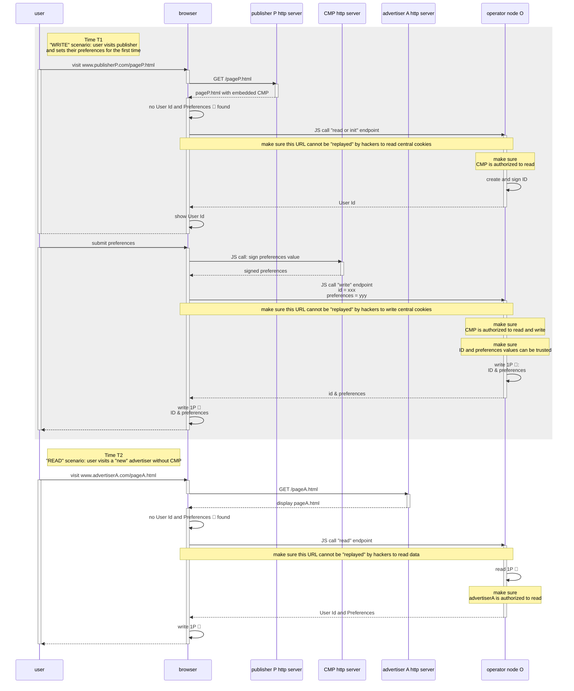
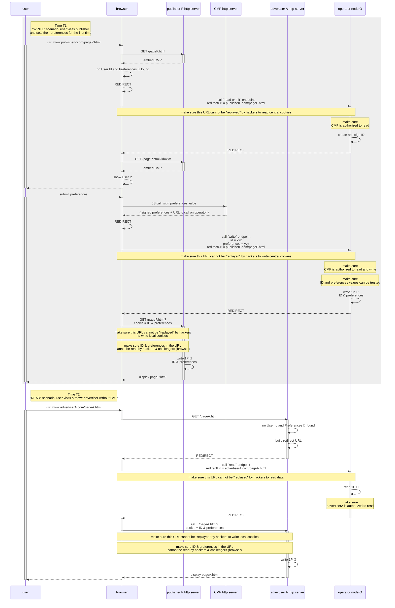

# Operator Requirements

## Introduction and definitions

Operators are contracting parties responsible for storing and controlling access to users data, in a secured way.

In this context,

- **data** means:
  - **Prebid ID** is the pseudonymous identifier _generated by an operator_ to identify a device
    - Other optional IDs will be supported in the future but are **not** part of the MVP
  - **Preferences** are user-set preferences regarding online tracking that is _captured by a CMP UI_ or a website (
    such as a publisher).
    - In the MVP, only one "preference" is supported: optin status.
- **storing** means in the form of **cookies** stored on Prebid Addressability Framework top level domain +1 (TLD+1, ex: `onekey.network`)
- **controlling access** means to offer ways for contracting parties to read and write this data and help them store a
  copy ("cache") of these cookies on their own domain.
- ***in a secured way*** has different meanings that are discussed below

Multiple operators will implement the same set of core features under the same TLD+1, although at this stage it is not
clear how they will co-operate.

## Example workflows

We represent:
- two typical workflows
  - the first interaction with Prebid where a user visits a publisher's page, that triggers a CMP
  - a visit to an advertiser while the user already opted in to Prebid
- with different configurations
  - the publisher doesn't use an operator **backend** client: redirects, when needed, are triggered in Javascript
  - the advertiser uses an operator backend client: when needed, redirects can be triggered via an HTTP response
- in two different contexts
  - where the browser supports third party cookies (3PC)
  - where it doesn't

### With 3PC

When 3d party cookies are available, all calls to read cookies can be made via Javascript to read or write data.

- When visiting a publisher and meeting Prebid Addressability Framework for the first time:
  - the publisher's page is called.
  - the publisher's backend serves the requested page, and it includes a JS library that checks for existence of
    Prebid Addressability Framework cookie
  - a JS call to the operator to "read or init" data will generate a new ID
  - the ID can be displayed in the CMP UI
  - when the user submits their preferences:
    - a JS call is made to the CMP to "prepare" the values to write (more about this, below)
    - another JS call is made to the operator to write these values (saved under Prebid Addressability Framework domain)
    - finally, these values are saved on the publisher's domain
- When a participating user visits an advertiser:
  - a JS call is made to the operator to get the Prebid Addressability Framework ID and preferences
  - the values are saved on the advertiser's domain

ℹ️ in this scenario, no full page redirect is needed

### Without 3PC

Without 3d party cookies,

- **a full page load** on PAF domain is needed to read or write cookies stored on PAF TLD+1
- **a full page load** on the website domain is needed to write cookies based on values read from PAF

So the only way to interact with PAF cookies is through  **full page "redirects"**.

- When visiting a publisher and meeting PAF for the first time:
  - the publisher's page is called. Here,  **two options are possible**:
    - either the publisher's _backend_ checks the existence of PAF cookie, and redirect the user to PAF Operator
    - or, the publisher's backend serves the requested page, and it includes a JS library that does exactly the same
      thing
  - in both cases the browser is  **redirected**  to PAF Operator to read any existing cookie or to create an
    ID if needed
  - the operator  **redirects**  back to the original page, this time with a User Id and Preferences as part of the URL
  - the CMP is displayed
  - the ID can be displayed in the CMP UI if needed
  - when the user submits their preferences:
    - a JS call is made to the CMP to "prepare" the values to write
    - via JS, a  **redirect**  is triggered to the operator to write these values (saved under PAF domain)
    - the operator  **redirects**  back to the original page, this time with a User Id and Preferences as part
      of the URL
    - finally, these values are saved as cookies on the publisher's domain
      - Note that this, again, can be done on the publisher's backend side or via JS
- When a participating user visits an advertiser:
  - on the advertiser backend, a  **redirect**  is triggered to the operator to get the User Id and Preferences
  - the operator  **redirects**  back to the original page, this time with a User Id and Preferences as part of
    the URL
  - the values are saved on the advertiser's domain

