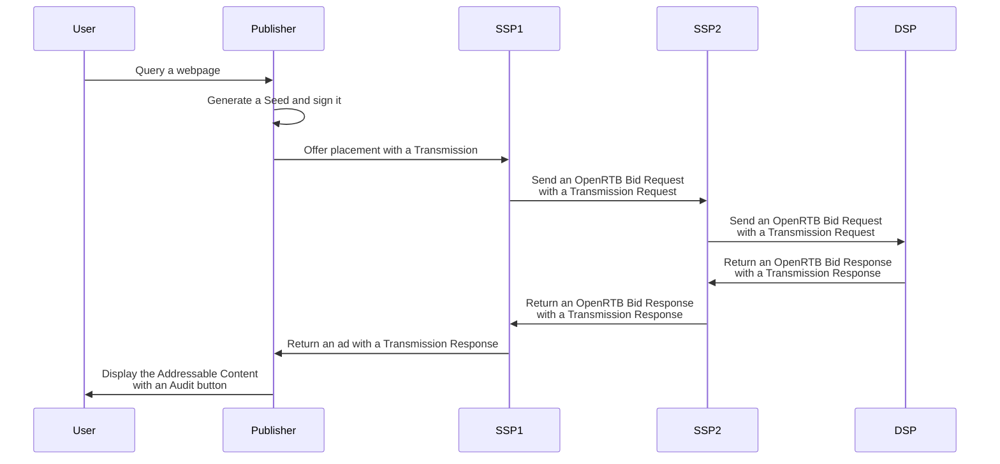

Here is a workflow with detailed steps that explains how 
Transmissions Request contain **parents** and Transmission Responses contains
**children** (here, we loan the terminology of the Tree data structure). 
**children** and **parents** are Transmission Results and they are helpful for
the Publisher and the DSP for generating the Audit Log of an Addressable Content.

The detailed steps of the diagram above:

1. The Publisher generates the Seed.
2. The Publisher sends the Transmission Request 1 to SSP1. The "parents" field of the Transmission Request is empty.
3. The SSP1 receives the Transmission Request 1 and generates the Transmission Result 1.
4. The SSP1 sends the Transmission Request 2 to SSP2. The "parents" contains the Transmission Result 1.
5. The SSP2 receives the Transmission Request 2 and generates the Transmission Result 2.
6. The SSP2 sends the Transmission Request 3 to the DSP. The "parents" contain the Transmission Result 1 and the Transmission Result 2.
7. The DSP receives the Transmission Request 3 and generates a Transmission Result 3.
8. The DSP returns a Transmission Response 3 to the Transmission Request 3 (SSP2). It includes the Transmission Result 3. The 'children" field is empty.
8. The SSP2 receives the Transmission Response 3.
10. The SSP2 returns a Transmission Response 2 to Transmission Request 2 (SSP1). It contains the Transmission Result 2. The "children" field includes the Transmission Result 3.
11. The SSP1 receives the Transmission Response 2.
12. The SSP1 returns a Transmission Response 1 to Transmission Request 3 (Publisher). It contains the Transmission Result 1. The "children" field includes the Transmission Result 2 and the Transmission Result 3.
13. The Publisher shows the Addressable Content via the DSP and the Audit Log is available.
