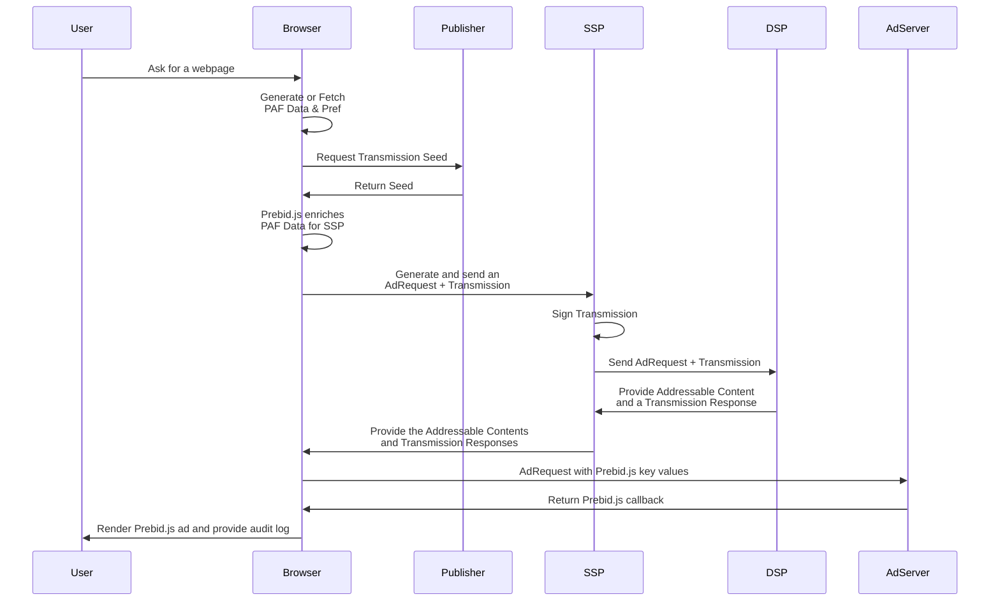
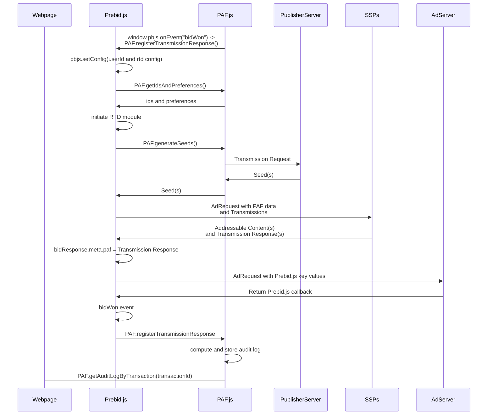

# Prebid.js Implementation

## Goal of the document

This document provides the guidance and the requirements for implementing 
Prebid Addressability Framework (PAF) through Prebid.js.

## Overview

Prebid.js is an open source header bidder solution used by the majority of the 
open web. Implementing PAF through Prebid.js will likely be by far the most
common implementation path.

Since Prebid.js is a client-side library the implementation will require
extra server-side calls to do any of the required signing functions.

The current [audit log requirements](audit-log-requirements.md) can be fulfilled
with the use of just one transmission seed, and so this design will use only one.
This design can be changed to use multiple seeds if desired, and will be covered below.

The Prebid.js solution should offer the following:
* Addition of a PAF userId submodule to Prebid.js
* Addition of a PAF RTD submodule to Prebid.js
* Expose PAF Data, Permissions, and Seed to adapters
* Collect PAF signatures for the purpose of audit log construction

The following diagram introduces an overview of this setup:

<!--partial-begin { "files": [ "prebid-flow.mmd" ], "block": "mermaid" } -->
<!-- ⚠️ GENERATED CONTENT - DO NOT MODIFY DIRECTLY ⚠️ -->

<!--partial-end-->

## Implementation Details

PAF doesn't standardize the way of offering inventory because 
there are already mechanisms sush as OpenRTB for these cases.
However to offer PAF the Publisher must implement additional features.

To understand the steps, it is important to overview how to generate the data and
the relationships between them:
* A Publisher offers *multiple* placements - one for each for 
Addressable Contents - via Prebid.js.
* A Publisher Server generates a Seed for each PAF Data transaction
* Prebid.js sends a Request for opportunites and 1 or more Transaction Requests
* A Supplier generates and sends *one* Transaction Response per Impression Opportunity


### Prebid.js userId module

Prebid.js already offers identity submodules and a PAF sub module will be added.
This module will be very straight-forward and will simply fetch the PAF data from the
window using the [PAF frontend](https://github.com/criteo/paf-mvp-implementation/tree/main/paf-mvp-frontend). The module will call
`PAF.getIdsAndPreferences()` to get the PAF Data. These data will be offered to all
configured bidders in the format:

<!--partial-begin { "files": [ "prebid-userid-request.json" ], "block": "json" } -->
<!-- ⚠️ GENERATED CONTENT - DO NOT MODIFY DIRECTLY ⚠️ -->
```json
{
    "data": {
        "identifiers": [
            {
                "version": 0,
                "type": "prebid_id",
                "value": "7435313e-caee-4889-8ad7-0acd0114ae3c",
                "source": {
                    "domain": "operator0.com",
                    "timestamp": 1639580000,
                    "signature": "12345_signature"
                }
            }
        ],
        "preferences": {
            "version": 0,
            "data": { 
                "opt_in": true 
            },
            "source": {
                "domain": "cmp1.com",
                "timestamp": 1639581000,
                "signature": "12345_signature"
            }
        }
    }
}
```
<!--partial-end-->

If the bidderAdapter utilizes `bidRequest.userIdAsEids` then the
transmissions preferences will be in eid extension, e.g.

<!--partial-begin { "files": [ "openrtb-eids.json" ], "block": "json" } -->
<!-- ⚠️ GENERATED CONTENT - DO NOT MODIFY DIRECTLY ⚠️ -->
```json
{
    "eids": [
      {
        "source": "paf",
        "uids": [
          {
            "atype": 1,
            "id": "7435313e-caee-4889-8ad7-0acd0114ae3c",
            "ext": {
              "version": 0,
              "type": "prebid_id",
              "source": {
                "domain": "operotor0.com",
                "timestamp": 1639589531,
                "signature": "12345_signature"
              }
            }
          }
        ],
        "ext": {
          "preferences": {
            "version": 0,
            "data": {
              "opt_in": true
            },
            "source": {
              "domain": "cmp1.com",
              "timestamp": 1639589531,
              "signature": "12345_signature"
            }
          }
        }
      }
    ],
    "paf": {
        "transmissions": [
            {
              "version": 0,
              "seed": {
                "version": 0,
                "transaction_id": "a0651946-0f5b-482b-8cfc-eab3644d2743",
                "publisher": "publisher.com",
                "source": {
                  "domain": "publisher.com",
                  "timestamp": 1639582000,
                  "signature": "12345_signature"
                }
              }
            }
        ]
    }
  }
```
<!--partial-end-->

The publisher can restrict the PAF data to participating parties.

```javascript
pbjs.setConfig(
    { 
    userSync: {
        userIds: [{
            name: "pafId",
            bidders: ["openx"]
        }] 
    }
});
```

#### Prebid.js RTD Module

Prebid.js already offers real-time-data submodules and a PAF sub module will be added.
This module will be responsible for retreiving one or many seeds from the paf-lib.
A pulisher will add the module in the configuration. The design allows for one or many seeds.

```javascript
pbjs.setConfig({
    realTimeData: {
        auctionDelay: 1000,
        dataProviders: [
                {
                name: "paf",
                waitForIt: true,
                params: {
                    seedPerImpression: true
                }
            }
        ]
    }
});
```

##### seedPerImpression = true

The PAF submodule will call `PAF.generateSeeds(N)` where N is the number of
impression opportunities. These seeds are then appended to imps using the 
FPD module (ortb2imp). The object is passed to bidders as follows:

<!--partial-begin { "files": [ "openrtb-imp-with-transmission.json" ], "block": "json" } -->
<!-- ⚠️ GENERATED CONTENT - DO NOT MODIFY DIRECTLY ⚠️ -->
```json
{
    "imp": [
        {
            "id": "1",
            "bidfloor": 0.03,
            "banner": {
                "h": 250,
                "w": 300,
                "pos": 0
            },
            "ext": {
                "paf": {
                    "version": 0,
                    "seed": {
                        "version": 0,
                        "transaction_id": "a0651946-0f5b-482b-8cfc-eab3644d2743",
                        "publisher": "publisher.com",
                        "source": {
                            "domain": "publisher0.com",
                            "timestamp": 1639589531,
                            "signature": "12345_signature"
                        }
                    },
                    "parents": []
                }
            }
        }
    ]
}
```
<!--partial-end-->

##### seedPerImpression = false

The PAF submodule will call `PAF.generateSeeds(1)`.
The seeds are then appended to the user object using the 
FPD module (ortb2). The object is passed to bidders as follows:

<!--partial-begin { "files": [ "openrtb-user-with-transmission.json" ], "block": "json" } -->
<!-- ⚠️ GENERATED CONTENT - DO NOT MODIFY DIRECTLY ⚠️ -->
```json
{
    "eids": [
      {
        "source": "paf",
        "uids": [
          {
            "atype": 1,
            "id": "7435313e-caee-4889-8ad7-0acd0114ae3c",
            "ext": {
              "version": 0,
              "type": "prebid_id",
              "source": {
                "domain": "operotor0.com",
                "timestamp": 1639589531,
                "signature": "12345_signature"
              }
            }
          }
        ],
        "ext": {
          "preferences": {
            "version": 0,
            "data": {
              "opt_in": true
            },
            "source": {
              "domain": "cmp1.com",
              "timestamp": 1639589531,
              "signature": "12345_signature"
            }
          }
        }
      }
    ],
    "paf": {
        "transmissions": [
            {
              "version": 0,
              "seed": {
                "version": 0,
                "transaction_id": "a0651946-0f5b-482b-8cfc-eab3644d2743",
                "publisher": "publisher.com",
                "source": {
                  "domain": "publisher.com",
                  "timestamp": 1639582000,
                  "signature": "12345_signature"
                }
              }
            }
        ]
    }
  }
```
<!--partial-end-->


### Receiving Transmission Responses

Prebid.js offers a freeform `BidResponse` field called `meta` that
allows bidders to append arbitrary data to their `BidResponses`.

Bidders that are part of PAF will be required to append all
transmission responses to `BidResponse.meta.paf`. Here is an example
of what should be appended:

<!--partial-begin { "files": [ "transmission-response-with-children.json" ], "block": "json" } -->
<!-- ⚠️ GENERATED CONTENT - DO NOT MODIFY DIRECTLY ⚠️ -->
```json
{
    "version": 0,
    "transaction_id": "a0651946-0f5b-482b-8cfc-eab3644d2743",
    "receiver": "ssp1.com",
    "status": "success",
    "details": "",
    "source": {
        "domain": "ssp1.com",
        "timestamp": 1639589531,
        "signature": "12345_signature"
    },
    "children": [
        {
            "receiver": "ssp2.com",
            "status": "success",
            "details": "",
            "source": {
                "domain": "ssp2.com",
                "timestamp": 1639589531,
                "signature": "12345_signature"
            }
        },
        {
            "receiver": "dsp.com",
            "status": "success",
            "details": "",
            "source": {
                "domain": "dsp.com",
                "timestamp": 1639589531,
                "signature": "12345_signature"
            }
        }
    ]
}
```
<!--partial-end-->

These values will now be exposed to the DOM where a Publisher
CPM or PAF lib can construct audit logs for any of the
Addressible Contents.

### Audit Log

The PAF lib will collect transmission responses
and construct audit logs. Depending on the terms,
this can done for all transmissions, or only for transmissions
that result in a rendered Addressible Content. This will require
PAF lib to store all generated seeds to match with transmission responses.

PAF will register a trigger to retrieve transmission responses explained below.
The trigger will perform a callback to PAF lib to register a transmission
response. This callback will be of the form:
```
PAF.registerTransmissionResponse(prebidTransacionId, pafTransactionId, slotId, transmissionResponse)
```
PAF lib will ingest the response and construct the full audit log by appending the PAF data and
seed (which if can look up via pafTransactionId) to the response, resulting in:

<!--partial-begin { "files": [ "audit-log.json" ], "block": "json" } -->
<!-- ⚠️ GENERATED CONTENT - DO NOT MODIFY DIRECTLY ⚠️ -->
```json
{
    "data": {
        "identifiers": [
            {
                "version": 0,
                "type": "prebid_id",
                "value": "7435313e-caee-4889-8ad7-0acd0114ae3c",
                "source": {
                    "domain": "operotor0.com",
                    "timestamp": 1639589531,
                    "signature": "12345_signature"
                }
            }
        ],
        "preferences": {
            "version": 0,
            "data": { 
                "opt_in": true 
            },
            "source": {
                "domain": "cmp1.com",
                "timestamp": 1639589531,
                "signature": "12345_signature"
            }
        }
    },
    "seed": {
        "version": 0,
        "transaction_id": "a0651946-0f5b-482b-8cfc-eab3644d2743",
        "publisher": "publisher.com",
        "source": {
          "domain": "ad-server.com",
          "timestamp": 1639589531,
          "signature": "12345_signature"
        }
    },
    "transmissions": [
        {
            "version": 0,
            "receiver": "ssp1.com",
            "status": "success",
            "details": "",
            "source": {
                "domain": "ssp1.com",
                "timestamp": 1639589531,
                "signature": "12345_signature"
            }
        },
        {
            "version": 0,
            "receiver": "ssp2.com",
            "status": "success",
            "details": "",
            "source": {
                "domain": "ssp2.com",
                "timestamp": 1639589531,
                "signature": "12345_signature"
            }
        },
        {
            "version": 0,
            "receiver": "dsp.com",
            "status": "success",
            "details": "",
            "source": {
                "domain": "dps.com",
                "timestamp": 1639589531,
                "signature": "12345_signature"
            }
        }
    ]
}
```
<!--partial-end-->

PAF lib will store the audit log keyed by the `prebidTransacionId`.  PAF Lib will also store a mapping
of `slotId` to the `prebidTransacionId`. If there is an existing slot mapping it will be overridden.

PAF will expose the audit log to the window with two methods of retrieval.
```
// look up by transactionId
PAF.getAuditLogByTransaction(prebidTransactionId)

// look up transactionId by slot mapping
PAF.getAuditLogBySlot(slotId)
```

This iteration is only focused on audit logs for winner. This results in a simplified trigger.

```
window.pbjs.onEvent("bidWon", (bid) =>
    // magic
    PAF.registerTransmissionResponse(prebidTransacionId, pafTransactionId, slotId, transmissionResponse)
));
```

#### Note: All Audit Log support

In order to support audit logs for every bid, not just the winner, there are 2 changes.
The trigger is now tied to `onBidResponse` and the transmission registration 
also now requires the prebid `adId` in order to store multiple audit logs per slot.

#### Note: Audit Log Rendering

Rendering is out of scope, but adding this as a note as to how it can be accomplished

```
    window.googletag.cmd.push(function () {
      let pubads = window.googletag.pubads();

      if (pubads.addEventListener) {
        pubads.addEventListener(onRenderEnded, args => {
            // lookup audit log and make a button
        });
      }
    });
```

### Sequence Summary

Below is a brief summary of the interactions in the browser.

<!--partial-begin { "files": [ "prebid-browser-flow.mmd" ], "block": "mermaid" } -->
<!-- ⚠️ GENERATED CONTENT - DO NOT MODIFY DIRECTLY ⚠️ -->

<!--partial-end-->

### The OpenRTB Bid Request

This section is just here to describe how SSPs and DSPs may communicate.
This is not related to the Prebid implementation, as bidders can communicate
however they want as long as they place valid responses in the `meta.paf` field.

First, The Transmission Request object in an OpenRTB request keeps the same structure.
It is embedded in the `ext` field of the eid

Second, the Pseudonymous-Identifiers and the Preferences structures change 
in the OpenRTB request to take the advantage of the 
[Extended Identifiers](https://github.com/InteractiveAdvertisingBureau/openrtb/blob/master/extensions/2.x_official_extensions/eids.md). 
One `eid` per Pseudonymous-Identifier (and Preferences). 
It is reachable at `user`.`ext`.`eids`.

Comparing to the solution without OpenRTB:
1. The Pseudonymous-Identifier value is stored in the `eids`.`id` field.
2. The `eids`.`atype` is set to `1` because the ID is tied to a specific browser
for nom.
3. The `version`, `type`, and `source` fields are gathered in an extension of the `eid`: `eids`.`ext`.`paf`.
4. The Preferences are attached as an extention of the `eid`.

#### Example of a OpenRTB Bid Request

<!--partial-begin { "files": [ "openrtb-request-with-transmission.json" ], "block": "json" } -->
<!-- ⚠️ GENERATED CONTENT - DO NOT MODIFY DIRECTLY ⚠️ -->
```json
{
    "id": "80ce30c53c16e6ede735f123ef6e32361bfc7b22",
    "at": 1, 
    "cur": [ "USD" ],
    "imp": [
        {
            "id": "1",
            "bidfloor": 0.03,
            "banner": {
                "h": 250,
                "w": 300,
                "pos": 0
            }
        }
    ],
    "site": {
        "id": "102855",
        "cat": [ "IAB3-1" ],
        "domain": "www.publisher.com",
        "page": "http://www.publisher.com/1234.html ",
        "publisher": {
            "id": "8953",
            "name": "publisher.com",
            "cat": ["IAB3-1"],
            "domain": "publisher.com"
        }
    },
    "device": {
        "ua": "Mozilla/5.0 (Macintosh; Intel Mac OS X 10_6_8) AppleWebKit/537.13 (KHTML, like Gecko) Version/5.1.7 Safari/534.57.2",
        "ip": "123.145.167.10"
    },
    "user": {
        "id": "55816b39711f9b5acf3b90e313ed29e51665623f",
         "ext":
         {
            "eids": 
            [
                {
                    "source": "paf",
                    "uids": [
                        {
                            "atype": 1,
                            "id": "7435313e-caee-4889-8ad7-0acd0114ae3c",
                            "ext": 
                            {
                                "version": 0,
                                "type": "prebid_id",
                                "source": 
                                {
                                    "domain": "operotor0.com",
                                    "timestamp": 1639589531,
                                    "signature": "12345_signature"
                                }
                            }
                        }
                    ],
                    "ext": {
                        "preferences": {
                            "version": 0,
                            "data": { 
                                "opt_in": true 
                            },
                            "source": {
                                "domain": "cmp1.com",
                                "timestamp": 1639589531,
                                "signature": "12345_signature"
                            }
                        },
                        "seed": {
                            "version": 0,
                            "transaction_id": "a0651946-0f5b-482b-8cfc-eab3644d2743",
                            "publisher": "publisher.com",
                            "source": {
                                "domain": "publisher0.com",
                                "timestamp": 1639589531,
                                "signature": "12345_signature"
                            }
                        },
                        "parents": []
                    }
                }
            ]
        }
    }
}
```
<!--partial-end-->

#### The OpenRTB Bid Response

The bidder (named Receiver in PAF Transmission) send back a 
OpenRTB Bid Response. Each `bid` is associated with a Transaction Response. The 
Transaction has the same structure explained in **Step 5** and is reachable in
the `ext` field of a `bid` (full path: `seatbid[].bid.ext.paf`).

Here is an example:

<!--partial-begin { "files": [ "openrtb-response-with-transmissions.json" ], "block": "json" } -->
<!-- ⚠️ GENERATED CONTENT - DO NOT MODIFY DIRECTLY ⚠️ -->
```json
{
    "id": "1234567890",
    "bidid": "abc1123",
    "cur": "USD",
    "seatbid": [
        {
            "seat": "512",
            "bid": [
                {
                    "id": "1",
                    "impid": "1",
                    "price": 9.43,
                    "nurl": "http://adserver.com/winnotice?impid=102",
                    "iurl": "http://adserver.com/pathtosampleimage",
                    "adomain": [ "advertiserdomain.com" ],
                    "cid": "campaign111",
                    "crid": "creative112",
                    "attr": [ 1, 2, 3, 4, 5, 6, 7, 12 ],
                    "ext": {
                        "paf": {
                            "version": 0,
                            "receiver": "dsp1.com",
                            "status": "success",
                            "details": "",
                            "source": {
                                "domain": "dsp1.com",
                                "timestamp": 1639589531,
                                "signature": "12345_signature"
                            },
                            "children": []
                        }
                    }
                }
            ]
        }
    ]
}
```
<!--partial-end-->
