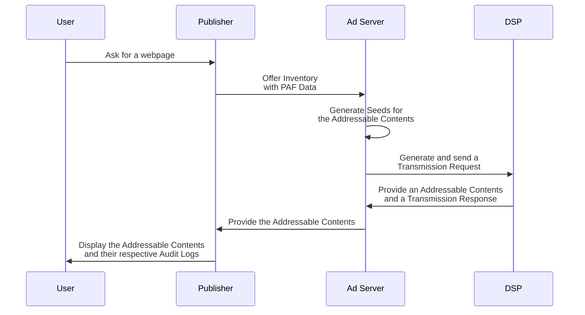
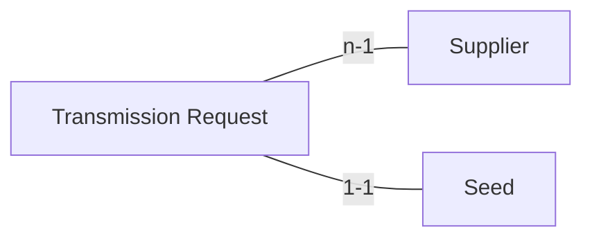

# Publishers requirements

## Goal of the document

This document describes what is required for a Publisher to participate in the Prebid Addressability Framework (PAF).

## Overview

The Prebid Addressability Framework enhances ad slots selling by instantiating an audit trail. This audit trail requires the following elements, that Publishers must implement:
* a Seed, identifying an bid request for an ad slot for a given user
* Transmission Requests, identifying the seed and the requester at each step of the bidding workflow
* Transmission Responses, as answers to Transmission Request
* an Audit Log, identifying which entities have been involved in the display of an ad

Seeds, Transmission Requests, and Transmissions Responses are signed.

Publishers are also required to:
* Expose an Identity endpoint, so that participants can verify the the publisher's signature.

Process overview:

<!--partial-begin { "files": [ "ad-server-flow.mmd" ], "block": "mermaid" } -->
<!-- ⚠️ GENERATED CONTENT - DO NOT MODIFY DIRECTLY ⚠️ -->

<!--partial-end-->

## Selling ad slots with the Prebid Addressability Framework

### ad slots, Seeds, and Transmissions Requests

The relationships between ad slots, Seeds, and Transmissions are:
* A Publisher offers *multiple* ad slots per page
* The Publisher must create *one* Seed for per ad slot
* The Publisher must send *one* Transmission Request per Seed and SSP
* An SSP must generate *one* Transmission Response per Transmission Request


### Step 1: Access PAF User Id and Preferences

*To be added.*


### Step 2: Deserialize the User Id and Preferences

The structure of the User Id is:

<!--partial-begin { "files": [ "identifier-table.md" ] } -->
<!-- ⚠️ GENERATED CONTENT - DO NOT MODIFY DIRECTLY ⚠️ -->
| Field   | Type          | Details                                            |
|---------|---------------|----------------------------------------------------|
| version | Number        | The version of PAF used.                                                                       |
| type    | String        | The type of Pseudonymous-Identifier. For now, there is only one: "prebid_id".                                                    |
| value   | String        | The Pseudonymous-Identifier value in UTF-8.                                                                                      |
| source  | Source object | The Source contains all the data for identifying and trusting the Operator that generated the Pseudonymous-Identifier. <br /> <table><tr><th>Field</th><th>Type</th><th>Details</th></tr><tr><td>domain</td><td>String</td><td>The domain of the Operator.</td></tr><tr><td>timestamp</td><td>Integer</td><td>The timestamp of the signature.</td></tr><tr><td>signature</td><td>String</td><td>Encoded signature in UTF-8 of the Operator.</td></tr></table>|
<!--partial-end-->

The structure of the Preferences is:

<!--partial-begin { "files": [ "preferences-table.md" ] } -->
<!-- ⚠️ GENERATED CONTENT - DO NOT MODIFY DIRECTLY ⚠️ -->
| Field   | Type                   | Details                                   |
|---------|------------------------|-------------------------------------------|
| version | Number                 | The Prebid SSO version used.     |
| data    | Dictionary             | The keys are strings and represent the name of the preferences. <br /> The values represent the value of the preference. <br /> For now there is only one preference named "optin" and its value is a boolean.|
| source  | Source object          | The source contains the data for identifying and trusting the CMP that signed lastly the Preferences.<br /> <table><tr><th>Field</th><th>Type</th><th>Details</th></tr><tr><td>domain</td><td>String</td><td>The domain of the CMP.</td></tr><tr><td>timestamp</td><td>Integer</td><td>The timestamp of the signature.</td></tr><tr><td>signature</td><td>String</td><td>Encoded signature in UTF-8 of the CMP.</td></tr></table>|
<!--partial-end-->

### Step 3: Generate the Seed

The Seed is the association of the User Id and Preferences with an ad slot. The Publisher must
generate the Seed and sign it.

The composition of a Seed is:

<!--partial-begin { "files": [ "seed-optimized-table.md" ] } -->
<!-- ⚠️ GENERATED CONTENT - DO NOT MODIFY DIRECTLY ⚠️ -->
| Field                  | Type                                     | Details  |
|------------------------|------------------------------------------|----------|
| version                | Number                                   | The PAF version used.|
| transaction_id         | String                                   | A GUID in a String format dedicated to the share of the Prebid SSO data for one Addressable Content.|
| publisher              | String                                   | The domain name of the Publisher that displays the Addressable Content|
| source                 | Source object                            | The source contains data for identifying and trusting the Publisher.<br /><table><tr><th>Field</th><th>Type</th><th>Details</th></tr><tr><td>domain</td><td>String</td><td>The domain of the Root Party (Publisher in most of the cases).</td></tr><tr><td>timestamp</td><td>Integer</td><td>The timestamp of the signature.</td></tr><tr><td>signature</td><td>String</td><td>Encoded signature in UTF-8 of the Root Party/Publisher.</td></tr></table>|
<!--partial-end-->

Here is a JSON example of the Seed:

<!--partial-begin { "files": [ "seed-optimized.json" ], "block": "json" } -->
<!-- ⚠️ GENERATED CONTENT - DO NOT MODIFY DIRECTLY ⚠️ -->
```json
{
    "version": 0,
    "transaction_id": "a0651946-0f5b-482b-8cfc-eab3644d2743",
    "publisher": "publisher.com",
    "source": {
        "domain": "adserver-company.com",
        "timestamp": 1639582000,
        "signature": "12345_signature"
    }
}
```
<!--partial-end-->

The Publisher must sign the Seeds ("source"."signature"). The Elliptic Curve Digital Signature Algorithm
(ECDSA) is used for this purpose. NIST P-256 coupled with the hash algorithm
SHA-256 is applied on a built string relying on the Seed data
and the User Id and Preferences.

Here is how to build the UTF-8 string for then generating the signature:

<!--partial-begin { "files": [ "seed-signature-string.txt" ], "block": "" } -->
<!-- ⚠️ GENERATED CONTENT - DO NOT MODIFY DIRECTLY ⚠️ -->
```
seed.source.domain + '\u2063' + 
seed.source.timestamp + '\u2063' + 
seed.transaction_id + '\u2063' + 
seed.publisher + '\u2063' + 
data.identifiers[0].source.signature + '\u2063' +
data.identifiers[1].source.signature + '\u2063' +
... + '\u2063' + 
data.identifiers[n].source.signature + '\u2063' +
data.preferences.source.signature
```
<!--partial-end-->

### Step 4: Send User Id and Preferences and Transmission Requests

Once the Seeds are generated (one per ad slot), the Publisher
shares the Seeds via Transmissions with placement data to 
SSP. In the case of an existing custom communication 
(a.k.a not OpenRTB), Transmission Requests must be included in the existing
communication and bound structurally or by references to the data of the 
impressions (also named Addressable Content). One Transmission Requests 
per Supplier and Seed.



Publishers can send PAF User Id and Preferences in bid requests to SSP. Whenever they do so, a Transmission Request must be included and bound to the bid request.
There must be one Transmission Requests per SSP and Seed.
publishers-requirements.md

A Transmission Request is composed as followed:

<!--partial-begin { "files": [ "transmission-request-table.md" ] } -->
<!-- ⚠️ GENERATED CONTENT - DO NOT MODIFY DIRECTLY ⚠️ -->
| Field  | Type                            | Details                           |
|--------|---------------------------------|-----------------------------------|
| version| Number                          | The PAF version used.               |
| seed   | Seed object                     | A Seed object contains all the Prebid SSO Data gathered and signed by the Publisher concerning the user. |
| parents| Array of Transmission Results   | A list of Transmission Results that participate to a chain of Transmissions and make this Transmission possible. |  
| source | Source object                   | The source object contains data for identifying the Sender of the Transmission.<br /><table><tr><th>Field</th><th>Type</th><th>Details</th></tr><tr><td>domain</td><td>String</td><td>The domain of the Sender.</td></tr><tr><td>timestamp</td><td>Integer</td><td>The timestamp of the signature.</td></tr><tr><td>signature</td><td>String</td><td>Encoded signature in UTF-8 of the Tranmission sender.</td></tr></table>|
<!--partial-end-->

<<<<<<< HEAD:mvp-spec/participants-publishers-requirements.md
The Transmission Request list is always associated to PAF Data that has
been used for generating the Seed. Here is a hypothetical structure of it that
we name `data` in the following example: 

<!--partial-begin { "files": [ "data-id-and-preferences-table.md" ] } -->
<!-- ⚠️ GENERATED CONTENT - DO NOT MODIFY DIRECTLY ⚠️ -->
| Field                  | Type                                     | Details  |
|------------------------|------------------------------------------|----------|
| preferences            | Preferences object                       | The Preferences of the user.|
| identifiers            | Array of Pseudonymous-Identifier objects | The Pseudonymous-Identifiers of the user. For now, it only contains a Prebid ID.|
<!--partial-end-->

=======
>>>>>>> 8f91279 (Update and rename participants-publishers-requirements.md to publishers-requirements.md):mvp-spec/publishers-requirements.md
Similar to the Seed, each Transmission Request contains a signature for 
audit purposes, using the same cryptographic algorithm, and based on the UTF-8 encoded string below:

<!--partial-begin { "files": [ "transmission-request-signature-string.txt" ], "block": "" } -->
<!-- ⚠️ GENERATED CONTENT - DO NOT MODIFY DIRECTLY ⚠️ -->
```
transmission_request_receiver_domain        + '\u2063' +
transmission_request.source.domain          + '\u2063' + 
transmission_request.source.timestamp       + '\u2063' + 
seed.source.signature
```
<!--partial-end-->

Here is a hypothetical structure of the associated User Id and Preferences, named `data` in the following example: 

<!--partial-begin { "files": [ "data-id-and-preferences-table.md" ] } -->
<!-- ⚠️ GENERATED CONTENT - DO NOT MODIFY DIRECTLY ⚠️ -->
| Field                  | Type                                     | Details  |
|------------------------|------------------------------------------|----------|
| preferences            | Preferences object                       | The Preferences of the user.|
| identifiers            | Array of Pseudonymous-Identifier objects | The Pseudonymous-Identifiers of the user. For now, it only contains a Prebid ID.|
<!--partial-end-->

In the communication, the Transmission Requests must be associated to the 
PAF Data. Depending on the existing structure of the communication,
it makes sense to have a shared structure for the PAF Data and 
multiple Transmissions referring to it.

Here is an example that must be adapted to the existing API of the Ad Server:

<!--partial-begin { "files": [ "transmission-requests.json" ], "block": "json" } -->
<!-- ⚠️ GENERATED CONTENT - DO NOT MODIFY DIRECTLY ⚠️ -->
```json
{
    "data": {
        "identifiers": [
            {
                "version": 0,
                "type": "prebid_id",
                "value": "7435313e-caee-4889-8ad7-0acd0114ae3c",
                "source": {
                    "domain": "operator0.com",
                    "timestamp": 1639580000,
                    "signature": "12345_signature"
                }
            }
        ],
        "preferences": {
            "version": 0,
            "data": { 
                "opt_in": true 
            },
            "source": {
                "domain": "cmp1.com",
                "timestamp": 1639581000,
                "signature": "12345_signature"
            }
        }
    },
    "transmissions": [
        {
            "version": 0,
            "seed": {
                "version": 0,
                "transaction_id": "a0651946-0f5b-482b-8cfc-eab3644d2743",
                "publisher": "publisher.com",
                "source": {
                    "domain": "publisher.com",
                    "timestamp": 1639582000,
                    "signature": "12345_signature"
                }
            },
            "source": {
                "domain": "dsp1.com",
                "timestamp": 1639581000,
                "signature": "12345_signature"
            },
            "parents": []
        },
        {
            "version": 0,
            "seed": {
                "version": 0,
                "transaction_id": "a0651946-0f5b-482b-8cfc-eab3644d2743",
                "publisher": "publisher.com",
                "source": {
                    "domain": "publisher.com",
                    "timestamp": 1639582000,
                    "signature": "12345_signature"
                }
            },
            "source": {
                "domain": "dps1.com",
                "timestamp": 1639581000,
                "signature": "12345_signature"
            },
            "parents": []
        }
    ]
}
```
<!--partial-end-->

### Step 5: Receive Transmission Responses

Whenever making use of the User Id and Preferences, the receiver of a Transmission Request must answer back with Transmission 
Responses. Those Transmission Responses must be included and bound to the bid response.

A Transmission Response is composed as followed:

<!--partial-begin { "files": [ "transmission-response-table.md" ] } -->
<!-- ⚠️ GENERATED CONTENT - DO NOT MODIFY DIRECTLY ⚠️ -->
| Field           | Type                          | Details                           |
|-----------------|-------------------------------|-----------------------------------|
| version         | Number                        | The version of the PAF used.                                                                                                                                                                                                                               |
| transaction_id  | String                        | A GUID dedicated to the Addressable Content. It allows associating the Transmission Responses to Transmission Request                                                                                                                     |
| receiver        | String                        | The domain name of the DSP.                                                                                                                                                                                                                                                                                |
| status          | String                        | Equals "success" if the DSP signed the Transmission and returns it to the sender.<br /> Equals "error_bad_request" if the receiver doesn't understand or see inconsistency in the Transmission Request.<br /> Equals "error_cannot_process" if the receiver cannot handle the Transmission Request properly. |
| details         | String                        | In case of an error status, the DSP can provide details concerning the error.                                                                                                                                                                                                                              |
| children        | Array of Transmission Results | An empty array as we consider that the DSP doesn't share the Prebid SSO Data to its suppliers via new transmissions.                                                                                                                                                                                       |
| source          | Source object                 | The source contains all the data for identifying the DSP and verifying the Transmission.                                                                                                                                                                                                                   |
<!--partial-end-->

Therefore, here is an example of Transmission Responses that
must be adapted to the existing API:

<!--partial-begin { "files": [ "transmission-responses.json" ], "block": "json" } -->
<!-- ⚠️ GENERATED CONTENT - DO NOT MODIFY DIRECTLY ⚠️ -->
```json
{
    "transmissions": [
        {
            "version": 0,
            "transaction_id": "a0651946-0f5b-482b-8cfc-eab3644d2743",
            "receiver": "dsp1.com",
            "status": "success",
            "details": "",
            "source": {
                "domain": "dsp1.com",
                "timestamp": 1639589531,
                "signature": "12345_signature"
            },
            "children": []
        },
        {
            "version": 0,
            "transaction_id": "a0651946-0f5b-482b-8cfc-eab3644d2743"8,
            "receiver": "dsp1.com",
            "status": "success",
            "details": "",
            "source": {
                "domain": "dsp1.com",
                "timestamp": 1639589531,
                "signature": "12345_signature"
            },
            "children": []
        }
    ]
}
```
<!--partial-end-->

### Step 6: Generate the Audit Log

Once the Ad Server has selected the supplier that will display the
Addressable Content, it must generate the Audit Log based on the related
Transmission Response and the PAF Data.

The Audit Log has the following structure:

<!--partial-begin { "files": [ "audit-log-table.md" ] } -->
<!-- ⚠️ GENERATED CONTENT - DO NOT MODIFY DIRECTLY ⚠️ -->
| Field         | Type                         | Detail                        |
|---------------|------------------------------|-------------------------------|
| data          | Prebid SSO Data Object       | List the Pseudonymous-Identifiers and the Preferences of the user. |
| seed          | Seed Object                  | The Seed object is the association of an Addressable Content to the Prebid SSO Data. |
| transmissions | List of Transmission Results | A list of Transmission Results |
<!--partial-end-->

As described, the Audit Log contains a list of Transmission Results. The 
Transmission Results are built thanks to the data within the received 
Transmission Response that participates in the Addressable Content. The required
data are the status and the signature of the Transmission Response and its 
children.

Here is the structure of a Transmission Result:
<!--partial-begin { "files": [ "transmission-result-table.md" ] } -->
<!-- ⚠️ GENERATED CONTENT - DO NOT MODIFY DIRECTLY ⚠️ -->
| Field           | Type                          | Details                           |
|-----------------|-------------------------------|-----------------------------------|
| version         | Number                        | The version of the PAF used.                                                                                                                                                                                                                               |
| receiver        | String                        | The domain name of the DSP.                                                                                                                                                                                                                                                                                |
| status          | String                        | Equals "success" if the DSP signed the Transmission and returns it to the sender.<br /> Equals "error_bad_request" if the receiver doesn't understand or see inconsistency in the Transmission Request.<br /> Equals "error_cannot_process" if the receiver failed to use the data of the Transmission Request properly. |
| details         | String                        | In case of an error status, the DSP can provide details concerning the error.                                                                                                                                                                                                                              |
| source          | Source object                 | The source contains all the data for identifying the DSP and verifying the Transmission.                                                                                                                                                                                                                   |
<!--partial-end-->

Let's take an example of a transformation to Transmission Results.
Here is a received Transmission Response that helps to generate the Addressable Content:

<!--partial-begin { "files": [ "transmission-response-with-children.json" ], "block": "json" } -->
<!-- ⚠️ GENERATED CONTENT - DO NOT MODIFY DIRECTLY ⚠️ -->
```json
{
    "version": 0,
    "transaction_id": "a0651946-0f5b-482b-8cfc-eab3644d2743",
    "receiver": "ssp1.com",
    "status": "success",
    "details": "",
    "source": {
        "domain": "ssp1.com",
        "timestamp": 1639589531,
        "signature": "12345_signature"
    },
    "children": [
        {
            "receiver": "ssp2.com",
            "status": "success",
            "details": "",
            "source": {
                "domain": "ssp2.com",
                "timestamp": 1639589531,
                "signature": "12345_signature"
            }
        },
        {
            "receiver": "dsp.com",
            "status": "success",
            "details": "",
            "source": {
                "domain": "dsp.com",
                "timestamp": 1639589531,
                "signature": "12345_signature"
            }
        }
    ]
}
```
<!--partial-end-->

Here is the associated list of Transmission Results:

<!--partial-begin { "files": [ "transmission-results.json" ], "block": "json" } -->
<!-- ⚠️ GENERATED CONTENT - DO NOT MODIFY DIRECTLY ⚠️ -->
```json
{
    "transmissions": [
        {
            "version": 0,
            "receiver": "ssp1.com",
            "status": "success",
            "details": "",
            "source": {
                "domain": "ssp1.com",
                "timestamp": 1639589531,
                "signature": "12345_signature"
            }
        },
        {
            "version": 0,
            "receiver": "ssp2.com",
            "status": "success",
            "details": "",
            "source": {
                "domain": "ssp2.com",
                "timestamp": 1639589531,
                "signature": "12345_signature"
            }
        },
        {
            "version": 0,
            "receiver": "dsp.com",
            "status": "success",
            "details": "",
            "source": {
                "domain": "dsp.com",
                "timestamp": 1639589531,
                "signature": "12345_signature"
            }
        }
    ]
}
```
<!--partial-end-->

After this transformation, it is possible to generate the Audit Log. Here is
an example:

<!--partial-begin { "files": [ "audit-log.json" ], "block": "json" } -->
<!-- ⚠️ GENERATED CONTENT - DO NOT MODIFY DIRECTLY ⚠️ -->
```json
{
    "data": {
        "identifiers": [
            {
                "version": 0,
                "type": "prebid_id",
                "value": "7435313e-caee-4889-8ad7-0acd0114ae3c",
                "source": {
                    "domain": "operotor0.com",
                    "timestamp": 1639589531,
                    "signature": "12345_signature"
                }
            }
        ],
        "preferences": {
            "version": 0,
            "data": { 
                "opt_in": true 
            },
            "source": {
                "domain": "cmp1.com",
                "timestamp": 1639589531,
                "signature": "12345_signature"
            }
        }
    },
    "seed": {
        "version": 0,
        "transaction_id": "a0651946-0f5b-482b-8cfc-eab3644d2743",
        "publisher": "publisher.com",
        "source": {
          "domain": "ad-server.com",
          "timestamp": 1639589531,
          "signature": "12345_signature"
        }
    },
    "transmissions": [
        {
            "version": 0,
            "receiver": "ssp1.com",
            "status": "success",
            "details": "",
            "source": {
                "domain": "ssp1.com",
                "timestamp": 1639589531,
                "signature": "12345_signature"
            }
        },
        {
            "version": 0,
            "receiver": "ssp2.com",
            "status": "success",
            "details": "",
            "source": {
                "domain": "ssp2.com",
                "timestamp": 1639589531,
                "signature": "12345_signature"
            }
        },
        {
            "version": 0,
            "receiver": "dsp.com",
            "status": "success",
            "details": "",
            "source": {
                "domain": "dps.com",
                "timestamp": 1639589531,
                "signature": "12345_signature"
            }
        }
    ]
}
```
<!--partial-end-->

### Step 7: Display the ad and make the Audit Log available

Finally, the ad can be displayed to the user on the Publisher 
page. An Audit Button (ideally per Addressable Content) is available for 
displaying the Audit UI.

### Transmissions with OpenRTB

If the used protocol for offering the inventory is OpenRTB, the Ad Server needs
to respect the following for integrating PAF.

#### The OpenRTB Bid Request

In step **Step 4**, the Ad Server must share the PAF Data in the 
extensions of the Bid Request:

First, The Transmission Request object in an OpenRTB request keeps the same structure.
It is embedded in the `ext` field of each impression. It is 
reachable at `imp`.`ext`.`paf`.

Second, the Pseudonymous-Identifiers and the Preferences structures change 
in the OpenRTB request to take the advantage of the 
[Extended Identifiers](https://github.com/InteractiveAdvertisingBureau/openrtb/blob/master/extensions/2.x_official_extensions/eids.md). 
One `eid` per Pseudonymous-Identifier (and Preferences). 
It is reachable at `user`.`ext`.`eids`.

Comparing to the solution without OpenRTB:
1. The Pseudonymous-Identifier value is stored in the `eids`.`id` field.
2. The `eids`.`atype` is set to `1` because the ID is tied to a specific browser
for nom.
3. The `version`, `type`, and `source` fields are gathered in an extension of the `eid`: `eids`.`ext`.`paf`.
4. The Preferences are attached as an extention of the `eid`.

#### Example of a OpenRTB Bid Request

<!--partial-begin { "files": [ "openrtb-request-with-transmissions.json" ], "block": "json" } -->
<!-- ⚠️ GENERATED CONTENT - DO NOT MODIFY DIRECTLY ⚠️ -->
```json
{
    "id": "80ce30c53c16e6ede735f123ef6e32361bfc7b22",
    "at": 1, 
    "cur": [ "USD" ],
    "imp": [
        {
            "id": "1",
            "bidfloor": 0.03,
            "banner": {
                "h": 250,
                "w": 300,
                "pos": 0
            },
            "ext": {
                "paf": {
                    "version": 0,
                    "seed": {
                        "version": 0,
                        "transaction_id": "a0651946-0f5b-482b-8cfc-eab3644d2743",
                        "publisher": "publisher.com",
                        "source": {
                            "domain": "publisher0.com",
                            "timestamp": 1639589531,
                            "signature": "12345_signature"
                        }
                    },
                    "parents": []
                }
            }
        }
    ],
    "site": {
        "id": "102855",
        "cat": [ "IAB3-1" ],
        "domain": "www.publisher.com",
        "page": "http://www.publisher.com/1234.html ",
        "publisher": {
            "id": "8953",
            "name": "publisher.com",
            "cat": ["IAB3-1"],
            "domain": "publisher.com"
        }
    },
    "device": {
        "ua": "Mozilla/5.0 (Macintosh; Intel Mac OS X 10_6_8) AppleWebKit/537.13 (KHTML, like Gecko) Version/5.1.7 Safari/534.57.2",
        "ip": "123.145.167.10"
    },
    "user": {
        "id": "55816b39711f9b5acf3b90e313ed29e51665623f",
         "ext":
         {
            "eids": 
            [
                {
                    "source": "paf",
                    "uids": [
                        {
                            "atype": 1,
                            "id": "7435313e-caee-4889-8ad7-0acd0114ae3c",
                            "ext": 
                            {
                                "version": 0,
                                "type": "prebid_id",
                                "source": 
                                {
                                    "domain": "operotor0.com",
                                    "timestamp": 1639589531,
                                    "signature": "12345_signature"
                                }
                            }
                        }
                    ],
                    "ext": {
                        "preferences": {
                            "version": 0,
                            "data": { 
                                "opt_in": true 
                            },
                            "source": {
                                "domain": "cmp1.com",
                                "timestamp": 1639589531,
                                "signature": "12345_signature"
                            }
                        }
                    }
                }
            ]
        }
    }
}
```
<!--partial-end-->

#### The OpenRTB Bid Response

In step 5, the bidder (named Receiver in PAF Transmission) send back a 
OpenRTB Bid Response. Each `bid` is associated with a Transaction Response. The 
Transaction has the same structure explained in **Step 5** and is reachable in
the `ext` field of a `bid` (full path: `seatbid[].bid.ext.paf`).

Here is an example:

<!--partial-begin { "files": [ "openrtb-response-with-transmissions.json" ], "block": "json" } -->
<!-- ⚠️ GENERATED CONTENT - DO NOT MODIFY DIRECTLY ⚠️ -->
```json
{
    "id": "1234567890",
    "bidid": "abc1123",
    "cur": "USD",
    "seatbid": [
        {
            "seat": "512",
            "bid": [
                {
                    "id": "1",
                    "impid": "1",
                    "price": 9.43,
                    "nurl": "http://adserver.com/winnotice?impid=102",
                    "iurl": "http://adserver.com/pathtosampleimage",
                    "adomain": [ "advertiserdomain.com" ],
                    "cid": "campaign111",
                    "crid": "creative112",
                    "attr": [ 1, 2, 3, 4, 5, 6, 7, 12 ],
                    "ext": {
                        "paf": {
                            "version": 0,
                            "receiver": "dsp1.com",
                            "status": "success",
                            "details": "",
                            "source": {
                                "domain": "dsp1.com",
                                "timestamp": 1639589531,
                                "signature": "12345_signature"
                            },
                            "children": []
                        }
                    }
                }
            ]
        }
    ]
}
```
<!--partial-end-->
