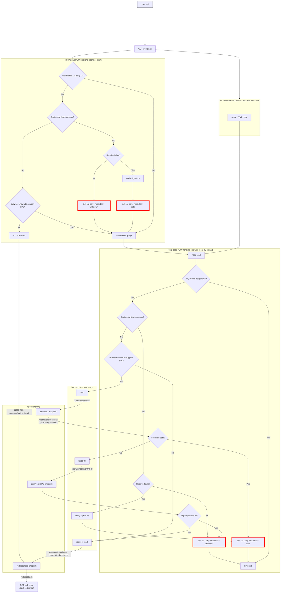

# Web site integration: design

## Read data

This diagram details the steps needed to read existing cookies from Prebid SSO
- at server level, _if the website decides to use a specific library_ (referred to as **backend operator client** in the diagram), HTTP redirects can be triggered when needed
- at browser level, a Javascript library (referred to as **frontend operator client**) is used
  - depending on the context, the JS library calls a REST or "redirect" endpoint on the operator
  - it relies on the **backend operator proxy**, a component responsible for building operator URLs to call.
 It is hosted by the website or by a vendor _on the website's behalf_  (see [landscape](./landscape.md) for context)
  

### Test support of 3rd party cookies

To test if third party cookies are supported and trigger redirect otherwise, the following logic is used:

1. if a backend client is used, then
   - based on user agent, if the browser is known to **not** support 3PC (ex: Safari) ➡️ consider no 3PC and immediately **HTTP redirect**
2. in Javascript,
   - based on user agent, if the browser is known to **not** support 3PC (ex: Safari) ➡️ consider no 3PC and immediately **javascript redirect**
3. otherwise, attempt to call REST endpoint and read existing (3PC) Prebid ID
   - at the same time, the operator attempts to write a "test" cookie on .prebidsso.com (ie. attempt to write a 3PC)
4. if Prebid ID is retrieved, of course it means 3PC **are** supported
5. if no Prebid ID retrieved, it means either that the user is not known, or that 3PC are not supported
   - call operator to attempt to read "test" cookie that was just written
   - if success ➡️ 3PC **are** supported, it's just that the user is not known
   - if failure ➡️ 3PC are **not** supported, **javascript redirect**

### Cookies writing

Note: cookies set by Javascript can be read by the http server when it receives a successive call, and vice-versa.

In other words, after a redirect by the operator back to the website,
- when using a **backend operator client**:
  - the backend operator client will set 1st party cookies (either a value or "unknown")
  - these cookies will be visible by the JS
  - so in the JS part of the diagram, the answer to the question "Any Prebid 1st party 🍪?" is: **yes** and the cookies won't be written twice
- when not using a backend operator client, these cookies will be written by JS

