# Web site integration: design

## Read data

This diagram details the steps needed to read existing cookies from Prebid SSO
- at HTTP level **if the website hosts a middleware** that can trigger HTTP redirects when needed
- at Javascript level in any case
  - the Javascript integration relies on the **operator client**, a component responsible for building operator URLs to call,
  hosted by the website or by a vendor _on the website's behalf_
  (see [landscape](./landscape.md) for context)
  - depending on the context, this operator client will call a JSON or "redirect" endpoint on the operator

```mermaid
flowchart TD
    subgraph noMiddleware [HTTP server without middleware]
        NoMiddlewareServe[HTTP return page]
    end
    
    subgraph middleware[HTTP server with middleware]
        MiddlewareCookies{"Any Prebid 1st party 🍪?"}
        MiddlewareAfterRedirect{Redirected from operator?}
        MiddlewareNonEmptyData{Received data?}
        Middleware3PC{Browser known to support 3PC?}
        MiddlewareServe[HTTP return page]
        MiddleRedirect[HTTP redirect]
        MiddlewareSave["Set 1st party Prebid 🍪 = data"]
        MiddlewareSaveNothing["Set 1st party Prebid 🍪 = 'unknown'"]
        
        Middleware3PC -->|No| MiddleRedirect
        Middleware3PC -->|Yes| MiddlewareServe
        
        MiddlewareCookies -->|No| MiddlewareAfterRedirect
        
        MiddlewareAfterRedirect -->|No| Middleware3PC
        MiddlewareAfterRedirect -->|Yes| MiddlewareNonEmptyData
        
        MiddlewareNonEmptyData -->|No| MiddlewareSaveNothing
        MiddlewareNonEmptyData -->|Yes| MiddlewareSave
        
        MiddlewareSaveNothing --> MiddlewareServe
        MiddlewareSave --> MiddlewareServe
        
        MiddlewareCookies -->|Yes| MiddlewareServe
    end

    subgraph "HTML page (Javascript)"
        HtmlLoad[Page load]
        HtmlAfterRedirect{Redirected from operator?}
        HtmlCookies{"Any Prebid 1st party 🍪?"}
        HtmlSave["Set 1st party Prebid 🍪 = data"]
        HtmlSaveNothing["Set 1st party Prebid 🍪 = 'unknown'"]
        HtmlAnyData{Received data?}
        HtmlDone[Finished]
    end
    
    subgraph "operator client (generated javascript)"
        ClientGetRead[Get operator URL to read data]
        Client3PC{Browser known to support 3PC?}
        ClientJsRedirect[javascript redirect]
        ClientCallJson["javascript call operator"]
    end

    subgraph "operator (API)"
        OperatorJson[json endpoint]
        OperatorRedirect[redirect endpoint]
    end
    
    User[User visit] --> Get
    style User stroke:#333,stroke-width:4px
    
    Get[GET web page]
    Get --> noMiddleware
    Get --> middleware
    
    MiddlewareServe --> HtmlLoad
    NoMiddlewareServe -------> HtmlLoad
    HtmlLoad --> HtmlCookies
    
    MiddleRedirect -- HTTP 303 operator/redirect/read --> OperatorRedirect
    
    ClientGetRead --> Client3PC
    Client3PC -->|No| ClientJsRedirect
    Client3PC -->|Yes| ClientCallJson
    
    ClientCallJson -- "after call to operator" --> HtmlAnyData
    ClientJsRedirect -- document.location = operator/redirect/read --> OperatorRedirect
    
    HtmlAnyData -->|No| HtmlSaveNothing --> HtmlDone  
    HtmlAnyData -->|Yes| HtmlSave --> HtmlDone
    
    HtmlCookies -->|No| HtmlAfterRedirect
    HtmlCookies -->|Yes| HtmlDone
    HtmlAfterRedirect -->|Yes| HtmlAnyData
    HtmlAfterRedirect -->|No| ClientGetRead
    
    OperatorRedirect -. redirect back .-> Get
    ClientCallJson -. operator/json/read .-> OperatorJson
        
```

