# Web site integration: design

## Read data

This diagram details the steps needed to read existing cookies from Prebid SSO
- at HTTP level **if the website hosts a middleware** that can trigger HTTP redirects when needed
- at Javascript level in any case
  - the Javascript integration relies on the **operator client**, a component responsible for building operator URLs to call,
  hosted by the website or by a vendor _on the website's behalf_
  (see [landscape](./landscape.md) for context)
  - depending on the context, this operator client will call a JSON or "redirect" endpoint on the operator

### Test support of 3rd party cookies

The logic to test if third party cookies are supported and use full page redirect if they aren't is the following:

1. if an HTTP middleware is used, then
   1. based on user agent, if the browser is known to **not** support 3PC (ex: Safari) ➡️ consider no 3PC and immediately **HTTP redirect**
2. in Javascript,
   1. based on user agent, if the browser is known to **not** support 3PC (ex: Safari) ➡️ consider no 3PC and immediately **javascript redirect**
3. otherwise, attempt to call JSON endpoint and read existing (3PC) Prebid ID
   1. at the same time, the operator attempts to write a "test" cookie on .prebidsso.com (ie. attempt to write a 3PC)
4. if Prebid ID is retrieved, of course it means 3PC **are** supported
5. if no Prebid ID retrieved, it means either that the user is not known, or that 3PC are not supported
   1. call operator to attempt to read "test" cookie that was just written
   2. if success ➡️ 3PC **are** supported, it's just that the user is not known
   3. if failure ➡️ 3PC are **not** supported, **javascript redirect**

```mermaid
flowchart TD
    subgraph noMiddleware [HTTP server without middleware]
        NoMiddlewareServe[serve HTML page]
    end
    
    subgraph middleware[HTTP server with middleware]
        MiddlewareCookies{"Any Prebid 1st party 🍪?"}
        MiddlewareAfterRedirect{Redirected from operator?}
        MiddlewareNonEmptyData{Received data?}
        Middleware3PC{Browser known to support 3PC?}
        MiddlewareServe[serve HTML page]
        MiddlewareRedirect[HTTP redirect]
        MiddlewareSave["Set 1st party Prebid 🍪 = data"]
        MiddlewareSaveNothing["Set 1st party Prebid 🍪 = 'unknown'"]
        
        Middleware3PC -->|No| MiddlewareRedirect
        Middleware3PC -->|Yes| MiddlewareServe
        
        MiddlewareCookies -->|No| MiddlewareAfterRedirect
        
        MiddlewareAfterRedirect -->|No| Middleware3PC
        MiddlewareAfterRedirect -->|Yes| MiddlewareNonEmptyData
        
        MiddlewareNonEmptyData -->|No| MiddlewareSaveNothing
        MiddlewareNonEmptyData -->|Yes| MiddlewareSave
        
        MiddlewareSaveNothing --> MiddlewareServe
        MiddlewareSave --> MiddlewareServe
        
        MiddlewareCookies -->|Yes| MiddlewareServe
    end

    subgraph "HTML page (Javascript)"
        HtmlLoad[Page load]
        HtmlAfterRedirect{Redirected from operator?}
        HtmlCookies{"Any Prebid 1st party 🍪?"}
        HtmlSave["Set 1st party Prebid 🍪 = data"]
        HtmlSaveNothing["Set 1st party Prebid 🍪 = 'unknown'"]
        HtmlAnyData{Received data?}
        HtmlDone[Finished]
        
        ClientBrowser3PC{Browser known to support 3PC?}
        ClientNonEmptyData{Received data?}
        ClientCallTest3PC["Javascript call test3PC"]
        Client3PCOk{3d party cookie ok?}
        
    end
    
    subgraph "operator proxy"
        ClientJsRedirect[javascript redirect]
        ClientCallJson["javascript call read"]
    end

    subgraph "operator (API)"
        OperatorJson[json/read endpoint]
        OperatorRedirect[redirect/read endpoint]
        OperatorVerify3PC["json/verify3PC endpoint"]
    end
    
    
    User[User visit] -------> Get
    style User stroke:#333,stroke-width:4px
    
    Get[GET web page]
    Get --> noMiddleware
    Get --> middleware
    
    MiddlewareServe --> HtmlLoad
    MiddlewareRedirect -- HTTP 303 operator/redirect/read --> OperatorRedirect
    NoMiddlewareServe ------> HtmlLoad
    HtmlLoad --> HtmlCookies
    
    HtmlAnyData -->|No| HtmlSaveNothing --> HtmlDone  
    HtmlAnyData -->|Yes| HtmlSave --> HtmlDone
    
    HtmlCookies -->|No| HtmlAfterRedirect
    HtmlCookies -->|Yes| HtmlDone
    
    HtmlAfterRedirect -->|No| ClientBrowser3PC
    HtmlAfterRedirect -->|Yes| HtmlAnyData
    
    ClientBrowser3PC -->|No| ClientJsRedirect
    ClientBrowser3PC -->|Yes| ClientCallJson
    
    ClientJsRedirect -- document.location = operator/redirect/read --> OperatorRedirect
    ClientCallJson -- operator/json/read --> OperatorJson
    
    ClientNonEmptyData -->|No| ClientCallTest3PC
    ClientNonEmptyData -->|Yes| HtmlSave
    ClientCallTest3PC -- "operator/json/verify3PC" --> OperatorVerify3PC
    
    Client3PCOk -->|No| ClientJsRedirect
    Client3PCOk -->|Yes| HtmlSaveNothing
    
    OperatorJson -- "Attempt to set 'test' 🍪<br>(a 3d party cookie)" --> ClientNonEmptyData
    OperatorVerify3PC --> Client3PCOk
    
    OperatorRedirect -. redirect back .-> Get2
    
    Get2["GET web page<br>(back to the top)"]
```

