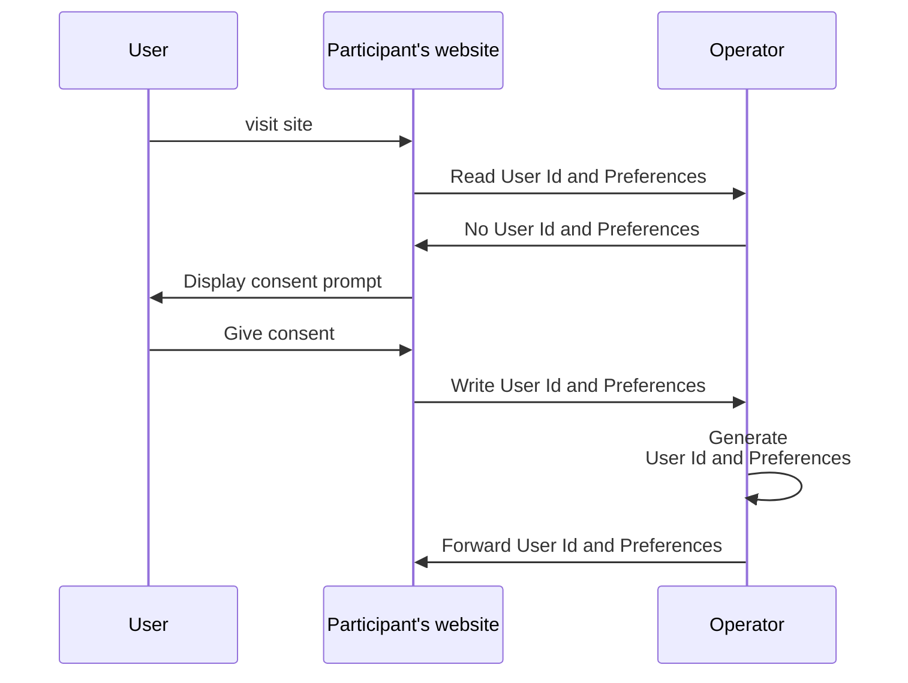
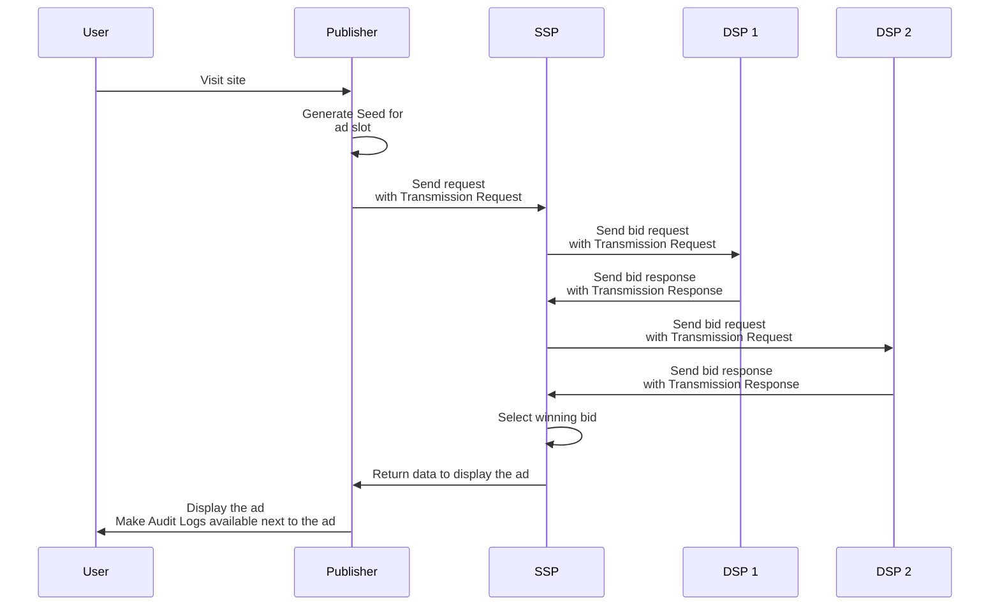

# Workflows

The workflows part of the Prebid Addressability Framework are:
- User Id and Preferences
- Selling ad slots

## Id and User Preferences

### Generic workflow

This workflow illustrates retrieving and creating/setting User Id and Preferences.

### When third-party cookies are supported

When third-party cookies are supported in the browser:
- User Id and Preferences are stored on the Operator's domain and retrieved in third-party context from the participant's website.

### When third-party cookies are not supported

When third-party cookies are not supported in the browser:
- User Id and Preferences are stored on both the Operator's domain and the participant's domain.
- The participant's website retrieves them by way of an HTTP redirect to the Operator website, and back to the participant's website.

See [operator-design.md](operator-design.md) for details. 

## Selling ad slots

# Glossary

**Audit Log** means a log identifying all participants (Publisher, SSP, DSP) part of a chain leading to an ad display.

**PAF** is short for Prebid Addressability Framework

**Operator** means the entity responsible for adding, updating, deleting and controlling access to the User Id and Preferences.

**Root Party** means the entity initiating the originating Transmission in a particular chain of Transmissions.

**Sign** means a cryptographic confirmation of generating, sending or receiving of PAF data.

**Transmission Request** and **Transmission Response** are signed statements that must be attached to the communication of User Id and Preferences between two entities (typically done through bid requests and bid responses).

**Transmission Result** means the final statement of a Transmissions that is used in an Audit Log

**User Id and Preferences** means as set of user pseudonymous identifiers and preferences managed within the Prebid Addressability Framework.

**Vendor** means an entity, different from the Publisher, participating to the generation of an ad display.
