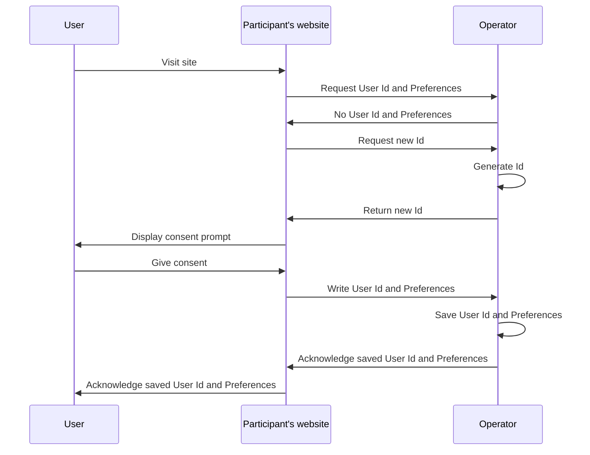
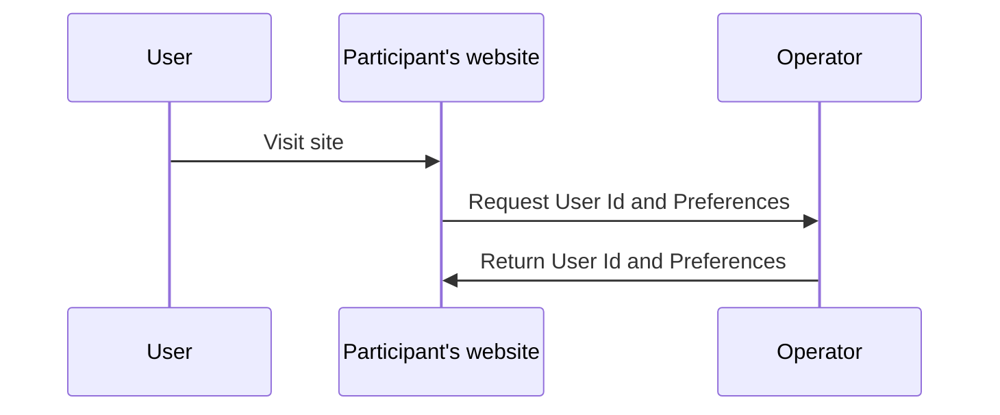
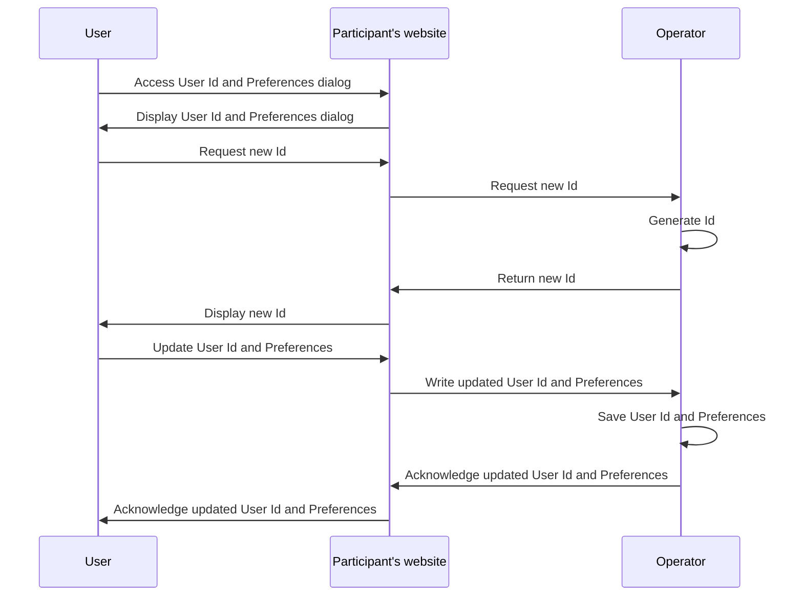

# Workflows

## User Id and Preferences

### Creating User Id and Preferences

This workflow illustrates a user first visit on a site part of the PAF network.

Note that the User Id and Preferences are not persisted in case the user does not consent.

### Retrieving User Id and Preferences

This workflow illustrates a user who has already given his/her consent visiting a site part of the Prebid Addressability Framework network.

### Updating User Id and Preferences

This workflow illustrates a user updating his/her User Id and Preferences on a site part of the PAF network.

### User Id and Preferences storage

User Id and Preferences are only stored client-side, in browser cookies on both the Operator's domain and the participants' domain.

When access to cookies in a third-party context is enabled, cookies stored on the Operator's domain are directly accessed from a participant's site.
When access to cookies in a third-party context is disabled, cookies stored on the Operator's domain are retrieved from a participant's site by way of an HTTP redirect to the Operator website, and back to the participant's website.

See [operator-design.md](operator-design.md) for details. 

