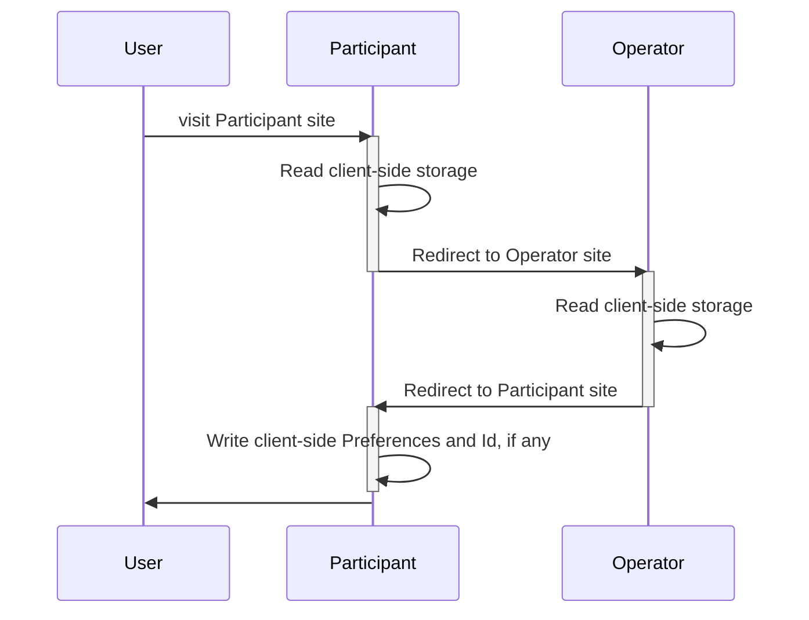
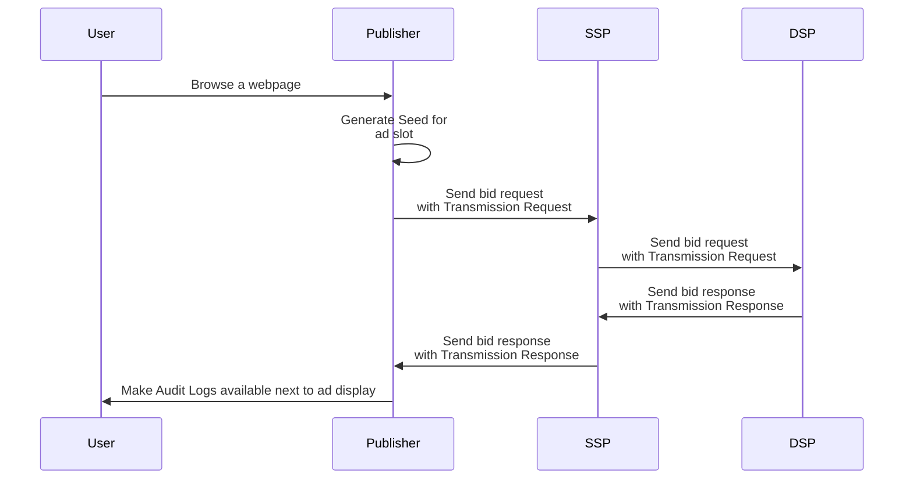

# Workflows

The workflows part of the Prebid Addressability Framework are:
- User Id and Preferences
  - Retrieval
  - Creation and updating
- Selling ad slots

## Id and User Preferences
### Retrieval

In this workflow, a Participant retrieves the Preferences and Id set by a User, if any.

### Creation and updating

In this workflow, User Id and Preferences get set following user preferences selection.

This workflow can be triggered following the Retrieval workflow, when no user preferences have been found.

## Selling ad slots

