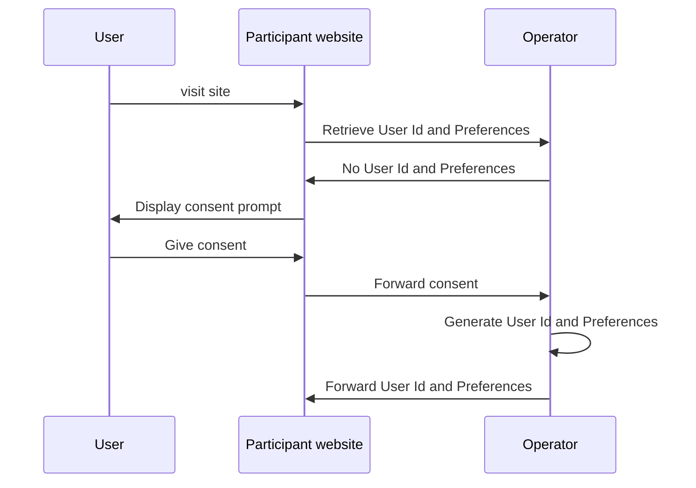
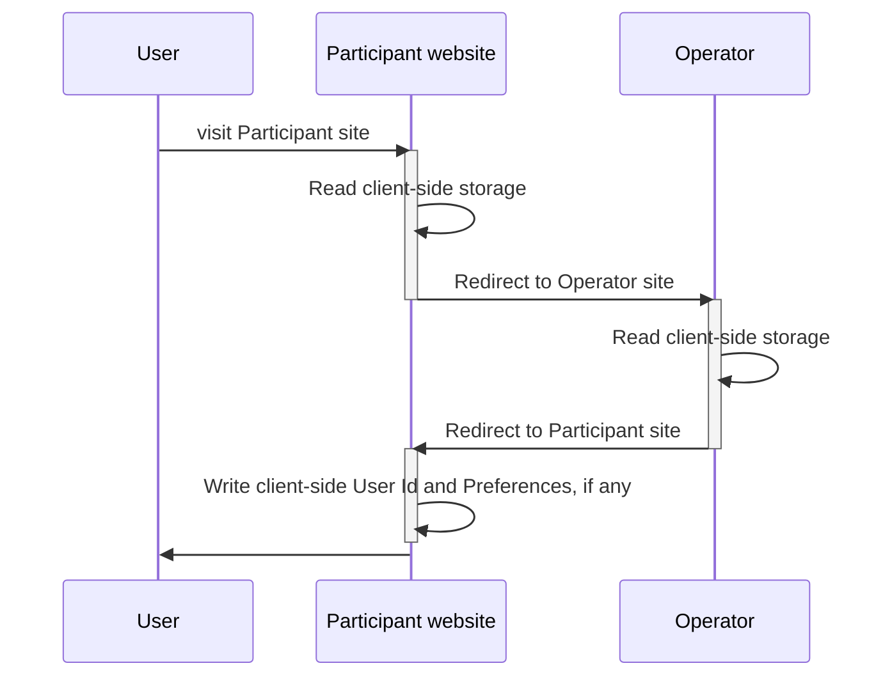
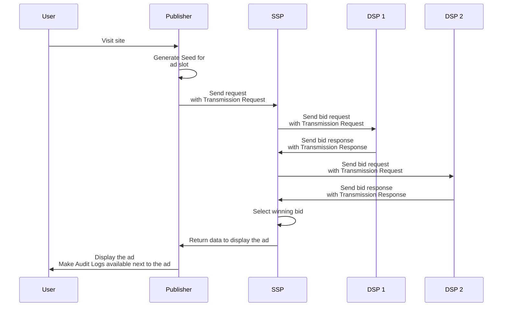

# Workflows

The workflows part of the Prebid Addressability Framework are:
- User Id and Preferences
  - Retrieval
  - Creation and updating
- Selling ad slots

## Id and User Preferences

### Creation

### Retrieval

### Creation and updating

In this workflow, User Id and Preferences get set following user preferences selection.

This workflow can be triggered following the Retrieval workflow, when no user preferences have been found.

## Selling ad slots

# Glossary

**Audit Log** means a log identifying all participants (Publisher, SSP, DSP) part of a chain leading to an ad display.

**Operator** means the entity responsible for adding, updating, deleting and controlling access to the User Id and Preferences.

**PAF** is short for Prebid Addressability Framework

**Root Party** means the entity initiating the originating Transmission in a particular chain of Transmissions.

**Sign** means a cryptographic confirmation of generating, sending or receiving of PAF Data.

**Transmission Request** and **Transmission Response** are envelops enabling the communication of User Id and Preferences between two entities, typically attached to bid requests and bid responses.

**Transmission Result** means the final statement of a Transmissions that is used in an Audit Log

**User Id and Preferences** means as set of user pseudonymous identifiers and preferences managed within the Prebid Addressability Framework.

**Vendor** means an entity, different from the Publisher, that participated to the generation of an ad display.
