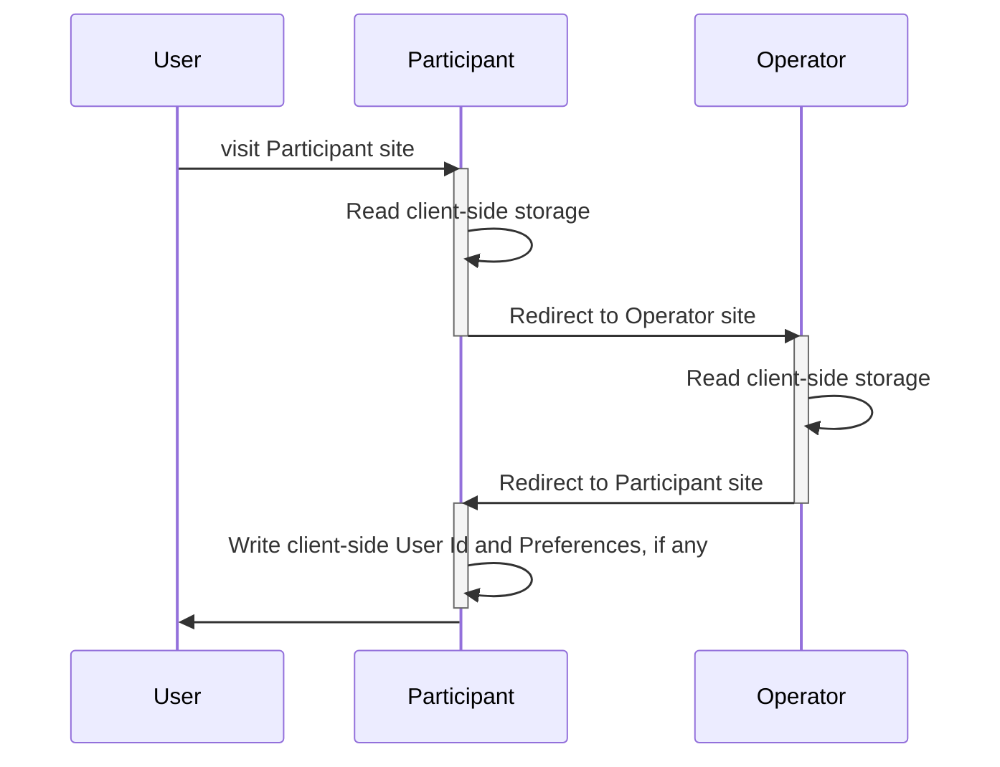

# Workflows

The workflows part of the Prebid Addressability Framework are:
- User Id and Preferences
  - Retrieval
  - Creation and updating
- Selling ad slots

## Id and User Preferences
### Retrieval

In this workflow, a Participant retrieves the Preferences and Id set by a User, if any.

### Creation and updating

In this workflow, User Id and Preferences get set following user preferences selection.

This workflow can be triggered following the Retrieval workflow, when no user preferences have been found.

## Selling ad slots

# Glossary

Audit Log means a log containing information received by a Party of each Transmission that has been Signed.

Contracting Party means any party bound to an agreement containing these Model Terms and “Parties” shall be construed accordingly.

Operator means the Party or Parties responsible for adding, updating, deleting and controlling access to the Prebid Addressability Framework Data;

PAF is short for Prebid Addressability Framework

Prebid Addressability Framework Ecosystem means each and every Party.

Pseudo-Identifier or Pseudonymous-Identifier means a generated Identifiers for the User.

Root Party means the Contracting Party initiating the originating Transmission in a particular chain of Transmissions.

Sign means a cryptographic confirmation of generating, sending or receipt of PAF Data.

Transaction: the sending of PAF Data from the Root Party through the PAF ecosystem by consecutive Transmissions.

Transaction ID is a generated identifier for a dedicated ad slot. 

Transmission means the sending of PAF Data from the Sender to the Receiver. One Transaction can be composed of many Transmissions.

Transmission Request means the communication of the PAF Data from a Sender to a Receiver.

Transmission Response means the communication of the PAF Data from a Receiver to a Sender.

Transmission Result means the final statement of a Transmission that is used in an Audit Log

User Id and Preferences

Vendor means a Contracting Party that participated via a Transaction to the generation of the Addressable Content to the user on the publisher website. The Publisher isn't a Vendor.
